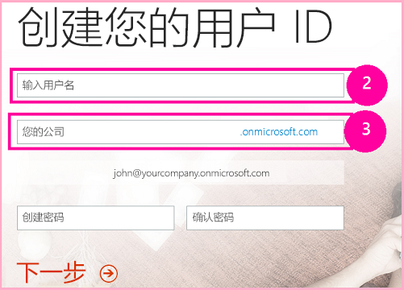
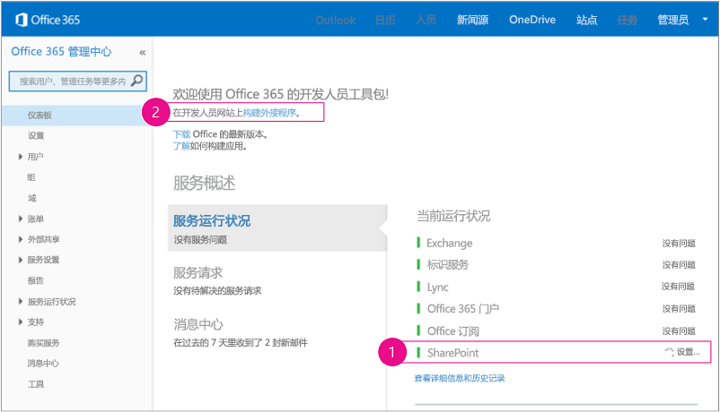
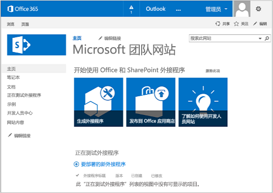

# 使用 Napa Office 365 开发工具创建 SharePoint 托管的基本的外接程序
了解如何使用 Napa Office 365 开发工具 创建 SharePoint 托管的基本的 SharePoint 外接程序。


 [立即运行此示例！](http://go.microsoft.com/fwlink/?LinkId=313212)
Napa 是一个可用来创建 SharePoint 托管的 SharePoint 外接程序的工具。Napa 本身可用作（提供程序托管的）SharePoint 外接程序，可安装在使用 **开发人员网站** 模板创建的 SharePoint Online 网站上。SharePoint 开发人员网站在主页上有一个名为"测试中的外接程序"的库。本文后续将介绍创建开发人员网站和安装 Napa 的说明。


> **注释**
> 我们不支持将 Napa 安装到内部部署 SharePoint。 


使用 Napa，您可以在浏览器中而非在 Visual Studio 中创建 SharePoint 外接程序。您可以随时下载项目并在 Visual Studio 中打开它以用于更高级的方案。


依照本文，您可以了解如何使用 Napa 创建一个 SharePoint 托管的简单的 SharePoint 外接程序。您将创建的外接程序包括用于管理列表和列表项的控件和代码。
> **注释**
> 使用 Napa，您只能创建 SharePoint 托管（而不是提供程序托管）的 SharePoint 外接程序。有关两者区别的详细信息，请参阅  [SharePoint 外接程序](sharepoint-add-ins.md)。 <BR /><BR /> 您不能在 Napa 中使用 SharePoint 的外接程序更新语义，该内容在 [更新 SharePoint 2013 中的外接程序 Web 组件](update-add-in-web-components-in-sharepoint-2013.md)中有介绍。因此，如果您需要更新在 Napa 中创建的外接程序，您必须首先将其导出到 Visual Studio。有关执行此操作的说明，稍后将在本文中介绍。 <BR /><BR /> 您还可以使用 Visual Studio 创建 SharePoint 外接程序。有关详细信息，请参阅 [开始创建 SharePoint 承载的 SharePoint 外接程序](get-started-creating-sharepoint-hosted-sharepoint-add-ins.md)。 


## （可选）获取 Office 365 开发人员网站
<a name="Prerequisites"> </a>

如果您还没有用于开发的 SharePoint Online 订阅，请根据此部分说明获取一个。否则，请跳至 [安装 Napa](#Overview)。


> **注释**
>  您可能已经拥有 Office 365 开发人员网站的访问权限：<BR /><BR /> **已经是 MSDN 订阅者？** Visual Studio Ultimate 和 Visual Studio Premium with MSDN 订阅者可以享受 Office 365 开发人员订阅权益。 [立即索取您的权益](https://msdn.microsoft.com/subscriptions/manage/default.aspx)。 <BR /><BR /> **您是否具有下列 Office 365 订阅计划之一？**<BR /> **如果有的话，Office 365 订阅的管理员可以创建一个 开发人员网站** ，方法是使用 [Office 365 管理中心](https://portal.microsoftonline.com/admin/default.aspx)。有关详细信息，请参阅 [在现有 Office 365 订阅中创建开发人员网站](create-a-developer-site-on-an-existing-office-365-subscription.md)。 


两种获取 Office 365 计划的方法。


- 开始 [免费 30 天试用](https://portal.microsoftonline.com/Signup/MainSignUp.aspx?OfferId=6881A1CB-F4EB-4db3-9F18-388898DAF510&amp;DL=DEVELOPERPACK)，提供一个用户许可证。


- 购买  [Office 365 开发人员订阅](https://portal.microsoftonline.com/Signup/MainSignUp.aspx?OfferId=C69E7747-2566-4897-8CBA-B998ED3BAB88&amp;DL=DEVELOPERPACK)。


> **提示**
> 为了方便您使用以下说明，每个链接将在另一个窗口或选项卡中打开。 


**图 1. Office 365 开发人员网站域名**





1. 注册表单的第一页（未显示）很容易理解。只需提供一些有关您的必要信息，然后选择"下一步"。


2. 在第二页（如图 1 所示）上指定订阅管理员的用户 ID。


3. 创建".onmicrosoft.com"的子域。

    注册后，您必须使用生成的凭据（格式： _UserID_@ _您的域_.onmicrosoft.com）登录到您的 Office 365 门户网站以便管理您的帐户。您的 SharePoint Online 开发人员网站将在您的新域中进行设置： **http:// _您的域_.sharepoint.com** 。


4. 选择"下一步"并填写表单的最后一页。如果您选择提供电话号码来获取确认代码，您可以提供一个移动或有线电话号码，但"不能是"VoIP（Internet 语音协议）号码。


> **注释**
> 当您尝试登录开发人员帐户时，如果您已经登录其他 Microsoft 帐户，则有可能收到这样的消息："对不起，您输入的用户 ID 无法使用。它似乎是无效的。确保输入的是您的组织分配给您的用户 ID。通常，您的用户 ID 类似于  *someone@example.com*  或 *someone@example.onmicrosoft.com*  。"<BR /><BR /> 如果您看到这种消息，请注销正在使用的 Microsoft 帐户并重试。如果您仍然收到这种消息，请清除浏览器缓存或切换到"InPrivate 浏览"，然后填写表单。 


在完成注册过程后，您的浏览器会打开 Office 365 安装页。选择管理员图标以打开管理中心页。


**图 2. Office 365 管理中心页**





1. 您必须等待开发人员网站完成设置。设置完成后，在浏览器中刷新 管理中心页。


2. 然后，选择页面左上角的"构建外接程序"链接，以打开您的开发人员网站。您会看到如图 3 所示的网站。页面上有一个"测试中的外接程序"列表。这证实该网站是使用 SharePoint 开发人员网站模板构建的。如果您看到的是一个一般的工作组网站，请稍等几分钟，然后重新启动网站。


3. 记下网站的 URL，当在 Visual Studio 中创建 SharePoint 外接程序项目时将会用到。


**图 3. 您的开发人员网站主页，其中包含"测试中的外接程序"列表**





## 安装 Napa
<a name="Overview"> </a>

如果您最初没有将 订阅创建为 Office 365 开发人员网站，那么您必须在 订阅的管理 UI 中创建一个开发人员网站。然后将 Napa 安装在其中。有关创建网站的说明，请参阅 [在现有 Office 365 订阅中创建开发人员网站](create-a-developer-site-on-an-existing-office-365-subscription.md)。


若要安装 Napa，请打开您的开发人员网站，并选择"网站内容">"添加外接程序">"SharePoint 商店"。在商店中，搜索 Napa，并对其进行安装。（如果您有 Office 365 开发人员网站，则在创建网站时，Napa 可能已安装好，您将能够在"网站内容"页面上看到它。）


## 创建 SharePoint 外接程序项目
<a name="Create"> </a>


1. 在 Office 365 页上打开 Napa外接程序。


2. 选择"添加新项目"磁贴，然后选择"SharePoint 外接程序"磁贴。


3. 将项目命名为 测试 SharePoint 外接程序，然后选择"创建"按钮。

    代码编辑器打开并显示默认网页，该网页已包含一些无需执行任何其他操作便可运行的示例代码。


## 将控件添加到主页中
<a name="AddControls1"> </a>

在 SharePoint 外接程序中，向默认主页中添加控件，以便创建和删除常规 SharePoint 列表，以及获取 SharePoint 外接程序的 Web 中列表的当前数目。您稍后将为这些控件添加代码。


### 将控件添加到主页中


1. 在页面左侧的"页面"文件夹下，选择"Default.aspx"页（如果尚未选择它）。

    Default.aspx 网页显示在代码编辑器中。


2. 在  `PlaceHolderMain` 部分，将此代码添加到现有 HTML 下

  ```HTML

<br />
<div>
    <button id="getListCount">Get count of lists in web</button>
</div>
<br />
<div id="starter">
    <input type="text" value="List name here" id="createlistbox"/><button id="createlistbutton">Create List</button>
    <p>
    Lists
    <br />
    <select id="selectlistbox" ></select><button id="deletelistbutton">Delete Selected List</button>
    </p>
</div>
  ```


HTML 将创建以下控件。

  - 获取 SharePoint 外接程序的 Web 中的列表数目的按钮。


  - 一个用于创建常规 SharePoint 列表的按钮以及另一个用于删除该列表的按钮。


  - 可在外接程序中使用的一组列表。


## 添加用于创建和删除列表的代码
<a name="AddCode1"> </a>

在此过程中，您将添加一些 JavaScript 代码，以便用户可以在 SharePoint 外接程序中创建和删除列表。


### 添加用于创建和删除列表的代码


1. 选择"脚本"文件夹，然后选择"App.js"链接。

    项目模板中的默认 JavaScript 代码文件将打开以供编辑。此文件包含 SharePoint 外接程序中使用的代码。您可以添加另一个 .js 文件并将代码添加到该文件中，而不是添加到现有文件中。但是，对于此示例，将代码添加到提供的 **App.js** 文件中。

    在下一步中，您将为您在上一个过程中创建的控件定义函数。


|**函数名称**|**说明**|
|:-----|:-----|
| `getWebProperties()` <br/> |已连接到"getListCount"控件 — 检索 Web 中的列表数。  <br/> |
| `createlist()` <br/> |已连接到"createListButton"控件 — 创建常规 SharePoint 列表。  <br/> |
| `deletelist()` <br/> |已连接到"deletelistbutton"控件 — 删除用户从可用列表集合中选择的列表。  <br/> |
 

您还将调用  `welcome()` 和 `displayLists()` 函数，本演练稍后将介绍它们。


2. 在"App.js"文件中，向两个默认变量添加  `web`、 `lists` 和 `listItemcollection` 变量，并将 `$(document).ready()` 函数中的代码更改为以下示例。

    > **注释**
      > 此代码中将出现错误波形曲线。在后面的步骤中，它们将消失。 

  ```

'use strict';

var context = SP.ClientContext.get_current();
var user = context.get_web().get_currentUser();
var web = context.get_web();
var lists = web.get_lists();
var listItemCollection;  // This variable is used later when you add list items.

(function () {

// This code runs when the DOM is ready and creates a context object which is 
// needed to use the SharePoint object model.
$(document).ready(function () {
    getUserName();
    $("#getListCount").click(function (event) {
        getWebProperties();
        event.preventDefault();
    });

    $("#createlistbutton").click(function (event) {
        createlist();
        event.preventDefault();
    });

    $("#deletelistbutton").click(function (event) {
        deletelist();
        event.preventDefault();
    });
        displayLists();
    });

  ```


在下一步中，您将为定义添加 JavaScript 函数。代码中的每个函数都是通过调用  `executeQueryAsync()` 执行的，该命令使用 SharePoint 的客户端对象模型 (CSOM) 在服务器上异步执行当前挂起的请求。当函数异步执行时，您的脚本将继续运行，而不会等待服务器做出响应。每个 `executeQueryAsync()` 调用均包括两个事件处理程序。如果函数成功运行，则一个处理程序响应；如果函数失败，则另一个处理程序响应。下表介绍主函数。


|**函数名称**|**说明**|
|:-----|:-----|
| `welcome()` <br/> |获取当前 Web 上下文引用，然后使用它将当前用户信息设置为上下文。  <br/> |
| `getWebProperties()` <br/> |获取当前 Web 中的列表集合，然后返回列表数。  <br/> |
| `displaylists()` <br/> |获取此 Web 中列表的当前集合。如果成功，则此函数将集合中每个列表的名称添加到可用列表集合中。  <br/> |
| `createlist()` <br/> |创建常规 SharePoint 列表（列表模板类型 **genericList**）并为它提供用户在"createlistbox"控件中指定的名称。您可以创建其他类型的列表。有关列表类型的详细信息，请参阅  [SPListTemplateType 枚举](http://go.microsoft.com/fwlink/?LinkId=256687)。  <br/> |
| `deletelist()` <br/> |删除用户从可用列表集合中选择的列表。  <br/> |
 
3. 将以下代码添加到"App.js"中的  `onGetUserNameFail()` 函数后面。

  ```

function getWebProperties() {
        // Get the number of lists in the current web.
        context.load(lists);
        context.executeQueryAsync(onWebPropsSuccess, onWebPropsFail);
    }

    function onWebPropsSuccess(sender, args) {
        alert('Number of lists in web: ' + lists.get_count());
    }

    function onWebPropsFail(sender, args) {
        alert('Failed to get list. Error: ' + args.get_message());
    }

    function displayLists() {
        // Get the available SharePoint lists, and then set them into 
        // the context.
        lists = web.get_lists();
        context.load(lists);
        context.executeQueryAsync(onGetListsSuccess, onGetListsFail);
    }

    function onGetListsSuccess(sender, args) {
        // Success getting the lists. Set references to the list 
        // elements and the list of available lists.
        var listEnumerator = lists.getEnumerator();
        var selectListBox = document.getElementById("selectlistbox");
        if (selectListBox.hasChildNodes()) {
            while (selectListBox.childNodes.length >= 1) {
                selectListBox.removeChild(selectListBox.firstChild);
            }
        }
        // Traverse the elements of the collection, and load the name of
        // each list into the dropdown list box.
        while (listEnumerator.moveNext()) {
            var selectOption = document.createElement("option");
            selectOption.value = listEnumerator.get_current().get_title();
            selectOption.innerHTML = listEnumerator.get_current().get_title();
            selectListBox.appendChild(selectOption);
        }
    }

    function onGetListsFail(sender, args) {
        // Lists couldn't be loaded - display error.
        alert('Failed to get list. Error: ' + args.get_message());
    }

function createlist() {
        // Create a generic SharePoint list with the name that the user specifies.
        var listCreationInfo = new SP.ListCreationInformation();
        var listTitle = document.getElementById("createlistbox").value;
        listCreationInfo.set_title(listTitle);
        listCreationInfo.set_templateType(SP.ListTemplateType.genericList);
        lists = web.get_lists();
        var newList = lists.add(listCreationInfo);
        context.load(newList);
        context.executeQueryAsync(onListCreationSuccess, onListCreationFail);
    }

    function onListCreationSuccess() {
        displayLists();
    }

    function onListCreationFail(sender, args) {
        alert('Failed to create the list. ' + args.get_message());
    }

    function deletelist() {
        // Delete the list that the user specifies.
        var selectListBox = document.getElementById("selectlistbox");
        var selectedListTitle = selectListBox.value;
        var selectedList = web.get_lists().getByTitle(selectedListTitle);
        selectedList.deleteObject();
        context.executeQueryAsync(onDeleteListSuccess, onDeleteListFail);
    }

    function onDeleteListSuccess() {
        displayLists();
    }

    function onDeleteListFail(sender, args) {
        alert('Failed to delete the list. ' + args.get_message());
    }
  ```


## 运行！
<a name="Run1"> </a>

UI 和代码的第一部分已就绪，因此继续运行外接程序以验证它是否运行。


### 运行外接程序


1. 在页面的底部，选择"运行"(  ) 按钮。

    将在您的 Office 365 开发人员网站上打包、部署并安装外接程序。

    安装后，SharePoint 外接程序将启动。如果外接程序因启用了弹出窗口阻止程序之类的原因而没有自动启动，请选择外接程序链接来启动外接程序。


2. 选择"单击此处以在新窗口中启动外接程序"链接。

    将出现 SharePoint 外接程序屏幕。


3. 选择"获取 Web 中的列表数目"按钮。

    对话框指定当前 SharePoint 外接程序的 Web 包含两个列表。（默认情况下，Web 包含"设计方案库"和"母版页样式库"列表。）


4. 在"List name here"框中，输入 Test List，然后选择"Create List"按钮。


5. 打开"列表"列表来验证新列表是否显示在其中。


6. 再次选择"Get count of lists in web"按钮。

    Web 现在包含三个列表，其中包括您刚创建的列表。


7. 在"列表"列表中，选择"Test List"，然后选择"Delete Selected List"按钮。

    "Test List"将从可用列表集合中消失。


8. 完成后，关闭浏览器窗口，然后选择"启动外接程序"窗口中的"关闭"按钮以返回到正在编辑的项目。


## 添加用于添加和删除列表项的代码和控件
<a name="AddControls2"> </a>

现在用户可以创建和删除列表了，您可以执行以下步骤来使用户能够添加和删除列表项。


### 添加用于添加和删除列表项的代码和控件


1. 选择 Default.aspx 文件以编辑它。


2. 在  `selectlistbox` 元素下，添加此代码。

  ```XML

<p>
    Items
    <br />
    <input type="text" value="item name here" id="createitembox"/><button id="createitembutton">Create Item</button>
    </p>
    <p>
    <select id="selectitembox"></select> <button id="deleteitembutton">Delete Selected Item</button>
    </p>
  ```


此代码添加用户可以在其中指定项名称的输入框、用于将项添加到列表中的按钮以及用于从列表中删除项的按钮。


3. 选择"App.js"文件以编辑它。


4. 在  `$(document).ready()` 函数中，添加在用户选择"Create Item"和"Delete Selected Item"按钮时调用的函数的定义。此外，为"Lists"列表框添加 jQuery 事件处理程序，以确保在您选择新列表时列表项得到更新。

  ```

$("#createitembutton").click(function (event) {
            createitem();
            event.preventDefault();
        });

        $("#deleteitembutton").click(function (event) {
            deleteitem();
            event.preventDefault();
        });

        // Update the list items dropdown when a new list
        // is selected in the Lists dropdown.
        $("#selectlistbox").change(function (event) {
            getitems();
            event.preventDefault();
        });
  ```


> **注释**
> 如果运行外接程序时，列表项目未显示，请确保  `displayLists();` 语句出现在之前代码的后面。

在下一步中，您将为新定义添加 JavaScript 函数和支持函数 ( `getItems()`)。下表介绍主函数执行的操作。


|**函数名称**|**说明**|
|:-----|:-----|
| `createItem()` <br/> |将项添加到用户选择的列表中，并为该项提供用户在"项"框中指定的名称。  <br/> |
| `deleteItem()` <br/> |删除用户从列表中选择的项。  <br/> |
| `getItems()` <br/> |在用户选择的列表中检索项的集合（及其子级）。  <br/> |
 
5. 将此代码添加到"App.js"底部的  `onDeleteListFail()` 函数后面。

  ```

function createitem() {
    // Retrieve the list that the user chose, and add an item to it.
    var selectListBox = document.getElementById("selectlistbox");
    var selectedListTitle = selectListBox.value;
    var selectedList = web.get_lists().getByTitle(selectedListTitle);

    var listItemCreationInfo = new SP.ListItemCreationInformation();
    var newItem = selectedList.addItem(listItemCreationInfo);
    var listItemTitle = document.getElementById("createitembox").value;
    newItem.set_item('Title', listItemTitle);
    newItem.update();
    context.load(newItem);
    context.executeQueryAsync(onItemCreationSuccess, onItemCreationFail);
}

function onItemCreationSuccess() {
    // Refresh the list of items.
    getitems();
}

function onItemCreationFail(sender, args) {
    // The item couldn't be created - display an error message.
    alert('Failed to create the item. ' + args.get_message());
}

function deleteitem() {
    // Delete the item that the user chose.
    var selectListBox = document.getElementById("selectlistbox");
    var selectedListTitle = selectListBox.value;
    var selectedList = web.get_lists().getByTitle(selectedListTitle);
    var selectItemBox = document.getElementById("selectitembox");
    var selectedItemID = selectItemBox.value;
    var selectedItem = selectedList.getItemById(selectedItemID);
    selectedItem.deleteObject();
    selectedList.update();
    context.load(selectedList);
    context.executeQueryAsync(onDeleteItemSuccess, onDeleteItemFail);
}

function onDeleteItemSuccess() {
    // Refresh the list of items.
    getitems();
}

function onDeleteItemFail(sender, args) {
    // The item couldn't be deleted - display an error message.
    alert('Failed to delete the item. ' + args.get_message());
}

function getitems() {
    // Using a CAML query, get the items in the list that the user chose, and 
    // set the context to the collection of list items.
    var selectListBox = document.getElementById("selectlistbox");
    var selectedList = selectListBox.value;
    var selectedListTitle = web.get_lists().getByTitle(selectedList);
    var camlQuery = new SP.CamlQuery();
    camlQuery.set_viewXml("<View><ViewFields>" +
        "<FieldRef Name='ID' />" +
        "<FieldRef Name='Title' />" +
        "</ViewFields></View>')");
    listItemCollection = selectedListTitle.getItems(camlQuery);
    context.load(listItemCollection, "Include(Title, ID)");
    context.executeQueryAsync(onGetItemsSuccess, onGetItemsFail);
}

function onGetItemsSuccess(sender, args) {
    // The list items were retrieved.
    // Show all child nodes.
    var listItemEnumerator = listItemCollection.getEnumerator();
    var selectItemBox = document.getElementById("selectitembox");
    if (selectItemBox.hasChildNodes()) {
        while (selectItemBox.childNodes.length >= 1) {
     selectItemBox.removeChild(selectItemBox.firstChild);
        }
    }
        while (listItemEnumerator.moveNext()) {
            var selectOption = document.createElement("option");
            selectOption.value = listItemEnumerator.get_current().get_item('ID');
            selectOption.innerHTML = listItemEnumerator.get_current().get_item('Title');
            selectItemBox.appendChild(selectOption);
        }
}

function onGetItemsFail(sender, args) {
    // The list items couldn't be retrieved - display an error message.
    alert('Failed to get items. Error: ' + args.get_message());
}
  ```


## 运行修订后的 SharePoint 外接程序！
<a name="Run2"> </a>

所有 UI 和代码已就绪，因此继续运行外接程序以确保它运行。


### 运行修订后的 SharePoint 外接程序


1. 在页面底部，再次选择"运行"按钮。


2. 在"List name here"框中，输入 New Test List，然后选择"Create List"按钮。

    新列表将添加到"列表"列表中。


3. 在"列表"列表中，选择"New Test List"。


4. 在"Item name here"框中，输入 Item 1，然后选择"Create Item"按钮。

    新列表项将显示在"项"列表中。


5. 重复上一步来添加 Item 2 和Item 3。


6. 在项列表中，选择"Item 2"，然后选择"Delete Selected Item"按钮。

    "Item 2"将从项列表中消失。


7. 完成后，关闭浏览器窗口。


## 将项目导出到 Visual Studio
<a name="NextSteps"> </a>

通过选择"在 Visual Studio 中打开"按钮在 Visual Studio 中打开您的项目，如图 3 所示。Napa会自动安装必要的工具并在 Visual Studio 中打开您的项目。


**图 3."在 Visual Studio 中打开"按钮**


## 其他资源
<a name="Additional"> </a>


-  [SharePoint 2013 开发概述](http://msdn.microsoft.com/library/f86e2695-4d7a-4fc5-bc23-689de96c4b06%28Office.15%29.aspx)


-  [SharePoint 外接程序](sharepoint-add-ins.md)


