# 创建一个使用 SAP Gateway 的云企业外接程序
了解如何构建 LightSwitch SharePoint 提供程序托管的外接程序，以通过 SAP Gateway for Microsoft 访问 SAP 数据。
本文重点介绍 Microsoft 开发团队创建 LightSwitch SharePoint 提供程序托管的外接程序时的关键步骤，以通过 SAP Gateway for Microsoft 访问 SAP 数据。该外接程序支持对 SAP 数据执行 CRUD 操作，可用于从 SharePoint 图片库查看图片或向其上载图片。


本文的目的是说明可能有助于您构建类似外接程序的外接程序的关键点。本文提供了代码示例，并已链接到文章，以便您可以看到如何创建有效的解决方案，加强您的学习。
 **示例下载：** [示例：开发用于访问 SAP Gateway for Microsoft 的云企业外接程序](https://code.msdn.microsoft.com/Sample-Developing-a-Cloud-25d6d1ea)


## 开始之前

下面是执行本文中过程的先决条件：


- 与 Microsoft Azure Active Directory (Azure AD) 租赁相关联的 Office 365 域中的 **Office 365 开发人员网站** 。请参阅 [注册 Office 365 开发人员网站、设置您的工具和环境并开始部署外接程序](https://msdn.microsoft.com/zh-cn/library/office/fp179924%28v=office.15%29.aspx)或 [如何：在现有 Office 365 订阅中创建开发人员网站](https://msdn.microsoft.com/zh-cn/library/office/jj692554%28v=office.15%29.aspx)


- **Visual Studio 2013 Update 4** 或更高版本，可从 [欢迎使用 Visual Studio 2013](https://msdn.microsoft.com/zh-cn/library/dd831853.aspx)中获取。


- **适用于 Visual Studio 的 Microsoft Office 开发人员工具。** Visual Studio 2013 Update 4 或更高版本中所包含的版本。


- 在 Microsoft Azure 中部署并配置 **SAP Gateway for Microsoft** 。有关详细信息，请参阅 [SAP Gateway for Microsoft](http://go.microsoft.com/fwlink/?LinkId=507635) 的文档。


- **Microsoft Azure 中的组织帐户。** 请参阅 [在 Azure AD 中创建组织用户帐户](http://go.microsoft.com/fwlink/?LinkID=512580)。

    > **注释**
    > 创建帐户后，登录到您的 Office 365 帐户 (login.microsoftonline.com) 以更改临时密码。 
- **SAP OData 终结点** 及其中的示例数据。请参阅 [SAP Gateway for Microsoft](http://go.microsoft.com/fwlink/?LinkId=507635) 文档。


- **基本熟悉 Azure AD。** 请参阅 [Azure AD 入门](http://msdn.microsoft.com/zh-cn/library/azure/dn655157.aspx)。


- **基本熟悉如何创建 SharePoint 外接程序。** 请参阅 [如何：创建基本的提供程序托管的 SharePoint 外接程序](https://msdn.microsoft.com/zh-cn/library/office/fp142381%28v=office.15%29.aspx)。


- **基本熟悉 Azure AD 中的 OAuth 2.0。** 请参阅 [Azure AD 中的 OAuth 2.0](https://msdn.microsoft.com/zh-cn/library/azure/dn645545.aspx) 及其子主题。


## 解决方案概述

Contoso Motors 是一家虚构的汽车销售公司，它代表一种实际的业务，汽车经销商与销售代表和其他关联的经销商共享汽车库存信息。通过使用此外接程序，销售人员可以查看汽车库存的当前状态，此外接程序可以通过 SAP Gateway for Microsoft 直接从 SAP 访问状态。所有数据均存储在 SAP 中，每辆汽车的图片存储在 SharePoint Online 中的图片库中。SAP 和 SharePoint 图片库中的数据由此外接程序汇总在一起并显示出来。在此外接程序内，经理和管理员可以对 SAP 中每辆汽车的详细数据执行标准 CRUD 操作。


在本文中的示例中，SellerDashboard 外接程序将处理 SAP 中的汽车库存数据以及 SharePoint 图片库中的图片。在此外接程序内，支持对 SAP 中每辆汽车的详细信息执行标准 CRUD（创建、读取、更新和删除）操作。


> **提示**
> 有关此外接程序的视频演示，请观看 BrightTalk 上的视频 [技术网络研讨会 - SAP Gateway for Microsoft 与 Microsoft Azure 开发模型](http://go.microsoft.com/fwlink/?LinkId=517378)。此应用程序功能的演示从 48:00 分钟开始。 


 **代码体系结构**


SellerDashboard 解决方案包括 8 个项目，如下面的图所示，该解决方案分为两类：BoxXDataStudio 和 SellerDashboardStudio。


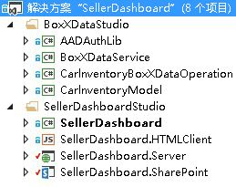


### BoxXDataStudio

此 Studio 包括与 SAP Gateway for Microsoft 交互所需的所有组件。


- **AADAuthLib**

    此组件用于执行  [Azure AD 授权代码流](https://msdn.microsoft.com/zh-cn/library/azure/dn645542.aspx)，它使用单一模式。

    以下代码段显示了 AADAuthLib 组件提供的主要功能。有关详细信息，请参阅 AADAuthLib/AuthUtil.cs 示例代码帮助程序类。


  ```cs

  // Use the auth code, acquire the refresh token and access token, and store them in the current session
        public bool AcquireTokenFromAuthCode(string authCode, string redirectUrl = "redirectUrl")
        {
            if (!IsAuthorized &amp;&amp; !string.IsNullOrEmpty(authCode))
            {
                AuthenticationResult authResult = _authContext.AcquireTokenByAuthorizationCode(authCode,
                    new Uri(ConfigurationManager.AppSettings["ida:" + redirectUrl]),
                    _clientCredential,
                    ConfigurationManager.AppSettings["ida:ResourceUrl"]);

                HttpContext.Current.Session["RefreshToken"] = authResult.RefreshToken;
                HttpContext.Current.Session["AccessToken-" + ConfigurationManager.AppSettings["ida:ResourceUrl"]] = new Tuple<string, DateTimeOffset>(authResult.AccessToken, authResult.ExpiresOn);

                return true;
            }

            return false;
  }

 // Provide the access token, which is stored in the current session, if the access token expired, use the refresh token get a new one.
 public string AccessToken
        {
            get
            {
                if (!IsAuthorized) throw new UnauthorizedAccessException();

                var accessToken = HttpContext.Current.Session["AccessToken-" + ConfigurationManager.AppSettings["ida:ResourceUrl"]] as Tuple<string, DateTimeOffset>;

                if (IsAccessTokenValid(accessToken))
                {
                    return accessToken.Item1;
                }

                accessToken = RenewAccessToken();
                HttpContext.Current.Session["AccessToken-" + ConfigurationManager.AppSettings["ida:ResourceUrl"]] = accessToken;

                return accessToken.Item1;
            }
  }
  ```

- **BoxXDataService**

    这是一种 WCF RIA 服务，它是供 Azure 中承载的 SellerDashboard 服务器端组件使用的界面，并且使用 SAP Gateway for Microsoft 中的 SAP 数据源。

    以下代码段是 WCF RIA 服务支持的 CRUD Web 方法。有关详细信息，请参阅 BoxXDataService/BoxXDataService.cs。


  ```cs

[Query(IsDefault = true)]
        public IQueryable<InventoryItem> GetAllCarInventory()
        {
            BoxXDataReader dataReader = BoxXDataReader.Instance;
            IInventoryCollection dataCollection = ModelFactory.CreateInventoryCollection(dataReader.SchemaPropertyNames);
            IInventoryQuery query = QueryFactory.CreateQuery();
            dataReader.GetData(dataCollection, query);

            return dataCollection.Items.Cast<InventoryItem>().AsQueryable();
        }

        [Update]
        public void UpdateCarInventoryItem(InventoryItem carInventoryItem)
        {
            BoxXDataUpdater dataUpdater = BoxXDataUpdater.Instance;
            dataUpdater.UpdateInventoryItem(carInventoryItem);
        }

        [Insert]
        public void InsertCarInventoryItem(InventoryItem carInventoryItem)
        {
            BoxXDataCreater dataCreater = BoxXDataCreater.Instance;
            dataCreater.CreateInventoryItem(carInventoryItem);
        }

        [Delete]
        public void DeleteCarInventoryItem(InventoryItem carInventoryItem)
        {
            BoxXDataDeleter.DeleteInventoryItem(carInventoryItem.ID);
 }
  ```

- **CarInventoryBoxXDataOperation**

    这是 BoxXDataService 的真实 CRUD 实现。下图显示了 CarInventoryBoxXDataOperation 的主代码体系结构。CRUD 命名空间用于实现 CRUD 操作，Util 命名空间是 CRUD 命名空间的帮助程序代码。

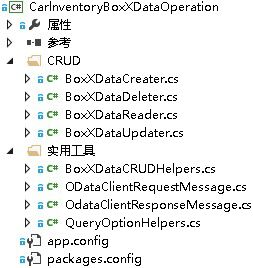


- **CarInventoryModel**

    这是一个用于实现数据模型和实用程序的库项目。根据 SAP 数据架构，数据模型定义必须与 SAP Gateway for Microsoft 使用的 OData 终结点的元数据匹配。BoxXDataService 和 CarInventoryBoxXDataOperation 使用此定义将 SAP 数据库项目转换为汽车库存实例。

    下图显示了主要组件。


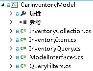


### SellerDashboardStudio

SellerDashboardStudio 包括标准 LightSwitch SharePoint 外接程序组件。


- **SellerDashboard**

    SellerDashboard 是一个 StartUp 项目，用于将 SellerDashboard 外接程序发布到 Azure 网站，将其 SharePoint 外接程序发布到 SharePoint 开发人员网站。


- **SellerDashboard.HTMLClient**

    此组件包括屏幕、自定义控件和照片上载控件。 下图显示了主要组件。


- 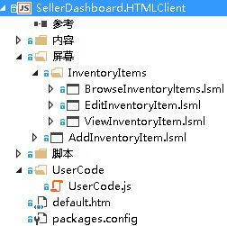


SellerDashboard.HTML.Client 包括下列四个屏幕：

  - BrowseInventoryItems 是主屏幕，用于浏览所有库存项目的基本信息。


  - ViewInventoryItem 是详细信息屏幕，用于显示每个库存项目的详细视图。


  - EditInventoryItem 是编辑弹出菜单的屏幕，用于编辑库存项目。


  - AddInventoryItem 是添加弹出菜单的屏幕，用于添加新的库存项目。


    UserCode.js file 文件包括 UX 自定义控件代码。

    Scripts 文件夹中的 photohelper.js 和 sharepointauthhelper.js 文件基于文章 [演练：使用 LightSwitch 创建 SharePoint 外接程序](https://msdn.microsoft.com/zh-cn/library/jj969621.aspx)中提供的指导。


- **SellerDashboard.Server**

    此组件包括 WCF RIA 数据源、SharePoint 数据源和照片上载 Web API。 下图显示了主要组件。

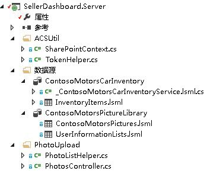


SharePointContext.cs 和 TokenHelper.cs 是帮助程序类，提供用于向 SharePoint 进行身份验证的客户端上下文。这将启用用于将汽车照片上载到图片库的照片上载 Web API。PhotoListHelper.cs 和 PhotosController.cs 文件将实现照片上载 Web API。有关 LightSwitch 如何使用照片上载 Web API 的详细信息，请参阅文章 [演练：使用 LightSwitch 创建 SharePoint 外接程序](https://msdn.microsoft.com/zh-cn/library/jj969621.aspx)。


- **SellerDashboard.SharePoint**

    此组件在 LightSwitch 解决方案之后包含，以启用 SharePoint 项目。您可以使用此组件配置用于图片库的 SharePoint 网站，并设置外接程序的必要权限。 在托管图片库的 SharePoint 网站上，需向 SellerDashboard 授予完全控制权限级别。


## 实现


### 概述

下图显示了组成 SellerDashboard 的组件。实线显示数据流，虚线显示 OAuth 流。绿色组件与 SAP 数据操作相关，蓝色组件与 SharePoint 图片库操作相关，橙色组件显示整个 SellerDashboard 应用程序的操作。 


 **SellerDashboard 解决方案**


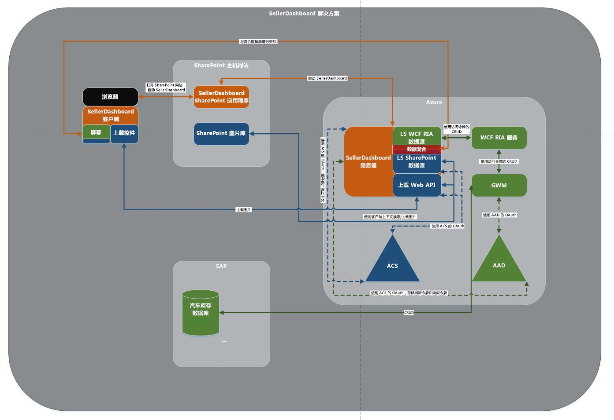


### 数据混搭

LightSwitch 可在设计器中添加两个数据源之间的关系，以支持数据混搭。


 **SAP 数据源**


-  *SAP 数据库中的数据架构* 

    以下代码段显示 SAP Gateway for Microsoft 中的一个数据架构示例。


  ```XML

<?xml version="1.0" encoding="UTF-8"?> 
- <edmx:Edmx xmlns:sap="http://www.sap.com/Protocols/SAPData" xmlns:m="http://schemas.microsoft.com/ado/2007/08/dataservices/metadata" 
xmlns:edmx:"http://schemas.microsoft.com/ado/2007/06/edmx" Version="1.0">
   - <edmx:DataServices m:DataServiceVersion="2.0">
      - <Schema xml:lang="en" xmlns="http://schemas.microsoft.com/ado/2008/09/edm" Namespace="ZCAR_POC_SRV">
         - <EntityType sap:content-version="1" Name="ContosoMotors">
              - <Key>
                     <PropertyRef Name="ID"/>
               </Key>
               <Property Name="ContactPhone" Type="Edm.String"/>
               <Property Name="ContactEmail" Type="Edm.String"/>
               <Property Name="ID" Type="Edm.Int32" Nullable="false"/>
               <Property Name="BuyerEmail" Type="Edm.String" MaxLength="255"/>
               <Property Name="MaxPower" Type="Edm.Int32" Nullable="false"/>
               <Property Name="Engine" Type="Edm.String" Nullable="false" MaxLength="255"/>
               <Property Name="BodyStyle" Type="Edm.String" Nullable="false" MaxLength="255"/>
               <Property Name="Transmission" Type="Edm.String" Nullable="false" MaxLength="255"/>
               <Property Name="Year" Type="Edm.Int32" Nullable="false"/>
               <Property Name="Model" Type="Edm.String" Nullable="false" MaxLength="255"/>
               <Property Name="Brand" Type="Edm.String" Nullable="false" MaxLength="255"/>
               <Property Name="ExtColor" Type="Edm.String" Nullable="false" MaxLength="255"/>
              <Property Name="IntColor" Type="Edm.String" Nullable="false" MaxLength="255"/>
              <Property Name="ContactName" Type="Edm.String" Nullable="false" MaxLength="255"/>
              <Property Name="Price" Type="Edm.String" Nullable="false"/>
              <Property Name="StockNo" Type="Edm.String" Nullable="false"/>
              <Property Name="Arrived_Date" Type="Edm.DateTime" Nullable="false" Precision="0"/>
              <Property Name="Status" Type="Edm.String" Nullable="false" MaxLength="255"/>
      </EntityType>
   - <EntityContainer Name="ZCAR_POC_SRV_Entities" m:IsDefaultEntityContainer="true">
          <EntitySet sap:content-version="1" Name="ContosoMotorsCollection" sap:searchable="true" EntityType="ZCAR_POC_SRV.ContosoMotors"/>
     </EntityContainer>
     <atom:link xmlns:atom="http://www.w3.org/2005/Atom" href="http://contoso.cloudapp.net:8080/perf/sap/opu/odata/sap/ZCAR_POC_SRV/$metadata" rel="self"/>
     <atom:link xmlns:atom="http://www.w3.org/2005/Atom" href="http://contoso.cloudapp.net:8080/perf/sap/opu/odata/sap/ZCAR_POC_SRV/$metadata" rel="latest-version"/>
</Schema>
</edmx:DataServices>
</edms:Edmx>           

  ```


这是我们的测试数据库，"属性类型"和"可为空值"基于具体方案。ID 为 PropertyRef，OData CRUD 操作基于 ID。StockNo 属性用于将数据与 SharePoint 图片库中存储的汽车图片进行混搭。


-  *为 RIA 服务定义的数据模型* 

  ```cs

public interface IInventoryItem
    	{
        IEnumerable<InventoryPropertyName> ValidPropertyNames { get; }
        bool IsValid { get; }

        int ID { get; set; }
        DateTime ArrivedDate { get; set; }
        string BodyStyle { get; set; }
        string Brand { get; set; }
        string BuyerEmail { get; set; }
        string ContactEmail { get; set; }
        string ContactName { get; set; }
        string ContactPhone { get; set; }
        string Engine { get; set; }
        string ExtColor { get; set; }
        IEnumerable<Uri> Images { get; }
        string IntColor { get; set; }
        int MaxPower { get; set; }
        string Model { get; set; }
        decimal Price { get; set; }
        bool Removed { get; }
        string Status { get; set; }
        string StockNo { get; set; }
        string Transmission { get; set; }
        int Year { get; set; }

        void AddImageUrl(Uri url);
        bool CopyFrom(IInventoryItem other);
        object GetPropertyValue(InventoryPropertyName property);
        void MarkAsRemoved();
        void SetPropertyValue(InventoryPropertyName property, object value);
       }

    	public interface IInventoryCollection
       {
        IEnumerable<InventoryPropertyName> QueriedPropertyNames { get; }
        IEnumerable<IInventoryItem> Items { get; }
        bool Valid { get; }

        IInventoryItem this[int id] { get; }
        bool Contains(int id);
        void AddItem(IInventoryItem inventoryItem);
        IInventoryCollection Filter(Predicate<IInventoryItem> match);
        bool CopyFrom(IInventoryCollection other);
}

  ```


未包括在 SAP 数据库架构中的任何属性均可忽略。例如，出于可伸缩性考虑，此处添加了 **Images** 属性。此数据模型是真实 SAP 数据库和 SellerDashboard.Server 数据源之间的中间层。LightSwitch 项目具有两个组件：View 和 Server。当您在服务器端添加外部数据源时，LightSwitch 将帮助您构建一个抽象数据层，此数据层已添加到服务器端的数据源中。

大多数属性的类型与 SAP 数据库架构中的属性相同，StockNo 除外，其类型已从 **int** 更改为 **string**。这是因为 StockNo 用作定义 SAP 数据与 SharePoint 图片库之间关系的一种方式。

> **提示**
> StockNo 的类型必须为 **string** ，因为 SharePoint 图片库中存储的值为 **Text** 。这两种类型必须匹配才能实现数据混搭。

两个界面的实现为 CarInventoryModel/InventoryItem.cs 和 CarInventoryModel/InventoryCollection.cs。


-  *LightSwitch 服务器端使用的数据源* 

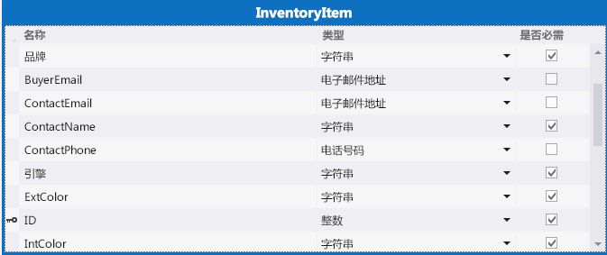


在 SellerDashboard 服务器中，当您添加 WCF RIA 服务 (BoxXDataService) 时，将包含在 CarInventoryModel 中定义的数据模型，您可获取相关的数据表。您可以更改某些属性的类型。例如，您可以将 **BuyerEmail** 类型从 **String** 更改为 **Email Address** ，LightSwitch 将支持在客户端进行电子邮件格式检查。


 **SharePoint 图片库**


SharePoint 主机网站中的图片库名为 ContosoMotorsPictureLibrary，其中包含三个名为 StockNo、ThumbnailUrl 和 FullImageUrl 的新列。这些列均配置为 **Text** 字段。


> **提示**
> 列名称需区分大小写。 


StockNo 列用于创建与 SAP 数据的关系。ThumbnailUrl 和 FullImageUrl 列以一种便捷的方式获取相关图片的 URL。


 *LightSwitch 服务器端使用的数据源* 


ContosoMotorsPicture 是一种 LightSwitch 数据源模型，它将映射到在 LightSwitch 服务器端的 SharePoint 主机网站图片库。


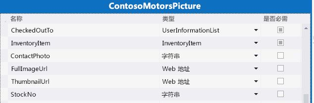


 **数据关系**


在 InventoryItem 和 ContosoMotorsPicture 之间添加一对零关系或一对一关系。下图显示了在 Visual Studio 中使用 LightSwitch 时将是什么情况


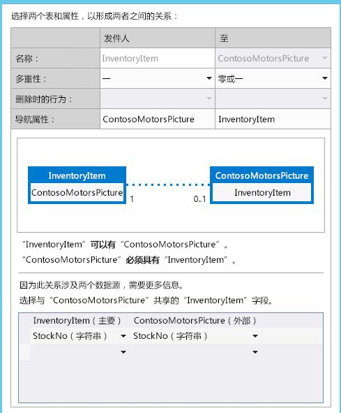


### Azure AD 和 ACS 中的 OAuth

本节概述了外接程序如何在 Azure AD 和访问控制服务 (ACS) 中实现 OAuth。


 **概述**


SellerDashboard 是一款 SharePoint 提供程序主机外接程序，它必须通过 SAP Gateway for Microsoft 在两种数据源上运行：SharePoint 图片库和 SAP 数据。


要访问 SharePoint 图片库，SellerDashboard 需要对 ACS 进行身份验证并从其获取访问令牌。但是，要访问 SAP 数据，SellerDashboard 需要从 Azure AD 获取不同的访问令牌，因为 SAP Gateway for Microsoft 使用 Azure AD 进行身份验证和授权。


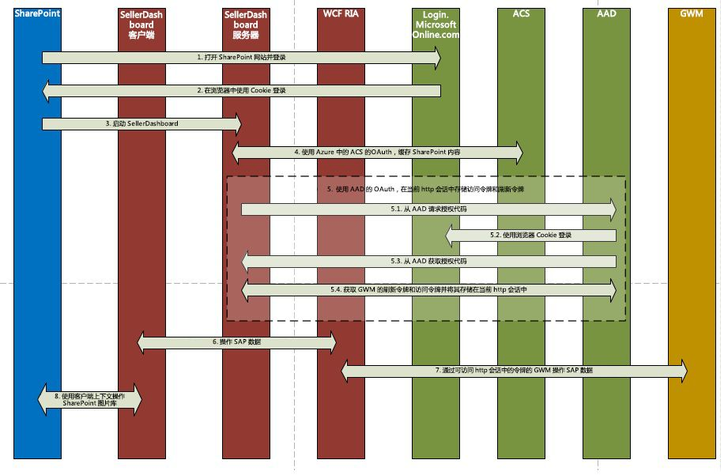


 **实现**


SellerDashboard 是一款 SharePoint 提供程序托管的外接程序，支持使用 SharePoint 客户端对象模型执行图片上载操作。用于创建 SharePoint 主机的客户端上下文的 SharePoint 上下文将会缓存，然后此客户端上下文将供上载 Web API 使用。


完成 ACS 中的 OAuth 过程后，将向 Azure AD 发送身份验证请求。要完成此操作，外接程序将使用 Cookie 登录到 Login.MicrosoftOnline.com。然后完成 Azure AD 授权代码流，这将返回外接程序缓存以供会话中今后的身份验证请求使用的刷新令牌。下面是用于此过程的代码。


```cs

protected override void Page_Load(object sender, EventArgs e)
{
    if (!IsPostBack)
    {
 SharePointContext spContext = SharePointContextProvider.Current.GetSharePointContext(Context);
        if (spContext != null)
        {
     // Cache the SharePoint Context, which will be used to create Client Context for SharePoint host
            _spContext = spContext;
        }

		
        // Acquire refresh token and access token, and store them in the current session, which will be used do the OAuth with AAD for operating the SAP data
        AuthUtil.Instance.AcquireTokenFromAuthCode(Request.QueryString["code"]);

        if (!AuthUtil.Instance.IsAuthorized)
        {
             Response.Redirect(AuthUtil.Instance.AuthCodeUrl);
        }
     }

     base.Page_Load(sender, e);
 }
```

有关详细信息，请参阅代码示例中的 SellerDashBoard.Server/SharePointLaunch.aspx.cs 和 AADAuthLib/AuthUtil.cs。


SellerDashboard.Server 包括 SharePointContext.cs 和 TokenHelper.cs 文件，这两个文件用于获取 SharePoint 主机的仅应用程序客户端上下文。这两个文件已由 Visual Studio 自动添加到您的 SharePoint 项目中。（Visual Studio 将项目命名为 < *yourprojectname*  >Web，例如 SharePointAppWeb。）您可以将这两个文件复制到 SellerDashboard 外接程序源代码并将其包含在您的项目中。


### 对 SAP Gateway for Microsoft 中的 SAP 数据执行 CRUD 操作

以下代码段显示了 CRUD 操作的主要代码逻辑。有关详细信息，请参阅代码示例中的 CarInventoryBoxXDataOperation 实现。


 **BoxXDataCreater**


```cs

        public void CreateInventoryItem(IInventoryItem inventoryItem)
        {
            if (_model == null)
            {
                _model = BoxXDataCRUDHelpers.GetMetadata(BoxXDataCRUDHelpers.MetadataUrl);
            }

            // Create new entry request generate
            var requestMessage = new ODataClientRequestMessage(new Uri(BoxXDataCRUDHelpers.DataCollectionUrl),
                                                                ODataConstants.MethodPost);
            BoxXDataCRUDHelpers.CreateEntryRequestHeaderSetter(requestMessage, AuthUtil.Instance.AccessToken);
            BoxXDataCRUDHelpers.SetODataRequestContent(requestMessage, _model, inventoryItem);

            // Create new entry request execute
            IODataResponseMessage responseMessage = requestMessage.GetResponse();

        }
BoxXDataReader
 public void GetData(IInventoryCollection dataCollection, IInventoryQuery query)
        {
            GetValueWithoutLocallyFiltering(dataCollection, query);

            if (query.Filters.Any())
            {
                var filteredCollection = dataCollection.Filter(inventoryItem =>
                    query.Filters.Any(filter => filter.Match(inventoryItem)));

                dataCollection.CopyFrom(filteredCollection);
            }
        }
```

 **BoxXDataUpdater**


```cs

public void UpdateInventoryItem(IInventoryItem inventoryItem)
        {
            if (_model == null)
            {
                _model = BoxXDataCRUDHelpers.GetMetadata(BoxXDataCRUDHelpers.MetadataUrl);
            }

            // Update existing entry request generate
            var requestMessage = new ODataClientRequestMessage(new Uri(BoxXDataCRUDHelpers.DataCollectionUrl + '(' + inventoryItem.ID + ')'),
                                                                ODataConstants.MethodPut);
            BoxXDataCRUDHelpers.UpdateEntryRequestHeaderSetter(requestMessage, AuthUtil.Instance.AccessToken);
            BoxXDataCRUDHelpers.SetODataRequestContent(requestMessage, _model, inventoryItem);

            // Update existing entry request execute
            IODataResponseMessage responseMessage = requestMessage.GetResponse();
        }
BoxXDataDeleter
 public static void DeleteInventoryItem(int ID)
        {
            // Delete existing entry request generate
            var requestMessage = new ODataClientRequestMessage(new Uri(BoxXDataCRUDHelpers.DataCollectionUrl + '(' + ID + ')'),
                                                                ODataConstants.MethodDelete);
            BoxXDataCRUDHelpers.DeleteEntryRequestHeaderSetter(requestMessage, AuthUtil.Instance.AccessToken);

            // Delete existing entry request execute
            IODataResponseMessage responseMessage = requestMessage.GetResponse();
        }
```


### 将照片上载到 SharePoint 图片库

照片上载控件和照片上载 Web API 实现用于将照片上载到 SharePoint 图片库，方法是使用基于以下文章中指导的代码： [演练：使用 LightSwitch 创建 SharePoint 外接程序](https://msdn.microsoft.com/zh-cn/library/jj969621.aspx)。


 **对于 photohelper.js 更改：**


为 uploadForm 添加了一个新字段，用于将 StockNo 传递到照片上载 Web API。


```

uploadForm = $(
             '<form id="uploadForm" method="POST" enctype="multipart/form-data" action="' + API_URL + '"  data-ajax="false" target="uploadTargetIFrame">' +
             '   <input name="fileInput" id="fileInput" type="file" size="30" data-theme="c" accept="image/*" multiple="true"/>' +
             '   <input type="hidden" name=' + screen.InventoryItem.StockNo + '>' +
             '</form>');

```

添加用于缓存图片 URL 的逻辑以及图片延迟逻辑。


```

function completeUpload(uploadedFiles) {
            var fullImageUrl = uploadedFiles[0];
            var photoNameWithExt = fullImageUrl.substr(fullImageUrl.lastIndexOf('/') + 1);
            var photoNameWithoutExt = photoNameWithExt.substr(0, photoNameWithExt.lastIndexOf("."));
            var photoPathUri = fullImageUrl.substr(0, fullImageUrl.lastIndexOf('/'));
            var photoExt = photoNameWithExt.substr(photoNameWithExt.lastIndexOf(".") + 1, photoNameWithExt.length);
            var thumbnailUrl = photoPathUri + "/_t/" + photoNameWithoutExt + "_" + photoExt + ".jpg";
            setCacheUrl(screen.InventoryItem.StockNo, fullImageUrl + "*#00#" + thumbnailUrl);
            setDetailsCarPicture(fullImageUrl);
            screen.closePopup();
        }
```

 **对于 PhotosController.cs 更改：**


对 SharePoint 主机使用由缓存 SharePoint 上下文创建的仅应用程序客户端上下文。


这样做是因为 ContosoMotorsPictureLibrary 不属于 SellerDashboard 外接程序；而属于 SharePoint 主机网站。此外，请移除与照片删除相关的代码。


```cs

private ClientContext AppWebContext
    {
        get
        {
            if (appWebContext == null)
            {
                appWebContext = SharePointLaunch.getAppWebContext();
            }
            return appWebContext;
        }
    }

```

 **对于 PhotoListHelper.cs 更改：**


添加图片更新逻辑，这将删除旧的图片项（如果存在），然后添加一个新的图片项。分配新图片项的 StockNo，同时将 FullImageUrl 和 ThumbnailUrl 值设置为新图片项。


```cs

            // Delete the old picture item
            foreach (ListItem item in items)
            {
                if (!string.IsNullOrEmpty((string)(item["StockNo"])))
                {
                    string tempStockNo = item["StockNo"].ToString();
                    if (tempStockNo.Equals(stockNo))
                    {
                        item.DeleteObject();
                        siteContext.ExecuteQuery();
                        break;
                    }
                }
            }

            // Update the new picture item
            foreach (ListItem item in items)
            {
                string fullImageName = item["FileLeafRef"].ToString();
                string thumbnailName = fullImageName.Replace('.', '_') + ".jpg";

                if (photoUri.Contains(fullImageName))
                {
                    item["StockNo"] = stockNo;
                    item["FullImageUrl"] = photoUri;
                    item["ThumbnailUrl"] = photoUri.Replace(fullImageName, "_t/" + thumbnailName);
                    item.Update();
                    siteContext.ExecuteQuery();
                    break;
                }
            }


```


### 用户体验

对于特殊的方案请求，将实施很多自定义控件以支持请求。您可以在 UserCode.js 文件中查找相关代码。您可以使用 LightSwitch 设计器快速构建一个简单的用户界面。常规的屏幕设置即可满足您的测试请求。因为用户体验并非本文的重点，本文不会提供详细信息。


## 部署应用程序

完成此部分的步骤以部署外接程序。在部署此外接程序之前，确保已在 Azure 租户上部署和配置 SAP Gateway for Microsoft。


### 创建您的 Azure 网站


1. 以全局管理员的身份登录到  [Microsoft Azure 门户](http://go.microsoft.com/fwlink/?LinkID=512959)。


2. 在左侧菜单中，单击"网站"。

    > **注释**
      > 您将使用此网站为 SellerDashboard 托管 SharePoint 提供程序托管的外接程序。 
3. 在页面底部的命令栏中，单击"新建"。


4. 依次选择"计算">"网站">"快速创建"。


5. 在"URL"框中，输入您想使用的 URL 的第一部分，选择一个 Web 托管计划，然后单击"创建网站"。复制此 URL，因为当您稍后在本文后面的部分中注册外接程序时将需要此 URL。例如，使用 Constoso.azurewebsites.net。


### 注册 SharePoint 应用程序

我们使用空的 SharePoint 外接程序向 SharePoint 外接程序授予读取权限，它需要这一权限从 SharePoint Online 图片库中检索汽车图像。完成以下步骤以向包含此图片库的 SharePoint 网站注册 SharePoint 外接程序，并授予外接程序对网站的读取访问权限。


### 注册 SharePoint 外接程序


1. 打开"解决方案资源管理器"中的解决方案。


2. 在 SharePoint 外接程序的属性中，输入包含此图片库的 SharePoint 网站的"网站 URL"。在显示的登录提示中，以网站所有者的身份登录。


3. 在应用程序清单中设置读取权限。

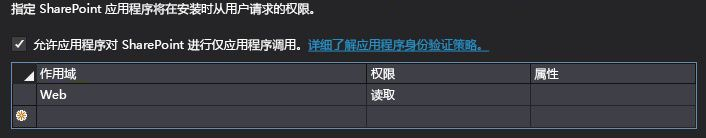


4. 将外接程序设置为启动项目，并运行此项目。您可以在 ContosoMotorsCarInventoryWeb/Web.config 文件中找到 ClientID 和 ClientSecret 值。代码应类似于：

  ```XML

<add key="ClientId" value="06af1059-8916-4851-a271-2705e8cf53c6"/>
<add key="ClientSecret" value="LypZu2yVajlHfPLRn5J2hBrwCk5aBOHxE4PtKCjIQkk="/>
  ```

5. 使用上述值替换 ContosoMotorsCarInventoryWeb/TokenHelper.cs 中的"托管外接程序配置"上 ClientID 和 ClientSecret 的值。代码应类似于：

  ```cs

private static readonly string ClientId = "06af1059-8916-4851-a271-2705e8cf53c6";
private static readonly string ClientSecret = "LypZu2yVajlHfPLRn5J2hBrwCk5aBOHxE4PtKCjIQkk=";

  ```


### 在 Azure AD 中注册您的 Web 应用程序

本节中的步骤说明如何从 Azure 管理门户注册示例外接程序。


1. 使用您的 Azure 服务管理员或共同管理员帐户登录到  [Azure 管理门户](http://go.microsoft.com/fwlink/?LinkID=512959)。


2. 在左侧导航窗格中，单击"Active Directory"。


3. 在 Active Directory 页上，单击为 SAP Gateway for Microsoft 配置的目录。

    > **提示**
      > 如果您不确定使用的是哪个目录，请咨询您的 SAP Gateway for Microsoft 管理员。提示：它是包含 SAP Gateway for Microsoft 的用户和组的目录。 
4. 在导航栏顶部，选择"应用程序"。


5. 在页面底部，单击"添加"。


6. 在打开的对话框中，单击"添加我的组织正在开发的应用程序"。


7. 在"添加应用程序"对话框中，为应用程序命名。例如，将其命名为"SellerDashboard"。


8. 选择"Web 应用程序和/或 Web API"作为应用程序类型，然后单击右箭头。


9. 在"添加属性"对话框中，使用您之前创建的网站的 URL（在"创建 Azure 网站"部分）作为登录 URL。例如，使用  *https://Constoso.azurewebsites.net*  。


10. 对于"APP ID URI"，为应用程序指定一个唯一的 URI，如附加在"登录 URL"结尾的应用程序名称；例如，使用  *https://Constoso.azurewebsites.net/SellerDashboard*  ，其中 Constoso.azurewebsites.net 是您在本文前面部分创建的网站。


11. 单击复选标记创建应用程序。

    应用程序的 Azure 仪表板将打开，并显示一条成功消息。


> **注释**
> 您必须在 Azure AD 中注册外接程序两次，一次是为了进行调试，另一次是为了将其部署用于生产，如步骤 10 中所述。 <BR /><BR /> 要注册外接程序以进行调试，请将"登录 URL"和"APP ID URI"与 SellerDashboard.Server 项目的调试 URL 一起使用，以便您可以运行 Visual Studio 调试器 (F5)。 此 URL 的格式为 https://localhost. *nnnn*  ，其中 *nnnn*  是端口号。在 Visual Studio 中的"属性"窗格中，您可以找到此 URL。<BR /><BR /> 然后，当您准备好部署用于生产时，编辑注册以使用正确的生产 URL。 


### 配置应用程序设置

配置您在上一过程中创建的新应用程序的设置。


1. 在应用程序页面顶部，单击"配置"。


2. 设置必需参数，并记下如下表所述的配置设置。


|**参数**|**操作**|
|:-----|:-----|
|Client ID  <br/> |复制客户端 ID 字段中显示的值。  <br/> |
|Client Secret  <br/> | 生成新的应用程序密钥： <br/>  在"密钥"部分中，选择持续 1 年或 2 年的密钥 。 <br/>  在页面底部的命令栏中，单击"保存"。 <br/>  此时将显示键值。 <br/>  复制并保存此键值以备将来使用；离开此页后，您将无法检索此键值。 <br/> |
|App ID URI  <br/> |复制在"Add-in ID URI"字段中显示的值。  <br/> |
 

请记得保持此信息便于使用，因为您在稍后的过程中将需要它。


3. 在"针对其他应用程序的权限"部分中，执行下列操作：

1. 选择您的 SAP Gateway for Microsoft 应用程序。


2. 在"委派权限"列中，启用 SharePoint 提供程序托管的 SellerDashboard 外接程序将需要的"SAP Gateway for Microsoft"权限复选框。


4. 在页面底部的命令栏中，单击"保存"。


### 替换部署所需的配置


1. 找到 SellerDashboardHTMLClient/UserCode.js，并查找以下代码占位符：

  ```cs

sharePointUrl: "Replace with your SharePoint host site",
// https://fake_domain.sharepoint.com/sites/Developer
SharePointRootUrl: "Replace with your SharePoint root site"
 // https://fake_domain.sharepoint.com/ 

  ```


1. 将 sharePointUrl 值替换为您的 SharePoint 网站，即，将安装外接程序且包含图片库的网站。


2. 将 sharePointRootUrl 值替换为相关的 SharePoint 根网站。


2. 在 SellerDashboard 解决方案中找到 SellerDashboard.Server/Web.config 并查找以下配置占位符：

  ```XML

<add key="ClientSecret" value="MwMp1yxOyy8BGhfD5d9VvuqlRbhaqWESxVNLzgpYNHU=" />
<add key="ClientId" value="ed138b32-c89d-4f22-b74d-7d9d5044b260" />
<add key="Ida:ClientId" value="Replace with Azure register add-in client id" />
<add key="Ida:ClientSecret" value="Replace with Azure register add-in client secret" />
<add key="Ida:TenantId" value="Replace with the SAP Gateway for Microsoft tenant domain, for example <yourDomain>.onmicrosoft.com" />
<add key="Ida:RedirectUrl" value="Replace with the Azure host site, for example https://contoso.azurewebsites.net/SharePointLaunch.aspx" />
<add key="Ida:ResourceUrl" value="Replace with the SAP Gateway for Microsoft instance, for example http://contoso.cloudapp.net/" />
<add key="Ida:ODataServiceBaseUrl" value="Replace with the SAP OData endpoint url, for example https://contoso.cloudapp.net:8081/perf/sap/opu/odata/sap/ZCAR_POC_SRV/" />
<add key="Ida:ODataServiceMetadataUrl" value="Replace with the SAP OData endpoint metadata url, for example https://contoso.cloudapp.net:8081/perf/sap/opu/odata/sap/ZCAR_POC_SRV/$metadata" />
<add key="Ida:DataCollection" value="Replace with OData EntitySet name, for example ContosoMotorsCollection" />
<add key="Ida:ODataFeedOrEntryFormat" value="application/atom+xml" />
<add key="Ida:ODataMetadataFormat" value="application/xml" />
<add key="Ida:ODataContentType" value="application/xml" />
<add key="Ida:ODataVersion" value="2.0" />
<add key="Ida:ODataMaxVersion" value="3.0" />
<add key="Ida:ODataWriterTypeName" value="Replace with the OData EntityType, for example ZCAR_POC_SRV.ContosoMotors" />
<add key="Ida:DefaultID" value="1024" />
<add key="Ida:DefaultStockNo" value="2048" />
<add key="Ida:SPPicLib" value="Replace with you picture library name, for example ContosoMotorsPictureLibrary" />
  ```


1. 将 ClientId 和 ClientSecret 值替换为您在上一过程中获取的值。


2. 将 Ida:ClientId 和 Ida:ClientSectet 值替换为 Azure AD 应用程序中的值。


3. 将 Ida:TenantId 值替换为 < *yourDomain*  >.onmicrosoft.com。

    例如，如果您的组织帐户是 someone@< *yourDomain*  >.onmicrosoft.com，则 < *yourDomain*  >.onmicrosoft.com 就是您需要的。


4. 将 Ida:RedirectUrl 值替换为您在 Azure 上创建的托管此外接程序的测试网站。


5. 将 Ida:ResourceUrl 值替换为已在 Azure 中部署和配置的 SAP Gateway for Microsoft 实例。


6. 将 Ida:ODataServiceBaseUrl 值替换为 SAP Gateway for Microsoft 实例的 OData 终结点 URL。


7. 将 Ida:ODataServiceMetadataUrl 值替换为 SAP Gateway for Microsoft 实例的 OData 终结点元数据 URL。


8. 替换 Ida:DataCollection 值。您可以从元数据中获取此值。例如，使用 ContosoMotorsCollection。


9. 替换 Ida:ODataWriterTypeName 值。您可以从元数据中获取正确的值。

    例如，使用 以下值：


  ```XML

ZCAR_POC_SRV.ContosoMotors

<EntityContainer Name="ZCAR_POC_SRV_Entities" m:IsDefaultEntityContainer="true">
     <EntitySet sap:content-version="1" Name="ContosoMotorsCollection" sap:searchable="true" EntityType="ZCAR_POC_SRV.ContosoMotors"/>
</EntityContainer>
<atom:link xmlns:atom="http://www.w3.org/2005/Atom" href="http://contoso.cloudapp.net:8080/perf/sap/opu/odata/sap/ZCAR_POC_SRV.ContosoMotors"/>
  ```

10. 将 Ida:SPPicLib 值替换为您在 SharePoint 主机网站中创建的图片库名称。


### 发布项目


1. 在 SellerDashboard 解决方案中找到 SellerDashboard 项目。


2. 右键单击 SellerDashboard 发布该项目。


3. 选择"提供程序承载"。


4. 选择"Windows Azure"。


5. 以全局管理员身份登录。


6. 选择在 Azure 中创建的网站。


7. 指明您想要使用 HTTPS。


8. 使用默认的数据连接字符串。


9. 输入您在 Azure 中创建的网站作为主机网站；输入您在前一过程中获取的 ClientId 和 ClientSecret 值。


10. 发布。

    您将获得一个已发布的程序包。


### 安装应用程序


1. 以网站管理员身份登录到您的 SharePoint 部署网站。


2. 在网站主页上，单击"要部署的新外接程序"。


3. 选择从发布过程中获得的程序包。


4. 部署并信任该程序包。


## 外部代码列表


|**Web 源**|**集合**|**代码位置**|**许可证**|
|:-----|:-----|:-----|:-----|
| [调查外接程序教程：使用 LightSwitch 开发 SharePoint 应用程序](http://code.msdn.microsoft.com/Survey-App-Tutorial-a70d0afd) <br/>  [演练：使用 LightSwitch 创建 SharePoint 外接程序](https://msdn.microsoft.com/zh-cn/library/jj969621.aspx) <br/> |**照片上载程序：** <br/> PhotoListHelper.cs  <br/> PhotosController.cs  <br/> Global.asax.cs  <br/> | [调查外接程序教程：使用 LightSwitch (C#) 开发 SharePoint 应用程序](http://www.getcodesamples.com/src/2571E87E/) <br/> |Apache 许可证，版本 2.0  <br/> |
|null  <br/> |**ACS 身份验证:** <br/> SharePointContext.cs  <br/> TokenHelper.cs  <br/> |**VS 内部模板：** <br/> Visual C#/Office/SharePoint/Apps/AppforSharePoint  <br/> ||
 

