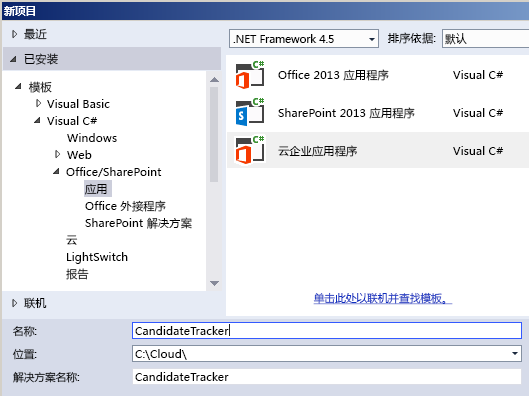
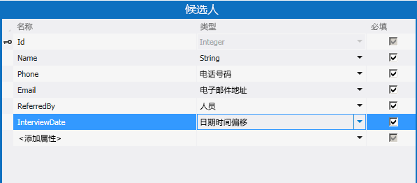
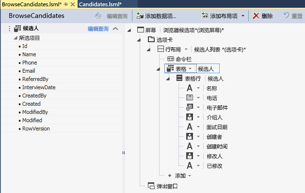
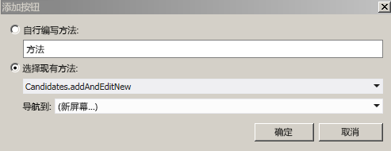
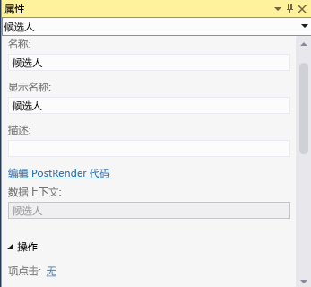
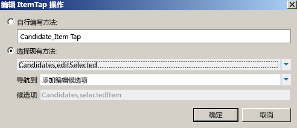

# 使用社交新闻源创建云企业外接程序
通过使用 Visual Studio 中的"云企业外接程序"模板，您可以创建 SharePoint 外接程序，在该外接程序中，用户可以查看、添加和更新 SharePoint 数据。"云企业外接程序"项目类型使用 Visual Studio LightSwitch 技术，这大大简化了创建托管在 SharePoint 上的企业外接程序的过程。在此演示中，您将创建一个外接程序以跟踪职位候选人，利用 SharePoint for Office 365 社交集成功能为外接程序提供新闻源。您可以从 MSDN 代码库下载完整的示例应用程序： [使用社交新闻源创建云企业外接程序](http://code.msdn.microsoft.com/Creating-a-Cloud-Business-8540c0c9)
## 先决条件

此演示需要 Visual Studio 2013。


要托管外接程序，您还需要在 Office 365 上具有 SharePoint 2013 网站或 SharePoint 开发人员网站，您可从 [注册 Office 365 开发人员网站](http://go.microsoft.com/fwlink/?LinkId=263490)开始。


## 创建云企业外接程序项目
<a name="bk_create"> </a>

要创建云企业外接程序，请使用 Visual Studio 中的"云企业外接程序"项目模板开始。


### 创建项目


1. 在菜单栏上，依次选择"文件"、"新建"、"项目"。

    将打开"新建项目"对话框。


2. 在模板列表中，展开"Visual Basic"或"Visual C#"节点，展开"Office/SharePoint"节点，选择"外接程序"节点，然后选择"云企业外接程序"，如图 1 中所示。

   **图 1. 添加项目**





3. 在"名称"文本框中，输入 CandidateTracker，然后选择"确定"按钮。

    "新建云企业外接程序"向导将打开。


4. 在"新建云企业外接程序"向导中，输入 Office 365 开发人员网站的 URL，然后选择"完成"按钮。

    URL 的格式应为 https://  _MySite_.sharepoint.com/sites/Developer/。

    "CandidateTracker"解决方案将添加到包含以下四个项目的解决方案资源管理器：顶级"CandidateTracker"项目、"CandidateTracker.HTMLClient"项目、"CandidateTracker.Server"项目和"CandidateTracker.SharePoint"项目。


## 添加数据和屏幕
<a name="bk_add"> </a>

候选人跟踪器外接程序需要数据库表，以及用于查看、添加和更新数据的屏幕，前者在"服务器"项目中创建，后者在"HTMLClient"项目中创建。


### 添加数据库表


1. 在"解决方案资源管理器"中，打开"CandidateTracker.Server"节点的快捷菜单并选择"添加表"。

    实体设计器将打开。


2. 在"属性"窗口的"名称"属性文本框中，输入 Candidate。


3. 在实体设计器中，选择"<添加属性>"链接，然后输入 Name。


4. 选择 Enter 键，接受默认的"类型" **String**，并将"必填"复选框保留选中状态。


5. 选择"<添加属性>"链接，输入 Phone，然后选择"Tab"键。


6. 在"类型列中，选择"电话号码"，然后选择 Tab 键两次。

    "电话号码"是自定义业务类型，它可自动格式化并提供电话号码验证。


7. 在下一行中，为"名称"输入 Email，然后将"电子邮件地址"选择为"类型"。

    "电子邮件地址"是提供电子邮件地址验证的另一个自定义业务类型。


8. 在下一行中，为"名称"输入 ReferredBy，然后将"个人"选择为"类型"。

    "个人"业务类型提供到 SharePoint User Profile Service 的连接，这将从 Active Directory 中拉取用户信息。


9. 在下一行中，为"名称"输入 InterviewDate，然后将"日期时间偏移"选择为"类型"。

    "日期时间偏移"业务类型以 UTC 格式存储日期和时间，使位于不同时区的用户查看正确的时间。

    图 2 显示完成的实体。


   **图 2. 候选人实体**





### 创建浏览屏幕


1. 在实体设计器的"角度"栏中，选择"HTML 客户端"选项卡，然后在工具栏上选择"屏幕"。

    将打开"添加新屏幕"对话框。


2. 在"添加新屏幕"对话框的"选择屏幕模板"列表中，选择"浏览数据屏幕"。


3. 在"屏幕数据"列中，选择"候选人"，然后选择"确定"按钮。

    屏幕设计器将打开，在左侧窗格中显示数据实体，在右侧窗格中显示屏幕布局。


4. 在屏幕设计器的右侧窗格中，选择"列表 | 候选人"节点，然后展开"列表"列表并选择"表"，如图 3 中所示。

   **图 3. 表控件**





    这将以表格式显示"候选人"信息，而非默认列表格式。

    请注意，除了您为表定义的字段，还有其他四个字段："创建者"、"创建时间"、"修改者"和"修改时间"。这些字段形成了审计线索，以显示项目是何时由谁添加或最后更新的。


### 创建添加屏幕


1. 在屏幕设计器中，打开"命令栏"节点的快捷菜单并选择"添加按钮"。


2. 在"添加按钮"对话框中，展开"showTab"列表并选择"addAndEditNew"（如图 4 中所示），然后选择"确定"按钮。

   **图 4. "添加按钮"对话框**





    将打开"添加新屏幕"对话框。


3. 在"添加新屏幕"对话框中，接受默认值并选择"确定"按钮。


将打开一个新的屏幕设计器窗口。


### 创建编辑屏幕


1. 选择"BrowseCandidates.lsml"设计器选项卡，然后在屏幕设计器中选择"表 | 候选人"节点。


2. 在"属性"窗口中，选择"项点击"链接，如图 5 中所示。

   **图 5. "项点击"链接**





    "编辑项点击操作"对话框将打开。


3. 在"编辑项点击操作"对话框中，展开"showTab"列表并选择"editSelected"（如图 6 中所示），然后选择"确定"按钮。

   **图 6. "编辑项点击操作"对话框**





### 测试外接程序


1. 在菜单栏上，选择"调试"，然后选择"启动调试"。

    第一次在计算机上运行 SharePoint 外接程序时，您将收到安装 Localhost 证书的提示，因为云企业外接程序始终使用 SSL（安全套接字层）。如果您接受此证书，则每次启动外接程序时不会显示安全警告。因为证书仅适用于 Localhost，系统不会面临威胁。


2. 在"安全警告"对话框中，选择"是"按钮。


3. 如果显示"安全警告"对话框，请选择"是"按钮。

    将显示您的 Web 浏览器。


4. 在"登录"页面上，选择"登录"按钮。


5. 输入您的密码，然后选择"登录"按钮。


6. 收到提示时，选择"信任它"按钮。


7. 在"浏览候选人"屏幕上，选择"添加候选人"按钮。

    "添加候选人"屏幕将打开。


8. 在"添加候选人"屏幕上，输入姓名、电话号码和电子邮件地址。


9. 选择"引用者"字段，并输入您自己的姓名的前三个字符。

    您的全名应该会出现在列表中。如果您的网站连接到 Active Directory，您应该会看到名称以相同三个字符开头的所有用户的列表。


10. （可选）更改"面试日期"日期和时间，然后选择"保存"按钮返回到"浏览候选人"屏幕。

    将显示您刚刚添加的候选人；如果您选择行，"添加编辑候选人"屏幕将打开。请注意，某些字段将从其自定义业务类型继承特殊行为。选择"电话"字段拨打号码，选择"电子邮件"字段发送电子邮件，或者将鼠标悬停在"创建者"字段上方查看联系信息。


11. 关闭浏览器窗口，使外接程序停止运行。


## 添加新闻源
<a name="bk_feed"> </a>

SharePoint for Office 365 的一项功能是添加新闻源，从而允许用户跟踪列表中的活动并添加注释。云企业外接程序使得为外接程序创建新闻源变得非常简单。


### 启用社交集成


1. 选择"Candidates.lsml"设计器选项卡，然后在"角度"栏上选择"服务器"选项卡。


2. 在"属性"窗口中，选中"创建时发布"和/或"更新时发布"复选框，如图 7 中所示。

   **图 7. 社会属性**


3. 选择"选择发布触发器"链接。

    将出现"选择发布触发器"对话框。


4. 在"选择发布触发器"对话框中，清除"所有字段"复选框，选中"面试日期"复选框，然后选择"确定"按钮。


### 测试外接程序


1. 在菜单栏上，选择"调试"，然后选择"启动调试"。


2. 在"浏览候选人"屏幕上，选择您之前创建的候选人。


3. 在"添加编辑候选人"屏幕上，更改"面试日期"，然后选择"保存"按钮。


4. 选择"添加候选人"按钮并添加其他候选人。


5. 在"浏览候选人"屏幕上的 SharePoint 部件版式栏上，选择"新闻源"链接。

    "候选人跟踪器新闻源"将在新的浏览器窗口中打开，并显示所添加和更新的候选人的两个条目。您可以选择文章的"赞"链接，也可以选择"回复"链接添加评论。


6. 关闭两个浏览器窗口，使外接程序停止运行。


## 添加验证
<a name="bk_validate"> </a>

在很多企业外接程序中，您将需要限制对特定功能的访问权限，例如，仅允许经理更改面试日期。云企业外接程序使您可以通过编写验证逻辑来执行此操作；在这种情况下，您需要编写代码，确定当前用户是否为特定 Active Directory 安全组的成员。


### 添加验证


1. 选择"Candidates.lsml"设计器选项卡，然后在"角度"栏上选择"服务器"选项卡。


2. 在工具栏上，展开"编写代码"列表并选择"Candidates_Validate"方法。

    代码编辑器将打开。


3. 在代码编辑器中，将以下代码添加到 **Candidates_Validate** 方法：

  ```VB.net

If Not Application.User.Department = "Hiring Managers" Then
                results.AddEntityError("Permission denied")
            End If
  ```


  ```cs

if (!(Application.User.Department == "Hiring Managers")) {
results.AddEntityError("Permission denied");
}
  ```


    当用户尝试保存记录时， **Validate** 方法将运行。如果用户是"招聘经理"安全组的成员，将保存记录，否则将显示"权限被拒绝"错误消息并放弃记录。


此时，如果您运行外接程序并添加新的候选人，您可能会看到错误消息，除非您是名为"招聘经理"的实际安全组的成员。将"招聘经理"替换为您所属的安全组名称并重试。您现在应该已具备添加候选人的权限。


## 后续步骤
<a name="bk_validate"> </a>

恭喜！您已创建您的首个云企业外接程序。如果您希望将此外接程序与用户共享，下一步是发布外接程序。请参阅 [如何：将云企业外接程序发布到 Office 365](http://msdn.microsoft.com/zh-cn/library/vstudio/dn454601.aspx) 或 [发布 SharePoint 外接程序](http://msdn.microsoft.com/zh-cn/library/office/apps/jj164070.aspx)。


当然，这只是一个简单的示例；除了创建功能齐全的外接程序外，您还可以执行更多操作。由于"云企业外接程序"模板基于 LightSwitch 技术，您可能需要浏览 LightSwitch 文档得到一些启发。请参阅  [LightSwitch SharePoint 外接程序](http://msdn.microsoft.com/zh-cn/library/vstudio/jj969620.aspx)。


## 其他资源
<a name="bk_addresources"> </a>


-  [创建云企业外接程序](create-cloud-business-add-ins.md)


