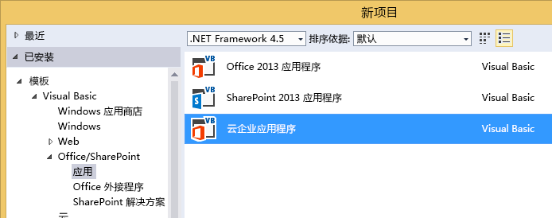
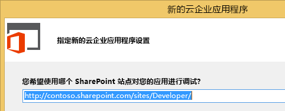
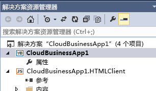
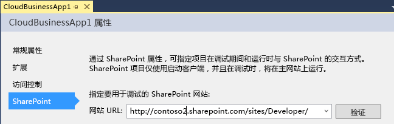

# 创建云企业外接程序
通过使用 Visual Studio 中的"云企业外接程序"模板，您可以在 Office 365 上创建 SharePoint 2013 或 SharePoint 外接程序，这些外接程序已针对添加和管理数据进行优化。
> **注释**
> 您还可以使用 SharePoint 2013 外接程序模板构建 SharePoint 外接程序。 

### 创建云企业外接程序

1. 在菜单栏上，依次选择"文件"、"新建"、"项目"。

    将打开"新建项目"对话框。

2. 在模板列表中，展开"Visual Basic"或"Visual C#"节点，展开"Office/SharePoint"节点，选择"外接程序"节点，然后选择"云企业外接程序"，如图 1 中所示。

   **图 1. 云企业外接程序模板**

3. 在"名称"文本框中，输入项目的名称，然后选择"确定"按钮。

    "新建云企业外接程序"向导将打开。

4. 在"新建云企业外接程序"向导中，输入 SharePoint 服务器或 Office 365 开发人员网站的网站 URL（如图 2 中所示），然后选择"完成"按钮。

   **图 2. SharePoint URL**

URL 的格式应为 https://  _MySite_.sharepoint.com/sites/Developer/。

新解决方案将添加到包含以下四个项目的解决方案资源管理器：顶级项目、"HTMLClient"项目、"服务器"项目和"SharePoint"项目。

### 更改云企业外接程序的网站

1. 在"解决方案资源管理器"中，打开顶级项目节点的快捷菜单并选择"属性"，如图 3 中所示。

   **图 3. 顶级项目节点**

应用程序设计器将打开。

2. 在应用程序设计器中，选择"SharePoint"选项卡，如图 4 中所示。

   **图 4. "SharePoint"选项卡**

3. 在"网站 URL"列表中，为您的 SharePoint 服务器或 Office 365 开发人员网站选择现有 URL 或输入网站 URL。

4. 选择"验证"按钮检验 URL。

## 其他资源

-  [开发云企业外接程序](develop-cloud-business-add-ins.md)

-  [创建云企业外接程序](create-cloud-business-add-ins.md)

