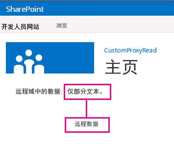

# 为 SharePoint 2013 中的跨域库创建自定义代理页
了解如何使用 SharePoint 中的跨域库创建一个自定义代理页，以从 SharePoint 页面访问远程服务中的数据。
当您构建 SharePoint 外接程序时，通常需要合并来自各种数据源的数据。然而，出于安全考虑，阻止机制会阻止同时与多个域通信。


如果您提供在远程外接程序基础结构中托管的自定义代理页，可以使用跨域库访问远程外接程序中的数据。作为开发人员，您负责实施自定义代理页，并且必须处理自定义逻辑，例如远程外接程序的身份验证机制。如果您希望在客户端级别发生通信，请结合使用跨域库和自定义代理页。
## 使用本文中的示例的先决条件
<a name="SP15Createcustomproxypage_Prereq"> </a>

您需要一个如 [开始创建提供程序承载的 SharePoint 加载项](get-started-creating-provider-hosted-sharepoint-add-ins.md)中所述的开发环境。


### 结合使用自定义代理页和 SharePoint 外接程序之前需要了解的核心概念

下表列出了一些有用的文章，它们可以帮助您了解 SharePoint 外接程序的跨域方案所涉及的概念。


**表 1. 使用自定义代理页的核心概念**


|**文章标题**|**说明**|
|:-----|:-----|
| [SharePoint 外接程序](sharepoint-add-ins.md) <br/> |了解 SharePoint 中的新外接程序模型，您可以使用它创建外接程序，即面向最终用户的小巧、易用的解决方案。  <br/> |
| [SharePoint 外接程序的安全数据访问和客户端对象模型](secure-data-access-and-client-object-models-for-sharepoint-add-ins.md) <br/> |了解 SharePoint 外接程序中的数据访问选项。本主题提供有关您在外接程序中使用数据时必须从中选择的高级别替代方案的指导。  <br/> |
| [SharePoint 2013 中的主机 Web、外接程序 Web 和 SharePoint 组件](host-webs-add-in-webs-and-sharepoint-components-in-sharepoint-2013.md) <br/> |了解主机 Web 和外接程序 Web 之间的区别。找出哪些 SharePoint 组件可以包含在 SharePoint 外接程序中、哪些组件部署到主机 Web、哪些组件部署到外接程序 Web，以及如何将外接程序 Web 部署在独立的域中。  <br/> |
| [客户端跨域安全](http://msdn.microsoft.com/zh-cn/library/cc709423%28VS.85%29.aspx) <br/> |了解跨域威胁和用例以及跨原始请求的安全原则，并权衡开发人员增强从在浏览器中运行的 Web 应用程序的跨域访问的风险。  <br/> |
 

## 代码示例：使用跨域库的自定义代理页访问远程数据
<a name="SP15Createcustomproxypage_Codeexample"> </a>

若要从远程服务读取数据，必须执行下列操作：


1. 创建 SharePoint 外接程序项目。


2. 修改外接程序清单以允许来自远程外接程序的通信。


3. 在 Web 项目中创建自定义代理页和内容页。


4. 创建一个使用 SharePoint 外接程序项目中的跨域库的网页。


### 创建 SharePoint 外接程序项目


1. 以管理员身份打开 Visual Studio。（为此，请右键单击"启动"菜单上的 Visual Studio 图标，然后选择"以管理员身份运行"。）


2. 如 [开始创建提供程序承载的 SharePoint 加载项](get-started-creating-provider-hosted-sharepoint-add-ins.md)中所述创建提供程序托管的 SharePoint 外接程序并将其命名为 ProxyPageApp。


### 编辑外接程序清单文件


1. 在"解决方案资源管理器"中，右键单击"AppManifest.xml"文件，然后选择"查看代码"。


2. 将整个 **AppPrincipal** 元素替换为以下内容。

  ```XML

<AppPrincipal>
    <Internal AllowedRemoteHostUrl="~remoteAppUrl"/>
</AppPrincipal>
  ```


    > **注释**
      > **AllowedRemoteHostUrl** 属性用于指定远程域。 **~remoteAppUrl** 解析到远程外接程序 URL。有关标记的详细信息，请参阅 [了解 SharePoint 外接程序的应用程序清单结构和包](explore-the-app-manifest-structure-and-the-package-of-a-sharepoint-add-in.md). 

### 创建自定义代理页


1. 创建 Visual Studio 解决方案后，右键单击 Web 应用程序项目（而不是 SharePoint 外接程序项目），并添加一个新的 Web 表单，方法是选择"添加">"新项目">"Web">"Web 表单"。将表单命名为 Proxy.aspx。


2. 在 Proxy.aspx 文件中，将整个 html 元素及其子元素替换为以下 HTML 代码。将 html 元素上方的所有标记保留原样。HTML 代码包含用于执行下列任务的标记和 JavaScript：

  - 为跨域库 JavaScript 文件提供一个占位符。


  - 从引用网站提取外接程序 Web URL。


  - 将跨域库 JavaScript 文件动态加载到占位符中。


  - 提供 **RequestExecutorMessageProcessor** 对象的设置。


  - 初始化 **RequestExecutorMessageProcessor** 对象。


  ```HTML

<html xmlns="http://www.w3.org/1999/xhtml">
<head runat="server">
    <meta http-equiv="X-UA-Compatible" content="IE=8" /> 
    <title>Custom Proxy Host Page</title>
    <script 
        src="http://ajax.aspnetcdn.com/ajax/4.0/1/MicrosoftAjax.js" 
        type="text/javascript">
    </script>
    <script 
        type="text/javascript" 
        src="http://ajax.aspnetcdn.com/ajax/jQuery/jquery-1.7.2.min.js">
    </script>

    <!-- Script to load the cross-domain library js file -->
    <script type="text/javascript">
        var hostweburl;

        $(document).ready(function(){
            //Get the URI decoded host web URL.
            hostweburl =
                decodeURIComponent(
                    getQueryStringParameter("SPHostUrl")
            );

            // The cross-domain js file is in a URL in the form:
            // host_web_url/_layouts/15/SP.RequestExecutor.js
            var scriptbase = hostweburl + "/_layouts/15/";

            // Load the js file 
            $.getScript(scriptbase + "SP.RequestExecutor.js", initCustomProxy);
        });

        //Function to initialize the custom proxy page
        //  must set the appropriate settings and implement
        //  proper authentication mechanism
        function initCustomProxy() {
            var settings =
            {
                originAuthorityValidator: function (messageOriginAuthority) {
                    // This page must implement the authentication for the
                    //   remote add-in.
                       // You should validate if messageOriginAuthority is
                       //  an approved domain to receive calls from.
                    return true;
                }
            };
            SP.RequestExecutorMessageProcessor.init(settings);
        }

        // Function to retrieve a query string value.
        // For production purposes you may want to use
        //  a library to handle the query string.
        function getQueryStringParameter(paramToRetrieve) {
            var params =
                document.URL.split("?")[1].split("&amp;");
            var strParams = "";
            for (var i = 0; i < params.length; i = i + 1) {
                var singleParam = params[i].split("=");
                if (singleParam[0] == paramToRetrieve)
                    return singleParam[1];
            }
        }
    </script>
</head>
<body>

</body>
</html>


  ```


    > **重要信息**
      > 在生产 SharePoint 外接程序中，您必须在设置中提供授权逻辑并返回 **originAuthorityValidator** 对象中的适当值。

### 创建内容页


1. 在"解决方案资源管理器"中右键单击 Web 项目，并添加一个新的 Web 表单，方法是选择"添加">"新项目">"Web">"Web 表单"。将表单命名为 Content.aspx。。


2. 将以下代码复制并粘贴到代码隐藏文件中的 **Page_Load** 方法。代码执行下列任务：

  - 将输出 **content-type** 设置为 **text/plain**。


  - 将内容写入输出缓冲区。


  - 结束连接。


  ```cs

string content;
content = "Just some text.";
Response.ContentType="text/plain";
Response.Write(content);
Response.End();

  ```


### 创建使用跨域库的 SharePoint 页面


1. 右键单击 SharePoint 外接程序项目，然后选择"添加">"新项目">"Office/SharePoint">"模块"。


2. 将该模块命名为 Pages，然后选择"添加"。


3. 右键单击"Pages"文件夹，并选择"添加">"新项目">"Office/SharePoint">"页面"。


4. 将该页面命名为 Home.aspx，然后选择"添加"。


5. 打开"Home.aspx"页（如果没有自动打开）。


6. 将以下代码复制并粘贴到 **PlaceHolderMain** 内容标记中。

  ```

<!-- The page dynamically loads the cross-domain library's
    js file, rescript acts as the placeholder. -->
<script 
    type="text/javascript"
    id="rescript"
    src="../_layouts/15/SP.RequestExecutor.js">
</script>
    Data from the remote domain: <span id="TextData"></span>

    <!-- Main script to retrieve the host web's title -->
    <script type="text/javascript">
    (function () {
        var executor;
        var hostweburl;
        var remotedomain;

        remotedomain = "<your_remote_add-in_domain>";

        //Get the URI decoded host web URL.
        hostweburl =
            decodeURIComponent(
                getQueryStringParameter("SPHostUrl")
        );

        // Initialize the RequestExecutor with the custom proxy URL.
        executor = new SP.RequestExecutor(remotedomain);
        executor.iFrameSourceUrl = "Proxy.aspx?SPHostUrl=" + hostweburl;

        // Issue the call against the remote endpoint.
        // The response formats the data in plain text.
        // The functions successHandler and errorHandler attend the
        //      sucess and error events respectively.
        executor.executeAsync(
            {
                url:
                    remotedomain + "Content.aspx",
                method: "GET",
                headers: { "Accept": "text/plain" },
                success: successHandler,
                error: errorHandler
            }
        );
    })();

    // Function to handle the success event.
    // Prints the data to the placeholder.
    function successHandler(data) {
        document.getElementById("TextData").innerText =
            data.body;
    }

    // Function to handle the error event.
    // Prints the error message to the page.
    function errorHandler(data, errorCode, errorMessage) {
        document.getElementById("TextData").innerText =
            "Could not complete cross-domain call: " + errorMessage;
    }

    // Function to retrieve a query string value.
    // For production purposes you may want to use
    //  a library to handle the query string.
    function getQueryStringParameter(paramToRetrieve) {
        var params =
            document.URL.split("?")[1].split("&amp;");
        var strParams = "";
        for (var i = 0; i < params.length; i = i + 1) {
            var singleParam = params[i].split("=");
            if (singleParam[0] == paramToRetrieve)
                return singleParam[1];
        }
    }
    </script>

  ```

7. 在您粘贴的上述代码中，查找行  `remotedomain = "<your_remote_add-in_domain>";`，将占位符  _<your_remote_add-in_domain>_ 替换为您在 Visual Studio 中使用 F5 运行外接程序时使用的 Web 应用程序的"localhost"URL。要查找此值，请在"解决方案资源管理器"中选择 Web 应用程序项目。"URL"属性将位于"属性"窗格中。请使用完整的值，包括协议、端口和结束斜杠，例如"http://localhost:45072"。


8. 保存并关闭该文件。


9. 打开 appmanifest.xml 文件，将"起始页"值设置为"ProxyPageApp/Pages/Home.aspx"。


### 生成并运行解决方案


1. 确保将 SharePoint 外接程序项目设置为启动项目。


2. 按 F5 键。

    > **注释**
      > 按 F5 键时，Visual Studio 会生成解决方案、部署外接程序并打开外接程序的权限页面。 
3. 选择"信任它"按钮。

    主页将打开，它应该如下所示。可能需要几秒钟时间才会显示"Just some text"短语，因为它将从远程域的 Content.aspx 页面获取。


   **SharePoint 页面中的来自远程服务的数据**





**表 2. 解决方案疑难解答**


|**问题**|**解决方案**|
|:-----|:-----|
|按 F5 键后 Visual Studio 未打开浏览器。  <br/> |将 SharePoint 外接程序项目设置为启动项目。  <br/> |
|发生未处理的异常"SP 未定义"。  <br/> |确保您可以在浏览器窗口中访问 SP.RequestExecutor.js 文件。  <br/> |
 

## 后续步骤
<a name="SP15Createcustomproxypage_Nextsteps"> </a>

本文说明了如何使用 SharePoint 中的跨域库的自定义代理页访问远程数据。接下来，您可以了解 SharePoint 外接程序中可用的其他数据访问选项。要了解更多信息，请参阅以下内容：


-  [代码示例：使用跨域库的代理页获取数据](http://code.msdn.microsoft.com/SharePoint-2013-Get-data-10039ff1)


-  [使用跨域库从外接程序访问 SharePoint 2013 数据](access-sharepoint-2013-data-from-add-ins-using-the-cross-domain-library.md)


-  [使用 SharePoint 2013 中的 Web 代理查询远程服务](query-a-remote-service-using-the-web-proxy-in-sharepoint-2013.md)


## 其他资源
<a name="SP15Createcustomproxypage_Addresources"> </a>


-  [设置 SharePoint 加载项的本地开发环境](set-up-an-on-premises-development-environment-for-sharepoint-add-ins.md)


-  [在 SharePoint 2013 中处理外部数据](work-with-external-data-in-sharepoint-2013.md)


-  [SharePoint 外接程序的安全数据访问和客户端对象模型](secure-data-access-and-client-object-models-for-sharepoint-add-ins.md)


-  [SharePoint 外接程序的授权和身份验证](authorization-and-authentication-of-sharepoint-add-ins.md)


-  [在 SharePoint REST 请求中使用 OData 查询操作](use-odata-query-operations-in-sharepoint-rest-requests.md)


-  [考虑 SharePoint 外接程序设计选项的三种方法](three-ways-to-think-about-design-options-for-sharepoint-add-ins.md)


-  [SharePoint 外接程序体系结构的重要方面和开发前景](important-aspects-of-the-sharepoint-add-in-architecture-and-development-landscap.md)


-  [SharePoint 加载项中的数据](important-aspects-of-the-sharepoint-add-in-architecture-and-development-landscap.md#Data)


