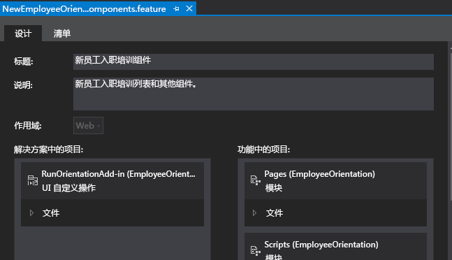
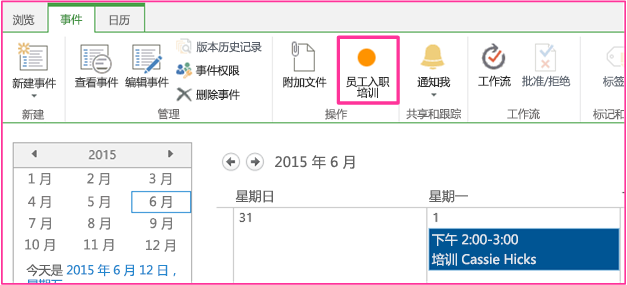

# 在 SharePoint 外接程序的主机 Web 中创建自定义功能区按钮
将自定义功能区按钮命令添加到 SharePoint 外接程序的主机 Web。
这是关于开发 SharePoint 托管的 SharePoint 外接程序的基础知识系列文章中的第九篇文章。您应该首先熟悉  [SharePoint 外接程序](sharepoint-add-ins.md)以及本系列中之前的文章：

-  [开始创建 SharePoint 承载的 SharePoint 外接程序](get-started-creating-sharepoint-hosted-sharepoint-add-ins.md)

-  [部署和安装 SharePoint 托管的 SharePoint 外接程序](deploy-and-install-a-sharepoint-hosted-sharepoint-add-in.md)

-  [向 SharePoint 托管的 SharePoint 外接程序添加自定义列](add-custom-columns-to-a-sharepoint-hostedsharepoint-add-in.md)

-  [向 SharePoint 托管的 SharePoint 外接程序添加自定义内容类型](add-a-custom-content-type-to-a-sharepoint-hostedsharepoint-add-in.md)

-  [向 SharePoint 托管的 SharePoint 外接程序中的页面添加 Web 部件](add-a-web-part-to-a-page-in-a-sharepoint-hosted-sharepoint-add-in.md)

-  [向 SharePoint 托管的 SharePoint 外接程序添加工作流](add-a-workflow-to-a-sharepoint-hosted-sharepoint-add-in.md)

-  [向 SharePoint 托管的 SharePoint 外接程序添加自定义页面和样式](add-a-custom-page-and-style-to-a-sharepoint-hosted-sharepoint-add-in.md)

-  [向 SharePoint 托管的 SharePoint 外接程序添加自定义客户端呈现](add-custom-client-side-rendering-to-a-sharepoint-hosted-sharepoint-add-in.md)

> **注释**
> 如果您阅读过关于 SharePoint 托管的外接程序的此系列文章，那么您应该具有 Visual Studio 解决方案，可以继续阅读本主题。您还可以从  [SharePoint_SP-hosted_Add-Ins_Tutorials](https://github.com/OfficeDev/SharePoint_SP-hosted_Add-Ins_Tutorials) 下载存储库并打开 BeforeRibbon.sln 文件。

所有 SharePoint 外接程序均可通过单击外接程序的图块，从主机 Web 的"网站内容"页面运行。SharePoint 外接程序的功能也可通过自定义操作（即自定义功能区按钮或自定义菜单项）在主机 Web 上公开。在本文中，您将按钮添加到主机 Web 上的功能区。
## 准备主机 Web

您将按钮添加到主机 Web 上的日历功能区。在 SharePoint 开发人员网站的 UI 中执行以下步骤。

1. 从网站的主页选择"网站内容">"添加外接程序">"日历"。

2. 在"添加日历"对话框中，键入 Employee Orientation Schedule 作为"名称"，然后选择"创建"。

3. 日历打开时，将光标放在任何日期上，直到日历上显示"添加"链接，然后单击"添加"。

4. 在"Employee Orientation Schedule - 新项目"对话框中，键入 Orient Cassi Hicks 作为"标题"。将其他字段保留为默认值，然后单击"保存"。

    日历应如下所示：

   **自定义日历**

> **重要信息**
> 下一过程要求日历在 Visual Studio 的 UI 中可见，但是如果 Visual Studio 在您创建日历时为打开状态，则不可见。在继续之前，请关闭 Visual Studio，并从您登录到开发人员网站的任何浏览器窗口和 PowerShell 控制台中注销。 

## 添加功能区自定义操作

1. 在"解决方案资源管理器"中，右键单击"EmployeeOrientation"项目，并选择"添加">"新项目">"Office/SharePoint">"功能区自定义操作"。将其命名为 RunOrientationAdd-in，然后选择"添加"。

2. "为功能区创建自定义操作"向导将询问您一系列问题。给出下表中的答案：

|**属性问题**|**答案**|
|:-----|:-----|
|要在哪个位置公开自定义操作?    |选择"主机 Web"。    |
|限制在哪个位置执行自定义操作?    |选择"列表实例"（不是"列表模板"）。    |
|限制对哪个特定项执行自定义操作?    |选择"员工定向日程安排"。    |
|控件位于什么位置?    |请勿使用下拉列表选择，而应键入"Ribbon.Calendar.Events.Actions.Controls._children"。（第三部分"事件"标识功能区的选项卡，第四部分"操作"标识按钮组。）    |
|菜单项上的文本是什么?    |键入"员工定向"。    |
|自定义操作将导航到哪个位置?    |请勿使用下拉列表选择，而应键入"~appWebUrl/Lists/NewEmployeesInSeattle"。这是位于外接程序 Web 上的列表的列表视图页面，因此主机 Web 上的功能区按钮将在外接程序 Web 上打开一个页面。    |
 
3. 选择"完成"。

## 检查外接程序 Web 功能

在"解决方案资源管理器"中，展开"功能"文件夹并选择"NewEmployeeOrientationComponents"功能。功能设计器将打开。

请注意，您创建的自定义操作"RunOrientationAdd-in"将列在"解决方案中的项目"中，不会列在"功能中的项目"中。这是因为功能将部署到外接程序 Web，但自定义操作将部署到主机 Web。当您将外接程序打包在 Visual Studio 中以部署到生产时，或者当您在 Visual Studio 中按 F5 时，Visual Studio Office 开发人员工具 会创建一个特殊的主机 Web 功能，向其添加自定义操作并将其部署到主机 Web。永远不要编辑主机 Web 功能。这就是为什么它一直到打包时才创建的原因。

**功能设计器**

## 运行并测试外接程序

1. 使用 F5 键部署并运行您的外接程序。Visual Studio 在测试 SharePoint 网站上临时安装此外接程序并立即运行。

2. SharePoint 外接程序的默认页面将打开。导航到开发人员网站的主页（即主机 Web）。页面左上角有它的痕迹导航链接。

3. 在主机 Web 的主页上，选择"网站内容"，然后在"网站内容"页面上单击"员工定向日程安排"日历（不是"员工定向"外接程序）。

4. 日历打开后，单击事件"Orient Cassie Hicks"。如果功能区上的"事件"选项卡未自动打开，请将其打开。列表看起来应该如下所示：

   **具有自定义按钮的"事件"功能区选项卡**

5. 在功能区上的"操作"组中，单击"员工定向"。"西雅图新员工"的列表视图页面将打开。

6. 要结束调试会话，请关闭浏览器窗口或在 Visual Studio 中停止调试。每次按 F5 时，Visual Studio 将撤回外接程序的之前版本并安装最新版本。

7. 您将在其他文章中使用此外接程序和 Visual Studio 解决方案，因此最好是当您使用一段时间后，最后一次撤回外接程序。在"解决方案资源管理器"中右键单击此项目，然后选择"撤回"。

## 

在本系列的下一篇文章中，您将 JavaScript 添加到 SharePoint 外接程序，并使用 SharePoint 的 JavaScript 对象模型访问 SharePoint 数据： [使用 SharePoint JavaScript API 处理 SharePoint 数据](use-the-sharepoint-javascript-apis-to-work-with-sharepoint-data.md)。

