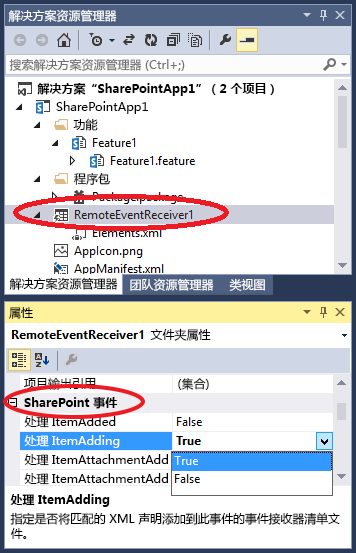

# 在 SharePoint 外接程序中创建远程事件接收器
创建处理 SharePoint 外接程序中列表和列表项事件的远程事件接收器 (RER)。
## 先决条件
<a name="SP15appevent_prereq"> </a>

如果您已事先了解提供程序承载的 SharePoint 外接程序，并且您已开发出一些至少比"Hello World"更高级的程序，将很有帮助。同时，您也应熟悉 [处理 SharePoint 外接程序中的事件](handle-events-in-sharepoint-add-ins.md)。


## 创建远程事件接收器
<a name="MakeRER"> </a>

本文演示如何通过添加可为加载项 Web 中的自定义列表处理 ItemAdded 事件的远程事件接收器 (RER) 来扩展 SharePoint 外接程序。RER 是通过使用声明性标记的加载项 Web 进行注册的。RER 是通过 *主机 Web*  以编程方式进行注册的。有关此操作的代码示例，请参阅 [OfficeDev/PnP/Samples/Core.EventReceivers](https://github.com/OfficeDev/PnP/tree/master/Samples/Core.EventReceivers)。


RER 必须是 SOAP Web 服务。接下来的示例将此实现为 Windows Communication Foundation (WCF) 服务；但也有可能遵循此原则在非 Microsoft 堆栈上实现 RER 。


要遵照本文内容并自行输入代码，请下载来自  [SharePoint-Add-in-CSOM-BasicDataOperations](https://github.com/OfficeDev/SharePoint-Add-in-CSOM-BasicDataOperations) 的示例，然后在 Visual Studio 中打开该示例。


> **注释**
> 此示例使用了由 Visual Studio Office 开发人员工具 生成的 TokenHelper.cs 文件。示例创建后，则是当前版本，但当您阅读本文时可能不是最新版本。该示例仍可出色地用于创建您的第一个 RER。但是，当您准备好超出此范围，您应了解在下面的"后续步骤"一节中列出的示例。它们更有可能保持最新。 


### 注册远程事件接收器


1. 在 Visual Studio 中打开 SharePoint 外接程序项目。


2. 在"解决方案资源管理器"中，选择加载项项目的节点。


3. 在菜单栏中，选择"项目"、"添加新项"。


4. 在"已安装的模板"窗格中，选择"Office/SharePoint"节点。


5. 在"模板"窗格中，选择"远程事件接收器"模板。


6. 在"名称"框中，保留默认名称 (RemoteEventReceiver1)，然后选择"添加"按钮。


7. 在"要哪种类型的事件接收器？"列表中，选择"列表项事件"。


8. 在"什么项目应该是事件源？"列表中，选择"自定义列表"。

    接下来的示例使用自定义泛型列表。但 RER 还可以处理在标准 SharePoint 列表中发生的事件，比如"通知"或"联系人"。


9. 在"处理下列事件"列表中，选择"正在添加的项目"，然后选择"完成"按钮。

    一个 Web 服务将添加到 Web 应用程序以处理您指定的远程事件。一个远程事件接收器将添加到 SharePoint 外接程序，列表项事件将在接收器的 Elements.xml 文件中引用，其本身包含在加载项 Web 功能中。


### 创建列表


1. 在"解决方案资源管理器"中，选择加载项项目的节点。


2. 在菜单栏中，选择"项目"、"添加新项"。


3. 在"已安装的模板"窗格中，选择"Office SharePoint"节点。


4. 在"模板"窗格中，选择"列表"模板。


5. 在"名称"框中，保留默认名称 (List1)，然后选择"添加"按钮。


6. 选择"创建基于现有列表模板的列表实例"选项按钮，选择列表中的"自定义列表"，然后选择"完成"按钮。


### 将功能添加到远程事件接收器


1. 如果您的测试 SharePoint 场并不在运行 Visual Studio 的同台计算机上，（或者您将 SharePoint Online 租赁用作测试 SharePoint 网站），请使用 Microsoft Azure 服务总线来配置用于调试的项目。有关详细信息，请参阅 [在 SharePoint 外接程序中调试远程事件接收器并排除故障](debug-and-troubleshoot-a-remote-event-receiver-in-a-sharepoint-add-in.md)。


2. 在远程事件接收器的服务的代码文件（即 RemoteEventReceiver1.svc.cs）中，使用以下代码来替换内容。

    此代码执行下列任务。

  - 获取有效的客户端上下文对象。


  - 如果尚不存在名为"事件日志"的列表，将创建此列表以包含发生的远程事件的名称。


  - 将一个条目添加到事件的列表中，包括时间和日期戳。


    > **注释**
      > 在撰写本文时，Visual Studio Office 开发人员工具 会在接收器创建好之后，将引用添加到所有所需的程序集中，但这些工具的更高版本可能不会如此。如果您收到编译器错误，只需添加缺少的引用；例如，您可能需要将引用添加到 System.ServiceModel 或 System.ComponentModel.DataAnnotations。 


  ```cs

using System;
using System.Collections.Generic;
using System.Linq;
using System.Net;
using System.Text;
using Microsoft.SharePoint.Client;
using Microsoft.SharePoint.Client.EventReceivers;
using System.Runtime.Serialization;
using System.ServiceModel;
using System.ServiceModel.Channels;


namespace BasicDataOperationsWeb.Services
{
    public class RemoteEventReceiver1 : IRemoteEventService
    {
        public SPRemoteEventResult ProcessEvent(SPRemoteEventProperties properties)
        {
            // When a "before" event occurs (such as ItemAdding), call the event 
            // receiver code.
            ListRemoteEventReceiver(properties);
            return new SPRemoteEventResult();
        }

        public void ProcessOneWayEvent(SPRemoteEventProperties properties)
        {
            // When an "after" event occurs (such as ItemAdded), call the event 
            // receiver code.        
        }

        public static void ListRemoteEventReceiver(SPRemoteEventProperties properties)
        {
            string logListTitle = "EventLog";

            // Return if the event is from the EventLog list itself. Otherwise, it may go into
            // an infinite loop.
            if (string.Equals(properties.ItemEventProperties.ListTitle, logListTitle, 
                  StringComparison.OrdinalIgnoreCase))
                return;

            // Get the token from the request header.
            HttpRequestMessageProperty requestProperty = 
                  (HttpRequestMessageProperty)OperationContext
                   .Current.IncomingMessageProperties[HttpRequestMessageProperty.Name];
            string contextTokenString = requestProperty.Headers["X-SP-ContextToken"];

            // If there is a valid token, continue.
            if (contextTokenString != null)
            {
                SharePointContextToken contextToken =
                    TokenHelper.ReadAndValidateContextToken(contextTokenString, 
                         requestProperty.Headers[HttpRequestHeader.Host]);

                Uri sharepointUrl = new Uri(properties.ItemEventProperties.WebUrl);
                string accessToken = TokenHelper.GetAccessToken(contextToken, 
                                                      sharepointUrl.Authority).AccessToken;
                bool exists = false;

                // Retrieve the log list "EventLog" and add the name of the event that occurred
                // to it with a date/time stamp.
                using (ClientContext clientContext = 
                     TokenHelper.GetClientContextWithAccessToken(sharepointUrl.ToString(), 
                                                                                                         accessToken))
                {
                    clientContext.Load(clientContext.Web);
                    clientContext.ExecuteQuery();
                    List logList = clientContext.Web.Lists.GetByTitle(logListTitle);

                    try
                    {
                        clientContext.Load(logList);
                        clientContext.ExecuteQuery();
                        exists = true;
                    }

                    catch (Microsoft.SharePoint.Client.ServerUnauthorizedAccessException)
                    {
                        // If the user doesn't have permissions to access the server that's 
                        // running SharePoint, return.
                        return;
                    }

                    catch (Microsoft.SharePoint.Client.ServerException)
                    {
                        // If an error occurs on the server that's running SharePoint, return.
                        exists = false;
                    }

                    // Create a log list called "EventLog" if it doesn't already exist.
                    if (!exists)
                    {
                        ListCreationInformation listInfo = new ListCreationInformation();
                        listInfo.Title = logListTitle;
                        // Create a generic custom list.
                        listInfo.TemplateType = 100;
                        clientContext.Web.Lists.Add(listInfo);
                        clientContext.Web.Context.ExecuteQuery();
                    }

                    // Add the event entry to the EventLog list.
                    string itemTitle = "Event: " + properties.EventType.ToString() + 
                          " occurred on: " + 
                          DateTime.Now.ToString(" yyyy/MM/dd/HH:mm:ss:fffffff");
                    ListCollection lists = clientContext.Web.Lists;
                    List selectedList = lists.GetByTitle(logListTitle);
                    clientContext.Load<ListCollection>(lists);
                    clientContext.Load<List>(selectedList);
                    ListItemCreationInformation listItemCreationInfo = 
                          new ListItemCreationInformation();
                    var listItem = selectedList.AddItem(listItemCreationInfo);
                    listItem["Title"] = itemTitle;
                    listItem.Update();
                    clientContext.ExecuteQuery();
                }
            }
        }
    }
}
  ```

3. 在 Home.aspx.cs 中，将  `SPHostUrl` 的所有实例更改为 `SPAppWebUrl`。

    例如， `sharepointUrl = new Uri(Request.QueryString["SPHostUrl"]);` 应改为 `sharepointUrl = new Uri(Request.QueryString["SPAppWebUrl"]);`。


## 运行和测试事件处理程序
<a name="RunAndTest"> </a>

安装以下步骤测试您的处理程序。


1. 按"F5"键以运行项目。


2. 当系统提示您执行此操作时，信任该加载项。

    您的 SharePoint 外接程序将运行，显示可用列表目录，其中包括"List1"。


3. 选择"List1"的 ID。

    该 ID 被复制到"检索列表项"框。


4. 选择"检索列表项"按钮。

    显示"List1"，其中不包含任何项。


5. 在"添加项"框中指定第一项，然后选择"添加项"按钮。

    名为"第一项"的列表项将添加到"List1"，这将导致远程事件接收器触发一个条目并在事件日志列表中添加该条目。


6. 选择"刷新列表"按钮以返回到列表目录。

    在目录中，将显示一个名为"事件日志"的新列表。


7. 为"事件日志"选择"ListID"GUID 值，然后选择"检索列表项"按钮。

    将显示"事件日志"的目录，其中包含在您将项目添加到"List1"时发生的"处理 ItemAdding"事件对应的条目。


## 使用 Visual Studio 添加或删除事件处理程序
<a name="Handle"> </a>


1. 在"解决方案资源管理器"中，选择远程事件接收器的项目节点。


2. 在"属性"窗格中，将要处理的事件的属性设置为 **True**。

    例如，如果你要在用户添加列表项时响应，请将"Handle ItemAdding"属性的值设置为 **True**。如果不想处理该事件，请将该属性的值设置为 **False**。


   **图 1. Visual Studio 中的 SharePoint 远程事件**





3. 如果已添加事件，则当您处理之前的事件时请将事件处理代码添加到 Web 服务的代码文件。

    若要处理不同类型的事件，请将其他远程事件接收器添加到 SharePoint 外接程序。例如，如果远程事件接收器处理列表项事件，则可向其添加其他列表项事件。但如果您要处理列表事件，则必须添加其他远程事件接收器。


## 对生产远程事件接收器的 URL 和托管限制
<a name="Handle"> </a>

远程事件接收器可托管在云中或托管在不同时用作 SharePoint 服务器的本地服务器中。生产接收器的 URL 不能指定特定的端口。这意味着，您必须对 HTTPS 使用端口 443（推荐），或对 HTTP 使用端口 80。如果您正在使用 HTTPS，同时接收器服务在本地托管，但加载项位于 Microsoft SharePoint Online，则托管服务器必须具有证书颁发机构授予的公开可信证书。（自签名证书只适用于加载项在本地 SharePoint 场的情况。）


## 后续步骤
<a name="Handle"> </a>

使用以下代码示例提高您对 RER 的认识：


-  [OfficeDev/PnP/Samples/Core.EventReceivers](https://github.com/OfficeDev/PnP/tree/master/Samples/Core.EventReceivers)


-  [OfficeDev/PnP/Samples/Provisioning.ReR](
https://github.com/OfficeDev/PnP/tree/master/Samples/Provisioning.ReR)


-  [OfficeDev/PnP/Scenarios/ECM.AutoTagging](https://github.com/OfficeDev/PnP/tree/master/Samples/ECM.AutoTagging)


## 其他资源
<a name="Additional"> </a>


-  [处理 SharePoint 外接程序中的事件](handle-events-in-sharepoint-add-ins.md)


-  [在 SharePoint 外接程序中调试远程事件接收器并排除故障](debug-and-troubleshoot-a-remote-event-receiver-in-a-sharepoint-add-in.md)


-  [远程事件接收器常见问题](handle-events-in-sharepoint-add-ins.md#RERFAQ)


