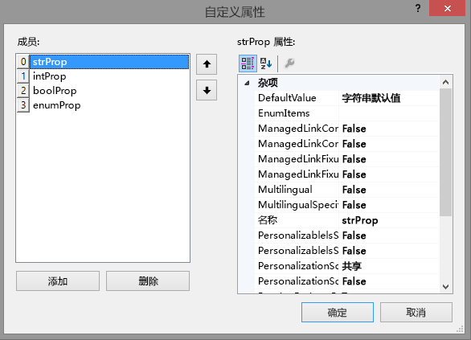

# 创建外接程序部件以安装 SharePoint 外接程序
了解如何在 SharePoint 2013 中创建安装 SharePoint 外接程序时可在主机 Web 的 Web 部件库中使用的外接程序部件。
利用外接程序部件，您可以直接在 SharePoint 网站页面中显示您的外接程序用户体验。外接程序部件在 [主机 Web](http://msdn.microsoft.com/library/fp179925.aspx) 页中显示您使用 **IFrame**（也称为框架）指定的网页（通常为交互式表单或数据的动态显示）。有关外接程序部件的更多背景，请参阅下列文章：


-  [从 UI 访问加载项](important-aspects-of-the-sharepoint-add-in-architecture-and-development-landscap.md#AccessingApp)


-  [SharePoint 外接程序的 UX 设计](ux-design-for-sharepoint-add-ins.md)


-  [在外接程序中扩展 SharePoint UI](sharepoint-add-ins-ux-design-guidelines.md#UXGuide_Extending)


图 1 显示了外接程序部件内容在 SharePoint 页面中如何显示。


**图 1. SharePoint 页中显示的外接程序部件内容**


外接程序部件使用 **ClientWebPart** 类实施。与所有其他 Web 部件一样，当用户安装包含外接程序部件的 SharePoint 外接程序后，该外接程序部件将在 Web 部件库中可用。您的用户可以使用您所提供的属性进一步自定义外接程序部件。（有关外接程序部件中可配置属性的示例，请参见下面的图 2。）本文中的示例使用在远程服务器上托管而不是 SharePoint 中托管的网页作为内容页。请记住，您还可以使用 SharePoint 页来托管外接程序部件内容，如下文 [其他常见的方案外接程序部件](#SP15Createappparts_Nextsteps)中所述。
## 使用本文中示例的先决条件
<a name="SP15Createappparts_Prereq"> </a>

若要按照此示例中的步骤操作，您需要：


- Visual Studio


- Visual Studio Microsoft Office 开发人员工具


- SharePoint 开发环境。如果您需要设置开发环境方面的帮助，请参阅 [开始创建提供程序承载的 SharePoint 加载项](get-started-creating-provider-hosted-sharepoint-add-ins.md)。


## 创建外接程序部件以安装到主机 Web 上
<a name="SP15Createappparts_Codeexample"> </a>

创建外接程序部件并安装到主机 Web 上需要执行以下几个任务：


1. 创建 SharePoint 外接程序和远程 Web 项目。


2. 添加外接程序部件内容的一个表单。


3. 将外接程序部件添加到 SharePoint 外接程序项目中。


完成任务后，当外接程序部件处于编辑模式时，您的外接程序部件外观应类似于图 2。此处，我们可以看到 (1) SharePoint 页中显示的外接程序内容和 (2) 外接程序部件自定义属性。


**图 2. SharePoint 页托管基本外接程序部件**


### 添加外接程序部件内容的一个表单


1. 如 [开始创建提供程序承载的 SharePoint 加载项](get-started-creating-provider-hosted-sharepoint-add-ins.md)中所述创建一个提供程序托管的 SharePoint 外接程序，但将该项目命名为 TestAppPart。


2. 创建 Visual Studio 解决方案后，右键单击 Web 应用程序项目（而不是 SharePoint 外接程序项目），并添加一个新的 Web 表单，方法是选择"添加">"新项目">"Web">"Web 表单"。将表单命名为 AppPartContent.aspx。


3. 在 AppPartContent.aspx 文件中，将整个 html 元素及其子元素替换为以下 HTML 代码。将 html 元素上方的所有标记保留原样。HTML 代码包含用于执行下列任务的 JavaScript：

  - 从查询字符串中提取默认属性值


  - 显示属性值


    请注意，此代码需要查询字符串中的一些参数。外接程序部件通过查询字符串提供其自定义属性，因此网页可以使用这些属性。下一项任务解释如何声明自定义属性和如何使其能够用于外接程序网页。


  ```HTML

<html>
    <body>
        <div id="content">
            <!-- Placeholders for properties -->
            String property: <span id="strProp"></span><br />
            Integer property: <span id="intProp"></span><br />
            Boolean property: <span id="boolProp"></span><br />
            Enumeration property: <span id="enumProp"></span><br />
        </div>

    <!-- Main JavaScript function, controls the rendering
         logic based on the custom property values -->
    <script lang="javascript">
        "use strict";

        var params = document.URL.split("?")[1].split("&amp;");
        var strProp;
        var intProp;
        var boolProp;
        var enumProp;

        // Extracts the property values from the query string.
        for (var i = 0; i < params.length; i = i + 1) {
            var param = params[i].split("=");
            if (param[0] == "strProp")
                strProp = decodeURIComponent(param[1]);
            else if (param[0] == "intProp")
                intProp = parseInt(param[1]);
            else if (param[0] == "boolProp")
                boolProp = (param[1] == "true");
            else if (param[0] == "enumProp")
                enumProp = decodeURIComponent(param[1]);
        }

        document.getElementById("strProp").innerText = strProp;
        document.getElementById("intProp").innerText = intProp;
        document.getElementById("boolProp").innerText = boolProp;
        document.getElementById("enumProp").innerText = enumProp;
    </script>
    </body>
</html>
  ```

4. 保存并关闭该文件。


### 将外接程序部件添加到 SharePoint 外接程序项目


1. 右键单击 SharePoint 外接程序项目（而不是 Web 应用程序项目），然后选择"添加">"新项目">"Office/SharePoint">"客户端 Web 部件(主机 Web)"。 （"客户端 Web 部件"是"外接程序部件"的另一个名称。）


2. 将部件命名为基本外接程序部件。


3. 在"指定客户端 Web 部件页"对话框中，选择"选择或输入现有网页的 URL"。在下拉列表中选择 **TestAppWebPart/AppPartContent.aspx** 页。（当您做出选择后，页面 URL 可能出现在框中，其中"TestAppWebPart"被"~remoteAppUrl"所替代，并为查询参数添加了"{StandardTokens}"。）


4. 选择"完成"。


5. 在"解决方案资源管理器"中右键单击"基本外接程序部件"，然后选择"属性"。


6. 在"属性"窗格中，依次选择"自定义属性"和标注 ( **...**) 按钮。


7. 使用"自定义属性"对话框将四个自定义属性添加到外接程序部件。您必须为每个自定义属性设置五个特性。特性名称和值如表 1 中所列。使用以下过程创建属性。

1. 选择"添加"。


2. 在特性列表中，从表 1 中选择第一个特性： **DefaultValue**。


3. 设置值，例如 String default value。


4. 选择下一个特性"Name"并设置其值，例如， strProp。


5. 继续设置"Type"、"WebCategory"和"WebDisplayName"特性。


6. 再次选择"添加"并为表 1 中的四行重复此过程。 *请勿*  关闭该对话框。

   **表 1. 外接程序部件的自定义属性的特性**


|**DefaultValue**|**名称**|**类型**|**WebCategory**|**WebDisplayName**|
|:-----|:-----|:-----|:-----|:-----|
|字符串默认值  <br/> |strProp  <br/> |字符串  <br/> |基本外接程序部件类别  <br/> |字符串类型的属性  <br/> |
|0  <br/> |intProp  <br/> |INT  <br/> |基本外接程序部件类别  <br/> |整数类型的属性  <br/> |
|FALSE  <br/> |boolProp  <br/> |布尔  <br/> |基本外接程序部件类别  <br/> |布尔类型的属性  <br/> |
|1st  <br/> |enumProp  <br/> |枚举  <br/> |基本外接程序部件类别  <br/> |枚举类型的属性  <br/> |
 

    此时，该对话框应如下所示：


   **ClientWebPart 的自定义属性对话框**





8. 依次选择 **enumProp** 属性、 **EnumItems** 特性和标注 ( **...**) 按钮。


9. 使用"ClientWebPartEnumItem 集合编辑器"添加三个项目。您必须为每个项目设置两个特性。特性名称和值如表 2 中所列。使用以下过程创建属性。

1. 选择"添加"。


2. 在特性列表中，从表 2 中选择第一个特性： **Value** 。


3. 设置特性的值，例如 1st。


4. 选择下一个特性"WebDisplayName"并设置其值，例如， First option。


5. 再次选择"添加"并为表 2 中的所有行重复此过程。

   **表 2. enumProp 属性的枚举项**


|**值**|**WebDisplayName**|
|:-----|:-----|
|1st  <br/> |第一个选项  <br/> |
|2nd  <br/> |第二个选项  <br/> |
|3rd  <br/> |第三个选项  <br/> |
 

    完成后，该对话框应如下所示：


   **ClientWebPartEnumItem 集合编辑器**


6. 选择"确定"关闭对话框，然后再次选择"确定"关闭"自定义属性"对话框。


10. Visual Studio 在外接程序部件的 elements.xml 文件中生成以下 XML 代码（为了清楚可见，添加了换行符）。请注意， **ClientWebPart** 元素的 **Title** 特性设置为"Basic add-in part Title"，说明设置为"Basic add-in part Description"。从第一个特性中删除"Title"一词，并将第二个特性替换为A basic add-in part。

  ```XML

<?xml version="1.0" encoding="UTF-8"?>
<Elements xmlns="http://schemas.microsoft.com/sharepoint/">
    <ClientWebPart
        Name="Basic add-in part"
        Title="Basic add-in part Title"
        Description="Basic add-in part Description" >
    
        <!--  The properties are passed through the query string 
                using the following notation: _propertyName_
                in the Src property of the Content element.
          -->
        <Content
            Src="~remoteAppUrl/AppPartContent.aspx?strProp=_strProp_&amp;amp;intProp=_intProp_&amp;amp;boolProp=_boolProp_&amp;amp;enumProp=_enumProp_"
            Type="html"/>
        <Properties>
            <Property
                Name="strProp"
                Type="string"
                RequiresDesignerPermission="true"
                DefaultValue="String default value"
                WebCategory="Basic add-in part category"
                WebDisplayName="A property of type string.">
            </Property>
            <Property
                Name="intProp"
                Type="int"
                RequiresDesignerPermission="true"
                DefaultValue="0"
                WebCategory="Basic add-in part category"
                WebDisplayName="A property of type integer.">
            </Property>
            <Property
                Name="boolProp"
                Type="boolean"
                RequiresDesignerPermission="true"
                DefaultValue="false"
                WebCategory="Basic add-in part category"
                WebDisplayName="A property of type boolean.">
            </Property>
            <Property
                Name="enumProp"
                Type="enum"
                RequiresDesignerPermission="true"
                DefaultValue="1st"
                WebCategory="Basic add-in part category"
                WebDisplayName="A property of type enum.">
                <EnumItems>
                    <EnumItem WebDisplayName="First option" Value="1st"/>
                    <EnumItem WebDisplayName="Second option" Value="2nd"/>
                    <EnumItem WebDisplayName="Third option" Value="3rd"/>
                </EnumItems>
            </Property>
        </Properties>
    </ClientWebPart>
</Elements>           

  ```


### 将外接程序起始页设置为托管 Web 主页


1. 接下来的示例 SharePoint 外接程序不具有任何外接程序 Web，其远程 Web 应用程序存在着只是为了托管表单。没有此外接程序的任何完整页面和沉浸式体验。因此，外接程序的起始页应设置为主机 Web 的主页。

    要开始，请在"解决方案资源管理器"中选择 SharePoint 外接程序项目（不是 Web 应用程序项目）并将"网站 URL"属性的值复制到剪贴板中，包括协议（例如，"https://contoso.sharepoint.com"）。


2. 打开外接程序清单，然后将 URL 粘贴到"起始页"框中。


3. 您可以选择从 Web 应用程序项目中删除 Default.aspx 页面，因为它在 SharePoint 外接程序中不使用。


### 构建和测试解决方案


1. 按 F5 键。

    > **注释**
      > 当您按 F5 时，Visual Studio 将生成解决方案、安装外接程序并打开外接程序的权限页。 
2. 选择"信任它"按钮。


3. 从外接程序部件库添加"基本外接程序部件"。有关详细说明，请参阅 [向页面添加外接程序部件](https://support.office.com/article/Add-an-App-Part-to-a-page-6f06c0b7-44b8-4c69-b4ad-85197eee8d78)。

    主机 Web 上安装外接程序后，外接程序部件库中就会提供"基本外接程序部件"，它应该与图 3 非常相似。


   **图 3. 外接程序部件库中的外接程序部件**


4. 添加外接程序部件后，选择标题"基本外接程序部件"右侧的向下箭头，然后选择"编辑 Web 部件"。

    您应该会看到与上面图 1 中类似的处于编辑模式的外接程序部件。


5. 打开"基本外接程序部件类别"并更改某些属性值。


6. 单击"确定"保存所做的更改，并验证属性已在外接程序部件中更改。


7. 结束调试会话后，如果您暂时不会在此项目上再次使用 F5，最好在最后一次撤回 SharePoint 外接程序，以确保测试外接程序部件从主页中删除。右键单击 SharePoint 外接程序项目并选择"撤回"。


## 疑难解答
<a name="SP15Createappparts_Codeexample"> </a>


**表 3. 解决方案疑难解答**


|**问题**|**解决方案**|
|:-----|:-----|
|外接程序部件没有显示任何内容。外接程序部件显示以下错误："已取消到该网页的导航"。出现此错误是因为浏览器阻止了内容页。  <br/> | 启用混合内容。解决过程可能因您使用的浏览器而异： <br/>  Internet Explorer 9 和 10 在页面底部显示以下消息："只显示安全内容"。选择"显示所有内容"来显示外接程序部件内容。 <br/>  Internet Explorer 8 显示具有以下消息的对话框："是否只查看安全传送的网页内容?"。选择"否"来显示外接程序部件内容。 <br/>  您也可以启用正在使用的 Internet 区域中的混合内容。对于大多数开发者而言，此 Intetrnet 区域是 **本地 Intranet** 。如果此情况不适用，请将您正在使用的 Internet 区域替换为"本地 Intranet"。 <br/>  在 Internet Explorer 中，选择"工具">"Internet 选项"。 <br/>  在"Internet 选项"对话框中的"安全"选项卡上，选择"本地 Intranet"，然后选择"自定义级别"按钮。 <br/>  在"安全设置"对话框中，启用"杂项"部分中的"显示混合内容"。 <br/> |
 

## 其他常见的方案外接程序部件
<a name="SP15Createappparts_Nextsteps"> </a>

本文显示如何利用将远程网页用作内容页的自定义属性创建基本外接程序部件。您还可以探索以下有关外接程序部件的方案和详细信息。


### 使用 SharePoint 页作为内容页

在大部分情况下，如果网页在响应中发送 **X-Frame-Options** HTTP 头，则该网页将无法在框架中显示。默认情况下，SharePoint 网页包含 **X-Frame-Options** 头。如果使用外接程序 Web 托管的 SharePoint 网页，您可能会遇到以下错误（如图 4 所示）："此内容无法在框架中显示"。


**图 4. 无法在框架中显示内容的外接程序部件**


请记住，当网页在框架中显示时，特定方案易受" [点击劫持](http://blogs.msdn.com/b/ieinternals/archive/2010/03/30/combating-clickjacking-with-x-frame-options.aspx)"攻击。请仔细评估您的外接程序部件方案，以确保不存在 **点击劫持** 攻击风险。


如果在外接程序 Web 中托管的页面不易受 ClickJacking 攻击，则您可以使用 **AllowFraming** Web 部件抑制页面响应中的 **X-Frame-Options** 头。下面的代码示例展示如何在 SharePoint 页面中使用 **AllowFraming** Web 部件。将此标记复制到托管在外接程序 Web 上的页面中。将此标记放在页面中第一个 **asp:content** 元素的上方。它不应该是任何其他元素的子元素。


```XML

<WebPartPages:AllowFraming ID="AllowFraming1" runat="server" />
```

您可以下载展示如何将 SharePoint 页作为内容页的  [外接程序部件代码示例](http://code.msdn.microsoft.com/SharePoint-2013-Display-be8dac16)。


### 调整外接程序部件大小

如果您在外接程序部件中使用动态内容，则该内容的宽度和高度可能发生改变。由于内容的动态特性，它可能不适合框架。您也可能使用了过多的空间。若使用动态内容，则可能难以在您的外接程序部件声明中指定固定大小。不过，您可以调整框架的大小，以便与内容的宽度和高度相符。


您可以使用内容网页中的 POST 消息指定框架的大小。以下 JavaScript 示例显示了如何发送 POST 消息以调整托管外接程序部件的框架的大小。通常情况下，在您从页面调用的 JavaScript 文件的 JavaScript 方法中具有此消息。例如，页面可能有一个控件，用户可在该控件中指定外接程序部件窗口的大小。然后将从该控件的 **onchange** 处理程序调用自定义方法。有关完整示例，请参阅 [代码示例：动态调整 SharePoint 外接程序中的外接程序部件的大小](http://code.msdn.microsoft.com/officeapps/SharePoint-2013-Resize-app-594acc88)。


```
window.parent.postMessage("<message senderId={SenderId}>resize(120, 300)</message>", {hostweburl});
```

在以上示例中，呈现页面时，外接程序部件代码将对页面的查询字符串自动设置 **senderId** 值。在请求调整大小时，您的页面只需从查询字符串中读取 **SenderId** 值并使用该值即可。您可以通过将 **StandardTokens** 或 **HostUrl** 令牌追加到外接程序部件定义中的 **Src** 属性来检索查询字符串的主机 Web URL。您可以下载 [调整外接程序部件大小的代码示例](http://code.msdn.microsoft.com/officeapps/SharePoint-2013-Resize-app-594acc88)，以查看动态调整大小的外接程序部件。


### 在外接程序部件内容中使用 SharePoint 样式表

因为您的外接程序部件托管在 SharePoint 网页中，您可能希望让外接程序部件内容看起来像网页的一部分。一个可以实现外观和感觉相似的方法是使用与托管该外接程序部件的 SharePoint 页面相同的样式类。您可以通过添加对外接程序 Web 中的 **defaultcss.ashx** 文件的引用来使外接程序部件可供 SharePoint 网站的样式表使用。


有关如何引用 SharePoint 外接程序中的 **defaultcss.ashx** 文件的说明，请参阅 [在 SharePoint 外接程序中使用 SharePoint 网站的样式表](use-a-sharepoint-website-s-style-sheet-in-sharepoint-add-ins.md)。您也可以下载 [咖啡壶代码示例](http://code.msdn.microsoft.com/office/SharePoint-2013-App-part-9d83703c)以查看引用样式表的外接程序部件。


### 当外接程序部件处于编辑模式时检测

用户可以编辑外接程序部件，以更改其属性。例如，用户可能想要更改外接程序部件的一个"外观"或"布局"属性。（参见上面的图 2。）如果外接程序部件处于编辑模式，您可能希望修改呈现逻辑或者阻止某些不必要的处理。例如，只要重新加载主机页面，外接程序部件就会调用后端数据库。在编辑模式中更改外接程序部件属性值会导致页面重新加载，但您可能不希望在这种情况下触发网络调用。您可以使用 **_editMode_** 标记检测是否有用户正在编辑您的外接程序部件。


若要使用 **_editMode_** 标记，请将查询字符串参数添加到外接程序部件声明中 **Content** 元素的 **Src** 属性中。


```XML
<Content Src="content_page_url&amp;amp;editmode=_editMode_">
```

 **_editMode_** 标记让内容页可以判断外接程序部件是否处于编辑模式。如果外接程序部件处于编辑模式， **_editMode_** 标记将解析为 1；否则解析为 0。


## 其他资源
<a name="SP15Createappparts_AddResources"> </a>


-  [代码示例：使用外接程序部件在主机 Web 中显示远程外接程序内容](http://code.msdn.microsoft.com/SharePoint-2013-Display-03c28286)


-  [代码示例：使用外接程序部件在主机 Web 中显示外接程序 Web 内容](http://code.msdn.microsoft.com/SharePoint-2013-Display-be8dac16)


-  [代码示例：动态调整 SharePoint 外接程序中的外接程序部件的大小](http://code.msdn.microsoft.com/officeapps/SharePoint-2013-Resize-app-594acc88)


-  [代码示例：使用咖啡壶外接程序部件显示远程网页内容](http://code.msdn.microsoft.com/SharePoint-2013-App-part-9d83703c)


-  [设置 SharePoint 加载项的本地开发环境](set-up-an-on-premises-development-environment-for-sharepoint-add-ins.md)


-  [SharePoint 外接程序的 UX 设计](ux-design-for-sharepoint-add-ins.md)


-  [SharePoint 外接程序 UX 设计准则](sharepoint-add-ins-ux-design-guidelines.md)


-  [在 SharePoint 2013 中创建 UX 组件](create-ux-components-in-sharepoint-2013.md)


-  [考虑 SharePoint 外接程序设计选项的三种方法](three-ways-to-think-about-design-options-for-sharepoint-add-ins.md)


-  [SharePoint 外接程序体系结构的重要方面和开发前景](important-aspects-of-the-sharepoint-add-in-architecture-and-development-landscap.md)


