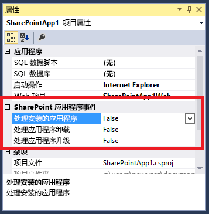

# 在 SharePoint 外接程序中创建外接程序事件接收器
为 SharePoint 外接程序中的 SharePoint 外接程序安装和卸载事件创建处理程序。
## 先决条件
<a name="SP15appevent_prereq"> </a>

本文假定您已了解提供程序托管的 SharePoint 外接程序，并且您已开发出一些至少比"Hello World"更高级的程序。同时，您也应熟悉 [处理 SharePoint 外接程序中的事件](handle-events-in-sharepoint-add-ins.md)。


## 获取更多的代码示例
<a name="SP15appevent_prereq"> </a>

如果您看完本文中的后续示例，将会有一个完成的代码示例。以下是一些其他示例。它们不都遵循本文中所述的体系结构。可以有多个构建外接事件接收器的好方法，也要牢记 Microsoft 指南也会随时间的推移而更新。


-  [OfficeDev/PnP/Samples/Core.AppEvents.HandlerDelegation](https://github.com/OfficeDev/PnP/tree/master/Samples/Core.AppEvents.HandlerDelegation) 与本文后面的示例十分匹配。


-  [OfficeDev/PnP/Samples/Core.AppEvents](https://github.com/OfficeDev/PnP/tree/master/Samples/Core.AppEvents) 说明了在无法使用处理程序委派策略的情况下，如何执行与前一示例相同的任务。


-  [OfficeDev/PnP/Samples/Core.EventReceivers](https://github.com/OfficeDev/PnP/tree/master/Samples/Core.EventReceivers)


-  [创建自定义外接程序安装的提供程序托管的外接程序](https://code.msdn.microsoft.com/SharePoint-2013-Create-a-f27752e0)


## 添加外接程序安装的事件接收器
<a name="SP15appevent_prereq"> </a>


1. 在 Visual Studio 中，打开提供程序托管的 SharePoint 外接程序的项目。（如果您将外接程序事件处理程序添加到 SharePoint 托管的外接程序中，Visual Studio Office 开发人员工具 会将其转换为提供程序托管的应用程序。）


2. 在"解决方案资源管理器"中，选择 SharePoint 外接程序的节点。


3. 在"属性"窗口中，将"处理外接程序安装"值设置为"True"。

   **图 1. "属性"窗口中的外接程序事件**





Visual Studio Office 开发人员工具 将执行下列操作：

  - 添加名为 AppEventReceiver.svc 且包含一些 C#（或 VB.NET）框架代码的文件。这是将处理外接程序事件的服务。


  - 以下条目已添加到 AppManifest.xml 文件的"属性"部分： `<InstalledEventEndpoint>~remoteAppUrl/AppEventReceiver.svc</InstalledEventEndpoint>`。此条目将外接程序事件接收器注册到 SharePoint。（请注意，"~remoteAppUrl"令牌同样也用于提供程序托管的 SharePoint 外接程序中的远程 Web 应用程序。Visual Studio Office 开发人员工具 假定 Web 应用程序的域和事件处理程序的域是相同的。极少数情况下会有不同，您需要手动将令牌"~remoteAppUrl"替换为您服务的实际域。）


  - 如果 SharePoint 外接程序项目还没有一个 Web 项目，则 Visual Studio Office 开发人员工具 将创建一个。该工具还会确保为提供程序托管的外接程序配置外接程序清单。同时还会添加页面、脚本、CSS 文件和其他内容。（如果您的外接程序所需的唯一远程组件是事件处理 Web 服务，则您可以从项目中删除这些内容。您还应该确保在外接程序清单中的 **StartPage** 元素没有指向已删除的页面。）


4. 如果您的测试 SharePoint 场不是在运行 Visual Studio 的同一台计算机上，则使用 Microsoft Azure 服务总线来配置用于调试的项目。有关详细信息，请参阅 [在 SharePoint 外接程序中调试远程事件接收器并排除故障](debug-and-troubleshoot-a-remote-event-receiver-in-a-sharepoint-add-in.md)。


5. 如果 AppEventReceiver.svc 文件中有一个  `ProcessOneWayEvent` 方法，它的实现应仅包含 `throw new NotImplementedException();` 行，因为此方法不能用在外接程序事件处理程序中。 *外接程序事件处理程序必须返回能够告诉 SharePoint 是继续完成还是回滚事件的对象，同时， `ProcessOneWayEvent` 方法不返回任何内容。* 


6. 该文件将包含一个与下面类似的  `ProcessEvent` 方法。（同时还可能有一个演示如何获取客户端上下文的代码块。可对其进行删除或注释。）

    对于此代码，请注意以下事项：

  - 将  [SPRemoteEventProperties](https://msdn.microsoft.com/library/Microsoft.SharePoint.Client.EventReceivers.SPRemoteEventProperties.aspx) 对象发送至您的处理程序 Web 服务作为 SOAP 消息，当中包含 SharePoint 中的一些上下文信息，包括标识事件的 [EventType](https://msdn.microsoft.com/library/Microsoft.SharePoint.Client.EventReceivers.SPRemoteEventProperties.EventType.aspx) 属性。


  - 您的处理程序返回的  [SPRemoteEventResult](https://msdn.microsoft.com/library/Microsoft.SharePoint.Client.EventReceivers.SPRemoteEventResult.aspx) 对象包含 [Status](https://msdn.microsoft.com/library/Microsoft.SharePoint.Client.EventReceivers.SPRemoteEventResult.Status.aspx) 属性，该属性的可能值是 [SPRemoteEventServiceStatus](https://msdn.microsoft.com/library/Microsoft.SharePoint.Client.EventReceivers.SPRemoteEventServiceStatus.aspx) . **Continue**、 **SPRemoteEventServiceStatus.CancelNoError** 和 **SPRemoteEventServiceStatus.CancelWithError**。 **Status** 属性的默认值是 **Continue**，用来告诉 SharePoint 继续完成事件。其他两个值告诉 SharePoint：

  - 至多运行您的处理程序三次。


  - 如果仍然收到取消状态，则取消事件并回滚对事件进行操作的所有内容。


  ```cs

public SPRemoteEventResult ProcessEvent(SPRemoteEventProperties properties)
{
    SPRemoteEventResult result = new SPRemoteEventResult();

    return result;
}
  ```

7. 立即出现在声明  `result` 变量的行下方，并添加以下开关结构来标识正在处理的事件。

  ```cs

switch (properties.EventType)
{
    case SPRemoteEventType.AppInstalled:
        break;
    case SPRemoteEventType.AppUpgraded:
        break;
    case SPRemoteEventType.AppUninstalling:
        break;
}
  ```


> **注释**
> **AppInstalled**、 **AppUpdated** 和 **AppInstalling** 事件，如果您有适用于它们的处理程序，就会将它们的 URL 分别在外接程序清单中注册。所以，您 *可以*  为它们分配不同的终结点；但本文（和 Visual Studio Office 开发人员工具）假设它们具有完全相同的终结点；这就是为什么代码需要确定哪个事件调用它的原因。
8. 如 [将回滚逻辑和"已完成"逻辑包括在您的加载项事件处理程序中](handle-events-in-sharepoint-add-ins.md#Rollback)中所述，如果您的安装逻辑出错了，您几乎始终想要取消外接程序安装，想让 SharePoint 回滚安装过程中所执行的操作，并想回滚您的处理程序执行的操作。实现这些目的的一种办法是，将以下代码添加在 AppInstalled 事件的 **case** 中。

  ```cs

case SPRemoteEventType.AppInstalled:
  try
  {
      // Add-in installed event logic goes here.
  }
  catch (Exception e)
  {
      result.ErrorMessage = e.ErrorMessage;
      result.Status = SPRemoteEventServiceStatus.CancelWithError;

      // Rollback logic goes here.
  }
  break;
  ```


> **注释**
> 将需要 30 秒以上的安装代码移入外接程序本身。您可以将其添加到"第一次运行"逻辑中，该逻辑在外接程序第一次运行时执行。外接程序能够显示"我们正在为您做相关准备"之类的消息。或者，外接程序也可以提示用户运行初始化代码。 > 如果"首次运行"逻辑在您的外接程序中不可行，另一个选项是让您的事件处理程序启动远程异步进程，然后立即返回  [SPRemoteEventResult](https://msdn.microsoft.com/library/Microsoft.SharePoint.Client.EventReceivers.SPRemoteEventResult.aspx) 对象，其中 **Status** 设置为 **Continue**。此策略的一个缺陷是，如果远程进程失败，将无法告知 SharePoint 回滚外接程序安装。 
9. 如 [加载项事件处理程序的体系结构策略](handle-events-in-sharepoint-add-ins.md#Strategies)中所述，处理程序委派策略是首选，尽管不可能适用于每个方案。在下面的示例中，我们向您演示将列表添加到主机 Web 时，如何实现处理程序委派策略。（有关如何创建类似于不使用处理程序委派策略的 AppInstalled 事件处理程序的信息，请参阅示例  [OfficeDev/PnP/Samples/Core.AppEvents](https://github.com/OfficeDev/PnP/tree/master/Samples/Core.AppEvents)。）

    以下是 AppInstalled **case** 块的新版本。请注意，适用于所有事件的初始化逻辑位于 **switch** 块之上。由于安装的同一个列表会在 AppUninstalling 处理程序中被删除，所以在此处对该列表进行标识。


  ```cs

SPRemoteEventResult result = new SPRemoteEventResult();
String listTitle = "MyList";

switch (properties.EventType)
{           
    case SPRemoteEventType.AppInstalled:
                
   try
   {
        string error = TryCreateList(listTitle, properties);
        if (error != String.Empty)
        {
            throw new Exception(error);        
        }
   }
    catch (Exception e)
   {
        // Tell SharePoint to cancel the event.
        result.ErrorMessage = e.Message;
        result.Status = SPRemoteEventServiceStatus.CancelWithError;           
    }
        break;
    case SPRemoteEventType.AppUpgraded:
       break;
    case SPRemoteEventType.AppUninstalling:
       break;
}                  
  ```

10. 使用以下代码将列表创建方法添加至 **AppEventReceiver** 类作为一个 **private** 方法。请注意， `TokenHelper` 类具有一个经过优化用以获取外接程序事件的客户端上下文的特定方法。为最后的参数传递 **false** 可确保该上下文适合主机 Web。

  ```cs

private string TryCreateList(String listTitle, SPRemoteEventProperties properties)
 {
    string errorMessage = String.Empty;      

    using (ClientContext clientContext =
        TokenHelper.CreateAppEventClientContext(properties, useAppWeb: false))
    {
        if (clientContext != null)
        {
        }
    }
    return errorMessage;
}

  ```

11. 回滚逻辑基本上算是异常处理逻辑，SharePoint CSOM（客户端对象模型）有一个  [ExceptionHandlingScope](https://msdn.microsoft.com/library/Microsoft.SharePoint.Client.ExceptionHandlingScope.aspx) ，能够让您的 Web 服务将异常处理委派给 SharePoint 服务器。（另请参阅 [如何：使用异常处理范围](http://msdn.microsoft.com/library/103619ef-1ba3-44e3-93e1-5e0685bc616e%28Office.15%29.aspx)。）将以下代码添加到前面代码段中的 **if** 块。

  ```cs

ExceptionHandlingScope scope = new ExceptionHandlingScope(clientContext);

using (scope.StartScope()) 
{ 
    using (scope.StartTry()) 
    { 
    }     
    using (scope.StartCatch()) 
    {                             
    } 
    using (scope.StartFinally()) 
    { 
    } 
} 
 clientContext.ExecuteQuery();

if (scope.HasException)
{
    errorMessage = String.Format("{0}: {1}; {2}; {3}; {4}; {5}", 
        scope.ServerErrorTypeName, scope.ErrorMessage, 
        scope.ServerErrorDetails, scope.ServerErrorValue, 
        scope.ServerStackTrace, scope.ServerErrorCode);
}
  ```

12. 前述的代码段中仅有一个对 SharePoint ( **ExecuteQuery**) 的调用，但遗憾的是，我们不能只处理这一个。每一个将在我们的异常作用域中进行引用的对象都必须首先被加载到客户端。所以要将以下代码添加在 **ExceptionHandlingScope** 的构造函数的 *上面*  。

  ```cs

ListCollection allLists = clientContext.Web.Lists;
IEnumerable<List> matchingLists =
    clientContext.LoadQuery(allLists.Where(list => list.Title == listTitle));
clientContext.ExecuteQuery();

var foundList = matchingLists.FirstOrDefault();
 List createdList = null;
  ```

13. 创建主机 Web 列表的代码将加入到  [StartTry](https://msdn.microsoft.com/library/Microsoft.SharePoint.Client.ExceptionHandlingScope.StartTry.aspx) 块中，但该代码必须首先检查该列表是否已完成添加（如 [将回滚逻辑和"已完成"逻辑包括在您的加载项事件处理程序中](handle-events-in-sharepoint-add-ins.md#Rollback)所述）。可通过使用  [ConditionalScope](https://msdn.microsoft.com/library/Microsoft.SharePoint.Client.ConditionalScope.aspx) 类将 If-then-else 逻辑委派给 SharePoint 服务器。（另请参阅 [如何：使用条件范围](http://msdn.microsoft.com/library/560112e9-c3ed-4b8f-9cd4-c8bc5d60d63c%28Office.15%29.aspx)。）将以下代码添加在 **StartTry** 块中。

  ```cs

ConditionalScope condScope = new ConditionalScope(clientContext,
        () => foundList.ServerObjectIsNull.Value == true, true);
using (condScope.StartScope())
{
    ListCreationInformation listInfo = new ListCreationInformation();
    listInfo.Title = listTitle;
    listInfo.TemplateType = (int)ListTemplateType.GenericList;
    listInfo.Url = listTitle;
    createdList = clientContext.Web.Lists.Add(listInfo);                            
}
  ```

14.  [StartCatch](https://msdn.microsoft.com/library/Microsoft.SharePoint.Client.ExceptionHandlingScope.StartCatch.aspx) 块应撤销创建列表，但需要首先检查是否已创建列表，因为在完成列表创建之前，有可能 **StartTry** 块中已引发了异常。将以下代码添加至 **StartCatch** 块中。

  ```cs

ConditionalScope condScope = new ConditionalScope(clientContext,
        () => createdList.ServerObjectIsNull.Value != true, true);
using (condScope.StartScope())
{
    createdList.DeleteObject();
} 
  ```


> **提示**
> **故障排除：**若要测试您的 **StartCatch** 块是否在适宜的时候完成了输入，您需要使用一种方法在 SharePoint 服务器上引发运行时异常。使用 **throw** 或除以零都不奏效，因为它们会在客户端运行时能够绑定代码并将其发送至服务器之前导致发生 *客户端*  异常（使用 **ExecuteQuery** 方法）。另一种做法是，将以下代码行添加到 **StartTry** 块。客户端运行时接受此操作，但会导致发生服务器端异常，而这正是您所希望的。>  `List fakeList = clientContext.Web.Lists.GetByTitle("NoSuchList");`


 `clientContext.Load(fakeList);`

    整个 TryCreateList 方法应与以下类似。（需要有  [StartFinally](https://msdn.microsoft.com/library/Microsoft.SharePoint.Client.ExceptionHandlingScope.StartFinally.aspx) 块，即使目前还未使用。）


  ```cs

private string TryCreateList(String listTitle, SPRemoteEventProperties properties)
{
    string errorMessage = String.Empty;

    using (ClientContext clientContext = 
        TokenHelper.CreateAppEventClientContext(properties, useAppWeb: false))
    {
        if (clientContext != null)
        {
            ListCollection allLists = clientContext.Web.Lists;
            IEnumerable<List> matchingLists = 
                clientContext.LoadQuery(allLists.Where(list => list.Title == listTitle));
            clientContext.ExecuteQuery();
            var foundList = matchingLists.FirstOrDefault();
            List createdList = null;

            ExceptionHandlingScope scope = new ExceptionHandlingScope(clientContext); 
            using (scope.StartScope()) 
            { 
                using (scope.StartTry()) 
                { 
                    ConditionalScope condScope = new ConditionalScope(clientContext, 
                            () => foundList.ServerObjectIsNull.Value == true, true);
                    using (condScope.StartScope())
                    {
                        ListCreationInformation listInfo = new ListCreationInformation();
                        listInfo.Title = listTitle;
                        listInfo.TemplateType = (int)ListTemplateType.GenericList;
                        listInfo.Url = listTitle;
                        createdList = clientContext.Web.Lists.Add(listInfo);
                    }
                } 
            
                using (scope.StartCatch()) 
                { 
                    ConditionalScope condScope = new ConditionalScope(clientContext, 
                            () => createdList.ServerObjectIsNull.Value != true, true);
                    using (condScope.StartScope())
                    {
                        createdList.DeleteObject();
                    }
                } 

                using (scope.StartFinally()) 
                { 
                } 
            } 
            clientContext.ExecuteQuery();

            if (scope.HasException)
            {
                    errorMessage = String.Format("{0}: {1}; {2}; {3}; {4}; {5}", 
                    scope.ServerErrorTypeName, scope.ErrorMessage, 
                    scope.ServerErrorDetails, scope.ServerErrorValue, 
                    scope.ServerStackTrace, scope.ServerErrorCode);
            }
        }
    }
    return errorMessage;
}
  ```


> **提示**
> **调试：**无论您是否使用处理程序委派策略，当您使用调试程序逐步执行代码时，要记住，无论哪种情况您的处理程序返回取消状态，SharePoint 都会再次调用您的处理程序，至多三次。因此调试程序会循环执行代码，至多四次。 

> **提示**
> **代码体系结构：**由于您可以使用声明性标记在您的处理程序之外将组件安装在外接程序 Web 上，所以通常您不想占用 30 秒中您的处理程序用来和外接程序 Web 进行交互的任何时间。但如果您占用了，请记住，您的代码需要一个单独针对外接程序 Web 的  [ClientContext](https://msdn.microsoft.com/library/Microsoft.SharePoint.Client.ClientContext.aspx) 对象。这意味着，外接程序 Web 和主机 Web 是不同的组件，就像 SQL Server 数据库是与众不同的一样。所以，调用外接程序 Web 的方法就位于 AppInstalled **case** 块的 **try** 块中，这类似于以下示例中的 TryCreateList 方法。但是，您的处理程序 *不*  需要回滚在外接程序 Web 上执行的操作。如果它遇到错误，只需取消事件，因为如果取消了该事件，SharePoint 将删除整个外接程序 Web。

## 创建外接程序卸载事件接收器
<a name="SP15appevent_prereq"> </a>


1. 将项目的"处理外接程序卸载"属性设置为"True"。如果已存在一个 Web 服务文件，这些工具 *不*  会再创建另一个 Web 服务文件；但它们会将一个 **UninstallingEventEndpoint** 元素添加到外接程序清单中。


2. 在将外接程序从第二阶段回收站中删除之后，AppUninstalling **case** 块中的代码应删除不需要的外接程序项目，因为它们会触发该事件。但是，有时可能您需要"停用"组件，而不是完全删除它们。这是因为，如果需要回滚卸载事件，您需要将它们还原。如果发生这种情况，外接程序仍会保留在第二阶段回收站中，并且用户可以将其还原并重新开始使用它。只要用回滚逻辑重新创建已删除的组件可能足以使外接程序再次工作，但组件中的任何数据或配置设置都将丢失。

    该策略对 SharePoint 组件来说相对容易，因为 SharePoint 的回收站中的内容可以还原，并且还有 CSOM API 可对其进行访问。此过程的后续步骤会演示操作方法。对于其他平台，或许需要用到其他技术。例如，如果您想停用外接程序卸载处理程序的 SQL Server 表中的某一行，该处理程序中 T-SQL 存储的过程可以向表中添加 IsDeleted 列，并针对该行将其设置为 **True**。如果该过程遇到错误，回滚逻辑将把此值重置为 **False**。如果该过程完成过程中未遇到错误，则在它返回成功标志之前，会设置计时器作业，以便过后删除该行。

    有时您想要保留数据，如列表，即使是在删除了该外接程序之后；但是，作为本文中的示例，以下是一个卸载事件处理程序，它删除使用已安装事件处理程序创建的列表。


  ```cs

case SPRemoteEventType.AppUninstalling:

try
{
    string error = TryRecycleList(listTitle, properties);
    if (error != String.Empty)
    {
        throw new Exception(error);
    }
}
catch (Exception e)
{
    // Tell SharePoint to cancel the event.
    result.ErrorMessage = e.Message;
    result.Status = SPRemoteEventServiceStatus.CancelWithError;
}
break;
  ```

3. 添加用来回收列表的帮助程序方法。请注意以下关于此代码的内容：

  - 该代码回收列表，而不是永久删除列表。这样一来，如果事件失败了，就可以还原列表，包括列表中的数据，而这也正是 **StartCatch** 块所做的事情。所以，如果该方法成功，并且该事件完成，会将该外接程序从第二阶段回收站中永久删除，但该列表仍然位于第一阶段回收站中。


  - 在执行回收之前，代码会测试列表是否存在，因为用户可能已在 SharePoint UI 中对其进行了回收。同样，在执行还原之前，回滚代码会检查回收站中的列表是否存在，因为用户可能已对其进行了还原，或将其移动到第二阶段回收站中。


  - 有两个条件范围用于测试列表是否存在，通过检查列表引用是否为 **null** 来测试。但这两个范围都有一个内部 **if** 块，可用来测试再次无效的同一个对象。包含条件范围块的外部测试在服务器上运行，而内部无效测试仍是需要的。这是因为，客户端运行时通过逐行执行代码来创建 **ExecuteQuery** 方法将发送至服务器的 XML 消息。当遇到对 **foundList** 和 **recycledList** 对象的引用时，这些代码行的个别行会引发"空引用"异常，除非它们被保存在内部无效检查中。


  ```cs

private string TryRecycleList(String listTitle, SPRemoteEventProperties properties)
{
    string errorMessage = String.Empty;

    using (ClientContext clientContext = 
        TokenHelper.CreateAppEventClientContext(properties, useAppWeb: false))
    {
        if (clientContext != null)
        {
            ListCollection allLists = clientContext.Web.Lists;
            IEnumerable<List> matchingLists = 
                clientContext.LoadQuery(allLists.Where(list => list.Title == listTitle));
            RecycleBinItemCollection bin = clientContext.Web.RecycleBin;
            IEnumerable<RecycleBinItem> matchingRecycleBinItems = 
                clientContext.LoadQuery(bin.Where(item => item.Title == listTitle));    
            clientContext.ExecuteQuery();

            List foundList = matchingLists.FirstOrDefault();
            RecycleBinItem recycledList = matchingRecycleBinItems.FirstOrDefault();

            ExceptionHandlingScope scope = new ExceptionHandlingScope(clientContext);
            using (scope.StartScope())
            {
                using (scope.StartTry())
                {
                    ConditionalScope condScope = new ConditionalScope(clientContext, 
                        () => foundList.ServerObjectIsNull.Value == false, true);
                    using (condScope.StartScope())
                    {
                        if (foundList != null)
                        {
                            foundList.Recycle();
                        }
                    }
                }
                using (scope.StartCatch())
                {
                    ConditionalScope condScope = new ConditionalScope(clientContext, 
                         () => recycledList.ServerObjectIsNull.Value == false, true);
                    using (condScope.StartScope())
                    {
                        if (recycledList != null)
                        {
                            recycledList.Restore(); 
                        }
                    }
                }
                using (scope.StartFinally())
                {
                }
            }
            clientContext.ExecuteQuery();

            if (scope.HasException)
            {
                errorMessage = String.Format("{0}: {1}; {2}; {3}; {4}; {5}", 
                    scope.ServerErrorTypeName, scope.ErrorMessage, 
                    scope.ServerErrorDetails, scope.ServerErrorValue, 
                    scope.ServerStackTrace, scope.ServerErrorCode);
            }
        }
    }
    return errorMessage;
}
  ```


### 调试并测试外接程序卸载事件接收器


1. 在单独的窗口或选项卡中打开所有以下页面：

  - **网站内容**


  - **网站设置 - 回收站**(_layouts/15/AdminRecycleBin.aspx?ql=1)


  - **回收站 - 第二阶段回收站**(_layouts/15/AdminRecycleBin.aspxView=2&amp;?ql=1)


2. 当出现提示时，按 F5 并信任该外接程序。外接程序的起始页将打开。如果您仅打算测试卸载处理程序，可以关闭此浏览器窗口。 *但如果您正在调试该处理程序，请保持它为打开状态。关闭它将结束调试会话。* 


3. 刷新"网站内容"页面，并在出现该外接程序时，将其删除。


4. 刷新"网站设置 - 回收站"页面。外接程序将显示为顶部项目。选择它旁边的复选框，然后单击"删除选择内容"。


5. 刷新"回收站 - 第二阶段回收站"页面。外接程序将显示为顶部项目。选择它旁边的复选框，然后单击"删除选择内容"。SharePoint 将立即调用您的外接程序卸载处理程序。


## 创建外接程序更新事件接收器
<a name="SP15appevent_prereq"> </a>

有关创建外接程序更新处理程序的详细信息，请参阅 [在 SharePoint 外接程序中创建更新事件的处理程序](create-a-handler-for-the-update-event-in-sharepoint-add-ins.md)。


## 生产外接程序事件接收器的 URL 和托管限制
<a name="SP15appevent_prereq"> </a>

外接程序事件接收器可托管在云中或托管在不同时用作 SharePoint 服务器的本地服务器中。生产接收器的 URL 不能指定特定的端口。这意味着，您必须对 HTTPS 使用端口 443（推荐），或对 HTTP 使用端口 80。如果您正在使用 HTTPS，同时接收器服务在本地托管，但外接程序位于 Microsoft SharePoint Online，则托管服务器必须具有证书颁发机构授予的公开可信证书。（自签名证书只适用于外接程序在本地 SharePoint 场的情况。）


## 其他资源
<a name="SP15appevent_addlresources"> </a>


-  [处理 SharePoint 外接程序中的事件](handle-events-in-sharepoint-add-ins.md)


