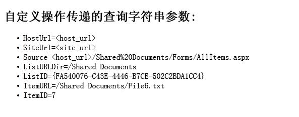

# 创建自定义操作以部署 SharePoint 外接程序
了解部署 SharePoint 外接程序时如何在部署到主机 Web 的 SharePoint 中创建自定义操作。
在创建 SharePoint 外接程序时，可通过自定义操作与主机 Web 中的列表及功能区进行交互。自定义操作会在最终用户安装您的外接程序时部署到主机 Web。自定义操作可以通过查询字符串打开远程网页并传送信息。外接程序可使用两种类型的自定义操作：功能区和菜单项自定义操作。


## 使用本文中的示例的先决条件
<a name="SP15Createcustomactionsapps_Prereq"> </a>

您需要一个如 [开始创建提供程序承载的 SharePoint 加载项](get-started-creating-provider-hosted-sharepoint-add-ins.md)中所述的开发环境。


### 用于帮助您了解自定义操作的核心概念

下表列出了有用的文章，这些文章可帮助您了解自定义操作方案中涉及的概念和步骤。


**表 1. 自定义操作的核心概念**


|**文章**|**描述**|
|:-----|:-----|
| [SharePoint 外接程序](sharepoint-add-ins.md) <br/> |了解 SharePoint 中新的外接程序模型，您可以利用此模型来创建外接程序，这些外接程序对最终用户来说是易于使用的小型解决方案。  <br/> |
| [SharePoint 外接程序的 UX 设计](ux-design-for-sharepoint-add-ins.md) <br/> |了解建立 SharePoint 外接程序时具有的用户体验 (UX) 选项。  <br/> |
| [SharePoint 2013 中的主机 Web、外接程序 Web 和 SharePoint 组件](host-webs-add-in-webs-and-sharepoint-components-in-sharepoint-2013.md) <br/> |了解主机 Web 和外接程序 Web 之间的区别。了解 SharePoint 外接程序中可以包括哪些 SharePoint 组件、将哪些组件部署到主机 Web、将哪些组件部署到外接程序 Web 以及如何在独立的域中部署外接程序 Web。  <br/> |
 

## 代码示例：在主机 Web 文档库中创建自定义操作
<a name="SP15Createcustomactionsapps_Codeexample"> </a>

执行以下步骤在主机 Web 文档库中创建自定义操作：


1. 创建 SharePoint 外接程序和远程 Web 项目。


2. 将自定义操作功能添加到 SharePoint 外接程序项目中。


3. 将外接程序网页添加到 Web 项目中。


### 创建 SharePoint 外接程序和远程 Web 项目


1. 以管理员身份打开 Visual Studio。（为此，请右键单击"启动"菜单上的 Visual Studio 图标，然后选择"以管理员身份运行"。）


2. 如 [开始创建提供程序承载的 SharePoint 加载项](get-started-creating-provider-hosted-sharepoint-add-ins.md)中所述创建提供程序托管的 SharePoint 外接程序并将其命名为 CustomActionsApp。


### 为自定义操作添加外接程序网页


1. 创建 Visual Studio 解决方案后，右键单击 Web 应用程序项目（而不是 SharePoint 外接程序项目），并添加一个新的 Web 表单，方法是选择"添加">"新项目">"Web">"Web 表单"。将表单命名为 CustomActionTarget.aspx。


2. 在 CustomActionTarget.aspx 文件中，将整个 **html** 元素及其子元素替换为以下 HTML 代码。将 **html** 元素上方的所有标记保留原样。HTML 代码包含用于执行下列任务的 JavaScript：

  - 为查询字符串参数提供占位符。


  - 从查询字符串中提取参数。


  - 显示占位符中的参数。


    > **重要信息**
      > 仅当已选择项目时，ItemURL 和 ItemID 令牌才能通过。在生产质量的 SharePoint 外接程序中，您的代码需要处理没有选择项目的情况。在此示例中，代码提示用户尚未选择任何项。 

  ```HTML

<html xmlns="http://www.w3.org/1999/xhtml">
<head>
    <title>Custom action target</title>
</head>
<body>
    <h2>Query string parameters passed by the custom action:</h2>

    <!-- Placeholder for query string parameters -->
    <ul id="qsparams"/>

    <!-- Main JavaScript function, renders
         the query string parameters -->
    <script lang="javascript">
        var params = document.URL.split("?")[1].split("&amp;");
        var paramsHTML = "";
  
        // Extracts the parameters from the query string.
        // Parameters are URLencoded, decode for rendering
        // in page.
        for (var i = 0; i < params.length; i = i + 1) {
            params[i] = decodeURIComponent(params[i]);
            paramsHTML += "<li>" + params[i] + "</li>";
        }

         // Alert the user when no item has been selected.
         // (The SPListItemId is the 5th parameter.)
         if (params[5] === undefined) {
            paramsHTML += "<div> <h3> No item has been selected from the list.  Please select an item. </h3> </div> ";
         }

        // Render parameters in the placeholder.
        document.getElementById("qsparams").innerHTML =
            paramsHTML;
    </script>
</body>
</html>
  ```


### 将菜单项自定义操作添加到 SharePoint 外接程序项目中


1. 右键单击 SharePoint 外接程序项目，然后选择"添加">"新项目">"Office/SharePoint">"菜单项自定义操作"。


2. 保留默认名称，然后选择"添加"。


3. "为菜单项创建自定义操作"向导将询问您一系列问题。给出下表中的答案：

   **表 2. 菜单项自定义操作属性**


|**属性问题**|**解答**|
|:-----|:-----|
|要在哪个位置公开自定义操作?  <br/> |选择"主机 Web"。  <br/> |
|限制在哪个位置执行自定义操作?  <br/> |选择"列表模板"。  <br/> |
|限制对哪个特定项执行自定义操作?  <br/> |选择"文档库"。  <br/> |
|菜单项上的文本是什么?  <br/> |键入"我的自定义操作"。  <br/> |
|自定义操作将导航到哪个位置?  <br/> |选择"CustomActionAppWeb\\CustomActionTarget.aspx"页。  <br/> |
 
4. 选择"完成"。

    Visual Studio 在菜单项自定义操作功能的 elements.xml 文件中生成以下标记：


  ```XML

<?xml version="1.0" encoding="utf-8"?>
<Elements 
    xmlns="http://schemas.microsoft.com/sharepoint/">
    <!-- RegistrationId attribute is the list type id,
        in this case, a document library (id=101). -->
  <CustomAction 
      Id="65695319-4784-478e-8dcd-4e541cb1d682.CustomAction"
      RegistrationType="List"
      RegistrationId="101"
      Location="EditControlBlock"
      Sequence="10001"
      Title="Invoke custom action">
    <!-- 
    Update the Url below to the page you want the custom action to use.
    Start the URL with the token ~remoteAppUrl if the page is in the
    associated web project, use ~appWebUrl if page is in the add-in project.
    -->
    <UrlAction Url=
"~remoteAppUrl/CustomActionTarget.aspx?{StandardTokens}&amp;amp;SPListItemId={ItemId}&amp;amp;SPListId={ListId}" />
  </CustomAction>
</Elements>

  ```

5. 将以下查询参数添加到 **UrlAction** 元素的 **Url** 属性末尾：

     `&amp;amp;SPSource={Source}&amp;amp;SPListURLDir={ListUrlDir}&amp;amp;SPItemURL={ItemUrl}`

    **UrlAction** 元素应该如下所示：

     ` <UrlAction Url= "~remoteAppUrl/CustomActionTarget.aspx?{StandardTokens}&amp;amp;SPListItemId={ItemId}&amp;amp;SPListId={ListId}&amp;amp;SPSource={Source}&amp;amp;SPListURLDir={ListUrlDir}&amp;amp;SPItemURL={ItemUrl}" />`


> **注释**
> 自定义菜单操作还可以使用 **HostWebDialog** 属性在对话框中打开远程网页。有关详细信息，请参阅 [SharePoint-Add-in-Localization](https://github.com/OfficeDev/SharePoint-Add-in-Localization)。 


### 将功能区自定义操作功能添加到 SharePoint 外接程序项目中


1. 右键单击 SharePoint 外接程序项目，然后选择"添加">"新项目">"Office/SharePoint">"功能区自定义操作"。


2. 保留默认名称，然后选择"添加"。


3. "为功能区创建自定义操作"向导将询问您一系列问题。给出下表中的答案：

   **表 3. 功能区自定义操作属性**


|**属性问题**|**解答**|
|:-----|:-----|
|要在哪个位置公开自定义操作?  <br/> |选择"主机 Web"。  <br/> |
|限制在哪个位置执行自定义操作?  <br/> |选择"列表模板"。  <br/> |
|限制对哪个特定项执行自定义操作?  <br/> |选择"文档库"。  <br/> |
|控件位于什么位置?  <br/> |选择"Ribbon.Documents.Manage"。  <br/> |
|菜单项上的文本是什么?  <br/> |键入"我的自定义功能区按钮"。  <br/> |
|自定义操作将导航到哪个位置?  <br/> |选择"CustomActionAppWeb\\CustomActionTarget.aspx"页。  <br/> |
 
4. Visual Studio 在功能区自定义操作功能的 elements.xml 文件中生成以下标记：

  ```XML

<?xml version="1.0" encoding="utf-8"?>
<Elements xmlns="http://schemas.microsoft.com/sharepoint/">
  <CustomAction Id="85691508-c076-4f43-93d4-96b4d5253a09.RibbonCustomAction1"
                RegistrationType="List"
                RegistrationId="101"
                Location="CommandUI.Ribbon"
                Sequence="10001"
                Title="Invoke &amp;apos;RibbonCustomAction1&amp;apos; action">
    <CommandUIExtension>
      <!-- 
      Update the UI definitions below with the controls and the command actions
      that you want to enable for the custom action.
      -->
      <CommandUIDefinitions>
        <CommandUIDefinition Location="Ribbon.Documents.Manage.Controls._children">
          <Button Id="Ribbon.Documents.Manage.RibbonCustomAction1Button"
                  Alt="My Custom Ribbon Button"
                  Sequence="100"
                  Command="Invoke_RibbonCustomAction1ButtonRequest"
                  LabelText="My Custom Ribbon Button"
                  TemplateAlias="o1"
                  Image32by32="_layouts/15/images/placeholder32x32.png"
                  Image16by16="_layouts/15/images/placeholder16x16.png" />
        </CommandUIDefinition>
      </CommandUIDefinitions>
      <CommandUIHandlers>
        <CommandUIHandler Command="Invoke_RibbonCustomAction1ButtonRequest"
                          CommandAction="~remoteAppUrl/CustomActionTarget.aspx?{StandardTokens}&amp;amp;SPListItemId={SelectedItemId}&amp;amp;SPListId={SelectedListId}"/>
      </CommandUIHandlers>
    </CommandUIExtension >
  </CustomAction>
</Elements> 

  ```

5. 将以下查询参数添加到 **CommandAction** 元素的 **CommandUIHandler** 属性末尾：

     `&amp;amp;SPSource={Source}&amp;amp;SPListURLDir={ListUrlDir}`

    **CommandUIHandler** 元素应该如下所示：

     ` <CommandUIHandler Command="Invoke_RibbonCustomAction1ButtonRequest" CommandAction="~remoteAppUrl/CustomActionTarget.aspx?{StandardTokens}&amp;amp;SPListItemId={SelectedItemId}&amp;amp;SPListId={SelectedListId}&amp;amp;SPSource={Source}&amp;amp;SPListURLDir={ListUrlDir}" />`

    > **注释**
      > 功能区自定义操作使用 **SelectedListId** 和 **SelectedItemId**。 **ListId** 和 **ItemId** 仅适用于菜单项自定义操作。

### 将外接程序起始页设置为主机 Web 主页


1. 接下来的示例 SharePoint 外接程序不具有任何外接程序 Web，其远程 Web 应用程序的存在只是为了托管表单。因此，外接程序的起始页应设置为主机 Web 的主页。

    要开始，请在"解决方案资源管理器"中选择 SharePoint 外接程序项目（不是 Web 应用程序项目）并将"网站 URL"属性的值复制到剪贴板中，包括协议（例如，"https://contoso.sharepoint.com"）。


2. 打开外接程序清单，然后将 URL 粘贴到"起始页"框中。


3. 您可以选择从 Web 应用程序项目中删除 Default.aspx 页面，因为它在 SharePoint 外接程序中不使用。


### 生成并运行解决方案


1. 按 F5 键。

    > **注释**
      > 按 F5 时，Visual Studio 将生成解决方案、部署外接程序并打开外接程序的权限页。 
2. 选择"信任它"按钮。将打开开发人员网站的默认页面。


3. 导航至主机 Web 中的任何文档库。

   **启动自定义菜单操作**


4. 选择任何文档的标注按钮 ( **...**)。将打开标注。


5. 选择标注上的标注按钮 ( **...**)。


6. 选择"高级"。


7. 在上下文菜单中，选择"我的自定义菜单操作"。您应看到类似下面的内容在远程网页上打开：

   **自定义操作中具有参数的远程网页**





8. 单击浏览器上的"后退"按钮返回到库。

   **启动自定义功能区操作**


9. 选择任何文档。


10. 打开功能区上的"文件"选项卡。


11. 选择"我的自定义功能区按钮"。您将看到相同的远程网页。


**表 4. 问题及解决方案**


|**问题**|**解决方案**|
|:-----|:-----|
|Visual Studio 在您按 F5 键之后未打开浏览器。  <br/> |将 SharePoint 外接程序项目设置为启动项目。  <br/> |
|在 Visual Studio 中按 F5 键之后未解析 URL 中的标记。  <br/> |转到主机 Web 中的"网站内容"页，并单击外接程序的图标。  <br/> |
 

## 后续步骤
<a name="SP15Createcustomactionsapps_Nextsteps"> </a>

本文演示如何在 SharePoint 外接程序中创建自定义操作。下一步，您可以了解可用于 SharePoint 外接程序的其他 UX 组件。要了解详细信息，请参阅以下内容：


-  [代码示例：使用 ECB 自定义操作打开远程外接程序网页](http://code.msdn.microsoft.com/SharePoint-2013-Open-e0ca1826)


-  [SharePoint-Add-in-Localization](https://github.com/OfficeDev/SharePoint-Add-in-Localization)


-  [代码示例：使用自定义操作和跨域库订购书籍](http://code.msdn.microsoft.com/SharePoint-2013-Open-a-36d1598d)


-  [在 SharePoint 外接程序中使用 SharePoint 网站的样式表](use-a-sharepoint-website-s-style-sheet-in-sharepoint-add-ins.md)


-  [在 SharePoint 外接程序中使用客户端部件版式控制](use-the-client-chrome-control-in-sharepoint-add-ins.md)


-  [创建外接程序部件以安装 SharePoint 外接程序](create-add-in-parts-to-install-with-your-sharepoint-add-in.md)


## 其他资源
<a name="SP15Createcustomactionsapps_AddResources"> </a>


-  [设置 SharePoint 加载项的本地开发环境](set-up-an-on-premises-development-environment-for-sharepoint-add-ins.md)


-  [SharePoint 外接程序的 UX 设计](ux-design-for-sharepoint-add-ins.md)


-  [SharePoint 外接程序 UX 设计准则](sharepoint-add-ins-ux-design-guidelines.md)


-  [在 SharePoint 2013 中创建 UX 组件](create-ux-components-in-sharepoint-2013.md)


-  [考虑 SharePoint 外接程序设计选项的三种方法](three-ways-to-think-about-design-options-for-sharepoint-add-ins.md)


-  [SharePoint 外接程序体系结构的重要方面和开发前景](important-aspects-of-the-sharepoint-add-in-architecture-and-development-landscap.md)


