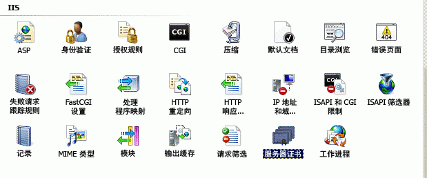
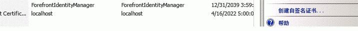
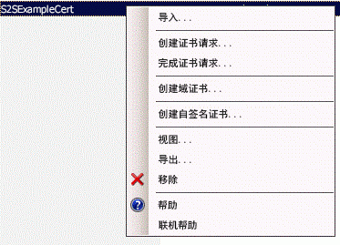
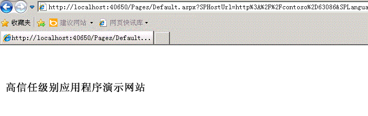

# 创建 SharePoint 高信任外接程序
了解如何创建高信任 SharePoint 外接程序。高信任外接程序使用数字证书建立远程 Web 应用程序和 SharePoint 2013 之间的信任。高信任外接程序仅可以安装在本地 SharePoint（而不是 Microsoft SharePoint Online）上，并且它们主要用于在本地使用，而不是与基于云的 Web 应用程序一起使用。
## 创建高信任外接程序的先决条件
<a name="Prereqs"> </a>

若要遵循本文中的过程，请确保你具有以下内容：


- 本地 SharePoint 2013 开发环境。有关安装说明，请参阅 [设置 SharePoint 加载项的本地开发环境](set-up-an-on-premises-development-environment-for-sharepoint-add-ins.md)。特别是，确保您已完成 [配置 SharePoint 中的服务以实现服务器到服务器加载项部署](set-up-an-on-premises-development-environment-for-sharepoint-add-ins.md#Servertoserver)部分中的步骤。


- 创建提供程序托管的 SharePoint 外接程序的经验。请参阅 [开始创建提供程序承载的 SharePoint 加载项](get-started-creating-provider-hosted-sharepoint-add-ins.md)。


- 远程安装的或在已安装 SharePoint 2013 的计算机上安装的 Visual Studio。


- Visual Studio Microsoft Office 开发人员工具。


- 熟悉数字证书 — 它们是什么以及如何使用它们。


阅读以下文章可更好地了解 SharePoint 外接程序 和数字证书。


**表 1. 设置 SharePoint 2013 以运行高信任外接程序的核心概念**


|**文章标题**|**说明**|
|:-----|:-----|
| [开始创建提供程序承载的 SharePoint 加载项](get-started-creating-provider-hosted-sharepoint-add-ins.md) <br/> |了解如何使用 Visual Studio Office 开发人员工具 创建基本的提供商托管的 SharePoint 外接程序 、如何使用 SharePoint CSOM 与 SharePoint 2013 网站进行交互。  <br/> |
| [Digital Certificates](http://msdn.microsoft.com/library/e523b335-0156-4f47-b55c-b80495587c4f.aspx)和 [Working with Certificates](http://msdn.microsoft.com/library/6ffb8682-8f07-4a45-afbb-8d2487e9dbc3.aspx) <br/> |了解数字证书背后的基本思想。  <br/> |
 

## 运行高信任外接程序简介
<a name="Intro"> </a>

高信任外接程序是提供商托管的 SharePoint 外接程序，它使用数字证书在远程 Web 应用程序和 SharePoint 之间建立信任。"高信任"与"完全信任"不同。高信任外接程序仍必须请求外接程序权限。外接程序之所以被视为"高信任"是因为信任它使用外接程序所需的任何用户标识，并且因为外接程序负责创建它传递到 SharePoint 的访问令牌的用户部分。


高信任 SharePoint 外接程序主要用于在本地环境中使用。高信任外接程序无法安装到 Microsoft SharePoint Online，但远程组件通常可以本地安装在企业防火墙中。因此 SharePoint 外接程序的实例特定于每个公司。


高信任外接程序使用证书而不是上下文令牌建立信任。（需要修改用于将 Microsoft Azure 访问控制服务 (ACS) 用作其信任令牌而构建的提供商托管的外接程序以作为高信任应用程序工作。）高信任外接程序需要 SharePoint 场和托管远程 Web 应用程序的服务器上的某些配置。本主题介绍了使 Visual Studio 调试 ( **F5**) 生效所需的配置步骤。配置测试、阶段或生产环境可能有所不同，将在 [打包和发布高度可信的 SharePoint 外接程序](package-and-publish-high-trust-sharepoint-add-ins.md)主题中进行介绍。


在 SharePoint 2013 中，服务器到服务器安全令牌服务 (STS) 为服务器到服务器身份验证提供访问令牌。服务器到服务器 STS 支持通过临时访问令牌访问其他应用程序服务（如 Exchange 2013、Lync 2013 和 SharePoint 2013 外接程序）。使用 Windows PowerShell cmdlet 和证书可在应用程序服务之间建立信任关系（例如，在 SharePoint 和远程外接程序之间建立信任）。


> **注释**
> 服务器到服务器 STS 不适用于用户身份验证。因此，在管理中心中用户登录页的"身份验证提供程序"部分，或 SharePoint 2013 的人员选取器中不会列出服务器到服务器 STS。 


本文显示了如何创建高信任外接程序，并提供了通过按"F5"在 Visual Studio 中运行该应用程序的安装说明。您将了解：


- 配置外接程序以用作高信任外接程序。


- 配置 SharePoint 2013 以使用高信任外接程序。


- 创建基本高信任外接程序。


## 获取证书或创建公用和专用测试证书
<a name="Cert2"> </a>

您需要适用于高信任外接程序的远程 Web 应用程序的 X.509 数字证书。若要全面测试您的 SharePoint 外接程序，您需要域颁发的证书或由证书颁发机构颁发的商业证书。但是，在调试的初始阶段，您可以使用自签名证书。以下过程介绍了如何使用 IIS 创建和导出测试证书。在下面的 [使用域颁发的证书或商业证书完成调试](#NewCertificate)部分中，您将了解如何将自签名证书替换为域颁发的证书或商业证书。


此外，你还可使用 MakeCert 测试程序生成 X.509 证书。有关如何使用 MakeCert 的详细信息，请参阅 [使用 Authenticode 对代码进行签名和检查](http://msdn.microsoft.com/zh-cn/library/ms537364%28VS.85%29.aspx)。


首先你将创建测试 .pfx 证书文件，然后创建相应的测试 .cer 文件。.pfx 证书包含由远程 Web 应用程序使用的私钥以将其通信签名到 SharePoint。.cer 包含 SharePoint 使用的公钥来加密消息、验证它们是否来自远程 Web 应用程序以及验证远程 Web 应用程序是否具有访问 SharePoint 信任的令牌颁发者提供的令牌的权限。有关 .pfx 和 .cer 文件的详细信息，请参阅 [软件发布者证书](http://msdn.microsoft.com/zh-cn/library/windows/hardware/ff552299%28v=vs.85%29.aspx)


### 创建自签名的测试 .pfx 证书文件的步骤


1. 当你在 Visual Studio 中调试高信任 SharePoint 外接程序 时，远程 Web 应用程序将在安装了 Visual Studio 的计算机上的 IIS Express 中托管。因此远程 Web 应用程序计算机不具有你可以在其中创建证书的 IIS 管理器。出于此原因，你可以在  *SharePoint*  测试服务器上使用 IIS 创建证书。在 IIS 管理器中，在左侧树视图中选择 _ServerName_ 节点。


2. 选择"服务器证书"图标，如图 1 所示。

   **图 1. IIS 中的"服务器证书"选项**





3. 从右侧链接集中选择"创建自签发证书"链接，如图 2 所示。

   **图 2."创建自签名证书"链接**





4. 将证书命名为 HighTrustSampleCert，然后选择"确定"。


5. 右键单击该证书，然后选择"导出"，如图 3 所示。

   **图 3. 导出测试证书**





6. 在 Windows 中或在命令行上，创建名为 C:\\Certs 的文件夹。


7. 回到 IIS 管理器中，将文件导出到 C:\\Certs 并为它提供密码。在此示例中，密码为 **password** 。


8. 如果你的测试 SharePoint 安装所在的计算机与运行 Visual Studio 的计算机不同，请在 Visual Studio 计算机上创建文件夹 C:\\Certs 并将 HighTrustSampleCert.pfx 文件移动到该文件夹。当你在 Visual Studio 中调试时，该计算机将是在其上运行远程 Web 应用程序的计算机。


### 创建相应的测试 .cer 文件的步骤


1. 在 SharePoint 服务器上，确保以下 IIS 外接程序池的外接程序池标识具有对 C:\\Certs 文件夹的读取权限：

  - "SecurityTokenServiceApplicationPool"


  - 可服务于 IIS 网站的外接程序池，该网站托管用于测试 SharePoint 网站的父 SharePoint Web 应用程序。对于"SharePoint - 80"IIS 网站，该池称为"OServerPortalAppPool"。


2. 在 IIS 管理器中，选择左侧树视图中的  _ServerName_ 节点。


3. 双击"服务器证书"。


4. 在"服务器证书"视图中，双击 **HighTrustSampleCert** 以显示证书详细信息。


5. 在"详细信息"选项卡上，选择"复制到文件"以启动"证书导出向导"，然后选择"下一步"。


6. 使用默认值"不，不导出私钥"，然后选择"下一步"。


7. 使用默认值。选择"下一步"。


8. 选择"浏览"，浏览到 C:\\Certs，将证书命名为 **HighTrustSampleCert** ，然后选择"保存"。该证书将另存为 .cer 文件。


9. 选择"下一步"。


10. 选择"完成"。


## 配置 SharePoint 2013 以使用证书并配置对您的外接程序的信任
<a name="Configure2"> </a>

您在本部分中创建的 Windows PowerShell 脚本旨在支持在 Visual Studio 中使用"F5"。它将 *不会*  正确配置阶段或生产 SharePoint 安装。有关配置生产 SharePoint 来使用证书的说明，请参阅 [打包和发布高度可信的 SharePoint 外接程序](package-and-publish-high-trust-sharepoint-add-ins.md)。


> **注释**
> 仔细检查您是否已完成 [配置 SharePoint 中的服务以实现服务器到服务器加载项部署](set-up-an-on-premises-development-environment-for-sharepoint-add-ins.md#Servertoserver)（已在本文中作为先决条件列出）中的步骤。如果没有，则必须立即配置它才能继续。 


### 配置 SharePoint 的步骤


1. 在文本编辑器或 Windows PowerShell 编辑器中，启动一个新文件并向其添加下面的行以创建证书对象：

  ```

$publicCertPath = "C:\\Certs\\HighTrustSampleCert.cer"
$certificate = New-Object System.Security.Cryptography.X509Certificates.X509Certificate2($publicCertPath)

  ```

2. 添加下面的行以确保 SharePoint 将证书视为根证书颁发机构。

  ```

New-SPTrustedRootAuthority -Name "HighTrustSampleCert" -Certificate $certificate

  ```

3. 添加下面的行以获取授权领域的 ID。

  ```

$realm = Get-SPAuthenticationRealm

  ```

4. 你的远程 Web 应用程序将使用访问令牌获取对 SharePoint 数据的访问权限。该访问令牌必须是由 SharePoint 信任的令牌颁发者颁发的。在高信任 SharePoint 外接程序 中，该证书是令牌颁发者。添加下面的行以 SharePoint 需要的格式构造颁发者 ID： ** _specific_issuer_GUID_@ _realm_GUID_** 。

  ```

$specificIssuerId = "11111111-1111-1111-1111-111111111111"
$fullIssuerIdentifier = $specificIssuerId + '@' + $realm 

  ```


    > **注释**
      >  `$specificIssuerId` 值必须是 GUID，因为在生产环境中，每个证书都必须具有唯一的颁发者。但是，在此上下文（您在其中使用相同的证书调试所有高信任外接程序）中，您可以硬编码该值。如果出于某些原因，您使用的 GUID 与在此处使用的不同， * **请确保 GUID 中的任何字母都是小写*** 。SharePoint 基础结构当前要求证书颁发者 GUID 采用小写。
5. 添加下面的行以将证书注册为受信任的令牌颁发者。 `-Name` 参数必须是唯一的，以便在生产配置中，通常可以使用 GUID 作为部分（或全部）名称，但是在此上下文中，您可以使用友好名称。需要 `-IsTrustBroker` 开关以确保可以为您开发的所有高信任外接程序使用相同的证书。要立即注册令牌颁发者，需要 `iisreset` 命令。如果没有该命令，您可能需要等待 24 小时才能注册新的颁发者。

  ```

New-SPTrustedSecurityTokenIssuer -Name "High Trust Sample Cert" -Certificate $certificate -RegisteredIssuerName $fullIssuerIdentifier -IsTrustBroker
iisreset 

  ```

6. SharePoint 2013 通常不接受自签名证书。因此当你使用自签名证书进行调试时，请添加下面的行以关闭在远程 Web 应用程序调用到 SharePoint 中时使用的 HTTPS 的 SharePoint 的一般要求。如果未添加，则当远程 Web 应用程序使用自签名证书调用 SharePoint 时，你将收到"403（已禁止）"消息。你将在之后的过程中撤销此步骤。关闭 HTTPS 要求意味着从远程 Web 应用程序到 SharePoint 的请求未加密，但是该证书仍然可以用作访问令牌的受信任的颁发者，这是其在高信任 SharePoint 外接程序 中的主要目的。

  ```

$serviceConfig = Get-SPSecurityTokenServiceConfig
$serviceConfig.AllowOAuthOverHttp = $true
$serviceConfig.Update()

  ```

7. 使用名称 HighTrustConfig-ForDebugOnly.ps1 保存该文件。


8. 以管理员身份打开"SharePoint Management Shell"，然后使用下面的行运行文件：

  ```

./HighTrustConfig-ForDebugOnly.ps1
  ```


## 创建高信任 SharePoint 外接程序
<a name="Createapp2"> </a>

在此部分中，你将了解如何使用 Visual Studio 创建高信任 SharePoint 外接程序。


> **注释**
> 如 [创建高信任外接程序的先决条件](#Prereq)部分中所述，本文假定您了解如何创建提供商托管的 SharePoint 外接程序。有关详细信息，请参阅 [开始创建提供程序承载的 SharePoint 加载项](get-started-creating-provider-hosted-sharepoint-add-ins.md)。 


### 创建高信任 SharePoint 外接程序 的步骤


1. 在 Visual Studio 中，依次选择"文件"、"新建"、"项目"。


2. 在"新建项目"向导中，展开"Visual C#"或"Visual Basic"节点，然后展开"Office/SharePoint"节点。


3. 选择"外接程序"，然后选择创建"SharePoint 外接程序"项目。


4. 将项目命名为 HighTrustSampleApp。


5. 将项目保存到选择的位置，然后选择"确定"。


6. 指定 SharePoint 开发人员网站的完整 URL。例如，http://TestServer/sites/devsite/


7. 选择"提供商托管"选项，然后选择"下一步"按钮。


8. 如果系统提示你指定 Web 项目的类型，请选择"ASP.NET Web 表单应用程序"以获取本主题中的后续示例，然后选择"下一步"按钮。


9. 将打开向导的"配置身份验证设置"页面。您添加到此表单中的值将自动添加到 web.config 文件。在"您希望如何对您的外接程序进行身份验证？"下，选择"使用证书"。


10. 单击"证书位置"框旁边的"浏览"按钮，并导航至你创建的自签名证书（.pfx 文件）的位置 (C:\\Certs)。此字段的值应该是完整路径 C:\\Certs\\HighTrustSampleCert.pfx。


11. 在"密码"框中键入此证书的密码。在此情况下，该密码是"password"。


12. 在"颁发者 ID"框中键入颁发者 ID ( `11111111-1111-1111-1111-111111111111`)。


13. 选择"完成"。许多配置将在解决方案打开时完成。将在 Visual Studio 解决方案中创建两个项目，一个适用于 SharePoint 外接程序，另一个适用于 ASP.NET Web 应用程序。


### 运行和调试外接程序


1. 当创建 ASP.NET 项目时，Visual Studio Office 开发人员工具 将自动生成 default.aspx 和 default.aspx.cs 文件。生成的代码将提取 SharePoint 主机 Web 的标题并将其显示在远程 Web 应用程序的默认页面上。这些文件中的确切标记和代码会有所不同，具体取决于工具版本。在本主题中，你可以使用生成的 default.aspx 和 default.aspx.cs 文件，无需进行修改。


2. 若要测试 SharePoint 外接程序及其远程 Web 应用程序，请在 Visual Studio 中按"F5"。Web 应用程序将部署到  *localhost*  的 IIS Express 中。SharePoint 外接程序 将安装到目标 SharePoint 网站。SharePoint 将提示您授予 SharePoint 外接程序请求的权限。某些版本的 Visual Studio Office 开发人员工具 将立即启动外接程序，其他版本将打开您的目标 SharePoint 网站的"网站内容"页面，您将看到其中列出了新的外接程序。

    如果外接程序不自动启动，则启动它。远程 Web 应用程序将打开在 AppManifest.xml 文件中指定为"起始页"的页面（它是 Default.aspx）。您的外接程序应与图 4 类似。


   **图 4. 调用 SharePoint Server 并检索 SharePoint 主机 Web 的标题的示例外接程序。**





## 使用域颁发的证书或商业证书完成调试
<a name="NewCertificate"> </a>

之前创建的 Windows PowerShell 脚本已禁用远程 Web 应用程序使用 HTTPS 协议访问 SharePoint 的 SharePoint 一般要求。禁用使用 HTTPS 功能可能导致您作为开发人员在构建外接程序时，错过某些在需要 HTTPS 的生产部署中出现的问题。因此，在将测试证书替换为域颁发证书或商业证书并在开启 HTTPS 要求的情况下重新测试外接程序之前，不应考虑开发和调试已完成的阶段。


当您获得新证书时，需要向其添加密码（如果它还没有密码）。在生产环境中，将使用强密码，但对于调试 SharePoint 外接程序，可以使用任何密码。您将需要采用两种格式（pfx 和 cer）的证书。如果您获得的证书不是 pfx 格式，您可能需要使用实用程序将其转换为 pfx。当您具有 pfx 文件时，可以将其导入到 IIS 中并导出 cer 文件，如以下过程所述。


### 导入新证书的步骤


1. 将 .pfx 文件放置在 SharePoint Server 上的 C:\\Certs 中。在本文中，假定该文件名为  _MyCert_.pfx。你应该将所有这些说明中的"MyCert"替换为你的证书的真实名称。


2. 在 IIS 管理器中，选择左侧树视图中的  _ServerName_ 节点。


3. 双击"服务器证书"图标。


4. 在右侧"操作"窗格中选择"导入"。


5. 在"导入证书"对话框中，使用"浏览"按钮浏览到 C:\\Certs\\ _MyCert_.pfx，然后输入证书密码。


6. 确保启用"允许导出此证书"，然后单击"确定"。


7. 在"服务器证书"列表中，右键单击该证书，然后选择"导出"，如上面的图 3 所示。


8. 将文件导出到 C:\\Certs 并指定其密码。


9. 如果你的测试 SharePoint 安装不在运行 Visual Studio 的相同计算机上，请将  _MyCert_.pfx 文件移动到 Visual Studio 计算机上的 C:\\Certs 文件夹。


10. 在"服务器证书"视图中，双击  _MyCert_ 以显示证书详细信息。


11. 在"详细信息"选项卡上，选择"复制到文件"以启动"证书导出向导"，然后选择"下一步"。


12. 使用默认值"不，不导出私钥"，然后选择"下一步"。


13. 使用默认值。选择"下一步"。


14. 选择"浏览"，浏览到 C:\\Certs，将证书命名为  _MyCert_，然后选择"保存"。证书将另存为 .cer 文件。


15. 选择"下一步"。


16. 选择"完成"。


### 配置 SharePoint 2013 以使用新证书的步骤


1. 打开 HighTrustConfig-ForDebugOnly.ps1file 以供编辑并进行以下更改：

1. 在显示  _MyCert_ 的两个位置中替换 `HighTrustSampleCert`。


2. 将特定的颁发者 ID  `11111111-1111-1111-1111-111111111111` 替换为 `22222222-2222-2222-2222-222222222222`。


3. 将"High Trust Sample Cert"替换为"My Cert"或某些其他相应的友好名称。


4. 在行  `$serviceConfig.AllowOAuthOverHttp = $true` 中，将 `true` 替换为 `false`。这将重新打开使用 HTTPS 的要求。


2. 保存该文件。


3. 以管理员身份打开"SharePoint Management Shell"，然后使用下面的行运行文件：

  ```
  ./HighTrustConfig-ForDebugOnly.ps1
  ```


### 重新配置远程 Web 应用程序的步骤


1. 在 Visual Studio 中，打开 Web 应用程序项目的 web.config 文件并进行以下更改：

1. 在  `ClientSigningCertificatePath` 密钥中，将 `C:\\Certs\\HighTrustSampleCert.pfx` 替换为 `C:\\Certs\\` _MyCert_ `.pfx`。


2. 将  `ClientSigningCertificatePassword` 密钥值替换为证书的实际密码。


3. 将  `IssuerId` 密钥值替换为 `22222222-2222-2222-2222-222222222222`。


2. 按"F5"以调试外接程序。


在开发高信任外接程序后，请查看 [打包和发布高度可信的 SharePoint 外接程序](package-and-publish-high-trust-sharepoint-add-ins.md)来了解有关如何打包和发布此种 SharePoint 外接程序的说明。


## TokenHelper 和 SharePointContext 文件可执行哪些操作？
<a name="TokenHelper"> </a>

Visual Studio Office 开发人员工具 在远程 Web 应用程序中包含 TokenHelper.cs（或 .vb）文件。某些版本的工具还包含 SharePointContext.cs（或 .vb）文件。这些文件中的代码执行以下操作：


- 将 .NET 配置为在发出网络调用时信任证书。


- 检索服务器到服务器访问令牌，该令牌由远程 Web 应用程序的专用证书代表指定的 **WindowsIdentity** 对象进行签名，并且 SharePoint 2013 可使用它建立信任。


- 获取 SharePoint 安全令牌服务 (STS) 证书。


- 在使用低信任而不是高信任授权系统的外接程序中，这些文件具有其他任务，例如处理 [SharePoint 外接程序的上下文令牌 OAuth 流](context-token-oauth-flow-for-sharepoint-add-ins.md)中所述方案的 OAuth 令牌。该方案不在本文的讨论范围内。


有关 TokenHelper 和 SharePointContext 的详细信息，请参阅文件中的注释。


高信任外接程序中没有上下文令牌。上下文令牌仅针对使用低信任授权的配置。但是，仍需要访问令牌。如果您使用的是高信任配置，则您的 Web 应用程序必须采用 SharePoint 所采用的方式对用户进行身份验证（即，外接程序负责创建访问令牌，包括用户和标识提供程序的 ID）。


当您在 Visual Studio 中使用 **F5** 进行调试时，Visual Studio Microsoft Office 开发人员工具 使用 Windows 身份验证，两个生成的代码文件使用运行外接程序以创建访问令牌的用户的 Windows 标识。您的外接程序发布后，如果您想在不做修改的情况下使用两个生成的文件，您需要将 IIS 管理器中的远程 Web 应用程序配置为使用 Windows 身份验证。如果您的外接程序在生产环境中不使用 Windows 身份验证，您将需要自定义生成的代码文件 TokenHelper 和/或 SharePointContext，以使用其他身份验证系统。如果您的远程 Web 应用程序以运行 SharePoint 外接程序 的用户以外的身份访问 SharePoint，您也可以对这些文件进行自定义。最后，如果远程 Web 应用程序是 PHP、node.js、Java 或其他非 ASP.NET 平台，您的访问代码需从所使用的身份验证机系统中获取用户的 ID，然后将该 ID 添加到它构建的访问令牌。有关详细信息，请参阅 [打包和发布高度可信的 SharePoint 外接程序](package-and-publish-high-trust-sharepoint-add-ins.md)、 [在提供程序托管的高信任 SharePoint 外接程序中创建和使用访问令牌](create-and-use-access-tokens-in-provider-hosted-high-trust-sharepoint-add-ins.md)以及 [在 SharePoint 2013 中将 SharePoint 外接程序与 SAML 和 FBA 网站一起使用](http://blogs.technet.com/b/speschka/archive/2012/12/07/using-sharepoint-apps-with-saml-and-fba-sites-in-sharepoint-2013.aspx)。


## 其他资源
<a name="bk_addresources"> </a>


-  [打包和发布高度可信的 SharePoint 外接程序](package-and-publish-high-trust-sharepoint-add-ins.md)


-  [有关 SharePoint 2013 中高信任外接程序的疑难解答提示](http://blogs.technet.com/b/speschka/archive/2012/11/01/more-troubleshooting-tips-for-high-trust-apps-on-sharepoint-2013.aspx)


-  [注册 SharePoint 2013 外接程序](register-sharepoint-add-ins-2013.md)


-  [SharePoint 外接程序的授权和身份验证](authorization-and-authentication-of-sharepoint-add-ins.md)


-  [在 SharePoint 2013 外接程序中通知新的 SharePointContext 帮助程序](http://blogs.msdn.com/b/officeapps/archive/2013/11/07/announcing-the-new-sharepointcontext-helper-in-apps-for-sharepoint-2013.aspx)


-  [SharePoint 2013 中的外接程序权限](add-in-permissions-in-sharepoint-2013.md)


-  [开始创建提供程序承载的 SharePoint 加载项](get-started-creating-provider-hosted-sharepoint-add-ins.md)


