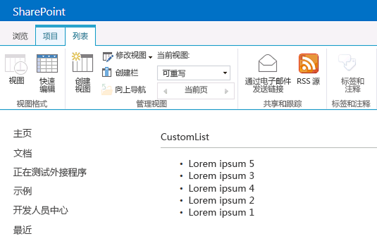

# 使用客户端呈现在 SharePoint 外接程序中自定义列表视图
了解如何使用 SharePoint 2013 中的客户端呈现技术在 Sharepoint 托管的外接程序中自定义列表视图。
在 SharePoint 2013 中，客户端呈现为您提供了一种方式来针对 SharePoint 页面中托管的一组控件来生成自己的输出。您可以利用它使用已知的技术（例如 HTML 和 JavaScript）定义 SharePoint 列表视图的呈现逻辑。利用客户端呈现，您可以指定自己的 JavaScript 资源并在可供您的外接程序使用的数据存储选项（例如文档库）中托管它们。Sharepoint 托管的外接程序仅包括 SharePoint 组件。Sharepoint 托管的外接程序在主机 Web 的独立子网站（称为外接程序 Web）中具有其资源。
  
    
    


## 使用本文中的示例的先决条件
<a name="SP15CSRlistview_Prereq"> </a>

若要按照此示例中的步骤操作，您将需要以下项目：
  
    
    

-  [Visual Studio 2015 和最新的 Microsoft Office 开发人员工具](https://www.visualstudio.com/features/office-tools-vs)
    
  
- SharePoint 2013 开发环境（本地方案需要外接程序隔离）
    
  
有关如何设置符合您需求的开发环境的指南，请参阅 [开始构建 Office 和 SharePoint 相关应用程序](http://msdn.microsoft.com/library/187f8c8c-1b15-471c-80b5-69a40e67deea%28Office.15%29.aspx)。
  
    
    

### 用于帮助您理解使用客户端呈现自定义列表视图的核心概念

下表列出了可帮助您理解列表视图自定义方案所涉及的概念的有用文章。
  
    
    

**表 1. 在外接程序中自定义列表视图的核心概念**


|**文章标题**|**说明**|
|:-----|:-----|
| [SharePoint 外接程序](sharepoint-add-ins.md) <br/> |了解 Microsoft SharePoint 2013 中新的外接程序模型，您可以利用此模型来创建外接程序，这些外接程序对最终用户来说是易于使用的小型解决方案。  <br/> |
| [SharePoint 外接程序的 UX 设计](ux-design-for-sharepoint-add-ins.md) <br/> |了解在生成 SharePoint 外接程序时可使用的 UX 选项。  <br/> |
| [SharePoint 2013 中的主机 Web、外接程序 Web 和 SharePoint 组件](host-webs-add-in-webs-and-sharepoint-components-in-sharepoint-2013.md) <br/> |了解主机 Web 和外接程序 Web 之间的区别。了解 SharePoint 外接程序中可以包括哪些 SharePoint 2013 组件、将哪些组件部署到主机 Web、将哪些组件部署到外接程序 Web 以及如何在独立的域中部署外接程序 Web。  <br/> |
   

## 代码示例：使用客户端呈现自定义列表视图
<a name="SP15CSRlistview_Codeexample"> </a>

若要使用客户端呈现自定义部署到外接程序 Web 的列表视图，请按照以下步骤操作：
  
    
    

1. 创建 SharePoint 外接程序项目。
    
  
2. 创建带有自定义视图的新列表定义。
    
  
3. 在 JavaScript 文件中提供自定义呈现逻辑。
    
  
图 1 显示了公告列表的客户端呈现视图。
  
    
    

**图 1. 公告列表的自定义视图**

  
    
    

  
    
    

  
    
    

### 创建 SharePoint 外接程序项目


1. 以管理员身份打开 Visual Studio 2015。（若要执行此操作，请右键单击"开始"菜单上的"Visual Studio"图标，并选择"以管理员身份运行"。）
    
  
2. 使用"SharePoint 外接程序"模板创建新的项目。
    
    图 2 显示了 Visual Studio 2015 中"SharePoint 外接程序"模板的位置，具体位于"模板"、"Visual C#"、"Office/SharePoint"、"Office 外接程序"下。
    

   **图 2. SharePoint 2013 相关外接程序的 Visual Studio 模板**

  

     
  

  

  
3. 提供您要用于调试的 SharePoint 网站的 URL。
    
  
4. 选择"Sharepoint 托管"作为您外接程序的托管选项。
    
  

### 创建新的列表定义


1. 右键单击 SharePoint 外接程序项目，添加一个新的"列表"项。创建一个基于公告的可自定义列表。
    
  
2. 复制以下标记并将其粘贴到列表功能的 Schema.xml 文件的 **Views** 元素中。该标记将执行以下任务：
    
  - 声明一个名为 Overridable 且 BaseViewID=2 的新视图。
    
  
  - 为指向使用外接程序预配的 JavaScript 文件的 **JSLink** 元素提供一个值。
    
    > [!注释]
      > 调查列表或事件列表不支持 JSLink 属性。SharePoint 日历是事件列表。 

  ```XML
  
<View BaseViewID="2"
      Name="8d2719f3-c3c3-415b-989d-33840d8e2ddb" 
      DisplayName="Overridable" 
      Type="HTML" 
      WebPartZoneID="Main" 
      SetupPath="pages\\viewpage.aspx" 
      Url="Overridable.aspx"
      DefaultView="TRUE">
  <ViewFields>
    <FieldRef Name="Title" />
  </ViewFields>
  <Query />
  <Toolbar Type="Standard" />
  <XslLink>main.xsl</XslLink>
  <JSLink Default="TRUE">~site/Scripts/CSRListView.js</JSLink>
</View>
  ```


### 在 JavaScript 文件中提供自定义程序逻辑


1. 右键单击"脚本"文件夹，添加一个新的 JavaScript 文件。将该文件命名为 CSRListView.js。
    
  
2. 复制以下代码并将其粘贴到 CSRListView.js 文件中。该代码将执行以下任务：
    
  - 为 **PreRender** 和 **PostRender** 事件提供事件处理程序。
    
  
  - 提供"页眉、页脚和项"模板集的模板。
    
  
  - 注册模板。
    
  

  ```
  
(function () {
    // Initialize the variable that stores the objects.
    var overrideCtx = {};
    overrideCtx.Templates = {};

    // Assign functions or plain html strings to the templateset objects:
    // header, footer and item.
    overrideCtx.Templates.Header = "<B><#=ctx.ListTitle#></B>" +
        "<hr><ul id='unorderedlist'>";

    // This template is assigned to the CustomItem function.
    overrideCtx.Templates.Item = customItem;
    overrideCtx.Templates.Footer = "</ul>";

    // Set the template to the:
    //  Custom list definition ID
    //  Base view ID
    overrideCtx.BaseViewID = 2;
    overrideCtx.ListTemplateType = 10057;

    // Assign a function to handle the
    // PreRender and PostRender events
    overrideCtx.OnPreRender = preRenderHandler;
    overrideCtx.OnPostRender = postRenderHandler;

    // Register the template overrides.
    SPClientTemplates.TemplateManager.RegisterTemplateOverrides(overrideCtx);
})();

// This function builds the output for the item template.
// It uses the context object to access announcement data.
function customItem(ctx) {

    // Build a listitem entry for every announcement in the list.
    var ret = "<li>" + ctx.CurrentItem.Title + "</li>";
    return ret;
}

// The preRenderHandler attends the OnPreRender event
function preRenderHandler(ctx) {

    // Override the default title with user input.
    ctx.ListTitle = prompt("Type a title", ctx.ListTitle);
}

// The postRenderHandler attends the OnPostRender event
function postRenderHandler(ctx) {

    // You can manipulate the DOM in the postRender event
    var ulObj;
    var i, j;

    ulObj = document.getElementById("unorderedlist");
    
    // Reverse order the list.
    for (i = 1; i < ulObj.children.length; i++) {
        var x = ulObj.children[i];
        for (j = 1; j < ulObj.children.length; j++) {
            var y = ulObj.children[j];
            if(x.innerText<y.innerText){                  
                ulObj.insertBefore(y, x);
            }
        }
    }
}
  ```


### 生成并运行解决方案


1. 按 F5 键。
    
    > [!注释]
      > 按 F5 时，Visual Studio 将生成解决方案、部署外接程序并打开外接程序的权限页。 
2. 选择"信任"按钮。
    
  
3. 通过输入相对于外接程序 Web 域（不是主机 Web 域）中您的外接程序目录的  _/Lists/<your_list_instance>_ 地址转到自定义列表。添加一个或两个公告。在功能区上，选择"可重写"视图。
    
  

## 后续步骤
<a name="SP15CSRlistview_Nextsteps"> </a>

本文演示了如何使用客户端呈现在 SharePoint 外接程序中自定义列表视图。下一步，您可以了解可用于 SharePoint 外接程序的其他 UX 组件。若要了解更多信息，请参阅以下内容：
  
    
    

-  [代码示例：使用客户端呈现在外接程序中自定义列表视图](http://code.msdn.microsoft.com/SharePoint-2013-Customize-61761017)
    
  
-  [在 SharePoint 外接程序中使用 SharePoint 网站的样式表](use-a-sharepoint-website-s-style-sheet-in-sharepoint-add-ins.md)
    
  
-  [在 SharePoint 外接程序中使用客户端部件版式控制](use-the-client-chrome-control-in-sharepoint-add-ins.md)
    
  
-  [创建自定义操作以部署 SharePoint 外接程序](create-custom-actions-to-deploy-with-sharepoint-add-ins.md)
    
  
-  [创建外接程序部件以安装 SharePoint 外接程序](create-add-in-parts-to-install-with-your-sharepoint-add-in.md)
    
  

## 其他资源
<a name="SP15CSRlistview_AddResources"> </a>


-  [设置 SharePoint 加载项的本地开发环境](set-up-an-on-premises-development-environment-for-sharepoint-add-ins.md)
    
  
-  [SharePoint 外接程序的 UX 设计](ux-design-for-sharepoint-add-ins.md)
    
  
-  [在 SharePoint 2013 中创建 UX 组件](create-ux-components-in-sharepoint-2013.md)
    
  
-  [考虑 SharePoint 外接程序设计选项的三种方法](three-ways-to-think-about-design-options-for-sharepoint-add-ins.md)
    
  
-  [SharePoint 外接程序体系结构的重要方面和开发前景](important-aspects-of-the-sharepoint-add-in-architecture-and-development-landscap.md)
    
  

