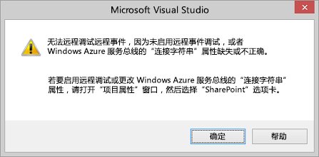
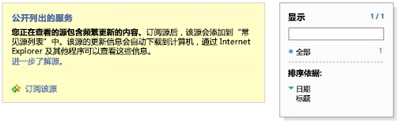

# 在 SharePoint 外接程序中调试远程事件接收器并排除故障
设置开发环境，以使用 Visual Studio 调试 中的远程事件。
## 为远程 SharePoint 测试网站配置调试

> [!注释]
> 此部分中的程序只适用于您的测试 SharePoint 网站位于不同于 Visual Studio 的另一台计算机上（或是在您将 SharePoint Online 开发人员网站作为您的测试网站）的情况。如果 SharePoint 和 Visual Studio 位于同一台计算机上，则跳过此部分。 
  
    
    

如果 Visual Studio 中的 SharePoint 外接程序项目包括远程事件接收器 (RER) 或外接程序事件接收器，您必须在项目属性中执行其他一些快速配置，然后才能使用 (F5) 调试外接程序。反过来，此配置要求您执行某些 Azure 配置。您无需为每个具有 RER 或外接程序事件的项目重复 Azure 配置。（如果外接程序包括 AppInstalled 事件处理程序，外接程序甚至不会使用 F5 或 Ctrl-F5 运行 [不调试直接运行]，除非您在本部分中执行配置。）
  
    
    

### 配置 Azure

1. 如果您还没有 Azure，请获取 Microsoft Azure 订阅。 [MSDN 订阅](http://azure.microsoft.com/zh-cn/pricing/member-offers/msdn-benefits/)中包括 Azure 订阅权益。
    
  
2. 执行 [How To: Create or Modify a Service Bus Service Namespace](http://msdn.microsoft.com/library/fa561f70-007c-45aa-b34d-56317dbbfc87.aspx)中的说明。
    
  

### 在 Visual Studio 中配置 SharePoint 外接程序项目

1. 您应该具有 Visual Studio 2013 Office 开发人员工具 的最新版本，因此请 [在此处运行 WebPI 安装程序](http://aka.ms/OfficeDevToolsForVS2013)或  [Visual Studio 2015 的 Office 开发人员工具的安装程序](http://aka.ms/OfficeDevToolsForVS2015)。
    
  
2. 将 RER 或外接程序事件处理程序添加到 Visual Studio 中的 SharePoint 外接程序项目，在"解决方案资源管理器"中右键单击项目并选择"属性"。
    
  
3. 在属性窗格中，打开"SharePoint"选项卡并滚动到底部。 
    
  
4. 选中复选框"通过 Microsoft Azure 服务总线启用调试"。
    
  
5. 在提供的文本框中输入完整的连接字符串。使用以下步骤获取字符串。
    
1. 登录到 Azure 门户并打开"服务总线"选项卡。
    
  
2. 打开您创建用于 RER 调试的命名空间，并导航到连接字符串。Azure 门户 UI 经常变更。如果您找不到连接字符串，请参阅  [Azure 门户帮助](https://msdn.microsoft.com/zh-cn/library/azure/dn578292.aspx)。
    
  
3. 复制"SAS"连接字符串。这是您在 Visual Studio 项目属性中输入的字符串。
    
  
今后当您在 Visual Studio 中创建 SharePoint 外接程序项目时，此信息将会预填充，因此您不必每次都打开 Azure 门户。
## 对配置进行测试

使用此部分中的过程来验证您是否可以调试 RER。
  
    
    

### 创建远程事件接收器项目

1. 在 Visual Studio 中，创建提供程序承载的 SharePoint 外接程序。
    
    请参阅  [开始创建提供程序承载的 SharePoint 加载项](get-started-creating-provider-hosted-sharepoint-add-ins.md)。
    
  
2. 在"解决方案资源管理器"中，选择外接程序项目的节点。
    
  
3. 在菜单栏中，选择"项目"、"添加新项"。
    
  
4. 在"模板"窗格中，选择"列表"模板，然后选择"添加"按钮。
    
  
5. 选择"完成"按钮，将默认自定义列表添加到外接程序项目。
    
  
6. 通过在"模板"窗格中选择"远程事件接收器" 模板，将另一项添加到外接程序项目中。
    
  
7. 在"名称"框中，保留默认名称 (RemoteEventReceiver1)，然后选择"添加"按钮。
    
  
8. 在"要哪种类型的事件接收器？"列表中，选择"列表项事件"。 
    
    将事件源保留为"List1"，即在之前步骤中添加的列表。
    
  
9. 在"处理下列事件"列表中，选择"正在添加的项目"，然后选择"完成"按钮。
    
    一个 Web 服务将添加到 Web 应用程序以处理您指定的远程事件。一个远程事件接收器将添加到 SharePoint 外接程序。接收器会引用该 Web 服务和事件接收器的 Elements.xml 文件中的列表项事件。
    
  
10. 在外接程序项目中，打开 AppManifest.xml。
    
  
11. 将起始页更改为列表页： _AddInProjectName_/Lists/List1。
    
    用外接程序项目的名称替换  _AddInProjectName_，例如 SharePointAddIn4/Lists/List1。对于此示例，我们将起始页更改为列表页。但是，在通常的外接程序中，您可能指向 Web 项目页中您自己的 UI。
    
  

### 运行并测试事件处理程序调试

1. 完成本文前面所述的过程 **在 Visual Studio 中配置 SharePoint 外接程序项目** （如果尚未执行）。
    
  
2. 在 Web 项目中，打开远程事件接收器服务 (RemoteEventReceiver1.svc)，然后将断点添加到  `ProcessEvent()` 方法内的任意代码行。
    
  
3. 选择"F5"键以运行项目。
    
  
4. 选择"+ 新建项目"按钮为列表添加项目。
    
  
5. 为项目提供一个标题，然后选择"保存"按钮。
    
    添加到远程事件接收器的断点已命中，同时核实您正在调试远程事件接收器。
    
  
6. 选择"F5"键继续运行项目，然后在完成时停止调试。
    
  

## 从 Visual Studio 打开/关闭需要配置事件调试的通知

如果您的项目中具有远程事件且尚未配置远程事件调试，Visual Studio 将提示您配置远程事件调试（参见图 1）。您可以通过取消选中"SharePoint"选项卡上的"在远程事件调试未配置时通知我"复选框来更改此行为。 
  
    
    

**图 1. 远程事件调试通知**

  
    
    

  
    
    

  
    
    

  
    
    

  
    
    

## 验证您的服务是否托管在服务总线上

按 F5 并信任该外接程序后，请前往浏览器中的 Service Bus 命名空间；例如 http://mynamespace.servicebus.windows.net，此时您应看到已列为数字的终结点。图 2 显示了 *未*  列出命名空间时该页面的外观；也就是说，按 F5 键之前的情况。
  
    
    

**图 2. 浏览到 Service Bus 命名空间**

  
    
    

  
    
    

  
    
    

  
    
    

  
    
    

## RER 未达到断点

根据事件，远程事件可能为同步或异步。如果为异步事件，可能需要几秒钟或更长时间才能达到断点。
  
    
    

## 错误："没有终结点在侦听"

当您的处理程序在实际运行时，您收到以下错误：
  
    
    
"远程事件接收器标注失败。详细信息: https:// _{domain}_: _nnnnn_/ _{path}_/AppEventReceiver.svc 上没有可接受消息的终结点在侦听。这通常是由于地址不正确或 SOAP 操作所导致。"其中  _nnnnn_ 表示端口。
  
    
    
SharePoint 要求在实际使用中，处理程序的 URL 中没有显式端口。这意味着您必须对 HTTPS 使用端口 443（推荐配置），或者对 HTTP 使用端口 80。 
  
    
    

## 错误："无法为 SSL/TLS 安全通道和颁发机构建立信任关系"

当您的处理程序在实际运行时，您收到以下错误：
  
    
    
"远程事件接收器标注失败。详细信息: 无法为 SSL/TLS 安全通道和颁发机构建立信任关系"
  
    
    
当外接程序位于 Microsoft SharePoint Online 中，但远程事件接收器服务位于内部部署并且按我们的建议使用 HTTPS 时，托管接收器的服务器在实际使用时无法使用自签名证书。服务器必须具有证书颁发结构签发的公认证书。如果外接程序位于本地 SharePoint 场中，则可接受自签名证书。
  
    
    

## 其他资源

-  [处理 SharePoint 外接程序中的事件](handle-events-in-sharepoint-add-ins.md)
    
  
-  [使用 Visual Studio 2012 调试 SharePoint 2013 远程事件](http://blogs.msdn.com/b/officeapps/archive/2013/03/21/update-to-debugging-sharepoint-2013-remote-events-using-visual-studio-2012.aspx)
    
  

