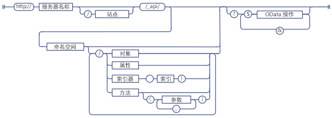
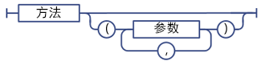
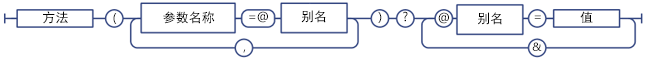
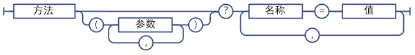
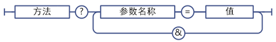

# 确定 SharePoint REST 服务端点 URI
了解根据对应客户端对象模型 API 的签名确定 REST 端点 URI 的通用指南。
 **准备工作**
  
    
    


-  [了解 SharePoint 2013 REST 服务](get-to-know-the-sharepoint-2013-rest-service.md)
    
  
-  [导航 REST 服务中展示的 SharePoint 数据结构](navigate-the-sharepoint-data-structure-represented-in-the-rest-service.md)
    
  

 **后续步骤**
  
    
    


-  [在 SharePoint REST 请求中使用 OData 查询操作](use-odata-query-operations-in-sharepoint-rest-requests.md)
    
  

## SharePoint REST 端点 URI 结构

在可以使用 REST 服务访问 SharePoint 资源之前，首先必须知道指向该资源的 URI 端点。只要可能，这些 REST 端点的 URI 就会准确地模仿 SharePoint 客户端对象模型中资源的 API 签名。例如：
  
    
    
 *客户端对象模型方法：* 
  
    
    
List.GetByTitle(listname).GetItems()
  
    
    
 *REST 端点：* 
  
    
    
 `http://server/site/_api/lists/getbytitle('listname')/items`
  
    
    
但是，在某些情况下，为了遵守 REST 或 OData 约定，端点 URI 会不同于相应的客户端对象模型签名。
  
    
    
下图显示 SharePoint REST URI 的通用语法结构。
  
    
    

**SharePoint REST URI 语法结构**

  
    
    

  
    
    

  
    
    
SharePoint 资源的部分端点偏离了这种语法结构：
  
    
    

- 需要复杂类型作为参数的方法。
    
    如果对应的客户端对象模型方法要求复杂类型作为参数传递，则 REST 端点可能偏离此语法构造说明 REST 限制。
    
  
- 静态方法和属性。
    
    REST 端点偏离代表静态方法和属性的 URI 的语法结构。
    
  

## 确定 SharePoint 2013 REST 服务端点

若要为 SharePoint 资源构造 REST 端点，请按照以下步骤执行操作：
  
    
    

1. 从 REST 服务引用开始：
    
     `http://server/site/_api`
    
  
2. 指定合适的入口点。例如：
    
     `http://server/site/_api/web`
    
  
3. 从入口点导航到您要访问的特定资源。这包括为与客户端对象模型中的方法对应的端点指定参数。例如：
    
     `http://server/site/_api/web/lists/getbytitle('listname')`
    
  

### 引用端点 URI 中的 SharePoint 2013 REST 服务

使用  `_api` 来表示端点 URI 中的 SharePoint 2013 REST 服务。REST 服务属于 client.svc Web 服务的一部分。但是，要尽早构造 REST URI 以及缩短基础 REST URI 路径，REST 服务使用 `_api` 将显式引用 client.svc Web 服务的需求抽象出来。REST 服务将承认并接受引用 client.svc Web 服务的 URI。例如，您可以使用 `http://server/site/_vti_bin/client.svc/web/lists` 来代替 `http://server/site/_api/web/lists`。但是，使用  `_api` 是首选惯例。URL 限制为 256 个字符，因此，使用 `_api` 可以缩短基础 URI，以留下更多的字符用于构造剩余 URL。
  
    
    

### 指定 SharePoint 2013 REST 服务的入口点

REST 服务的主要入口点表示网站集合以及指定上下文的网站。这样，这些入口点与客户端对象模型中的  [ClientContext.Site](https://msdn.microsoft.com/library/Microsoft.SharePoint.Client.ClientContext.Site.aspx) 属性和 [ClientContext.Web](https://msdn.microsoft.com/library/Microsoft.SharePoint.Client.ClientContext.Web.aspx) 属性对应。
  
    
    
要访问特定的网站集合，请使用以下构造：
  
    
    
 `http://server/site/_api/site`
  
    
    
要访问特定的网站，请使用以下构造：
  
    
    
 `http://server/site/_api/web`
  
    
    
其中  *server*  表示服务器的名称， *site*  表示特定网站的名称或路径。
  
    
    
除  `/site` 和 `/web` 外，REST 服务包括几个其他访问点，通过这些访问点，开发人员可导航至特定功能。下表列出了部分访问点。
  
    
    


|**功能区域**|**访问点**|
|:-----|:-----|
|网站  <br/> |http:// _server/site_/_api/site  <br/> |
|Web  <br/> |http:// _server/site_/_api/web  <br/> |
|用户配置文件  <br/> |http:// _server/site_/_api/SP.UserProfiles.PeopleManager  <br/> |
|搜索  <br/> |http:// _server/site_/_api/search  <br/> |
   

### 导航到您要访问的特定资源

从这里，通过遍历对象模型并使用用斜杠分隔的客户端对象模型中 API 的名称构造多个特定 REST 端点。下表显示客户端对象模型调用及等效 REST 端点示例。
  
    
    


|**客户端对象模型 API**|**REST 端点**|
|:-----|:-----|
|ClientContext.Web.Lists  <br/> |http:// _server_/ _site_/_api/web/lists  <br/> |
|ClientContext.Web.Lists[guid]  <br/> |http:// _server_/ _site_/_api/web/lists(' _guid_')  <br/> |
|ClientContext.Web.Lists.GetByTitle("Title")  <br/> |http:// _server_/ _site_/_api/web/lists/getbytitle(' _Title_')  <br/> |
   
终结点 URI 不区分大小写。例如，在上表中，使用  `/getbytitle` 指定 **GetByTitle()** 方法的 REST 等效项。
  
    
    

## 指定 REST 端点 URI 中的参数

SharePoint 2013 扩展了 OData 规范，允许您使用括号来指定方法参数和索引值。这可防止包含多个名称相同参数的 URI 中的潜在混淆问题。例如，下面两个 URI 包含名称相同的参数：
  
    
    
 `http://server/site/_api/web/lists/getByTitle('Announcements')/fields/getByTitle('Description')`
  
    
    
 `http://server/site/_api/web/lists('<guid>')/fields/getById('<guid>')`
  
    
    
要指定多个参数，请将参数作为名称/值对包含在内，并用逗号将参数分隔。例如：
  
    
    
 `http://server/site/_api/web/getAvailableWebTemplates(lcid=1033, includeCrossLanguage=true)`
  
    
    
下图显示了 SharePoint REST 参数语法。
  
    
    

**SharePoint REST 参数语法**

  
    
    

  
    
    

  
    
    

### REST 服务复杂类型作为参数

客户端对象模型中的某些方法要求大的有效载荷作为参数。对于要与其对应客户端对象模型 API 保持功能平衡的 REST 端点，这些端点必须接受复杂类型作为参数。在这种情况下，REST 服务扩展了现有 OData 协议，允许这些 REST 端点接受单个复杂类型作为参数。这仅适用于 **POST** 操作，并且您必须根据 OData 标准以 [Atom](http://www.odata.org/developers/protocols/atom-format#RepresentingComplexTypesProperties) 格式或 [JSON](http://www.odata.org/developers/protocols/json-format#RepresentingComplexTypeProperties) 格式传递复杂类型。
  
    
    
例如， [ListCollection.Add](https://msdn.microsoft.com/library/Microsoft.SharePoint.Client.ListCollection.Add.aspx) 方法以 [Microsoft.SharePoint.Client.ListCreationInformation](https://msdn.microsoft.com/library/Microsoft.SharePoint.Client.ListCreationInformation.aspx) 对象作为参数。要将列表添加到指定网站，请按如下方式构造相应的 REST 端点：
  
    
    
 `http://server/site/_api/web/lists/add`
  
    
    
然后，在请求正文中传递复杂类型，此处使用 JSON 进行格式设置。
  
    
    


```

{ "d" : {
   "results": {
     "__metadata": {
       "type": "SP.ListCreationInformation"
     }, 
     "CustomSchemaXml": "…large payload…/", 
     "Description": "desc", 
     "DocumentTemplateType": "1", 
     "TemplateType": "101", 
     "Title": "Announcements"
   }
} 
}

```


### 在 REST 服务调用中使用参数别名

您可以在 OData 中使用"参数别名"语义将参数传递到 SharePoint REST 端点。在参数别名中，用参数调用中的别名标识参数值，而实际值则在 URI 的查询字符串中指定。这允许您通过使用查询字符串支持多种类型的字符和一致的格式。
  
    
    
例如，以下两个 REST URI 为等效项：
  
    
    
 *直接指定参数值：* 
  
    
    
 `http://server/site/_api/web/applyWebTemplate("STS#0")`
  
    
    
 *使用参数别名，并在 URI 的查询字符串中指定实际参数值：* 
  
    
    
 `http://server/site/_api/web/applyWebTemplate(title=@template)?@template="STS#0"`
  
    
    
但是，SharePoint REST 服务不支持通过参数别名传递复杂类型。例如，以下 URI（参数别名中包含复杂类型）不受支持：
  
    
    
 `http://server/site/_api/userProfiles/People(7)/GetWorkplace(@address)?@address={"__metadata":{"type: "ODataDemo.Address"},"Street":"NE 228th", "City":"Sammamish","State":"WA","ZipCode":"98074","Country": "USA"}`
  
    
    

**SharePoint REST 服务参数别名语法**

  
    
    

  
    
    

  
    
    

  
    
    

  
    
    

### 指定字典作为参数值

对于与以  `Dictionary<String, String>` 字典作为参数的方法相对应的 REST 端点，在查询字符串中将字典作为一组以逗号分隔的名称/值对传递。
  
    
    

**Dictionary 参数 REST 服务语法**

  
    
    

  
    
    

  
    
    
 `Dictionary<String, object>` 表示为多值对象，命名为 KeyedPropertyValue，并具有以下字符串属性：
  
    
    

- **Key** 多值对象的键
    
  
- **Value** 对象的值
    
  
- **ValueType** 对象的值类型。对于映射到现有实体数据模型 (EDM) 类型的简单值类型，REST 服务返回相应的 EDM 类型字符串；例如，"Edm.String"。如果不是，则 REST 服务返回由 **Type.ToString** 功能返回的值类型。
    
  

### 在查询字符串中指定参数值

如果您的 REST URI 以方法调用结束，则可以使用查询字符串语法来指定方法的参数值。例如：
  
    
    
 `http://<server>/<site>/_api/web/applyWebTemplate?template="STS#0"`
  
    
    
下图显示查询字符串中参数的 REST 服务语法。
  
    
    

**查询字符串中参数的 REST 服务语法**

  
    
    

  
    
    

  
    
    

  
    
    

  
    
    

## 指定静态方法和属性作为 REST 服务 URI

要构造与静态方法或属性对应的 URI，请使用 ECMAScript 对象模型中的对应 API 名称，该名称以命名空间声明开始并使用点记法 。例如，ECMAScript 客户端对象模型中的  [SP.Utilities.Utility.getImageUrl(imageName)](http://msdn.microsoft.com/zh-cn/library/ee658947.aspx) 将具有以下 REST 等效物：
  
    
    
 `http://server/site/_api/SP.Utilities.Utility.getImageUrl('imageName')`
  
    
    
但是，静态属性只能直接访问，不允许作为较大 URI 组成的一部分。例如，允许直接访问 REST 中的 **SP.Utility.AssetsLibrary** 方法，如下所示：
  
    
    
 `http://server/site/_api/SP.Utility.assetsLibrary/id`
  
    
    
但是，不允许将该资源位置用作更复杂 URI 的参数，如下面的示例所示：
  
    
    
 `http://server/site/_api/getList(~SP.Utility/assetsLibrary/id)`
  
    
    
下图显示 SharePoint REST 服务静态成员语法。
  
    
    

**SharePoint REST 服务静态成员语法**

  
    
    

  
    
    

  
    
    

  
    
    

  
    
    

## 后续步骤

如果要对从端点请求的数据进行选择、筛选和排序，SharePoint REST 服务支持许多不同的 OData 查询字符串运算符。
  
    
    

## 其他资源
<a name="bk_addresources"> </a>


-  [了解 SharePoint 2013 REST 服务](get-to-know-the-sharepoint-2013-rest-service.md)
    
  
-  [使用 SharePoint 2013 REST 终结点完成基本操作](complete-basic-operations-using-sharepoint-2013-rest-endpoints.md)
    
  
-  [使用 REST 处理列表和列表项](working-with-lists-and-list-items-with-rest.md)
    
  
-  [使用 REST 处理文件夹和文件](working-with-folders-and-files-with-rest.md)
    
  
-  [导航 REST 服务中展示的 SharePoint 数据结构](navigate-the-sharepoint-data-structure-represented-in-the-rest-service.md)
    
  
-  [在 SharePoint REST 请求中使用 OData 查询操作](use-odata-query-operations-in-sharepoint-rest-requests.md)
    
  
-  [SharePoint 2013 REST API、终结点和示例](02128c70-9d27-4388-9374-a11bce68fdb8.md)
    
  
-  [使用 REST 服务同步 SharePoint 项](synchronize-sharepoint-items-using-the-rest-service.md)
    
  
-  [使用 ETag 值通过 REST 服务获取文档列表项版本控制](5f7e0579-46b7-44ab-b3b4-cdbc622dcd98.md)
    
  

  
    
    

