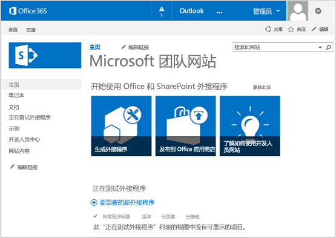

# 开始创建 SharePoint 承载的 SharePoint 外接程序
设置开发环境，然后创建您的第一个 SharePoint 承载的 SharePoint 外接程序。
SharePoint 承载的加载项是 SharePoint 外接程序的两个主要类型之一。有关 SharePoint 外接程序和这两种不同类型的概述，请参阅  [SharePoint 外接程序](sharepoint-add-ins.md)。以下是 SharePoint 承载的加载项的摘要：


- 它们包含 SharePoint 列表、Web 部件、工作流、自定义页面和其他组件，所有这些元素都安装在加载项所安装在的 SharePoint 网站的一个称为加载项 Web 的子网站上。


- 所具有的唯一代码是位于自定义 SharePoint 页面上的 JavaScript。


 [


](get-started-creating-sharepoint-hosted-sharepoint-add-ins.md#Setup) [


](get-started-creating-sharepoint-hosted-sharepoint-add-ins.md#Create) [


](get-started-creating-sharepoint-hosted-sharepoint-add-ins.md#Code)


## 设置开发环境
<a name="Setup"> </a>

有多种途径可为 SharePoint 外接程序设置开发环境。此部分说明了最简单的方法。有关其他方法，请参阅 [其他资源](#bk_addresources)。


### 获取工具


- 如果您还没有安装 **Visual Studio** 2013 或更高版本，请按照 [Install Visual Studio](http://msdn.microsoft.com/library/da049020-cfda-40d7-8ff4-7492772b620f.aspx) 中的说明进行安装。建议使用 [从 Microsoft 下载中心获取的最新版本](https://www.visualstudio.com/downloads/download-visual-studio-vs)。


- Visual Studio 包括 **Visual Studio Microsoft Office 开发人员工具** ，但有时该工具的最新版本会在 Visual Studio 的更新版本之间发布。若要确保您拥有该工具的最新版本，请使用 [Visual Studio 2013 的 Office 开发人员工具的安装程序](http://aka.ms/OfficeDevToolsForVS2013)或  [Visual Studio 2015 的 Office 开发人员工具的安装程序](http://aka.ms/OfficeDevToolsForVS2015)。


### 注册 Office 365 开发人员网站
<a name="o365_signup"> </a>


> **注释**
>  您可能已经拥有 Office 365 开发人员网站 的访问权限。> **已经是 MSDN 订阅者？** Visual Studio Ultimate 和 Visual Studio Premium with MSDN 订阅者可以享受 Office 365 开发人员订阅权益。 [立即索取您的权益](https://msdn.microsoft.com/subscriptions/manage/default.aspx)。 > **您是否具有下列 Office 365 订阅计划之一？**> **如果有的话，Office 365 订阅的管理员可以创建一个 开发人员网站** ，方法是使用 [Office 365 管理中心](https://portal.microsoftonline.com/admin/default.aspx)。有关详细信息，请参阅 [在现有 Office 365 订阅中创建开发人员网站](create-a-developer-site-on-an-existing-office-365-subscription.md)。 


有三种获取 Office 365 计划的方法。


- 可通过 Office 365 开发人员计划免费注册一年的 Office 365 开发人员帐户。 [获取更多信息](http://dev.office.com/devprogram)，或直接转到 [注册表](https://profile.microsoft.com/RegSysProfileCenter/wizardnp.aspx?wizid=14b845d0-938c-45af-b061-f798fbb4d170)。您通过用于注册开发人员帐户的链接注册了开发人员计划后，将收到一封电子邮件。请使用以下说明。


- 开始 [免费 30 天试用](https://portal.microsoftonline.com/Signup/MainSignUp.aspx?OfferId=6881A1CB-F4EB-4db3-9F18-388898DAF510&amp;DL=DEVELOPERPACK)，获取一个用户许可证。


- 购买  [Office 365 开发人员订阅](https://portal.microsoftonline.com/Signup/MainSignUp.aspx?OfferId=C69E7747-2566-4897-8CBA-B998ED3BAB88&amp;DL=DEVELOPERPACK)。


> **提示**
> 为了方便您使用以下说明，请在另一个窗口或选项卡中打开这些链接。 


**图 1. Office 365 开发人员网站域名**


1. 注册表单的第一页（未显示）很容易理解：提供请求的信息，然后选择"下一步"。


2. 在第二页上（如图 1 所示）指定订阅的管理员用户 ID。


3. 创建".onmicrosoft.com"的子域，例如 contoso.onmicrosoft.com。

    注册后，您必须使用生成的凭据（格式： _UserID_@ _您的域_.onmicrosoft.com）登录到您的 Office 365 门户网站以便管理您的帐户。您的 SharePoint Online 开发人员网站将在您的新域中进行设置： **http:// _您的域_.sharepoint.com** 。


4. 选择"下一步"并填写表单的最后一页。如果您选择提供电话号码来获取确认代码，您可以提供一个移动或有线电话号码，但"不能是"VoIP（Internet 语音协议）号码。


> **注释**
> 当您尝试登录开发人员帐户时，如果您已经登录到其他 Microsoft 帐户，则有可能收到这样的消息："对不起，您输入的用户 ID 无法使用。它似乎是无效的。确保输入的是您的组织分配给您的用户 ID。通常，您的用户 ID 类似于  *someone@example.com*  或 *someone@example.onmicrosoft.com*  。"> 如果您看到该消息，请注销正在使用的 Microsoft 帐户并重试。如果您仍然收到这种消息，请清除浏览器缓存或切换到"InPrivate 浏览"，然后填写表单。 


在完成注册过程后，您的浏览器会打开 Office 365 安装页。选择管理员图标以打开管理中心页。


**图 2. Office 365 管理中心页**


1. 等待开发人员网站完成设置。设置完成后，在浏览器中刷新 管理中心页。


2. 然后，选择页面左上角的"构建加载项"链接，以打开您的开发人员网站。您会看到如图 3 所示的网站。页面上"测试中的加载项"列表证实该网站是使用 SharePoint 开发人员网站模板构建的。如果您看到的是一个一般的工作组网站，请稍等几分钟，然后重新启动网站。


3. 记下网站的 URL，当在 Visual Studio 中创建 SharePoint 外接程序项目时将会用到。


**图 3. 您的开发人员网站主页，其中包含"测试中的加载项"列表**





## 创建加载项项目
<a name="Create"> </a>


1. 使用"以管理员身份运行"选项启动 Visual Studio。


2. 依次选择"文件">"新建">"新建项目"。


3. 在"新建项目"对话框中，依次展开"Visual C#"节点和"Office/SharePoint"节点，然后选择"加载项">"SharePoint 加载项"。


4. 将项目命名为 EmployeeOrientation，然后选择"确定"。


5. 在第一个"指定 SharePoint 加载项设置"对话框中，提供要用于调试您的加载项的 SharePoint 网站的完整 URL。这是 开发人员网站 的 URL。（在 URL 中使用 HTTPS 而不是 HTTP。）在"您希望如何承载 SharePoint 加载项"下，选择"Sharepoint 承载"。选择"完成"。


6. 您可能会收到登录 开发人员网站的提示，如果收到，请使用您的订阅管理员的凭据登录。


7. 创建项目后，从项目的根目录打开文件 **/Pages/Default.aspx** 。其中，这一生成的文件加载 SharePoint 上托管的一个或两个脚本：sp.runtime.js 和 sp.js。加载这些文件的标记位于文件顶部附近的 **Content** 控件（ID 为 **PlaceHolderAdditionalPageHead**）中。此标记因要使用的 **Visual Studio Microsoft Office 开发人员工具** 版本而异。这一系列教程要求使用普通的 HTML **<script>** 标记（而非 **<SharePoint:ScriptLink>** 标记）同时加载这两个文件。请确保 **PlaceHolderAdditionalPageHead** 控件中 `<meta name="WebPartPageExpansion" content="full" />` 行的 *正上方*  有下面这行代码：

  ```

<script type="text/javascript" src="/_layouts/15/sp.runtime.js"></script>
<script type="text/javascript" src="/_layouts/15/sp.js"></script> 

  ```


    然后，在文件中搜索其他任何也会加载这一个或两个文件的标记，并删除多余的标记。保存并关闭文件。


## 编码您的加载项
<a name="Code"> </a>

对于您的第一个 SharePoint 托管的 SharePoint 外接程序，我们将包括经典的 SharePoint 扩展：自定义列表和列表实例。


1. 在"解决方案资源管理器"中，打开"AppManifest.xml"文件。


2. 当清单设计器打开后，在 **Title** 字段的单词之间添加空格，所以读作Employee Orientation。（请 *勿*  更改 **Name** 字段。）


3. 保存并关闭该文件。


4. 用鼠标右键单击"解决方案资源管理器"中的项目并选择"添加">"新文件夹"。将文件夹命名为"列表"。


5. 用鼠标右键单击新文件夹，然后选择"添加">"新项目"。"添加新项目"对话框将打开到"Office/SharePoint"节点。


6. 选择"列表"。将其命名为 NewEmployeeOrientation，然后选择"添加"。


7. 在"SharePoint 自定义向导"的"选择列表设置"页面上，保留默认的"NewEmployeeOrientation"列表显示名称，选择"创建可自定义的列表模板及其列表实例"选项按钮，并在下拉列表中选择"默认值（自定义列表）"。然后选择"完成"。


8. 向导通过一个名为"NewEmployeeOrientationInstance"的子列表实例创建一个"NewEmployeeOrientation"列表模板。可能会打开一个列表设计器，用于后续步骤。


9. 如果未出现，则展开"解决方案资源管理器"中的"NewEmployeeOrientationInstance"节点，以便您可以明确将 *实例*  列表中的子项 elements.xml 文件从 *模板*  列表中的子项 elements.xml 文件中区分出来。

   **列出解决方案资源管理器中的节点**


10. 打开 "NewEmployeeOrientation"列表模板的 elements.xml 子项。


11. 向 **DisplayName** 属性（而非 **Name** 属性）添加空格，使其更为友好："新员工定位"。


12. 将 **Description** 属性设置为"新员工的定位信息"。


13. 保留所有其他属性为默认值，然后保存并关闭该文件。


14. 如果列表设计器未打开，请在"解决方案资源管理器"中选择"NewEmployeeOrientation"节点。


15. 打开设计器的"列表"选项卡。此选项卡用于设置"实例"列表（而非"模版"列表）的某些值，但仍然具有一些继承自模板的默认值。


16. 将此选项卡上的值更改为以下内容：

  - **标题**：在西雅图的新员工


  - **列表 URL**：Lists/NewEmployeesInSeattle


  - **说明**：在西雅图的新员工。


    将复选框保留为其默认状态，保存文件并关闭设计器。


17. 该列表实例在"解决方案资源管理器"中可能有旧名称。如果这样，请打开"NewEmployeeOrientationInstance"的快捷菜单，选择"重命名"并将名称更改为 NewEmployeesInSeattle。


18. 打开 schema.xml 文件。


19. 在 **View** 元素（其 **BaseViewID** 值为"0"）中，将现有的 **ViewFields** 元素替换为以下标记。（对名为 `Title` 的 **FieldRef** 准确使用此 GUID。）

     *换行符可能会出现在此自动生成的 schema.xml 文件中的奇数位置。请确保您已找到用于 **ViewFields** 元素的匹配的开始和结束标记。添加换行符，以提高可读性。* 


  ```

<ViewFields>
  <FieldRef Name="Title" ID="{fa564e0f-0c70-4ab9-b863-0177e6ddd247}" DisplayName="Employee" />
 </ViewFields>
  ```

20. 仍在 schema.xml 文件中，在 **View** 元素（其 **BaseViewID** 值为"1"）中，将现有的 **ViewFields** 元素替换为以下标记。（对名为 `LinkTitle` 的 **FieldRef** 准确使用此 GUID。）

  ```

<ViewFields>
  <FieldRef Name="LinkTitle" ID="{82642ec8-ef9b-478f-acf9-31f7d45fbc31}" DisplayName="Employee" />
</ViewFields>
  ```

21. 保存并关闭 schema.xml 文件。


22. 打开作为 *实例*  "NewEmployeesInSeattle"列表子项的 elements.xml 文件（而非作为 *模板*  "NewEmployeeOrientation"列表子项的 elements.xml 文件）。


23. 在该文件中，使用一些初始数据填充列表。您可以通过添加以下 **Data** 元素标记作为 **ListInstance** 元素的子项来执行此操作。

  ```

<Data>
  <Rows>
    <Row>
      <Field Name="Title">Tom Higginbotham</Field>
    </Row>
    <Row>
      <Field Name="Title">Satomi Hayakawa</Field>
    </Row>
    <Row>
      <Field Name="Title">Cassi Hicks</Field>
    </Row>
    <Row>
      <Field Name="Title">Lertchai Treetawatchaiwong</Field>
    </Row>
  </Rows>
</Data>
  ```

24. 保存并关闭该文件。


25. 在"解决方案资源管理器"中，双击"Feature1"打开功能设计器。在该设计器中，将"标题"设置为新员工定位组件并将"说明"设置为用于公司员工定位的列表和其他组件。保存文件，并关闭设计器。


26. 如果"解决方案资源管理器"中的"Feature1"尚未自动重命名，请打开其快捷菜单，选择"重命名"并将其重命名为 NewEmployeeOrientationComponents。


27. 打开 Default.aspx 文件。


28. 通过 ID"PlaceHolderPageTitleInTitleArea"查找 ASP.NET **Content** 元素。将默认字符串"页标题"替换为"新员工位置"。


29. 通过 ID"PlaceHolderMain"查找 ASP.NET **Content** 元素。将其内容 *替换*  为以下标记。 ` _spPageContextInfo` 是 SharePoint 自动包含在页面中的 JavaScript 对象。它是返回加载项 Web 的 URL 的 `webAbsoluteUrl` 属性。

  ```XML

<p><asp:HyperLink runat="server"
    NavigateUrl="JavaScript:window.location = _spPageContextInfo.webAbsoluteUrl + '/Lists/NewEmployeesInSeattle/AllItems.aspx';" 
    Text="New Employees in Seattle" /></p>

  ```


## 运行加载项并测试列表
<a name="Code"> </a>


1. 使用 F5 键部署并运行您的加载项。Visual Studio 将加载项临时安装在您的 SharePoint 测试网站上，并立即运行该加载项。（若要找出最终用户如何运行已安装的 SharePoint 外接程序，请参阅 [后续步骤](#Nextsteps)。）


2. 当加载项的默认页面打开时，选择"在西雅图的新员工"链接以打开自定义列表实例。

   **默认页面和列表视图页面**


3. 添加和删除列表中的项目。


4. 若要结束调试会话，请关闭浏览器窗口，或停止 Visual Studio 中的调试。每次按 F5 时，Visual Studio 将收回以前版本的加载项并安装最新的应用程序版本。


5. 您将在其他文章中使用此外接程序和 Visual Studio 解决方案，因此最好是当您使用一段时间后，最后一次撤回外接程序。在"解决方案资源管理器"中右键单击此项目，然后选择"撤回"。


## 
<a name="Nextsteps"> </a>

到目前为止，列表中并没有太多定位信息。我们将在本系列的后续文章中添加一些相关信息。但首先，需要暂时停止编码，开始了解 [部署和安装 SharePoint 托管的 SharePoint 外接程序](deploy-and-install-a-sharepoint-hosted-sharepoint-add-in.md)中如何部署 SharePoint 外接程序。


