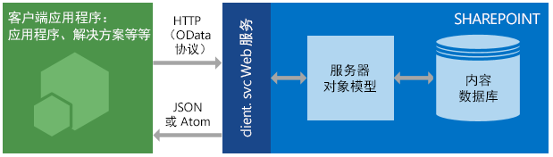

# 了解 SharePoint 2013 REST 服务
了解使用 SharePoint 2013 REST 服务根据 REST 和 OData Web 协议标准访问和更新 SharePoint 数据的基础知识。
SharePoint 2013 引入了代表性状态传输 (REST) 服务，此服务可以媲美于现有 SharePoint  [客户端对象模型](http://msdn.microsoft.com/library/88e5e1b9-eab2-4f3b-a3f2-75c96b86f1f4%28Office.15%29.aspx)。此时，开发人员可以使用任何支持 REST Web 请求的技术以远程方式与 SharePoint 数据进行交互。这意味着，开发人员可以使用 REST Web 技术和标准开放数据协议 (OData) 语法从其 SharePoint 外接程序、解决方案和客户端应用程序执行 **Create**、 **Read**、 **Update**和 **Delete** (CRUD) 操作。


## 先决条件

本主题假定您已经基本熟悉 REST 以及如何构建 REST 请求。


## SharePoint 2013 REST 服务的工作方式
<a name="bk_how"> </a>

SharePoint 2013 新增了使用 REST 与 SharePoint 网站远程交互的功能。现在，您可以使用任何支持标准 REST 功能的技术直接与 SharePoint 对象进行交互。


要使用 REST 访问 SharePoint 资源，可以根据与所需客户端对象模型 API 对应的开放数据协议 (OData) 标准构建 RESTful HTTP 请求。例如：


 *客户端对象模型方法：* 


List.GetByTitle(listname)


 *REST 端点：* 


 `http://server/site/_api/lists/getbytitle('listname')`


SharePoint 中的 client.svc Web 服务可以处理 HTTP 请求并以 Atom 或 JSON（JavaScript Object Notation）格式作出适当的响应。然后，您的客户端应用程序必须解析该响应。下图显示了 SharePoint REST 体系结构的高级视图。


**SharePoint REST 服务体系结构**





由于客户端对象模型易于使用且功能强大，它们保留了使用 .NET Framework 托管代码、Silverlight 或 JavaScript 与 SharePoint 网站交流的主要开发选项。


### 将 HTTP 命令与 SharePoint 2013 REST 服务一起使用
<a name="bk_usingHTTP"> </a>

若要使用 SharePoint 2013 中内置的 REST 功能，您可以使用 OData 标准构造可实现 REST 的 HTTP 请求，它对应于要使用的客户端对象模型 API。client.svc Web 服务将处理 HTTP 请求并为 Atom 或 JavaScript Object Notation (JSON) 格式的适当的响应提供服务。然后，客户端应用程序必须分析该响应。


SharePoint 2013 REST 服务中的端点对应于 SharePoint 客户端对象模型中的类型和成员。通过使用 HTTP 请求，您可以使用这些 REST 端点对 SharePoint 实体（如列表和网站）执行典型的 CRUD 操作。


通常：


|**如果您想对一个终结点进行此操作**|**使用此 HTTP 请求**|**记住**|
|:-----|:-----|:-----|
|阅读资源  <br/> |**GET** <br/> ||
|创建或更新资源  <br/> |**POST** <br/> |使用 **POST** 创建实体，如列表和网站。SharePoint 2013 REST 服务支持将包含对象定义的 **POST** 命令发送到表示集合的终结点。 <br/> 对于 **POST** 操作，任何不需要的属性将设置为其默认值。如果您尝试在 **POST** 操作过程中设置只读属性，则服务将返回异常。 <br/> |
|更新或插入资源  <br/> |**PUT** <br/> | 使用 **PUT** 和 **MERGE** 操作更新现有 SharePoint 对象。 <br/>  任何表示对象属性 **set** 操作的服务终结点均支持 **PUT** 请求和 **MERGE** 请求。 <br/>  对于 **MERGE** 请求，设置属性是可选的；任何未显式设置的属性将保留其当前属性。 <br/>  对于 **PUT** 请求，如果未指定对象更新中所需的所有属性，REST 服务会返回一个异常。此外，任何未显式设置的可选属性将设置为其默认属性。 <br/> |
|删除资源  <br/> |**DELETE** <br/> |对某个特定终结点 URL 使用 HTTP **DELETE** 命令可删除该终结点表示的 SharePoint 对象。 <br/> 对于可循环的对象（如列表、文件和列表项），这将导致 **Recycle** 操作。 <br/> |
 

### 构造 REST URL 以访问 SharePoint 资源
<a name="bk_constructURLs"> </a>

只要可能，这些 REST 端点的 URI 就会准确地模仿 SharePoint 客户端对象模型中资源的 API 签名。REST 服务的主要入口点表示网站集合以及指定上下文的网站。


要访问特定的网站集合，请使用以下构造：


 `http://server/site/_api/site`


要访问特定的网站，请使用以下构造：


 `http://server/site/_api/web`


在不同情况下， *server*  表示服务器的名称， *site*  表示特定网站的名称和路径。


从这个起点，您可以通过遍历对象模型并使用用斜杠分隔的客户端对象模型中 API 的名称构造多个特定 REST URI。


此语法不适用于 SocialFeedManager 或 SocialFollowingManager REST API。请参阅  [SharePoint 2013 的好友动态订阅源 REST API 引用](http://msdn.microsoft.com/library/f1cb914f-1e91-4e23-bf53-d2ab323eac13%28Office.15%29.aspx)和  [关注好友及 SharePoint 2013 的内容 REST API 引用](http://msdn.microsoft.com/library/c05755df-846d-4a39-941d-950d066cc6d4%28Office.15%29.aspx)获取详细信息。


请参阅 [确定 SharePoint REST 服务端点 URI](determine-sharepoint-rest-service-endpoint-uris.md)，获取根据对应客户端对象模型 API 的签名确定 REST 端点 URI 的更多指南。


## SharePoint REST 端点示例
<a name="bk_URLexamples"> </a>

下表包含典型 REST 终结点 URL 示例以帮助您开始处理 SharePoint 数据。在表中显示的 URL 片段前面预置  `http://server/site/_api/` 可构造完全限定的 REST URL。对于 **POST** 命令，必要时，表会包含您必须传入 HTTP 请求正文中的示例数据以创建指定的 SharePoint 项目。用斜体显示的项目表示必须替换为您的值的变量。


|**说明**|**URL 终结点**|**HTTP 方法**|**正文内容**|
|:-----|:-----|:-----|:-----|
|检索列表的标题  <br/> | `web/title` <br/> |GET  <br/> |不适用  <br/> |
|检索网站上的所有列表  <br/> | `lists` <br/> |GET  <br/> |不适用  <br/> |
|检索单个列表的元数据  <br/> | `lists/getbytitle('listname')` <br/> |GET  <br/> |不适用  <br/> |
|检索列表中的项目  <br/> | `lists/getbytitle('listname')/items` <br/> |GET  <br/> |不适用  <br/> |
|检索文档的特定属性。（在此示例中，为文档标题。）  <br/> | `lists/getbytitle('listname')?select=Title` <br/> |GET  <br/> |不适用  <br/> |
|创建列表  <br/> | `lists` <br/> |POST  <br/> |
```

{
  '_metadata':{'type':SP.List},
  'AllowContentTypes': true,
  'BaseTemplate': 104 ,
  'ContentTypesEnabled': true,
  'Description': 'My list description ',
  'Title': 'RestTest '
}
```

|
|向列表添加项  <br/> | `lists/getbytitle('listname')/items` <br/> |POST  <br/> |
```

{
  '_metadata':{'type':SP.listname ListItem},
  'Title': 'MyItem'
}

```

|
 

## 批处理作业支持
<a name="batch"> </a>

SharePoint Online（和本地 SharePoint 2016 或更高版本）REST 服务支持使用 OData  `$batch` 查询选项，将多个请求合并到对该服务的单个调用中。有关详细信息和代码示例的链接，请参阅 [使用 REST API 发出批处理请求](make-batch-requests-with-the-rest-apis.md)。


## 其他资源
<a name="bk_learnmore"> </a>

使用以下列出的资源了解有关使用 SharePoint REST 服务的详细信息。


|||
|:-----|:-----|
| [使用 SharePoint 2013 REST 终结点完成基本操作](complete-basic-operations-using-sharepoint-2013-rest-endpoints.md) <br/> |了解如何使用 SharePoint 2013 REST 接口执行基本的创建、读取、更新和删除 (CRUD) 操作。  <br/> |
| [使用 REST 处理列表和列表项](working-with-lists-and-list-items-with-rest.md) <br/> |了解如何使用 SharePoint 2013 REST 界面对列表和列表项执行基本的创建、读取、更新和删除 (CRUD) 操作。  <br/> |
| [使用 REST 处理文件夹和文件](working-with-folders-and-files-with-rest.md) <br/> |了解如何使用 SharePoint 2013 REST 界面对文件夹和文件执行基本的创建、读取、更新和删除 (CRUD) 操作。  <br/> |
| [导航 REST 服务中展示的 SharePoint 数据结构](navigate-the-sharepoint-data-structure-represented-in-the-rest-service.md) <br/> |了解对于给定 SharePoint 项目如何从 REST 端点开始，然后导航到并访问相关项目，例如该项目所在的父网站或库结构。  <br/> |
| [确定 SharePoint REST 服务端点 URI](determine-sharepoint-rest-service-endpoint-uris.md) <br/> |了解根据对应客户端对象模型 API 的签名确定 REST 端点 URI 的通用指南。  <br/> |
| [在 SharePoint REST 请求中使用 OData 查询操作](use-odata-query-operations-in-sharepoint-rest-requests.md) <br/> |了解如何使用各种 OData 查询字符串操作符对您从 SharePoint REST 服务器请求的数据执行选择、筛选和排序。  <br/> |
| [SharePoint 2013 REST API、终结点和示例](02128c70-9d27-4388-9374-a11bce68fdb8.md) <br/> |本页面包含 MSDN 上可供 SharePoint 2013 开发人员使用的所有 REST 资源的链接。  <br/> |
| [SharePoint Search REST API 概述](http://msdn.microsoft.com/library/8a4f7863-e4c1-4099-9189-a1894db36930%28Office.15%29.aspx) <br/> |使用 SharePoint Server 2013 中的搜索 REST 服务以及任何支持 REST Web 请求的技术向客户端和移动应用程序添加搜索功能。  <br/> |
| [SharePoint 2013 的好友动态订阅源 REST API 引用](http://msdn.microsoft.com/library/f1cb914f-1e91-4e23-bf53-d2ab323eac13%28Office.15%29.aspx) <br/> |了解订阅源相关任务的 SharePoint 2013 REST 终结点。  <br/> |
| [关注好友及 SharePoint 2013 的内容 REST API 引用](http://msdn.microsoft.com/library/c05755df-846d-4a39-941d-950d066cc6d4%28Office.15%29.aspx) <br/> |了解下列人员和内容的 SharePoint 2013 REST 终结点。  <br/> |
| [使用 REST API 发出批处理请求](make-batch-requests-with-the-rest-apis.md) <br/> |了解如何将多个请求组合到对 REST 服务的单个调用中。  <br/> |
| [使用 REST 服务同步 SharePoint 项](synchronize-sharepoint-items-using-the-rest-service.md) <br/> |了解如何使用 **GetListItemChangesSinceToken** 资源（SharePoint REST 服务的一部分）在 SharePoint 和您的外接程序或服务之间同步项目。 <br/> |
| [使用 ETag 值通过 REST 服务获取文档列表项版本控制](5f7e0579-46b7-44ab-b3b4-cdbc622dcd98.md) <br/> |了解如何将 HTML ETag 和 SharePoint REST 服务用于 SharePoint 列表和列表项的并发控制。  <br/> |
 

## OData 资源
<a name="SP15startREST_bk_addlresources"> </a>


-  [介绍 OData](http://msdn.microsoft.com/zh-cn/data/hh237663)


-  [按照示例打开数据协议](http://msdn.microsoft.com/zh-cn/library/ff478141.aspx)


-  [打开数据协议](http://www.odata.org/)


-  [OData 协议 URI 约定](http://www.odata.org/documentation/odata-version-2-0/uri-conventions/)


-  [寻找服务操作的地址](http://www.odata.org/documentation/odata-version-2-0/uri-conventions#AddressingServiceOperations)


-  [OData 协议操作](http://www.odata.org/documentation/odata-version-2-0/operations/)


-  [错误条件](http://www.odata.org/documentation/odata-version-2-0/operations#ErrorConditions)


