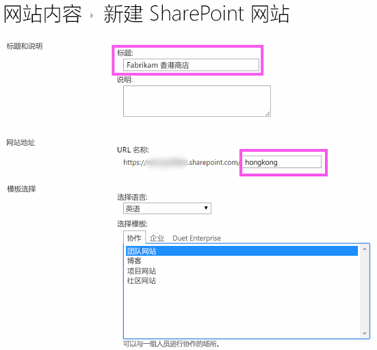
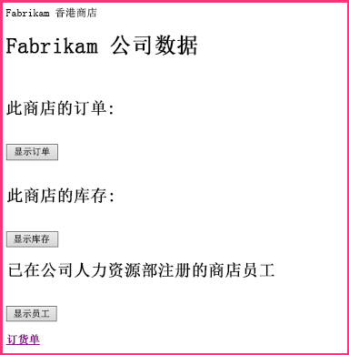
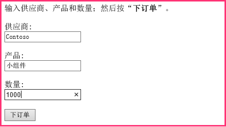
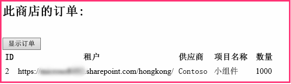
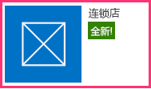
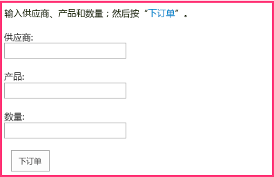
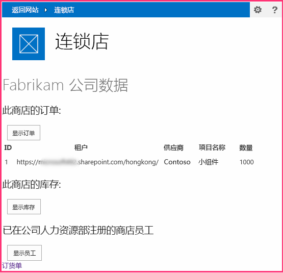
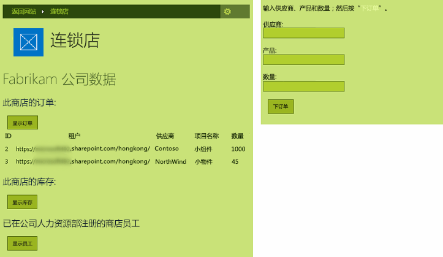

# 使提供程序托管的外接程序具有 SharePoint 的外观
了解如何使提供程序托管 SharePoint 外接程序具有 SharePoint 的外观。
这是关于开发 SharePoint 托管的 SharePoint 外接程序的基础知识系列文章中的第二篇文章。您应该首先熟悉  [SharePoint 外接程序](sharepoint-add-ins.md)以及本系列中之前的文章：


-  [开始创建提供程序承载的 SharePoint 加载项](get-started-creating-provider-hosted-sharepoint-add-ins.md)


在本系列的前一篇文章中，您了解了如何设置开发环境，以及如何使用 Visual Studio 创建第一个"Hello World"级别的外接程序，该外接程序可在外接程序的远程 Web 应用程序中公开 SharePoint 数据。在本文中，我们将从已创建的 SharePoint 外接程序 解决方案入手。它包括 ASP.NET Web 表单应用程序和 SQL Azure 数据库。我们为您创建这些是因为本系列文章仅专注于 SharePoint 外接程序。在本系列的每一篇文章中，您将向外接程序添加添加更多 SharePoint 功能和集成。


## 了解基本外接程序

在本系列中，我们不打算教您 ASP.NET 或 T-SQL 编程，但您需要稍微了解一下外接程序的远程组件，然后我们才能开始将其集成到 SharePoint。外接程序的方案设想有一系列零售店，每个零售店都在母公司的 SharePoint Online 订阅中具有一个工作组网站。当零售店在其工作组网站中安装外接程序时，外接程序将允许他们将 SharePoint 数据和体验与母公司数据库中的数据相集成。外接程序的每个实例在公司数据库中都有自己的租户，用户只能使用与其零售店相关的公司数据。


### 首先为链中的两个零售店创建工作组网站


1. 打开 SharePoint Online 的主页并单击快速启动栏上的"网站内容"链接。在"网站内容"页面上向下滚动，直至您看到"新建子网站"链接，单击该链接。


2. 在"新建 SharePoint 网站"页面上，使用以下屏幕截图中的值填写新工作组网站的表单。




3. 将所有其他设置保留为默认值并按"创建"。


### 浏览外接程序


1. 转到  [SharePoint_Provider-hosted_Add-Ins_Tutorials](https://github.com/OfficeDev/SharePoint_Provider-hosted_Add-ins_Tutorials) 并单击 **下载 ZIP** 按钮，将存储库下载到您的桌面。将此文件解压缩。


2. 以管理员身份启动 Visual Studio，然后打开 BeforeSharePointUI.sln。解决方案中有三个项目：

  - **ChainStore** - SharePoint 外接程序 项目。


  - **ChainStoreWeb** - 远程 Web 应用程序。


  - **ChainCorporateDB** - SQL Azure 数据库。


3. 选择"ChainStore"项目，在"属性"窗口中，将"网站 URL"属性设置为香港工作组网站的完整 URL：https://{YOUR_SHAREPOINT_DOMAIN}/hongkong/。务必在结尾包含"/"字符。按"保存"按钮。 *在此过程中的某个时候，将会提示您登录到 SharePoint Online 订阅。* 


4. 右键单击"解决方案资源管理器"顶部的解决方案节点，然后选择"设置启动项目"。


5. 确保所有三个项目在"操作"列中均设置为"启动"。


6. 使用 F5 键部署并运行您的外接程序。Visual Studio 在 IIS Express 中托管远程 Web 应用程序，在 SQL Express 中托管 SQL 数据库。它还会在 SharePoint 测试网站上临时安装外接程序并立即运行它。在起始页打开之前，将提示您向外接程序授予权限。


7. 外接程序的起始页如下面的屏幕截图中所示。顶部是安装外接程序的 SharePoint 网站的名称。这是 Visual Studio Office 开发人员工具 生成的某些示例代码的副作用。在后续步骤中无法更改。在页面的某些区域中，可以看到来自公司"库存"、"订单"和"员工"SQL 数据库表的数据。这些表最初是空的。




8. 打开页面底部的"订单表"链接以打开订单表。在表中输入一些值并按"下订单"。以下屏幕截图显示了一个示例。它不会显示没有发生的内容，但按钮的隐藏代码会将值传递到 SQL 数据库中的参数化存储过程。使用参数化的存储过程可保护数据库免受 SQL 注入攻击。




9. 使用浏览器的后退按钮导航回起始页，然后按"显示订单"按钮。页面将刷新，您的订单将显示在与以下屏幕截图类似的页面上。

    表中有一个"租户"字段将测试 SharePoint 网站的 URL 作为值。这并非指 SharePoint Online 订阅（有时称为租户）。相反，外接程序的每个实例都是公司数据库中的不同租户。由于在特定 SharePoint 主机 Web 上不能安装外接程序的多个实例，主机 Web 的 URL 可以作为数据库中的租户鉴别符。（如果您尚不了解主机 Web 与外接程序 Web 之间的区别，请参阅  [SharePoint 外接程序](sharepoint-add-ins.md)。）外接程序中的所有存储过程包括从数据库写入或读取时的鉴别符值。这可以确保当用户按"显示订单"（或"显示员工"或"显示库存"）按钮时，仅会从数据库检索与用户门店相关的数据。该设计还可确保用户只能为自己的门店下达订单和添加员工。

    远程 Web 应用程序在启动外接程序时，从 SharePoint 添加到起始页 URL 的查询字符串参数中获取主机 Web URL。因为使用的是 SSL，此查询字符串将加密，因为它会通过 Internet 传递到远程 Web 应用程序。




10. 要结束调试会话，请关闭浏览器窗口或在 Visual Studio 中停止调试。每次按 F5 时，Visual Studio 将撤回外接程序的之前版本并安装最新版本。


11. 默认情况下，在 Visual Studio 中的两次调试会话之间，外接程序在 SharePoint 主机 Web 上保持安装状态。要查看最终用户在外接程序安装后如何启动，请在浏览器中打开 Fabrikam Hong Kong SharePoint 网站并导航到"网站内容"页面。您将看到外接程序的图块，如以下屏幕截图中所示：




    > **注释**
      > 如果您单击图块，不会打开起始页，因为 Visual Studio 在您停止调试时关闭了 IIS Express 会话。 

## 将 Visual Studio 配置为在每次调试会话时重建公司数据库
<a name="Rebuild"> </a>

默认情况下，Visual Studio 不会重建 SQL Express 数据库。因此您在一个调试会话中添加到数据库的订单和其他项目在后续会话中仍处于数据库中。每次按 F5 时，从一个空的数据库入手会比较容易，因此请执行下列步骤：


1. 右键单击"ChainCorporateDB"项目并选择"属性"。


2. 打开"调试"选项卡并启用"始终重新创建数据库"选项。


## 使远程 Web 应用程序具有 SharePoint 的外观
<a name="Rebuild"> </a>

在某些情况下，您希望远程页面具有自己的品牌，但在大多数情况下，它们的 UI 应该与 SharePoint 相仿，使用户感觉仍在使用 SharePoint。


### 将 SharePoint 部件版式和顶部栏添加到起始页


1. 在"解决方案资源管理器"中，导航到"ChainStoreWeb | 页面"，然后打开 CorporateDataViewer.aspx 文件。这是外接程序的起始页。


2. 在 **head** 部分，您将看到可加载多个 JavaScript 库的脚本。在其下方添加以下附加脚本。该脚本将加载位于每个 SharePoint 网站的 /_layouts/15/ 文件夹中的 SP.UI.Controls.js 文件。此外，该文件将加载 SharePoint CSS 库。

  ```

<script type="text/javascript">
    var hostweburl;

    // Load the SharePoint resources.
    $(document).ready(function () {

        // Get the URI decoded add-in web URL.
        hostweburl =
            decodeURIComponent(
                getQueryStringParameter("SPHostUrl")
        );

        // The SharePoint js files URL are in the form:
        // web_url/_layouts/15/resource.js
        var scriptbase = hostweburl + "/_layouts/15/";

        // Load the js file and continue to the 
        // success handler.
        $.getScript(scriptbase + "SP.UI.Controls.js")
    });

    // Function to retrieve a query string value.
    function getQueryStringParameter(paramToRetrieve) {
        var params =
            document.URL.split("?")[1].split("&amp;");
        var strParams = "";
        for (var i = 0; i < params.length; i = i + 1) {
            var singleParam = params[i].split("=");
            if (singleParam[0] == paramToRetrieve)
                return singleParam[1];
        }
    }
</script>
  ```

3. 在页面的正文部分的顶部添加以下标记。这将在页面中插入 SharePoint 顶部栏，称为部件版式控件。稍后在本文中测试修改后的外接程序时，此标记的细节将变得更加清晰。（在某些属性名称中会出现字符串"app"，因为外接程序之前被称为"apps"。）

  ```

<!-- Chrome control placeholder. Options are declared inline.  -->
<div 
    id="chrome_ctrl_container"
    data-ms-control="SP.UI.Controls.Navigation"
    data-ms-options=
        '{
            "appHelpPageUrl" : "Help.aspx",
            "appIconUrl" : "/Images/AppIcon.png",
            "appTitle" : "Chain Store",
            "settingsLinks" : [
                {
                    "linkUrl" : "Account.aspx",
                    "displayName" : "Account settings"
                },
                {
                    "linkUrl" : "Contact.aspx",
                    "displayName" : "Contact us"
                }
            ]
         }'>
</div>
  ```

4. 页面正文中的 **H1** 标头和超链接将自动使用 SharePoint 的 CSS 库中定义的样式，因此无需进行更改。为了说明您可以如何使用 SharePoint 样式，请将三个 **GridView** 控件中的列标题设置为 SharePoint 的全部大写样式，方法是将 **HeaderStyle-CssClass** 属性添加到每个控件并将其值设置为" `ms-uppercase`"。示例如下。对所有三个 **GridView** 控件进行相同的更改。

  ```XML

<asp:GridView ID="ordersGridView" runat="server" CellPadding="5" GridLines="None"
HeaderStyle-CssClass="ms-uppercase" />
  ```

5. 部件版式控件使用外接程序的图标，因此我们需要远程 Web 服务器上的图标文件的另一个副本。在"解决方案资源管理器"中，右键单击"ChainStore"项目中的 AppIcon.png 文件并选择"复制"。


6. 右键单击"ChainStoreWeb"项目中的"图像"文件夹，然后选择"粘贴"。


7. 打开 CorporateDataViewer.aspx.cs 文件。


8.  `CorporateDataViewer` 类声明类型为 **SharePointContext** 的私有成员。该类在创建项目时 Visual Studio Office 开发人员工具 生成的 SharePointContext.cs 文件中定义。您可以将其视为与 ASP.NET 的 **HttpContextBase** 类相似，但其中添加了 SharePoint 上下文信息，例如主机 Web 的 URL。

    在 **Page_Load** 方法中，有一个 **using** 语句将 SharePoint 主机 Web 的名称写入远程起始页。这是示例代码，因此请删除整个 **using** 语句。（但保留初始化 `spContext` 变量的行。）现在方法看起来应该如下所示：


  ```cs

protected void Page_Load(object sender, EventArgs e)
{
    spContext = SharePointContextProvider.Current.GetSharePointContext(Context);
}
  ```

9. 有四个其他 ASP.NET 文件也需要 SharePoint UI：

  - Account.aspx


  - Contact.aspx


  - Help.aspx


  - OrderForm.aspx


    > **注释**
      > 项目中的最后一个 aspx 文件 EmployeeAdder.aspx 从未实际呈现过，因此您未更改其 UI。本系列的下一篇文章中将对其进行详细介绍。 

    但是我们不希望这些页面上出现部件版式控件。我们只需要访问 SharePoint CSS 库。对于这四个 aspx 文件，请将以下标记添加到 **head** 元素。


  ```XML

<link type="text/css" rel="stylesheet"
href="<%= spContext.SPHostUrl.ToString() + "_layouts/15/defaultcss.ashx" %>" />
  ```

10. 已针对"订单表"页面和"帐户"页面完成此步骤和下一步，因此这两个步骤仅适用于"联系人"和"帮助"页面。要使  `spContext` 对象与每个页面联系，请打开这三个 aspx 页面的文件隐藏的 *.aspx.cs 代码。在每个 aspx 页面中，将以下成员添加到 **Page** 类。

  ```cs

protected SharePointContext spContext;
  ```

11. 将 **Page_Load** 方法替换为以下版本。将从会话缓存中检索对象。外接程序的起始页的 **Page_Load** 方法第一次创建对象时将其缓存在那里。

  ```cs
  protected void Page_Load(object sender, EventArgs e)
{
    spContext = Session["SPContext"] as SharePointContext;
}
  ```

12. 打开 OrderForm.aspx 页面。在顶部的 **Label** 元素中，将短语"下订单"上的 **<b>** 元素替换为引用 `ms-accentText` CSS 类型的跨度标记。当您完成后，整个 **Label** 控件看起来应该如下所示。

  ```XML

<asp:Label ID="lblOrderPrompt" runat="server"
         Text="Enter a supplier, product, and quantity; and then press <span class='ms-accentText'>Place Order</span>.">
</asp:Label>
  ```


## 运行外接程序并测试新的 SharePoint UI
<a name="Rebuild"> </a>


1. 使用 F5 键部署并运行您的外接程序。Visual Studio 在 IIS Express 中托管远程 Web 应用程序，在 SQL Express 中托管 SQL 数据库。它还会在 SharePoint 测试网站上临时安装外接程序并立即运行它。在起始页打开之前，将提示您向外接程序授予权限。


2. 外接程序的起始页打开时，它看起来应该类似于 SharePoint 页面。单击"订单表"链接。现在它看起来也类似于 SharePoint 表单。




3. 创建一个订单并按"下订单"。


4. 使用浏览器的后退按钮导航回外接程序起始页，然后按"显示订单"。现在页面看起来应该如下所示。请注意，列标题现在全部为大写。




5. 按部件版式控件结尾的"?"图标。将打开一个简单的帮助页面。单击浏览器的后退按钮。


6. 按部件版式控件上的齿轮图标。将打开一个菜单，其中具有"帐户"和"联系人"页面的链接。打开"帐户"页面并使用浏览器的后退按钮返回到起始页。对"联系人"页面执行相同的操作。


7. 单击部件版式控件上的"返回站点"按钮。将打开主机 Web 的主页，即香港分店的工作组网站。


8. 单击顶部栏上的齿轮图标，然后选择"更改外观"。


9. 按照提示将网站更改为备选"外观"之一。


10. 导航到"网站内容"页面并从其图块启动连锁店应用。您的自定义页面已应用所选的外观。以下屏幕截图显示了页面在"自然"组合外观下是什么样的。




11. 将网站的外观更改回默认设置，即"Office"。


12. 要结束调试会话，请关闭浏览器窗口或在 Visual Studio 中停止调试。每次按 F5 时，Visual Studio 将撤回外接程序的之前版本并安装最新版本。


13. 您将在其他文章中使用此外接程序和 Visual Studio 解决方案，因此最好是当您使用一段时间后，最后一次撤回外接程序。在"解决方案资源管理器"中右键单击此项目，然后选择"撤回"。


## 
<a name="Nextsteps"> </a>

外接程序现在看起来类似于 SharePoint，但除了它从 SharePoint 中的图块启动之外，它仍然是 Web 应用程序，并未真正与 SharePoint 集成。在下一篇文章中，您将添加从自定义功能区按钮启动的自定义命令： [在提供程序托管的外接程序中包含自定义按钮](include-a-custom-button-in-the-provider-hosted-add-in.md)。


