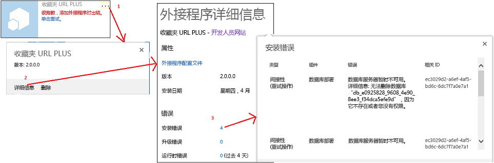
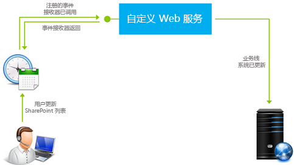

# 处理 SharePoint 外接程序中的事件

自定义代码可以处理提供程序承载的加载项中的三类事件：
  
    
    


- **列表事件**，如在网站上添加或删除列表。
    
  
- **列表项事件**，如编辑列表中的项目。
    
  
- **加载项事件**，如安装加载项。
    
  

SharePoint 承载的 SharePoint 外接程序不支持事件处理，但您可以通过设置触发工作流的事件来将工作流调入某种列表或列表项事件处理程序中。请参阅  [SharePoint 2013 中的工作流](http://msdn.microsoft.com/library/e0602371-ae22-44be-8a7e-9e47e9f046d6%28Office.15%29.aspx)。不能通过加载项事件触发工作流，因此加载项事件不能通过 SharePoint 承载的加载项来进行处理。
  
    
    


> **注释**
> 网站事件和网站集事件在 SharePoint 外接程序中不受支持。 
  
    
    

有两种类型的事件：
- ** *Before*  事件** 在 SharePoint 基础结构执行任何自行处理事件的操作（包括将更改提交到内容数据库）之前触发。在 SharePoint 中， **自定义 before 事件处理程序始终同步执行** 。除了其他目的以外，它们还可用来取消事件。例如，如果加载项有一个用于删除列表的函数，则在不满足特定条件时，列表删除事件处理程序可以取消删除操作。如果事件是一系列事件的一部分，取消该事件将导致后面的事件都不会发生。例如，如果您的 **ItemAdding** 事件的处理程序取消了该事件，则不会触发正常稍后将发生的 **ItemAdded** 事件。
    
  
- ** *After*  事件** 在 SharePoint 基础结构执行任何自行处理事件的操作之后触发。在 SharePoint 中， **列表和列表项事件的远程 after 事件处理程序始终异步执行** 。（应用程序事件是异常。）和其他目的相比，它们可以用于记录事件。
    
  

## 处理列表和列表项事件
<a name="RER"> </a>

若要处理列表和列表项事件，您需创建远程事件接收器 (RER)，也就是运行在 SharePoint 场或 SharePoint Online 之外的 Web 服务。RER 服务的 URL 是为其处理的事件进行注册的。有两种注册处理程序的方法：
  
    
    

- 使用 CSOM（客户端对象模型）或 SharePoint REST API 以编程方式注册主机 Web 中的事件。此任务通常是在加载项或在加载项事件的处理程序中的"首次运行"逻辑中完成的。（请参阅本文后面的 [处理加载项事件](#HandlingAppEvents)，了解有关加载项事件的概述。）以编程方式注册列表事件的代码示例，请参阅  [OfficeDev/PnP/Samples/Core.EventReceivers](https://github.com/OfficeDev/PnP/tree/master/Samples/Core.EventReceivers)。
    
  
- 加载项 Web 中的事件通常注册在具有一些简单 XML 标记的加载项 Web 功能中。有关如何创建标记和服务的详细信息，可参阅 [在 SharePoint 外接程序中创建远程事件接收器](create-a-remote-event-receiver-in-sharepoint-add-ins.md)。还有可能以编程方式注册加载项 Web 事件。
    
  

> **注释**
> 在 服务器场解决方案中，RER 的作用和事件接收器相同；但事件接收器有运行在 SharePoint 服务器上的自定义代码，所以它们不能用在 SharePoint 外接程序中。 
  
    
    

您的加载项可以处理以下列表和文档库事件。以"ing"结尾的事件在（同步）事件之前，以"ed"结尾的事件是（异步）事件之后。
  
    
    

|||
|:-----|:-----|
|ListAdding  <br/> |ListAdded  <br/> |
|ListDeleting  <br/> |ListDeleted  <br/> |
|FieldAdding  <br/> |FieldAdded  <br/> |
|FieldDeleting  <br/> |FieldDeleted  <br/> |
|FieldUpdating  <br/> |FieldUpdated  <br/> |
   
字段更新事件是有关更改列表上字段（列）属性的事件（例如是否可排序），而不是有关更改字段中数据的事件。
  
    
    
您的加载项可以处理以下列表项事件。
  
    
    

|||
|:-----|:-----|
|ItemAdding  <br/> |ItemAdded  <br/> |
|ItemUpdating  <br/> |ItemUpdated  <br/> |
|ItemDeleting  <br/> |ItemDeleted  <br/> |
|ItemCheckingOut  <br/> |ItemCheckedOut  <br/> |
|ItemCheckingIn  <br/> |ItemCheckedIn  <br/> |
|ItemUncheckingOut  <br/> |ItemUncheckedOut  <br/> |
|ItemAttachmentAdding  <br/> |ItemAttachmentAdded  <br/> |
|ItemAttachmentDeleting  <br/> |ItemAtttachmentDeleted  <br/> |
|ItemFileMoving  <br/> |ItemFileMoved  <br/> |
|ItemVersionDeleting*  <br/> |ItemVersonDeleted*  <br/> |
||ItemFileConverted  <br/> |
   

> **注释**
> *这两个新事件可能在 Visual Studio UI 中不可用。如果不可用，请选择 ItemDeleting 或 ItemDeleted，然后手动更改名称。 
  
    
    

当您在 Visual Studio 中工作，并将某个 RER 添加到 SharePoint 外接程序项目中时，Visual Studio Office 开发人员工具 将执行以下操作：
  
    
    

- 诸如"RemoteEventReceiver1.svc"之类的 Web 服务文件会添加到 Web 应用程序中，以处理向 SharePoint 外接程序添加远程事件接收器时指定的事件。此 Web 服务包含用于处理远程事件的代码文件。
    
    创建远程事件接收器之后，可向 Web 应用程序服务的代码文件添加代码以处理事件。默认情况下，您添加了处理代码的代码文件包含以下两个方法：
    
  -  `ProcessEvent()` 处理"之前"的事件（如本文前面表格中左侧列中的事件），并且向 SharePoint 返回一个报告应取消事件或让它继续的对象。
    
  
  -  `ProcessOneWayEvent()` 处理"after"事件。它以异步方式运行，并且不会将任何内容返回到 SharePoint。
    
  

    已注册的事件发生时，SharePoint 将在您的服务中调用相应的方法，并传递一个对象用于提供有关您的代码的一些上下文信息。例如，对事件类型（来自本文前面两个表之一）进行标识，以便您的代码可以分支到适用于该事件的逻辑。
    
  
- 远程事件接收器的项目项会添加到 SharePoint 外接程序项目中。远程事件接收器的 Elements.xml 文件引用您指定的 Web 应用程序和远程事件中的 Web 服务。以下示例显示了一个处理列表项的添加或删除的 Elements.xml 文件。
    
 ```XML
  
<?xml version="1.0" encoding="utf-8"?>
<Elements xmlns="http://schemas.microsoft.com/sharepoint/">
  <Receivers ListTemplateId="104">
      <Receiver>
        <Name>RemoteEventReceiver1ItemAdding</Name>
        <Type>ItemAdding</Type>
        <SequenceNumber>10000</SequenceNumber>
        <Url>~remoteAppUrl/RemoteEventReceiver1.svc</Url>
      </Receiver>
      <Receiver>
        <Name>RemoteEventReceiver1ItemDeleting</Name>
        <Type>ItemDeleting</Type>
        <SequenceNumber>10000</SequenceNumber>
        <Url>~remoteAppUrl/RemoteEventReceiver1.svc</Url>
      </Receiver>
  </Receivers>
</Elements>
 ```

若要更改远程事件接收器处理的事件，请打开"解决方案资源管理器"，打开远程事件接收器的"属性"窗口，展开"SharePoint 事件"节点，然后仅将想要处理的事件设置为 **True**。
  
    
    

> **注释**
> 有关 RER 的其他信息，包括一些故障排除信息，请参阅 [远程事件接收器常见问题](handle-events-in-sharepoint-add-ins.md#RERFAQ)。 
  
    
    


## 处理加载项事件
<a name="HandlingAppEvents"> </a>

加载项事件也由远程 Web 服务进行处理，但它们是以不同于列表和列表项 RER 的方式在加载项包中进行配置的，所以将它们视为组件的一个单独类别。对于加载项事件，远程 Web 服务在加载项清单中注册，而不是在加载项 Web 功能中注册。加载项甚至不需要有一个加载项 Web。以下各节中描述了三个加载项事件。
  
    
    

### AppInstalled 事件

 **AppInstalled** 事件在以下情况下立即运行：在 SharePoint 完成外接程序安装时需要执行的所有操作之后，但在通知用户安装完成之前。尽管这是一个 *after*  事件，SharePoint 会 *同步*  运行您的处理程序。直到您的处理程序完成，并且您的处理程序可以取消安装（这将导致 SharePoint 回滚其参与安装所执行的所有操作）后，该外接程序才可使用。实际上，它是能够抓取到您的处理程序中存在的任何错误，并指示 SharePoint 回滚安装的最佳做法。有关详细信息，请参阅 [将回滚逻辑和"已完成"逻辑包括在您的加载项事件处理程序中](#Rollback)。
  
    
    

> **注释**
> 当您安装含 [租户作用域](tenancies-and-deployment-scopes-for-sharepoint-add-ins.md)的加载项时，会将其安装到加载项目录网站集中，仅在这个时候会运行 AppInstalled 事件。可在租赁的多个网站中看到该加载项，但该事件不会为每个网站单独运行。 
  
    
    

除了取消加载项安装之外，此事件可以用于其他许多用途，包括：
  
    
    

- 将 SharePoint 组件安装到不能通过声明方式安装带有主机 Web 功能的主机 Web，如列表或子网站。
    
  
- 以编程方式使用主机 Web 或加载项 Web 注册列表和列表项事件处理程序。
    
  
- 设置应用实例相关的初始化设置。例如，您的加载项可以有一个加载项 Web 属性包，用于保存从该加载项的一个实例变为另一个实例的设置。您的 AppInstalled 处理程序可以将不同的值写入属性包中，即，根据主机 Web 的网站类型（如工作组网站或博客网站）写入。
    
    > **注释**
      > 检查主机 Web 是否是 AppCatalog 站点，是检测该加载项是否在租户作用域内安装的好方法。请参阅  [SharePoint 外接程序的租赁和部署范围](tenancies-and-deployment-scopes-for-sharepoint-add-ins.md)。 
- 在加载项的远程 Web 应用程序中执行应用实例相关的配置，例如将表格添加到数据库中。
    
  

> **重要信息**
> 必须在 30 秒内执行"AppInstalled"事件，否则 SharePoint 安装基础结构会认为安装失败。基础结构将返回事件， *并从头开始重复代码*  ，最多再重复三次。四次超时后，SharePoint 将回滚整个外接程序安装。有关对这些事项完整意义的介绍，请参阅 [将回滚逻辑和"已完成"逻辑包括在您的加载项事件处理程序中](#Rollback)。 
  
    
    


### AppUninstalling 事件

将加载项从主机 Web 中删除时， **AppUninstalling** 事件 *不*  运行。删除加载项只是将加载项移至用户的回收站。在触发"AppUninstalling"事件之前，还需执行两个步骤。首先，用户必须将加载项从回收站中删除，即将其移至第二阶段回收站中。其次， **用户必须将该加载项从第二阶段回收站中删除。这最后的任务是触发"AppUninstalling"事件** 。AppUninstalling 事件是同步事件，您可以用它来取消卸载，这会使该加载项留在第二阶段回收站中。
  
    
    
此事件的处理程序的主要用途是删除或重复使用通过 AppInstalled（或 AppUpdated）处理程序来部署的内容。SharePoint 不能删除这些内容或将它们移动到回收站中，因为它不知道相关信息，至少不是作为该加载项的组件。通常好的做法是删除这些内容。但您不想在删除该加载项后删除那些仍然有用的内容：如果您的 AppInstalled 处理程序创建的列表或网站仍将继续使用，就不要在 AppUninstalling 处理程序中将它删除。
  
    
    

### AppUpgraded 事件

 **AppUpgraded** 事件在以下情况下立即运行：在 SharePoint 完成将加载项更新到新版本时需要执行的所有操作之后，但在通知用户该更新已完成之前。和 AppInstalled 事件一样，AppUpgraded 事件是一个 after 事件，但基本上也是同步的，并且是能够抓取到错误并通知 SharePoint 回滚更新的最佳做法。
  
    
    
此事件处理程序可执行操作的一些示例：
  
    
    

- 添加、更改或从主机 Web 中删除加载项组件。
    
  
- 在加载项 Web 中执行声明性更新语义无法在加载项 Web 功能中实现的操作。例如，您不能使用声明性更新标记删除任何内容，但是您可以在 AppUpgraded 处理程序中以编程方式执行这样的操作。
    
  
- 对加载项的 Web 应用程序或远程数据库中的应用实例相关组件进行更改。
    
  
 *有关创建加载项事件处理程序的详细说明，可参阅 [在 SharePoint 外接程序中创建外接程序事件接收器](create-an-add-in-event-receiver-in-sharepoint-add-ins.md)*  。
  
    
    

### 将回滚逻辑和"已完成"逻辑包括在您的加载项事件处理程序中
<a name="Rollback"> </a>

如果在处理三个之中任一个加载项事件时，SharePoint 遇到了错误，它将取消事件并回滚其所做出的与此事件相关的任何更改。加载项事件处理程序必须与此系统集成，因为如果您正在执行的事件有一部分出现了故障，您希望整个事件回滚，而不是继续并将内容维持在可能已损坏状态中。以下是您的处理程序通常需要执行的操作：
  
    
    

- 告诉 SharePoint 发生了错误。您的加载项事件处理 Web 服务返回至 SharePoint 的 SOAP 消息将具有一个 **Status** 属性，该属性的值可以是 **Continue**、 **CancelWithError** 或 **CancelWithoutError**。无论哪种 **Cancel*** 状态，都会告诉 SharePoint 回滚事件。
    
  
- 回滚处理程序遇到错误之前该处理程序已完成的操作。SharePoint 通常无法为您执行此操作，因为它不知道您的处理程序做了什么。但这并不是绝对的。例如，在加载项安装被取消时，SharePoint 将删除整个加载项 Web，所以 AppInstalled 事件处理程序还原对加载项 Web 所执行的操作就变得没有意义。但通常它应回滚对主机 Web 或对该加载项的远程组件所执行的操作。
    
  

> **注释**
> **关于 AppUninstalling 事件的特别注意事项：**前面要点适用于 AppUninstalling 事件，同样也适用于其他两个加载项事件。例如，如果您用于卸载事件的处理程序删除了远程数据库中的一行内容，然后遇到了一个错误，则该行需要还原。由于您的服务将向 SharePoint 发送取消消息，所以该加载项不会从回收站中删除。如果将它从回收站还原并再次使用，则在没有该数据库条目的情况下可能会发生失败。 > 但是，您的 AppUninstalling 处理程序会在 SharePoint 将加载项从回收站中删除 *之前*  完成操作。因此，如果 SharePoint 本身遇到错误，并且需要取消删除，那么您的处理程序将无法撤消它完成的操作。
  
    
    

如果在 30 秒内，SharePoint 没有收到来自您的处理程序的结果消息，它将再次调用该处理程序。在重试三次（总共尝试四次）后，它将完全放弃，并回滚该事件。每次调用该处理程序时，您的代码都会再次从头开始。但您通常不希望您的处理程序再次执行已完成的操作（如在主机 Web 上创建列表），在该处理程序超时之前，您也无法知道是否已完成回滚逻辑，或者是否甚至已触发回滚逻辑。为此，如果不先检查是否已完成该操作，您的处理程序逻辑就不应执行任何操作，除非再次执行是无害的。
  
    
    
可以在 SharePoint UI 中看到安装和更新错误，如下图所示。
  
    
    

**图 1.获取安装错误的详细信息。**

  
    
    

  
    
    

  
    
    

#### 加载项事件处理程序的体系结构策略
<a name="Strategies"> </a>

由于已在伪代码中进行了表述，您的处理程序通常应具备类似下面的结构。如果在尝试部分中出现错误，应调用"捕获和回滚"部分。（这可能会根据语言和框架而自动发生。）
  
    
    

```

Try
    If X not already done,
        Do X.
Catch
    Send cancel message to SharePoint.
    If X not already undone,
        Undo X.

```

但是，在您的 Web 服务中实现回滚和"已完成"的逻辑可以降低该处理程序的执行速度。您的安装和回滚逻辑通常会对来自 Web 服务的某些远程内容进行更改，如 SharePoint 主机 Web 或后端数据库。如果您的安装和回滚代码分为"尝试"和"捕获"部分，那么该服务将单独调用远程组件，通常每个部分中会有几个此类调用。最佳做法通常是在某个可以从您的"尝试"部分的处理程序进行调用的过程中执行远程组件自身的安装和回滚逻辑。该过程应返回成功或失败的消息，如果它报告失败，"尝试"部分中的代码将调用"捕获"部分（意味着引发异常）。"捕获"部分所能执行的操作只是通知 SharePoint。我们将此称为处理程序委派策略。下面的伪代码说明了该策略：
  
    
    



```

Try
    Call the "Do X" procedure on remote platform.
    If remote platform reports failure, call Catch.
Catch
    Send cancel message to SharePoint.

```

在远程系统上执行的"执行 X"过程本身将包含回滚和"已完成"逻辑，如下所示。
  
    
    



```

Try
    If X not already done,
        Do X.
        Set success flag to true.
Catch
    If X was done before error,
        Undo X.
    Set success flag to false.
Send
    Return success flag to the event handler.

```

例如，如果您的处理程序需要对 SQL Server 数据库执行操作，您可以在使用  [TRY-CATCH](http://msdn.microsoft.com/library/248df62a-7334-4bca-8262-235a28f4b07f%28Office.15%29.aspx) 块的 SQL Server 上安装一个存储的程序，以实现安装回滚逻辑。使用 [ELSE IF](http://msdn.microsoft.com/library/676c881f-dee1-417a-bc51-55da62398e81%28Office.15%29.aspx) 块来实现"已完成"逻辑。
  
    
    
SharePoint 加载项模型不提供将自定义服务器端代码存储在 SharePoint 上并从 CSOM（客户端对象模型）对其进行调用的方法。但是，CSOM 会提供捆绑 try-catch 和 if-then-else 逻辑的方法，并将其发送至服务器以供执行。有关使用处理程序委派策略将列表添加至主机 Web 的加载项处理程序的详细示例，请参阅 [在 SharePoint 外接程序中创建外接程序事件接收器](create-an-add-in-event-receiver-in-sharepoint-add-ins.md)。有关代码示例，请参阅  [OfficeDev/PnP/Samples/Core.AppEvents.HandlerDelegation](https://github.com/OfficeDev/PnP/tree/master/Samples/Core.AppEvents.HandlerDelegation)。
  
    
    
始终不能使用处理程序委派策略。例如，当您的处理程序供多个组件（如数据库和 SharePoint 主机 Web）进行调用时，其中的一个就有可能成功完成，而另一个发生失败。在此方案中，如果采用处理程序委派策略进行设计，则第一个组件的回滚逻辑将不会运行。出于此原因，如果您以同步方式调用组件，则只有最后调用的那个组件可以使用处理程序委派策略。如果异步调用它们，则无论哪个都将无法使用该策略。有关不使用处理程序委派策略的加载项事件处理程序的示例，请参阅  [OfficeDev/PnP/Samples/Core.AppEvents](https://github.com/OfficeDev/PnP/tree/master/Samples/Core.AppEvents)。
  
    
    

> **提示**
> 如果 AppInstalled 事件发生失败，SharePoint 将删除加载项 Web（如果有的话）；如果 AppUpated 事件发生失败， SharePoint 将把加载项 Web 还原到其更新前的状态。为此，您的处理程序完全不需要回滚它们对加载项 Web 执行的操作。如果您的处理程序在主机 Web 和应用程序 Web 上执行操作，它应首先处理加载项 Web。这样做可以可安全地对主机 Web 使用处理程序委派策略。即使加载项 Web 操作成功执行，而主机 Web 操作失败，也不会有未执行的回滚逻辑。 
  
    
    


## 支持多个安全区域的外接程序中的远程事件接收器
<a name="HandlingAppEvents"> </a>

设计支持多个安全区域且具有远程事件接收器的外接程序时存在一些限制。有关详细信息，请参阅知识库文章 kb3135876  [在 SharePoint 2013 的非默认区域中使用提供程序托管的外接程序时无法从默认的 SharePoint 商店添加应用程序](https://support.microsoft.com/zh-cn/kb/3135876)。
  
    
    

## 远程事件接收器常见问题
<a name="RERFAQ"> </a>

以下是在使用远程事件接收器时可能会遇到的常见问题。
  
    
    

### 远程事件接收器与 SharePoint 2010 中的事件接收器有何不同？
<a name="RER_HowRERDifferentfrom2010"> </a>

在 SharePoint 2010 中，事件接收器通过在 SharePoint 服务器（完全信任服务器或沙盒服务器）上运行代码，来处理 SharePoint 列表、站点及其他 SharePoint 对象上发生的事件。但是，SharePoint 2013 也支持 *远程*  事件接收器。在该事件接收器上，在触发事件时运行的代码由 Web 服务提供服务。这意味着，如果您注册远程事件接收器，您还需要通知 SharePoint 将调用哪个 Web 服务。在表 1 中，左侧的代码示例（SharePoint 解决方案）使用事件处理器实施功能。右侧的示例（SharePoint 外接程序）使用远程事件接收器实施相同的功能。
  
    
    

**表 1. SharePoint 2010 中的事件接收器与加载项中的远程事件接收器的代码示例**


|**SharePoint 解决方案**|**SharePoint 外接程序**|
|:-----|:-----|
|
```cs

// Trigger an event when an item is added to the SharePoint list.
Public class OnPlantUpdated : SPItemEventReceiver
{
Public override void ItemAdding (SPItemEventProperties properties)
{
Properties.After.Properties.ChangedProperties.Add("Image",CreateLink(properties));
Properties.status =SPEventReceiverStatus.Continue;
}

/// When an item updates, run the following.
Public override void ItemUpdating(SPItemEventProperties properties)
{
Properties.AfterProperties.ChangedProperties.Add("Image",CreateLink9properties));
Properties.Status= SPEventReceiverStatus.Continue;
}

```

|
```cs

/* Trigger an event when an item is added to the SharePoint list*/
Public class OnPlantUpdated : IRemoteEventService
{
public SPRemoteEventResult ProcessEvent (SPRemoteEventProperties properties)
{
SPRemoteEventResult result =new SPRemoteEventResult();
If (properties.EventType == SPRemoteEventType.ItemAdding ||  
properties.EventType == SPRemoteEventType.ItemUpdating)
{

// Add code that runs when an item is added or updated.
}

```

|
   
有关完整的代码示例，请参阅 [使用远程事件接收器添加列表项属性](http://code.msdn.microsoft.com/SharePoint-2013-Add-list-2c6e71e0)。有关代码示例的详细演示，请参阅 [将 SharePoint 事件接收器迁移到远程事件接收器](http://channel9.msdn.com/Series/Reimagine-SharePoint-Development/Migrating-a-SharePoint-Event-Receiver-to-a-Remote-Event-Receiver)。
  
    
    

### 
<a name="RER_HowRERDifferentfrom2010"> </a>

有关信息，请参阅  [SPRemoteEventType 枚举](https://msdn.microsoft.com/zh-cn/library/microsoft.sharepoint.client.eventreceivers.spremoteeventtype.aspx)
  
    
    

### 远程事件接收器如何工作？
<a name="RER_HowDoRERWork"> </a>

图 1 显示了远程事件接收器如何工作：
  
    
    

- 用户在 SharePoint 上执行操作（例如，编辑列表项）。
    
  
- 然后 SharePoint 与注册 Web 服务联系。您可以执行一些操作—例如，更新列表项属性或更新后端系统。
    
  
- Web 服务还可以与访问控制服务 (ACS) 联系，来请求自己的签名令牌以回调到 SharePoint。由于之前对列表项或在后端系统中执行的操作，您可以通过令牌从 Web 服务内部执行远程操作。
    
  

**图 2. 远程事件接收器在 SharePoint 中如何工作**

  
    
    

  
    
    

  
    
    

  
    
    

  
    
    

### 如何调试远程事件接收器？
<a name="RER_DebugRER"> </a>

请参阅 [在 SharePoint 外接程序中调试远程事件接收器并排除故障](debug-and-troubleshoot-a-remote-event-receiver-in-a-sharepoint-add-in.md)。
  
    
    

### 我能否从远程事件接收器运行客户端 (JavaScript) 代码？
<a name="RER_ClientsideCodeFromRER"> </a>

不能。
  
    
    

### 关于远程事件接收器可以承载的位置或其 URL 是否有任何限制？
<a name="RER_ClientsideCodeFromRER"> </a>

远程事件接收器可托管在云中或托管在不同时用作 SharePoint 服务器的本地服务器中。生产接收器的 URL 不能指定特定的端口。这意味着，您必须对 HTTPS 使用端口 443（推荐），或对 HTTP 使用端口 80。如果您正在使用 HTTPS，同时接收器服务在本地托管，但外接程序位于 Microsoft SharePoint Online，则托管服务器必须具有证书颁发机构授予的公开可信证书。（自签名证书只适用于外接程序在本地 SharePoint 场的情况。）
  
    
    

### 升级后 SharePoint 2010 事件处理程序能否在 SharePoint 2013 上运行？
<a name="RER_Will2020EventHandlerWillWorkOn2013"> </a>

如果将包含事件处理程序的 SharePoint 2010 解决方案包升级到 SharePoint 2013，根据您的自定义设置，解决方案包可能在不做任何修改的情况下工作。这也包括事件处理程序。如果 SharePoint 2010 解决方案在 SharePoint 2013 中重新建模为 SharePoint 外接程序，应将事件处理程序重新编写成远程事件接收器。（请参阅 [将 SharePoint 事件接收器迁移到远程事件接收器](http://channel9.msdn.com/Series/Reimagine-SharePoint-Development/Migrating-a-SharePoint-Event-Receiver-to-a-Remote-Event-Receiver)。）
  
    
    

## 其他资源
<a name="SP15handleevents_addlresources"> </a>


-  [在 SharePoint 外接程序中创建远程事件接收器](create-a-remote-event-receiver-in-sharepoint-add-ins.md)
    
  
-  [在 SharePoint 外接程序中创建外接程序事件接收器](create-an-add-in-event-receiver-in-sharepoint-add-ins.md)
    
  
-  [SharePoint 2013 中的远程事件接收器简介](http://www.microsoft.com/resources/msdn/en-us/office/media/video/video.mdl?cid=sdc&amp;from=mscomsdc&amp;VideoID=3ef8f7ae-85a7-44c3-967d-d1620e2a019f)
    
  
-  [将 SharePoint 事件接收器迁移到远程事件接收器](http://channel9.msdn.com/Series/Reimagine-SharePoint-Development/Migrating-a-SharePoint-Event-Receiver-to-a-Remote-Event-Receiver)
    
  

