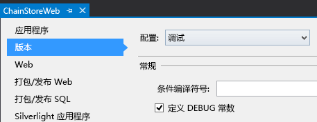
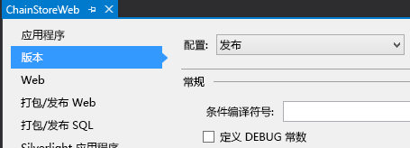
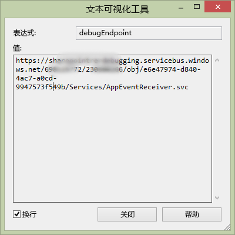

# 处理提供程序托管的外接程序中的列表项事件
了解在提供程序托管的 SharePoint 外接程序中如何处理列表项事件。
这是关于开发 SharePoint 托管的 SharePoint 外接程序的基础知识系列文章中的第 10 篇文章。您应该首先熟悉  [SharePoint 外接程序](sharepoint-add-ins.md)以及本系列中之前的文章：


-  [开始创建提供程序承载的 SharePoint 加载项](get-started-creating-provider-hosted-sharepoint-add-ins.md)


-  [使提供程序托管的外接程序具有 SharePoint 的外观](give-your-provider-hosted-add-in-the-sharepoint-look-and-feel.md)


-  [在提供程序托管的外接程序中包含自定义按钮](include-a-custom-button-in-the-provider-hosted-add-in.md)


-  [获取 SharePoint 对象模型的快速概述](get-a-quick-overview-of-the-sharepoint-object-model.md)


-  [将 SharePoint 写入操作添加到提供程序托管的外接程序](add-sharepoint-write-operations-to-the-provider-hosted-add-in.md)


-  [在提供程序托管的外接程序中包括外接程序部件](include-an-add-in-part-in-the-provider-hosted-add-in.md)


-  [处理提供程序托管的外接程序中的外接程序事件](handle-add-in-events-in-the-provider-hosted-add-in.md)


-  [将首次运行逻辑添加到提供程序托管的外接程序](add-first-run-logic-to-the-provider-hosted-add-in.md)


-  [以编程方式在提供程序托管的外接程序中部署自定义按钮](programmatically-deploy-a-custom-button-in-the-provider-hosted-add-in.md)


> **注释**
> 如果您阅读过关于提供程序托管的外接程序的系列文章，那么您应该具有 Visual Studio 解决方案，可以继续阅读本主题。您还可以从  [SharePoint_Provider-hosted_Add-Ins_Tutorials](https://github.com/OfficeDev/SharePoint_Provider-hosted_Add-ins_Tutorials) 下载存储库并打开 BeforeRER.sln 文件。


您在本系列之前的文章中看到，当下达订单时，它将添加到公司数据库的"订单"表中，并会在"预期装运"列表中自动添加该订单的一个项。当它到达本地商店时，用户将"已到达"列更改为"是"。更改项目的字段值会创建一个项目已更新事件，您可为其添加一个自定义处理程序。在本文中，您将为该列表项事件创建一个处理程序，然后以编程方式将其部署到 SharePoint 外接程序的首次运行逻辑中。您的处理程序会将项目添加到公司数据库的"库存"表中。然后它将"预期装运列表的"已添加到库存"列更改为"是"。您还将了解如何防止第二个项目已更新事件引发无限的项目已更新事件。
## 以编程方式部署"预期装运"列表


> **注释**
> Visual Studio 中的启动项目的设置可能会在重新打开解决方案时恢复为默认值。重新打开本系列文章中的示例解决方案后，请始终立即执行下列步骤： 


1. 在"解决方案资源管理器"中，打开"ChainStoreWeb"项目中的 Utilities\\SharePointComponentDeployer.cs 文件。将以下方法添加到  `SharePointComponentDeployer` 类。此代码不会引入本系列之前文章尚未涉及的任何功能，但请注意以下几点：

  - 它将"数量"字段的 **Required** 属性设置为 **TRUE**，因此字段必须具有值，然后它将默认值设置为 1。


  - "已到达"和"已添加到库存"字段在"新项目"窗体中为隐藏状态。


  - 理想情况下，"已添加到库存"字段在"编辑项目"窗体中也为隐藏状态，因为它应该仅在项目已更新事件处理程序第一次将项目添加到公司"库存" 表时才更改为"是"。出于技术原因（将在后面的步骤中解释），如果我们想要以编程方式将某个字段写入到项目已更新事件处理程序，该字段在"编辑项目"窗体中必须可见。


  ```cs

private static void CreateExpectedShipmentsList()
 {
    using (var clientContext = sPContext.CreateUserClientContextForSPHost())
    {
        var query = from list in clientContext.Web.Lists
                    where list.Title == "Expected Shipments"
                    select list;
        IEnumerable<List> matchingLists = clientContext.LoadQuery(query);
        clientContext.ExecuteQuery();
               
        if (matchingLists.Count() == 0)
        {
                ListCreationInformation listInfo = new ListCreationInformation();
                listInfo.Title = "Expected Shipments";
                listInfo.TemplateType = (int)ListTemplateType.GenericList;
                listInfo.Url = "Lists/ExpectedShipments";
                List expectedShipmentsList = clientContext.Web.Lists.Add(listInfo);

                Field field = expectedShipmentsList.Fields.GetByInternalNameOrTitle("Title");
                field.Title = "Product";
                field.Update();

                expectedShipmentsList.Fields.AddFieldAsXml("<Field DisplayName='Supplier'" 
                                                            + " Type='Text' />", 
                                                            true,
                                                            AddFieldOptions.DefaultValue);
                expectedShipmentsList.Fields.AddFieldAsXml("<Field DisplayName='Quantity'" 
                                                            + " Type='Number'" 
                                                            + " Required='TRUE' >" 
                                                            + "<Default>1</Default></Field>",
                                                            true, 
                                                            AddFieldOptions.DefaultValue);
                expectedShipmentsList.Fields.AddFieldAsXml("<Field DisplayName='Arrived'" 
                                                           + " Type='Boolean'"
                                                           + " ShowInNewForm='FALSE'>"
                                                           + "<Default>FALSE</Default></Field>",
                                                            true, 
                                                            AddFieldOptions.DefaultValue);
                expectedShipmentsList.Fields.AddFieldAsXml("<Field DisplayName='Added to Inventory'" 
                                                            + " Type='Boolean'" 
                                                            + " ShowInNewForm='FALSE'>"
                                                            + "<Default>FALSE</Default></Field>", 
                                                            true, 
                                                            AddFieldOptions.DefaultValue);

                clientContext.ExecuteQuery();
        }
     }
 }
  ```

2. 在  `DeployChainStoreComponentsToHostWeb` 方法中，在行 `RemoteTenantVersion = localTenantVersion` 上方添加以下行。

  ```

CreateExpectedShipmentsList();
  ```


## 创建列表项事件接收器


> **注释**
> 如果您已阅读完本系列文章，您应该已经将开发环境配置为可调试远程事件接收器。如果还没有，请参阅 [配置事件接收器调试解决方案](handle-add-in-events-in-the-provider-hosted-add-in.md#RERDebug)，然后再深入阅读本主题。 


Visual Studio Office 开发人员工具 包括一个可添加到 SharePoint 外接程序 解决方案的"远程事件接收器"项目。但是，在编写本文时，此项目项假定列表（接收器已在其中注册）位于外接程序 Web 上，并且稍后工具将会在其中创建外接程序 Web 和某些 SharePoint 项目。但是连锁店外接程序的接收器将在主机 Web 上的"预期装运"列表中注册（在后续步骤中），因此外接程序不需要外接程序 Web。（有关外接程序 Web 和主机 Web 之间的区别，请参阅  [SharePoint 外接程序](sharepoint-add-ins.md)。）


> **注释**
> 列表和列表项事件接收器称为远程事件接收器 (RER)，因为它们的代码对于 SharePoint 为远程状态，即位于云中或者位于 SharePoint 服务器场外部的内部部署服务器中。但是，触发它们的事件位于 SharePoint 中。


1. 在"解决方案资源管理器"中，右键单击"ChainStoreWeb"项目中的"服务"文件夹，然后选择"添加 | WCF 服务"。


2. 出现提示时，将服务命名为 RemoteEventReceiver1，然后按"确定"。


3. 工具将创建接口文件、*.svc 文件以及文件的隐藏代码。我们不需要接口文件 IRemoteEventReceiver1.cs，请将其删除。（工具可能会将其自动打开，此时请将其关闭并删除。）

    > **注释**
      > 在本系列之前的文章中为已安装和卸载事件创建外接程序事件接收器时，Visual Studio Office 开发人员工具 将其 URL 添加到应用程序清单文件中。列表和列表项事件接收器未在应用程序清单中注册，而是以编程方式（在提供程序托管的外接程序中）注册。您将在后面的步骤中执行此操作。 
4. 打开文件 RemoteEventReceiver1.svc.cs 的隐藏代码。将其全部内容替换为以下代码。对于此代码，请注意以下事项：

  - 接口  `IRemoteEventService` 在 **Microsoft.SharePoint.Client.EventReceivers** 命名空间中定义。


  - 不存在任何在连锁店外接程序中处理的"before"事件，但  `IRemoteEventService` 接口需要 **ProcessEvent** 方法。


  ```cs
  using System;
using System.Collections.Generic;
using Microsoft.SharePoint.Client;
using Microsoft.SharePoint.Client.EventReceivers;
using System.Data.SqlClient;
using System.Data;
using ChainStoreWeb.Utilities;

namespace ChainStoreWeb.Services
{
    public class RemoteEventReceiver1 : IRemoteEventService
    {
        /// <summary>
        /// Handles events that occur before an action occurs, 
        /// such as when a user is adding or deleting a list item.
        /// </summary>
        /// <param name="properties">Holds information about the remote event.</param>
        /// <returns>Holds information returned from the remote event.</returns>
        public SPRemoteEventResult ProcessEvent(SPRemoteEventProperties properties)
        {
            throw new NotImplementedException();
        }

        /// <summary>
        /// Handles events that occur after an action occurs, 
        /// such as after a user adds an item to a list or deletes an item from a list.
        /// </summary>
        /// <param name="properties">Holds information about the remote event.</param>
        public void ProcessOneWayEvent(SPRemoteEventProperties properties)
        {

        }
    }
}
  ```

5. 将以下代码添加到  `ProcessOneWayEvent` 方法。请注意， **ItemUpdated** 事件是此示例将处理的唯一事件，因此我们使用的可能是简单的 **if** 结构，而非 **switch**。但事件接收器通常会处理多个事件，因此我们希望您查看以 SharePoint 外接程序开发人员身份在事件处理程序中最常使用的模式。

  ```cs

switch (properties.EventType)
{
    case SPRemoteEventType.ItemUpdated:

        // TODO12: Handle the item updated event.
                
        break;
}
  ```

6. 将  `TODO12` 替换为以下代码。同样，此处我们将使用 **switch** 结构，如果简单的 **if** 结构可行，因为我们希望您查看 SharePoint 事件接收器中的通用模式。

  ```cs

switch (properties.ItemEventProperties.ListTitle)
{
    case "Expected Shipments":

        // TODO13: Handle the arrival of a shipment.

        break;
}
  ```

7. 对装运到达做出响应的代码应执行两个操作：

  - 将已到达商店的项目添加到公司库存。


  - 将"预期装运"列表上的"已添加到库存"字段设置为"是"。但是，此操作应该仅在项目已成功添加到库存时执行。


    添加以下代码替换  `TODO13`。后续步骤中将创建两个方法： `TryUpdateInventory` 和 `RecordInventoryUpdateLocally`。


  ```cs

bool updateComplete = TryUpdateInventory(properties);
if (updateComplete)
{
    RecordInventoryUpdateLocally(properties);
}
  ```


    现在  `ProcessOneWayEvent` 方法看起来应该如下所示：


  ```cs

public void ProcessOneWayEvent(SPRemoteEventProperties properties)
{
    switch (properties.EventType)
    {
        case SPRemoteEventType.ItemUpdated:

            switch (properties.ItemEventProperties.ListTitle)
            {
                case "Expected Shipments":
                    bool updateComplete = UpdateInventory(properties);
                    if (updateComplete)
                    {
                        RecordInventoryUpdateLocally(properties);
                    }
                    break;
            }
            break;
    }      
}
  ```

8. 将以下方法添加到  `RemoteEventReceiver1` 类。

  ```cs

private bool TryUpdateInventory(SPRemoteEventProperties properties)
{
    bool successFlag = false;

        // TODO14: Test whether the list item is changing because the product has arrived
        // or for some other reason. If the former, add it to the inventory and set the success flag
        // to true. 

    return successFlag;
}
  ```

9. "预期装运"列表中有五个列，但我们希望处理程序对项目的大多数更新类型不做出响应。例如，如果用户更正供应商名称的拼写，将触发项目已更新事件，但我们的处理程序不应执行任何操作。处理程序应该仅在"已到达"字段设置为"是"时进行操作。

    还有一个条件需要测试。假定"已到达"设置为"是"，且项目中的产品已添加到库存（"已添加到库存"设置为"是"）。但之后用户错误地将装运的"已到达"字段更改为"否"，然后将其重新设置为"已到达"弥补了此错误。犯错误和修复错误均会触发项目已更新事件。处理程序不会对错误做出响应，因为它仅在"已到达"设置为"是"时进行操作，但它会对修复错误做出响应，因为"已到达"重新设置为了"是"，因此同一产品和数量将再次添加到库存中。因此，处理程序应该仅在"已添加到库存"值为"否"时进行操作。

    此时，在用户更新项目后，处理程序需要立即知道这些字段的值是什么。 **SPRemoteEventProperties** 对象具有 **ItemEventProperties** 属性。反过来，它又具有索引的 **AfterProperties** 属性，其中保存了已更新项目的字段的值。以下代码使用这些属性测试处理程序是否应做出响应。使用此代码替换 `TODO14`。


  ```cs

var arrived = Convert.ToBoolean(properties.ItemEventProperties.AfterProperties["Arrived"]);
var addedToInventory = Convert.ToBoolean(properties.ItemEventProperties.AfterProperties["Added_x0020_to_x0020_Inventory"]);

if (arrived &amp;&amp; !addedToInventory)
{

    // TODO15: Add the item to inventory

    successFlag = true;
}
  ```

10. 将  `TODO15` 替换为以下代码。这主要是 SQL 和 ASP.NET 编程，因此我们不会详细讨论，但请注意：

  - 我们使用 **ItemEventProperties.WebUrl** 属性来获取租户名称，即主机 Web URL。


  - 我们再次使用 **AfterProperties** 来获取产品名称和数量的值。


  - 我们将产品名称字段称为"标题"，即使显示名称已更改为"产品"（在  `CreateExpectedShipmentsList` 方法中），因为字段始终由其内部名称引用。


  ```cs

using (SqlConnection conn = SQLAzureUtilities.GetActiveSqlConnection())
using (SqlCommand cmd = conn.CreateCommand())
{
    conn.Open();
    cmd.CommandText = "UpdateInventory";
    cmd.CommandType = CommandType.StoredProcedure;
    SqlParameter tenant = cmd.Parameters.Add("@Tenant", SqlDbType.NVarChar);
    tenant.Value = properties.ItemEventProperties.WebUrl + "/";
    SqlParameter product = cmd.Parameters.Add("@ItemName", SqlDbType.NVarChar, 50);
    product.Value = properties.ItemEventProperties.AfterProperties["Title"]; // not "Product"
    SqlParameter quantity = cmd.Parameters.Add("@Quantity", SqlDbType.SmallInt);
    quantity.Value = Convert.ToUInt16(properties.ItemEventProperties.AfterProperties["Quantity"]);
    cmd.ExecuteNonQuery();
}
  ```


    我们尚未完成  `TryUpdateInventory` 方法，但此时它应该如下所示。


  ```cs

private bool TryUpdateInventory(SPRemoteEventProperties properties)
{
    bool successFlag = false;

    var arrived = Convert.ToBoolean(properties.ItemEventProperties.AfterProperties["Arrived"]);
    var addedToInventory = Convert.ToBoolean(properties.ItemEventProperties.AfterProperties["Added_x0020_to_x0020_Inventory"]);

    if (arrived &amp;&amp; !addedToInventory)
    {
        using (SqlConnection conn = SQLAzureUtilities.GetActiveSqlConnection())
        using (SqlCommand cmd = conn.CreateCommand())
        {
            conn.Open();
            cmd.CommandText = "UpdateInventory";
            cmd.CommandType = CommandType.StoredProcedure;
            SqlParameter tenant = cmd.Parameters.Add("@Tenant", SqlDbType.NVarChar);
            tenant.Value = properties.ItemEventProperties.WebUrl + "/";
            SqlParameter product = cmd.Parameters.Add("@ItemName", SqlDbType.NVarChar, 50);
            product.Value = properties.ItemEventProperties.AfterProperties["Title"]; // not "Product"
            SqlParameter quantity = cmd.Parameters.Add("@Quantity", SqlDbType.SmallInt);
            quantity.Value = Convert.ToUInt16(properties.ItemEventProperties.AfterProperties["Quantity"]);
            cmd.ExecuteNonQuery();
        }        
        successFlag = true;
    }
    return successFlag;
}
  ```

11.  `TryUpdateInventory` 方法返回 **true** 时，我们的处理程序将调用一个方法（尚未编写），通过将"已添加到库存"字段设置为"是"更新"预期装运"列表中的相同项目。这本身是一个项目更新事件，因此将再次调用处理程序。（"已添加到库存"字段现在为"是"，这将阻止处理程序将相同的装运再次添加到库存中，但仍会调用处理程序。）

    但是，SharePoint 的行为与编程更新触发的项目已更新事件略有不同： *它仅在 **AfterProperties** 中包含更新中更改的字段。*  因此，不会显示"已到达"字段，因为只有"已添加到库存"字段发生了更改。行 --

     `var arrived = Convert.ToBoolean(properties.ItemEventProperties.AfterProperties["Arrived"]);`

    -- 将抛出 **KeyNotFoundException**。

    有多种方法可以解决此问题。在此示例中，我们将捕获异常并使用 **catch** 块，以确保 `successFlag` 已设置为 **false**。执行此操作可确保项目不会更新第三次。

    将所有内容放在位于 **try** 块中的第一行 `bool successFlag = false;` 与最后一行 `return successFlag;` 之间的方法中。


12. 将以下 **catch** 块添加到 **try** 块下方。

  ```cs

catch (KeyNotFoundException)
{
    successFlag = false;
}
  ```


    > **注释**
      > **KeyNotFoundException** 也是我们为什么必须将"已添加到库存"字段在"编辑项目"窗体上显示出来的原因。SharePoint 不会将"编辑项目"窗体中的隐藏字段包括在 **AfterProperties**中。 

    现在整个方法看起来应该如下所示。


  ```cs

private bool TryUpdateInventory(SPRemoteEventProperties properties)
{
    bool successFlag = false;

    try 
    {
        var arrived = Convert.ToBoolean(properties.ItemEventProperties.AfterProperties["Arrived"]);
        var addedToInventory = Convert.ToBoolean(properties.ItemEventProperties.AfterProperties["Added_x0020_to_x0020_Inventory"]);

        if (arrived &amp;&amp; !addedToInventory)
        {
            using (SqlConnection conn = SQLAzureUtilities.GetActiveSqlConnection())
            using (SqlCommand cmd = conn.CreateCommand())
            {
                conn.Open();
                cmd.CommandText = "UpdateInventory";
                cmd.CommandType = CommandType.StoredProcedure;
                SqlParameter tenant = cmd.Parameters.Add("@Tenant", SqlDbType.NVarChar);
                tenant.Value = properties.ItemEventProperties.WebUrl + "/";
                SqlParameter product = cmd.Parameters.Add("@ItemName", SqlDbType.NVarChar, 50);
                product.Value = properties.ItemEventProperties.AfterProperties["Title"]; // not "Product"
                SqlParameter quantity = cmd.Parameters.Add("@Quantity", SqlDbType.SmallInt);
                quantity.Value = Convert.ToUInt16(properties.ItemEventProperties.AfterProperties["Quantity"]);
                cmd.ExecuteNonQuery();
            }        
            successFlag = true;
        }
    }
    catch (KeyNotFoundException)
    {
        successFlag = false;
    }
    return successFlag;
}
  ```

13. 将以下方法添加到  `RemoteEventReceiver1` 类。到目前为止，您已在本系列前面的文章中熟悉此代码模式，但请注意一个区别。代码通过调用 **TokenHelper.CreateRemoteEventReceiverClientContext** 方法获取 **ClientContext** 对象，而不是代码中所用的 **SharePointContext.CreateUserClientContextForSPHost** 方法，后者从页面（例如 EmployeeAdder 页面）调用 SharePoint。使用不同方法获取 **ClientContext** 对象的主要原因是，SharePoint 将以不同方式创建此类对象所需的信息传递到事件接收器，然后从事件接收器传递到页面。对于事件接收器，它会传递一个 **SPRemoteEventProperties** 对象，但对于页面，则在启动外接程序页面的请求正文中传递一个特殊字段，称为上下文令牌。

  ```cs

private void RecordInventoryUpdateLocally(SPRemoteEventProperties properties)
{
    using (ClientContext clientContext = TokenHelper.CreateRemoteEventReceiverClientContext(properties))
    {
        List expectedShipmentslist = clientContext.Web.Lists.GetByTitle(properties.ItemEventProperties.ListTitle);
        ListItem arrivedItem = expectedShipmentslist.GetItemById(properties.ItemEventProperties.ListItemId);
        arrivedItem["Added_x0020_to_x0020_Inventory"] = true;
        arrivedItem.Update();
        clientContext.ExecuteQuery();
    }
}
  ```

14. 保存并关闭接收器的代码文件。


## 注册接收器

最后一个任务是告诉 SharePoint 我们有一个自定义的接收器，我们希望只要"预期装运"列表上的项目有更新时，SharePoint 即调用此接收器。


1. 打开 SharePointContentDeployer.cs 文件，并在  `DeployChainStoreComponentsToHostWeb` 方法中将以下行添加到创建"预期装运"列表的行下方。我们将在下一步添加此方法。请注意，我们会将外接程序起始页传递到 `DeployChainStoreComponentsToHostWeb` 方法的 **HttpRequest** 对象传递到方法。

  ```cs

RegisterExpectedShipmentsEventHandler(request);
  ```

2. 将以下方法添加到  `SharePointComponentDeployer` 类。

  ```cs
  private static void RegisterExpectedShipmentsEventHandler(HttpRequest request)
{
    using (var clientContext = sPContext.CreateUserClientContextForSPHost())
    {
        var query = from list in clientContext.Web.Lists
                    where list.Title == "Expected Shipments"
                    select list;
        IEnumerable<List> matchingLists = clientContext.LoadQuery(query);
        clientContext.ExecuteQuery();

        List expectedShipmentsList = matchingLists.Single();

        // TODO16: Add the event receiver to the list's collection of event receivers.   

        clientContext.ExecuteQuery();
    }
}
  ```

3. 将  `TODO16` 替换为以下行。请注意，事件接收器有一个轻型 ***CreationInformation** 类，就像列表和列表项也有。

  ```cs

EventReceiverDefinitionCreationInformation receiver = new EventReceiverDefinitionCreationInformation();
receiver.ReceiverName = "ExpectedShipmentsItemUpdated";
receiver.EventType = EventReceiverType.ItemUpdated;

 // TODO17: Set the URL of the receiver.

expectedShipmentsList.EventReceivers.Add(receiver);

  ```

4. 现在您需要告知 SharePoint 事件接收器的 URL。在生产环境中，它将位于与远程页面相同的域，路径为 /Services/RemoteEventReceiver1.svc。由于处理程序将在外接程序起始页的首次运行逻辑中注册，对于调用页面的请求，域位于 **HttpRequest** 对象的主机标头中。我们的代码已将该对象从页面传递到 `DeployChainStoreComponentsToHostWeb` 方法，然后此方法将对象传递到 `RegisterExpectedShipmentsEventHandler` 方法。因此我们可以使用以下代码设置接收器的 URL。

     `receiver.ReceiverUrl = "https://" + request.Headers["Host"] + "/Services/RemoteEventReceiver1.svc";`

    遗憾的是，当您从 Visual Studio 调试外接程序时，这不起作用。在调试时，接收器托管在 Azure 服务总线，而不是托管远程页面的本地主机 URL 中。我们需要为接收器设置不同的 URL，具体取决于是否正在进行调试，因此请将  `TODO17` 替换为使用 C# 编译器指令的以下结构。请注意，在调试模式下，接收器的 URL 从 web.config 设置中读取。 *您将在后面的步骤中创建此设置。* 


  ```cs

#if DEBUG
                    receiver.ReceiverUrl = WebConfigurationManager.AppSettings["RERdebuggingServiceBusUrl"].ToString();
#else
                    receiver.ReceiverUrl = "https://" + request.Headers["Host"] + "/Services/RemoteEventReceiver1.svc"; 
#endif

  ```


    现在整个  `RegisterExpectedShipmentsEventHandler` 方法看起来应该如下所示：


  ```cs

private static void RegisterExpectedShipmentsEventHandler(HttpRequest request)
{
    using (var clientContext = sPContext.CreateUserClientContextForSPHost())
    {
        var query = from list in clientContext.Web.Lists
		            where list.Title == "Expected Shipments"
		            select list;
        IEnumerable<List> matchingLists = clientContext.LoadQuery(query);
        clientContext.ExecuteQuery();

        List expectedShipmentsList = matchingLists.Single();

        EventReceiverDefinitionCreationInformation receiver = new EventReceiverDefinitionCreationInformation();
        receiver.ReceiverName = "ExpectedShipmentsItemUpdated";
        receiver.EventType = EventReceiverType.ItemUpdated;

#if DEBUG
        receiver.ReceiverUrl = WebConfigurationManager.AppSettings["RERdebuggingServiceBusUrl"].ToString();
#else
        receiver.ReceiverUrl = "https://" + request.Headers["Host"] + "/Services/RemoteEventReceiver1.svc"; 
#endif
        expectedShipmentsList.EventReceivers.Add(receiver);
        clientContext.ExecuteQuery();
    }
}
  ```

5. 将以下 **using** 语句添加到文件顶部。

  ```cs

using System.Web.Configuration;
  ```

6. 要确保  `DEBUG` 为 true，并且如果且仅当正在调试外接程序时，执行以下子过程：

1. 在"解决方案资源管理器"中，右键单击"ChainStoreWeb"项目，然后选择"属性"。


2. 打开"属性"的"内部版本"选项卡，然后从顶部的"配置"下拉列表中选择"调试"。


3. 确保"定义 DEBUG 常量" 框处于选中状态。（通常默认已选中。）下面的屏幕截图显示了正确的设置。




4. 将"配置"下拉列表更改为"发行版"，然后确保"定义 DEBUG 常量"框 ** *未* ** 选中。（通常默认未选中。）下面的屏幕截图显示了正确的设置。




5. 如果您进行了任何更改，请保存，然后再关闭"属性"选项卡。


7. 打开 web.config 文件，将以下标记添加为 **appSettings** 元素的子项。我们在下一节中获取设置的值。

  ```XML
  <add key="RERdebuggingServiceBusUrl" value="" />
  ```


## 获取接收器 URL 以进行调试

外接程序事件和列表项事件接收器为 Windows Communication Service (WCF) 服务，每个 WCF 服务都知道自己的终结点并将其存储在多个位置，包括 **System.ServiceModel.OperationContext.Current.Channel.LocalAddress.Uri** 对象。当您进行调试时，外接程序接收器托管在几乎与列表项接收器的终结点相同的 Azure 服务总线终结点中。区别在于，外接程序终结点的 URL 以"AppEventReceiver.svc"结束，但列表项接收器 URL 以"RemoteEventReceiver1.svc"结束。因此可以在外接程序接收器中获取终结点的 URL，对其结尾进行少量更改，然后使用它作为 **RERdebuggingServiceBusUrl** 设置的值。


1. 打开"ChainStoreWeb"项目的"服务"文件夹中的 AppEventReceiver.svc.cs 文件。


2. 将以下内容添加为"ProcessEvent"方法的第一行。

  ```cs
  string debugEndpoint = System.ServiceModel.OperationContext.Current.Channel.LocalAddress.Uri.ToString(); 
  ```

3. 在方法的下一行添加一个断点。


4. 按 F5 调试外接程序。因为 web.config 处于打开状态，且每次按 F5 时 Visual Studio Office 开发人员工具 都会更改其中的一个设置，系统将提示您重新加载该文件。选择"是"。


5. 到达断点时，将光标悬停在  `debugEndpoint` 变量上。出现 Visual Studio 数据提示时，单击向下箭头并选择"文本可视化工具"。




6. 从可视化工具中复制字符串值并将其粘贴在某个位置。


7. 关闭可视化工具，然后停止在 Visual Studio 中调试。


8. 删除或注释掉您在此过程第二步添加的行，然后一并删除断点。


9. 在您复制的字符串中，将结尾的"AppEventReceiver.svc"替换为"RemoteEventReceiver1.svc"。


10. 复制并粘贴修改后的 URL 作为 web.config 文件中的 **RERdebuggingServiceBusUrl** 键。


> **注释**
>  在远程事件接收器在生产环境中运行的情况下对其进行调试时，手动复制服务总线 URL 并（将修改后的版本）粘贴到 web.config 并非处理对不同 URL 的需求的唯一方法。>  我们可以编程方式将 **System.ServiceModel.OperationContext.Current.Channel.LocalAddress.Uri** 的值存储在 SharePoint 或远程数据库中的某个位置，然后由我们的首次运行代码读取它并分配给 `receiver.ReceiverUrl` 属性。>  我们可以将列表项事件接收器注册为已安装外接程序的事件处理程序的一部分。然后我们可以编程方式读取 **System.ServiceModel.OperationContext.Current.Channel.LocalAddress.Uri**，对其进行修改并分配给  `receiver.ReceiverUrl`，无需将其存储在任何位置。该策略要求也在已安装外接程序的事件处理程序中创建"预期装运"列表，因为它必须存在，才能在其中注册处理程序。（另外请注意，我们可以将外接程序事件接收器和列表项事件接收器合并为一个接收器，即相同的 .svc 和 .svc.cs 文件。在这种情况下，在使用它作为  `receiver.ReceiverUrl` 的值之前无需修改 URL。）


## 运行外接程序并测试列表项接收器


1. 打开香港分店网站的"网站内容"页面， *然后删除"预期装运"列表（如果存在）。* 


2. 使用 F5 键部署并运行您的外接程序。Visual Studio 在 IIS Express 中托管远程 Web 应用程序，在 SQL Express 中托管 SQL 数据库。它还会在 SharePoint 测试网站上临时安装外接程序并立即运行它。在起始页打开之前，将提示您向外接程序授予权限。


3. 当外接程序的起始页打开时，单击顶部部件版式控件上的"返回到网站"按钮。


4. 从香港分店的主页导航到"网站内容"页面，然后打开"预期装运"列表。


5. 在新项目窗体上创建一个项目。请注意，"已到达"和"已添加到库存"字段不会显示在窗体上。


6. 创建项目后，重新打开它以进行编辑。选中"已到达"框并保存该项目。这将触发项目已更新事件。项目将添加到库存中，且"已添加到库存"字段的值将更改为"是"。（您可能必须刷新页面才能看到对"已添加到库存"的更改。）


7. 单击浏览器的后退按钮，直到您后退到连锁店外接程序的起始页，然后按"显示库存"按钮。现在将列出您标记为"已到达"的项。


8. 导航回"预期装运"列表并添加另一个 *产品名称和供应商名称完全相同*  ，但数量不同的项目。


9. 创建项目后，重新打开它以进行编辑。将"已到达"的值更改为"是"并保存该项目。


10. 单击浏览器的后退按钮，直到您后退到连锁店外接程序的起始页，然后按"显示库存"按钮。产品名称和供应商仍然只有一个项目，但数量现在是"预期装运"列表中两个项目的总和。


11. 要结束调试会话，请关闭浏览器窗口或在 Visual Studio 中停止调试。每次按 F5 时，Visual Studio 将撤回外接程序的之前版本并安装最新版本。


12. 您将在其他文章中使用此外接程序和 Visual Studio 解决方案，因此最好是当您使用一段时间后，最后一次撤回外接程序。在"解决方案资源管理器"中右键单击此项目，然后选择"撤回"。


## 
<a name="Nextsteps"> </a>

请参阅 [部署和安装SharePoint 外接程序：方法和选项](deploying-and-installing-sharepoint-add-ins-methods-and-options.md)，了解如何将外接程序发布到 SharePoint 网站，或者使用 MSDN 的以下节点继续执行 SharePoint 外接程序开发的高级工作：


-  [设计 SharePoint 外接程序](design-sharepoint-add-ins.md)


-  [开发 SharePoint 外接程序](develop-sharepoint-add-ins.md)


-  [发布 SharePoint 外接程序](publish-sharepoint-add-ins.md)


-  [SharePoint 外接程序开发工具和环境](tools-and-environments-for-developing-sharepoint-add-ins.md)


