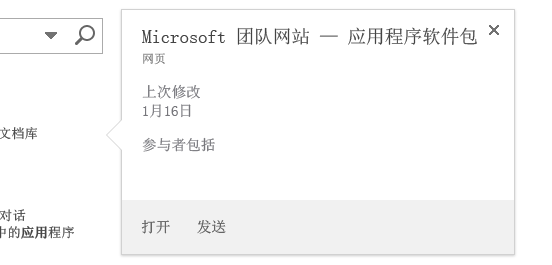
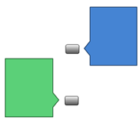
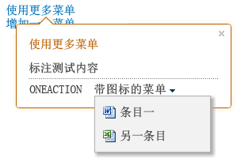

# 用标注控件突出显示内容和增强 SharePoint 托管的 SharePoint 外接程序的功能
通过 SharePoint 标注控件，可以灵活地与用户交互并展示 SharePoint 承载的应用程序的功能。您可以用多种方式配置它以适合应用程序的 UI。本文为您展示了如何构建此控件、将其添加到页面以及自定义其外观和行为。当您在 SharePoint 2013 网站中搜索时，您将会看到标注控件的操作示例，每当您将鼠标光标悬停在搜索结果时，就会弹出标注控件。图 1 显示了单个搜索结果的标注，还显示了内容控件中的几个典型部分：标题、关于页面上项目的一些信息以及您可以对项目执行的操作（"打开"和"发送"）。在本例中，信息和操作相对简单，但您已经看到使用它的两个优点。首先，它会让您展示关于页面中元素的附加信息（如果需要的话）；其次，它可以让您轻松地向页面添加功能。 
**图 1. SharePoint 2013 搜索结果页上的标注控件示例**

  
    
    

  
    
    

  
    
    

  
    
    

  
    
    

## 通过包含 callout.js 文件使控件对您的 HTML 页面可用
<a name="GettingStarted"> </a>

此示例使用了  `SP.SOD.executeFunc` 方法，以确保在您运行任何依赖该脚本文件的代码之前加载该脚本文件。
  
    
    

```

SP.SOD.executeFunc("callout.js", "Callout", function () {
    });
```

您传递给  `SP.SOD.executeFunc` 函数的函数包含在 callout.js 文件加载后要运行的代码。加载这些文件后，使用 `CalloutManager` 对象为每个需要有与之关联的标注控件的页面元素创建一个 `Callout` 对象。 `CalloutManager` 是一个单方对象，用于在关联矩阵内存储对页面上每个 `Callout` 对象的引用。 `Callout` 对象只有两个必需的成员： `ID` 和 `launchPoint`。 `ID` 成员是映射到 `Callout`:  `CalloutManager` 中 `CalloutManager["value of the callout's ID member"]` 的对象的关键字。 `launchPoint` 成员是一个 HTML 页面元素。例如，您可以在页面上创建或获取一个 `div` 元素并将它作为 `Callout` 对象的成员进行传递。默认情况下，每当用户单击 `launchPoint` 元素时，都会显示标注控件。此示例为您显示了如何只使用两个必需成员和一个标题字符串创建尽可能简单的标注控件。
  
    
    



```

var calloutPageElement = document.createElement("div");
var callout = CalloutManager.createNew({
   ID: "unique identifier",
   launchPoint: calloutPageElement,
   title: "callout title"
});

```

每当用户单击页面元素时，该特定标注控件都会弹出并在控件顶部显示标题。您可以通过一些非常有效的方式，使用可选成员自定义控件的外观、行为、位置和操作。标注控件还有一个 set 方法，您可以在创建控件示例后用该方法为任何参数设定一个值。
  
    
    



```

callout.set({openOptions:{event: "hover"}});
```

您还可以为  `CalloutOptions` 对象中的所有标注成员设置值并将该对象传递给 `createNew` 方法。
  
    
    



```
var calloutPageElement = document.createElement("div");
var calloutOptions = new CalloutOptions();
calloutOptions.ID = unique identifier;
calloutOptions.launchPoint = calloutPageElement;
calloutOptions.title = callout title;
var callout = CalloutManager.createNew(calloutOptions);
```


## 如何自定义标注控件的外观
<a name="Appearance"> </a>

您可以使用这些成员控制标注的显示。
  
    
    


|**成员**|**目的**|**有效值（默认以粗体显示）**|
|:-----|:-----|:-----|
|Title  <br/> |在控件顶部显示标题。  <br/> |字符串， **null** ，包含 HTML 的字符串 <br/> |
|Content  <br/> |每当  `contentElement` 成员没有值时，在控件内显示 HTML。 <br/> |包含 HTML 的字符串， **null** ，如果 `contentElement` 具有值则必须为空。 <br/> |
|contentElement  <br/> |当  `content` 成员没有值时，在控件内显示一个 HTML 元素。 <br/> |任何 HTML 元素， **null** ，如果 `content` 具有值则必须为空。 <br/> |
|contentWidth  <br/> |以像素为单位指定标注体容器的宽度。该容器还有一个 1 像素的边框并以 15 像素填充每一侧，因此该控件的宽度比您指定的宽度宽 32 像素。该控件的 CSS  `overflow` 属性设置为 `hidden`，因此如果您的内容不适合您所指定的宽度，就会被剪切掉。如果您在一个开放标注中设置该成员，则更改会立刻生效。该规则对其他成员无效。  <br/> |240 和 610 之间的任意数字， **350** （默认情况下，控件宽度设为 382 像素） <br/> |
|beakOrientation  <br/> |指定标注控件的尖角或指针的方向。  <br/> |**topBottom** ，显示如下（图 2）： **图 2. 显示的标注控件的尖角为 topBottom 方向**          **leftRight** ，显示如下（图 3）： **图 3. 显示的标注控件的尖角为 leftright 方向**         |
   

## 如何自定义标注控件的行为
<a name="Behavior"> </a>

您可以使用以下方法控制标注的行为。首先是非常重要的  `openOptions` 成员，因为它允许您指定当用户与控件在页面上交互时如何打开和关闭控件。
  
    
    


|**对  `openOptions` 成员使用这些值**|**目的**|
|:-----|:-----|
|**{event: "click", closeCalloutOnBlur: true}** <br/> |当用户用鼠标单击  `launchPoint` 元素时，显示标注控件；当用户将鼠标移开 `launchPoint` 元素时，关闭标注控件。因为 `event` 的值为 `click`， `showCloseButton` 选项的值默认为 **true** 且无法更改。此为值的默认组合。 <br/> |
| `{event: "hover", showCloseButton: true}` <br/> |当用户将鼠标停留在  `launchPoint` 元素上时，显示标注控件；当用户单击标注控件右上角的 **X** 按钮时，关闭该控件。因为 `event` 的值为 `hover`， `closeCalloutOnBlur` 的值不适用且无法设置。 <br/> |
| `{event: "click", closeCalloutOnBlur: false}` <br/> |当用户将鼠标停留在  `launchPoint` 元素上时，显示标注控件；当用户单击标注控件右上角的 **X** 按钮时，关闭该控件。因为 `event` 的值为 `click`， `showClosebutton` 的值默认为 **true** 且无法更改。 <br/> |
   
您还可以设置其他成员来控制标注的行为。
  
    
    


|**使用此成员**|**目的**|**有效值（默认以粗体显示）**|
|:-----|:-----|:-----|
|onOpeningCallback  <br/> |执行在标注控件在页面上呈现之前必须发生的操作。因为  `Callout` 对象必须作为参数传递给您提供的函数，所以您可以在控件呈现之前使用该成员为该控件的任何属性设置值。您还可以使用该成员进行添加或更改控件内容的异步操作。您一次只能为该成员设置一个值。 <br/> | `function(callout /*=Callout*/) {...}`, **null** <br/> |
|onOpenedCallback  <br/> |执行在标注控件生动地呈现在页面上之后必须发生的操作。您可以使用该成员操纵控件的文档对象模型 (DOM)。您一次只能为该成员设置一个值。  <br/> | `function(callout /*=Callout*/) {...}`, **null** <br/> |
|onClosingCallback  <br/> |执行在标注控件正在关闭但还未从页面中完全删除之前必须发生的操作。您一次只能为该成员设置一个值。  <br/> | `function(callout /*=Callout*/) {...}`, **null** <br/> |
|onClosedCallback  <br/> |执行在标注控件已关闭并且已经从页面中删除之后必须发生的操作。您一次只能为该成员设置一个值。  <br/> | `function(callout /*=Callout*/) {...}`, **null** <br/> |
   

## 如何使用标注控件方法
<a name="CalloutMethods"> </a>

您可以使用这些方法自定义标注控件的行为。
  
    
    


|**使用此方法**|**目的**|**有效参数值**|
|:-----|:-----|:-----|
|set({member:value})  <br/> |构造控件的实例后，为成员设置值。  <br/> |一个名称/值对，用于为任何标注控件成员定义值。  <br/>```var callout = new Callout({openOptions:{event: "click"}});callout.set({openOptions:{event: "hover"}});```|
|getOrientation()  <br/> |返回一个指示标注控件指向的  `CalloutOrientation` 对象。该对象具有四个布尔型成员： `up`、 `down`、 `left` 和 `right`。打开该控件时，其中两个值将为 **true** ，两个值将为 **false** （例如 `up` 和 `right`）。  <br/> |无参数  <br/> |
|addEventCallback(string eventName, CalloutCallback callback  <br/> |注册一个回调函数，每当标注控件更改为  `eventName` 参数指定的状态时，即调用该函数。 <br/> | `eventName` 参数必须采用下列值之一： `opening`、 `open`、 `closing` 和 `closed`。 `callback` 参数必须是一个将标注控件的实例作为其第一个参数的函数。 <br/> |
|open()  <br/> |显示控件。如果该控件已打开或正在打开，此方法返回 **false** 且不执行任何操作。 <br/> |无参数  <br/> |
|close(bool useAnimation)  <br/> |隐藏控件。如果该控件已关闭或正在关闭，此方法返回 **false** 且不执行任何操作。 <br/> |用于指定控件关闭时是否具有动画的布尔值。动画默认是关闭的。  <br/> |
|toggle()  <br/> |切换控件的打开/关闭状态。  <br/> |无参数  <br/> |
|addAction(CallOutAction calloutAction)  <br/> |为标注控件的  `CalloutAction` 对象数组添加一个新的 `CalloutAction` 对象。这些对象定义要在控件的页脚中显示的操作。 [如何将操作添加到标注控件](#AddActions)一节阐述了如何构造这些对象。只有在创建控件实例之后才能添加操作。该控件最多只能有三个操作，如果您尝试添加更多操作，则会出现异常。  <br/> |一个  `CalloutAction` 对象。 <br/> |
|refreshActions()  <br/> |重新加载已添加到控件中的所有操作。您可以在控件打开时使用此方法更改、启用或禁用操作。  <br/> |无参数  <br/> |
   

## 如何将操作添加到标注控件
<a name="AddActions"> </a>

您可以在创建标注控件的实例之后添加操作。一个标注操作可以包含单个操作，也可以包含以菜单形式提供的一系列操作。您最多可以为一个标注控件添加三个操作。一旦您创建了一个标注操作，即可通过其  `addAction` 方法将其添加到 `CalloutControl` 对象。当用户单击文本后，此示例操作会在您的浏览器中打开一个新窗口。
  
    
    

```

//Create CalloutAction
var calloutAction = new CalloutAction({
            text: "Open window"
            onClickCallback: function() {                
                window.open(url);
            }
        });

//Add Action to an instance of the CalloutControl        
        myCalloutControl.addAction(calloutAction);
```

您还可以为  `CalloutActionOptions` 对象中的所有 `CalloutAction` 成员设置值，并将该对象传递给 `CalloutAction` 构造函数。
  
    
    



```

//Create CalloutAction
var calloutActionOptions = new CalloutActionOptions();
calloutActionOptions.text = "Open window";
actionOptions.onClickCallback = function() {
    window.open(url);
};
var calloutAction = new CalloutAction(calloutActionOptions);

//Add Action to an instance of the CalloutControl        
        myCalloutControl.addAction(calloutAction);
```

您可以使用这些成员定义标注操作的行为。
  
    
    


|**使用此成员**|**目的**|**有效值（默认以粗体显示）**|
|:-----|:-----|:-----|
|text (required)  <br/> |显示该操作的文本标签。  <br/> |字符串， **null** <br/> |
|onClickCallback  <br/> |定义当用户单击标注操作标签时发生的操作。  <br/> | `function(calloutAction /*=CalloutAction*/) {...}`, **null** <br/> |
|isEnabledCallback  <br/> |定义一个回调函数，它在标注显示之前运行并确定是否启用操作。如果此函数返回 **true** ，则标注显示已启用的操作。如果返回 **false** ，则标注显示操作文本，但禁用该操作。 <br/>  `function(calloutAction /*=CalloutAction*/) {...}`, **null** <br/> |
|isVisibleCallback  <br/> |定义一个回调函数，它在标注显示之前运行并确定是否显示操作文本。如果此函数返回 **true** ，则标注显示操作文本。如果返回 **false** ，则标注隐藏操作文本。其他操作将向左移动以取代隐藏的操作。 <br/> | `function(calloutAction /*=CalloutAction*/) {...}`, **null** <br/> |
|tooltip  <br/> |当用户将光标停留在标注操作文本上时显示文本。  <br/> |字符串， **null** <br/> |
|disabledTooltip  <br/> |当用户将光标停留在标注操作文本上且已禁用标注操作时显示文本（当  `isEnabledCallback` 函数返回 **false** 时）。 <br/> |字符串， **null** <br/> |
|menuEntries  <br/> |定义以菜单形式表示的一系列操作而不是单个操作。下一节阐述了如何创建  `CalloutActionMenuEntry` 及如何将其添加到 `CalloutAction` 对象。 <br/> |[ `CalloutActionMenuEntry`, ...], null  <br/> |
   

### 如何将操作菜单添加到标注控件

当一个标注操作包含一个菜单而不是单个操作时，用户可以看到标注操作文本旁边有一个下拉箭头，如图 4 所示。
  
    
    

**图 4. 当用户单击操作标签旁边的箭头时，标注操作显示一个菜单**

  
    
    

  
    
    

  
    
    
您可以创建任意多个菜单项，并通过将它们作为  `CalloutAction` 对象的 `menuEntries` 成员的值传递到数组中，将其添加到标注操作。
  
    
    



```

//Create two menu entries.
var menuEntry1 = new CalloutActionMenuEntry("Entry One", calloutActionCallbackFunction, "/_layouts/images/DOC16.GIF");
var menuEntry2 = new CalloutActionMenuEntry("Some Other Entry", calloutActionCallbackFunction, "/_layouts/images/XLS16.GIF");

//Add the menu entries to the callout action.
var calloutAction = new CalloutAction({
   text: "MENU W/ ICONS",
   menuEntries: [menuEntry1, menuEntry2]
})

//Add the callout action to the callout control.
callout.addAction(calloutAction);

```

 `CalloutActionMenuEntry` 构造函数有三个参数。前两个参数都是必需的。第三个是可选的，但非常有用，因为它允许您显示带有文本的图标。
  
    
    

- 传递一个字符串作为第一个参数以显示每个菜单项的文本标签。
    
  
- 传递一个函数作为第二个参数以定义当用户单击菜单项文本时发生的操作。
    
  
- 将一个包含要显示的图标的 URL 的字符串传递到文本标签的左边。
    
  

## 如何使用 CalloutManager 创建和管理标注控件的实例
<a name="UseCalloutManager"> </a>

 `CalloutManager` 单例对象存储对页面上每个 `Callout` 对象的引用。它将标注控件的每个实例存储在一个关联数组中，其中每个控件的 `ID` 值为关键字。 `CalloutManager` 包含可以帮助您创建和管理它所存储的 `Callout` 对象的方法。
  
    
    


|**使用此方法**|**目的**|**有效参数值**|
|:-----|:-----|:-----|
|createNew(members)  <br/> |创建一个新的  `Callout` 对象。当您这样做时， `CalloutManager` 在其关联数组中添加该控件的条目，并使用所需成员 `ID` 的值作为关键字。 <br/> |一个关联数组，它将值分配给要使用的每个成员。 `ID` 和 `launchPoint` 成员是必需的。 <br/> |
|createNewIfNecessary (members)  <br/> |如果作为参数传递的  `launchPoint` 没有分配给它的标注控件，则创建 `Callout` 对象。 <br/> |一个关联数组，它将值分配给要使用的每个成员。 `ID` 和 `launchPoint` 成员是必需的。 <br/> |
|getFromLaunchPoint: function (/*@type(HTMLElement)*/launchPoint)  <br/> |获取与函数中提供的  `launchPoint` 相关联的 `Callout` 对象。如果 `launchPoint` 没有分配给它的 `Callout` 对象，此方法将引发异常。 <br/> |无参数  <br/> |
|getFromLaunchPointIfExists: function (/*@type(HTMLElement)*/launchPoint)  <br/> |获取与函数中提供的  `launchPoint` 相关联的 `Callout` 对象。如果 `launchPoint` 没有分配给它的 `Callout` 对象，此方法将返回 null。 <br/> |无参数  <br/> |
|getFromCalloutDescendant: function (/*@type(HTMLElement)*/descendant)  <br/> |获取与给定元素的函数中提供的 HTML 元素相关联的  `Callout` 对象。该元素可以是 callout 元素的任何子代。例如您可以传递创建 `Callout` 对象时分配的 `contentElement` 成员的值。如果该子代没有与其相关联的 `Callout` 对象，此方法将引发异常。 <br/> |无参数  <br/> |
|closeAll()  <br/> |关闭所有打开的  `Callout` 对象。如果关闭至少一个 callout，此方法返回 true。 <br/> |无参数  <br/> |
|isAtLeastOneCalloutOpen()  <br/> |检查是否还有 callout 是打开的。  <br/> |无参数  <br/> |
   

## 如何定位页面上的标注控件
<a name="Positioning"> </a>


|**使用此成员**|**目的**|**有效值（默认以粗体显示）**|
|:-----|:-----|:-----|
|boundingBox  <br/> |指定将用作标注控件的  `offsetParent` 等效项的 HTML 元素。默认情况下，该元素的默认值为标注控件的 `offsetParent`，但是您可以用该成员确保控件准确定位。标注控件会尝试自我定位以在该框中显示。它将改变方向（根据尖角的方向，从顶部变到底部或从左变为右）以保持在框中可见。  <br/> |任何 HTML 元素， **包含标注控件的 HTML 元素的 offsetParent** <br/> |
|positionAlgorithm  <br/> |重写标注控件的默认定位算法。下一节介绍如何使用  `calloutPositioningProxy` 对象编写标注控件的定位算法。 <br/> |**CalloutOptions.prototype.defaultPositionAlgorithm**, `function(calloutPositioningProxy) { ... }` <br/> |
   

### 如何用 calloutPositioningProxy 编写定位算法

 `calloutPositioningProxy` 对象包含可用于重写标注控件默认使用的定位逻辑的方法和属性。例如，如果您想让控件始终显示在 `launchPoint` 元素的右下方，可以编写一个如下所示的定位算法。
  
    
    

```

function alwaysGoDownAndRight(calloutPositioningProxy)  {
    calloutPositioningProxy.moveDownAndRight();
} 

```

然后将该函数作为  `Callout` 对象的 `positionAlgorithm` 成员的值进行传递。您可以在创建 `Callout` 时或在以后设置值时执行该操作。
  
    
    



```

callout.set({positionAlgorithm: alwaysGoDownAndRight});

```

您始终可以通过启动浏览器的 JavaScript 控制台（如 Internet Explorer F12 开发人员工具）查看默认定位逻辑。
  
    
    



```

CalloutOptions.prototype.positionAlgorithm.toString()
```

您可以在  `CalloutPositioningProxy` 对象中使用这些方法编写自己的定位逻辑。
  
    
    


|**方法**|**说明**|
|:-----|:-----|
|isCalloutTooFarTop()  <br/> |返回 Boolean 类型的值。  <br/> |
|isCalloutTooFarRight()  <br/> |返回 Boolean 类型的值。  <br/> |
|isCalloutTooFarBottom()  <br/> |返回 Boolean 类型的值。  <br/> |
|isCalloutTooFarLeft()  <br/> |返回 Boolean 类型的值。  <br/> |
|isCalloutLeftOfHardBoundingBox()  <br/> |返回 Boolean 类型的值。如果返回值为 **true**，则将该控件的左侧放置在其容器元素的外面。此控件部分不可见，用户也无法滚动到该位置。  <br/> |
|isCalloutRightOfHardBoundingBox()  <br/> |返回 Boolean 类型的值。如果返回值为 **true**，则将该控件的右侧放置在其容器元素的外面。该控件部分不可见，用户也无法滚动到该位置。  <br/> |
|isCalloutAboveHardBoundingBox()  <br/> |返回 Boolean 类型的值。如果返回值为 **true**，则将该控件的顶部放置在其容器元素的外面。此控件部分不可见，用户也无法滚动到该位置。  <br/> |
|isCalloutBelowHardBoundingBox()  <br/> |返回 Boolean 类型的值。如果返回值为 **true**，则将该控件的底部放置在其容器元素的外面。此控件部分不可见，用户也无法滚动到该位置。  <br/> |
|isOrientedUp()  <br/> |返回 Boolean 类型的值。  <br/> |
|isOrientedDown()  <br/> |返回 Boolean 类型的值。  <br/> |
|isOrientedLeft()  <br/> |返回 Boolean 类型的值。  <br/> |
|isOrientedRight()  <br/> |返回 Boolean 类型的值。  <br/> |
|moveUpAndRight()  <br/> |不返回任何值。改变控件的方向。  <br/> |
|moveUpAndLeft()  <br/> |不返回任何值。改变控件的方向。  <br/> |
|moveDownAndRight()  <br/> |不返回任何值。改变控件的方向。  <br/> |
|moveDownAndLeft()  <br/> |不返回任何值。改变控件的方向。  <br/> |
|moveTowardsOppositeQuadrant()  <br/> |不返回任何值。改变控件的方向。  <br/> |
|flipHorizontal()  <br/> |不返回任何值。改变控件的方向。  <br/> |
|flipVertical()  <br/> |不返回任何值。改变控件的方向。  <br/> |
|numberOfEdgesCollidingWithBoundingBox()  <br/> |返回一个 0 到 4 之间的整数，代表标注与可见的绑定框发生冲突的边界数。例如，如果当您调用  `moveUpAndRight()` 方法后，控件的顶端被文档的顶端截断，则 `numberOfEdgesCollidingWithBoundingBox()` 方法返回一个大于 1 的数字。 <br/> |
   
这种定位算法使得控件位于文本的上方或下方。 `CalloutPositioningProxy` 的 `isRTL` 属性告诉您该文本是否显示为从右到左的语言。检查此属性以确保该控件相对于页面上文本的定位始终正确。
  
    
    



```
function examplePositionAlgorithm(calloutPositioningProxy) {
    if (!calloutPositioningProxy.isRTL) {
        calloutPositioningProxy.moveDownAndRight();
        if (calloutPositioningProxy.isCalloutTooFarBottom()) {
            calloutPositioningProxy.moveUpAndRight();
        }
    }
    else {
        calloutPositioningProxy.moveDownAndLeft();
        if (calloutPositioningProxy.isCalloutTooFarBottom()) {
            calloutPositioningProxy.moveUpAndLeft();
        }
    }
}
callout.set({positionAlgorithm: examplePositionAlgorithm});

```

这种定位算法将控件的默认方向更改为  `downAndRight` 而不是 `upAndRight`，但如果有任何冲突，它将使用默认算法。
  
    
    



```

function tryDownAndRightThenGoDefault(calloutPositioningProxy) {
    if (!calloutPositioningProxy.isRTL)
        calloutPositioningProxy.moveDownAndRight();
    else
        calloutPositioningProxy.moveDownAndLeft();
    
    if (calloutPositioningProxy.numberOfEdgesCollidingWithBoundingBox() > 0)
        return CalloutOptions.prototype.positionAlgorithm.apply(this, arguments);
};
callout.set({positionAlgorithm: tryDownAndRightThenGoDefault});

```


## 其他资源
<a name="bk_addresources"> </a>


-  [SharePoint 2013：在 SharePoint 托管外接程序中使用列表视图、标注和对话框](http://code.msdn.microsoft.com/officeapps/SharePoint-2013-Use-list-cb3e4e14)
    
  
-  [开始创建 SharePoint 承载的 SharePoint 外接程序](get-started-creating-sharepoint-hosted-sharepoint-add-ins.md)
    
  
-  [使用 Napa Office 365 开发工具创建 SharePoint 托管的基本的外接程序](create-a-basic-sharepoint-hosted-add-in-by-using-napa-office-365-development-too.md)
    
  
-  [SharePoint 外接程序的 UX 设计](ux-design-for-sharepoint-add-ins.md)
    
  

  
    
    
