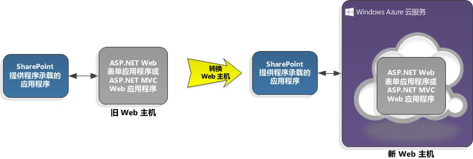

# 在 Microsoft Azure 云服务中承载 SharePoint 2013 加载项
了解如何在 Microsoft Azure 云服务（而非 Web 应用）中托管提供程序托管的 SharePoint 外接程序，如何将 SharePoint 外接程序添加到 Azure Web 角色，以及托管在 Azure 上可能比托管在 Web 应用上更好的原因。
 * **适用范围：*** 

|||
|:-----|:-----|
|**本文内容**          [先决条件](#SP15createselfhostapp_bk_prereq)           [如何在 Azure 云服务上托管 SharePoint 外接程序](#SP15HostAzure_bk_HowTo)           [为何使用 Azure？](#SP15HostAzure_bk_Why)           [其他资源](#SP15Devapps_AddtionalResources)||
 

## 先决条件

-  [开始创建提供程序承载的 SharePoint 加载项](get-started-creating-provider-hosted-sharepoint-add-ins.md) 的先决条件。

- 适用于 .NET (VS 2012) 1.8.1 的 Microsoft Azure SDK，可以使用  [Web 平台安装程序](http://www.microsoft.com/web/downloads/platform.aspx)进行安装。

## 如何在 Azure 云服务上托管 SharePoint 外接程序

### 将云服务添加到现有外接程序

如果已经拥有要托管在 Azure 中的提供程序托管的 SharePoint 外接程序，选择 SharePoint 外接程序解决方案中的 Web 应用项目。在菜单栏中，依次选择"项目"、"添加 Microsoft Azure 云服务项目"。一个名为  _NameOfTheWebAppProject_.Azure 的 Azure 项目将添加到 SharePoint 外接程序解决方案。Web 项目的一个 Web 角色也将添加到 Azure 云服务项目。Visual Studio 2012 Office 开发人员工具 设置必要的项目属性，以便 Web 角色用于 SharePoint 外接程序。

图 1 显示了 SharePoint 外接程序如何转换为使用 Azure 云服务。

**图 2. 将 SharePoint 外接程序转换为使用 Azure 云服务**

### 将外接程序添加到现有 Web 角色

如果要用作提供程序托管的 SharePoint 外接程序主机的 Azure 云服务中已经有 Web 角色，在 Visual Studio 中打开 Azure 云项目，然后在"解决方案资源管理器"中，选择 Web 角色项目。在菜单栏中，依次选择"项目"、"添加用于 SharePoint 项目的外接程序"。将为提供程序托管的 SharePoint 外接程序创建一个项目，名为  _NameOfTheWebAppProject_.Azure，并添加到解决方案。Visual Studio 引用 Azure Web 角色作为 SharePoint 外接程序的 Web 项目主机。

图 2 显示了如何将 SharePoint 外接程序添加到现有 Web 角色。

**图 2. 将 SharePoint 外接程序添加到现有 Web 角色**

## 为何使用 Azure？

通过将提供程序托管的 SharePoint 外接程序的 Web 应用程序迁移到 Azure 云服务，可以利用 Azure 的托管服务和可扩展性。还可以提高 SharePoint 外接程序的性能和可用性，尤其是在外接程序经常使用或者需要随着时间进行更改的情况下。可以在 Azure 中运行 Web 应用程序，只需对现有 SharePoint 外接程序进行细微的更改。从本质上说，Azure Web 角色是一个基于 Internet Information Services (IIS) 并且托管在 Azure 中的网站。

若要了解 Azure 如何提供帮助，就需要一些背景信息。基于云的（即提供程序托管的） SharePoint 外接程序项目通常与 Web 应用程序项目，或"Web 应用"相关联。Web 应用在 SharePoint 场外部部署和托管。提供程序托管的 SharePoint 外接程序通过 Web 应用中的服务与 SharePoint 网站交互，也可以使用位于远程网站上的资源和服务。

请参阅以下链接获取更多信息。

-  [SharePoint 外接程序体系结构的重要方面和开发前景](important-aspects-of-the-sharepoint-add-in-architecture-and-development-landscap.md)

-  [什么是云服务？](http://www.windowsazure.com/zh-cn/manage/services/cloud-services/what-is-a-cloud-service/)

-  [为开发和托管 SharePoint 外接程序选择模式](choose-patterns-for-developing-and-hosting-your-sharepoint-add-in.md)

-  [介绍 Microsoft Azure](http://www.windowsazure.com/zh-cn/develop/net/fundamentals/intro-to-windows-azure/)

您的 SharePoint 外接程序的 Web 应用可能位于需要对硬件、设施和人员进行维护的本地服务器场中。Azure 将为您处理一切，减少扩展和维护服务器场的费用和麻烦。如果 SharePoint 外接程序需要更多服务器资源，Azure 可以动态地将它们分配给外接程序。通过将 SharePoint 外接程序转换为使用 Azure 云服务，为您的外接程序提供了更多的扩展空间。请参阅 [自动扩展和 Microsoft Azure](http://msdn.microsoft.com/en-us/library/hh680945%28v=pandp.50%29.aspx)。

如果 Azure 中已经有 Web 角色，可以通过将其设为 SharePoint 外接程序主机对其加以利用，而不用创建新的 Web 角色。还可以将您的网站打包成 SharePoint 外接程序，然后将其发布在 Office 商店上，这样可能会让更多客户看到您的网站。

## 其他资源

-  [什么是 Microsoft Azure？](http://www.windowsazure.com/zh-cn/documentation/)

-  [如何创建和部署云服务](http://www.windowsazure.com/zh-cn/manage/services/cloud-services/how-to-create-and-deploy-a-cloud-service/)

-  [将 ASP.NET Web 应用程序部署到 Microsoft Azure 网站](http://www.windowsazure.com/zh-cn/develop/net/tutorials/get-started/)

-  [在 Microsoft Azure 网站、Web 角色和 VM 之间进行选择](http://dotnetthread.com/articles/30-Choosing-between-Windows-Azure-Web-Sites-Web-Roles-and-VMs.aspx)

  