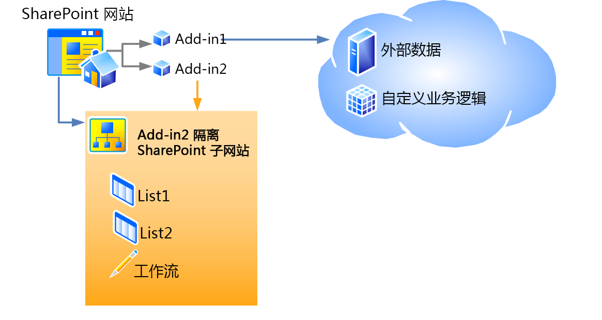

# SharePoint 2013 中的主机 Web、外接程序 Web 和 SharePoint 组件
了解主机 Web 和外接程序 Web 之间的差异。了解 SharePoint 外接程序中可以包括哪些 SharePoint 2013 组件、将哪些组件部署到主机 Web、将哪些组件部署到外接程序 Web 以及如何将外接程序 Web 部署到隔离域中。
## 主机 Web、外接程序 Web 以及独立的域
<a name="IsolatedDomain"> </a>

在网站上安装包括 SharePoint 组件的外接程序时，会在可从中启动该外接程序的"网站内容"页面上列出该外接程序。该列表是外接程序的启动点，虽然可以根据需要向网站添加某些其他内容，如自定义操作或外接程序部件，但是此列表是唯一必需添加到网站中的内容。有关这些选项的信息，请参阅 [从 UI 访问加载项](important-aspects-of-the-sharepoint-add-in-architecture-and-development-landscap.md#AccessingApp)。除了这些 UI 元素之外，诸如列表、内容类型、工作流和页面之类的 SharePoint 外接程序组件和内容会部署到特殊独立域内的不同网站中。用户基本上不知道这个事实。外接程序所 *部署*  到的特殊网站称为外接程序 Web。外接程序所 *安装*  到的网站称为主机 Web。虽然外接程序 Web 具有它自己的独立域，但它与主机 Web 在相同的网站集中。（在使用租户作用域安装外接程序时不遵循此规则。在此情况下，外接程序 Web 在公司外接程序目录的网站集中）。 
  
    
    
图 1 显示安装了两个 SharePoint 外接程序的主机 Web。外接程序 1 具有远程组件，但没有 SharePoint 组件，因此它没有外接程序 Web。外接程序 2 没有远程组件，但它具有两个 SharePoint 列表和一个工作流。这些内容已经部署到独立的子网站中。（虽然此图中的任何外接程序都没有远程组件和 SharePoint 托管的组件，但 SharePoint 外接程序可以具有这些组件）。
  
    
    

**图 1：具有提供程序托管的外接程序和 SharePoint 托管的外接程序的主机 Web**

  
    
    

  
    
    

  
    
    
例如，假设在具有以下 URL 的主机网站上安装了一个外接程序，此外接程序不仅仅具有 UI 元素，还具有可以部署到主机 Web 的 SharePoint 组件：
  
    
    
 `https://www.fabrikam.com/sites/Marketing`
  
    
    
SharePoint 外接程序将部署到新创建的网站，此网站具有如下所示的 URL：
  
    
    
 `http://add-in-bdf2016ea7dacb.fabrikamadd-ins.com/sites/Marketing/Scheduler`
  
    
    
请注意，此 URL 具有以下结构：
  
    
    
 `https://` _Add-in_Prefix_ `-` _Add-in_ID_ `.` _Add-in_Base_Domain_ `/` _Domain_Relative_URL_of_Host_Web_ `/` _Add-in_Name_
  
    
    
占位符定义如下：
  
    
    

-  _Add-in_Prefix_ 是管理中心场管理员设置的任何字符串。默认值为"default"。在此示例中，管理员已经将此值更改为"add-in"。
    
  
-  _Add-in_ID_ 是安装外接程序时在内部生成的十六进制数值。
    
  
-  _Add-in_Base_Domain_ 是管理中心场管理员设置的或用 SharePoint Management Shell 设置的任何字符串。此字符串 *不*  应设为 SharePoint Web 应用程序的子域或很大程度上击败外接程序隔离的目的。在此示例中，管理员已经删除了"www."并且将"外接程序"添加到公司名称中。因此 `fabrikamadd-ins.com` 是外接程序基域。
    
  
-  _主机 Web 的域相对 URL_ 是父主机 Web 的相对 URL，在本例中为 `sites/Marketing`。
    
  
-  _Add-in_Name_ 是 appmanifest.xml 文件中 **App** 元素的 **Name** 属性的值。
    
  
将 SharePoint 组件部署到外接程序 Web 而不是部署到主机 Web 有两个主要的原因。这两个原因都与安全性相关。
  
    
    

- **外接程序权限强制：**在 SharePoint 外接程序的模型 中，外接程序具有其自己的标识，并且具有权限，这些权限未必与执行该外接程序的用户的权限相同。安装外接程序时会请求这些外接程序权限，并且这些权限由安装外接程序的人员授予，前提是人员具有外接程序请求的所有权限。（如果正在安装外接程序的用户没有外接程序请求的所有权限，则用户无法安装外接程序。）通过为每个外接程序提供其自己的域，SharePoint 2013 可以可靠地标识外接程序提出的请求，并验证外接程序的权限。有关外接程序权限的详细信息，请参阅 [加载项权限](important-aspects-of-the-sharepoint-add-in-architecture-and-development-landscap.md#AppPermissions)。
    
  
- **跨域脚本安全性：**对于 JavaScript 方法调用，现代浏览器支持"相同的源策略"。通过将每个 SharePoint 外接程序部署到其自己的域，SharePoint 可以利用浏览器的相同源策略，以确保 SharePoint 外接程序中的 JavaScript 不会执行任何其他域（从最终用户的角度来看，包括在其中安装了该外接程序的域）中的任何 JavaScript。
    
    SharePoint 还提供了一种安全地克服策略限制的方法。此外，这可以使 SharePoint 外接程序的远程组件能够从主机和外接程序 Web 的共同父租赁的任何网站中查询数据。有关详细信息，请参阅 [使用跨域库从外接程序访问 SharePoint 2013 数据](access-sharepoint-2013-data-from-add-ins-using-the-cross-domain-library.md)。
    
  

## 可位于 SharePoint 外接程序中的 SharePoint 组件的类型
<a name="TypesOfSPComponentsInApps"> </a>

通常，SharePoint 外接程序可以包含以下列表中的一个或多个组件。必须在 SharePoint 解决方案包 (.wsp) 文件内部的 **Web** 范围功能中部署这些组件，但有一些例外：
  
    
    

> **注释**
> ***** 本文后面的 [关于部署 SharePoint 组件的警告](#SpecialCases)部分中会更加详细地讨论标有星号 (*) 的组件。 
  
    
    


- 功能（仅限 **Web** 范围）
    
  
- 自定义的操作（包括快捷菜单项和功能区自定义）*
    
  
- 远程事件接收器*
    
  
- 引用 SharePoint 中所包含的 Web 部件（包括外接程序部件，但不是自定义 Web 部件）的标记*
    
  
- 要供 SharePoint 页面使用的自定义级联样式表 (CSS) 文件
    
  
- 要供 SharePoint 页面使用的自定义 JavaScript 文件
    
  
- 模块（文件集）
    
  
- 页面
    
  
- 列表模板
    
  
- 列表和库实例
    
  
- 自定义列表表单
    
  
- 自定义列表视图
    
  
- 自定义内容类型
    
  
- 字段（属于 SharePoint 中内置字段类型）
    
  
- Microsoft Business Connectivity Services (BCS) 模型（仅限 **Web** 范围）、基于此模型的外部内容类型以及使用内容类型的外部列表。*
    
  
- 工作流*
    
  
- 属性包
    
  
- Web 模板（但不是网站定义）*
    
  
在 SharePoint 外接程序中无法部署其他类型的 SharePoint 组件。有关 SharePoint 外接程序中可包含的内容的限制的详细信息，请参阅 [SharePoint 加载项与 SharePoint 解决方案比较](http://msdn.microsoft.com/library/0e9efadb-aaf2-4c0d-afd5-d6cf25c4e7a8%28Office.15%29.aspx)。
  
    
    

## 关于部署 SharePoint 组件的警告
<a name="SpecialCases"> </a>

以下是关于在外接程序中部署某些类型的 SharePoint 组件的一些警告和详细信息： 
  
    
    

- **自定义操作：**除了可以将自定义操作添加到外接程序 Web 中之外，也可以将其添加到主机 Web 中。为了将自定义操作添加到外接程序 Web 中，您可以将其包括在 .wsp 文件内的 **Web** 范围功能中，就像可包括添加到外接程序 Web 中的任何其他组件一样。为了将自定义操作添加到主机 Web 中，您可以（甚至在外部外接程序中）将 **CustomAction** 标记包括在位于外接程序包内但在任何 .wsp 文件之外的功能中。此类"散装"功能中的组件适用于主机 Web，不适用于外接程序 Web，因此此类型的功能称为主机 Web 功能。 
    
  
- **Web 部件：**可以在外接程序中部署一种 Web 部件（外接程序部件），外接程序部件可以转至外接程序 Web 或主机 Web。在外接程序中可以引用所有其他类型的 Web 部件，但外接程序不会部署这些部件。如果将外接程序部件部署到主机 Web，则应该将其包括在主机 Web 功能中。
    
  
- **远程事件接收器：**这些是 SharePoint 2013 中的新增内容，它们与经典的 SharePoint 事件接收器相似，不同的是代码在云中运行。在 SharePoint 托管的外接程序中无法使用这些接收器。
    
  
- **工作流：**SharePoint 2013 中的工作流使用 Microsoft Azure 托管的工作流运行时，此工作流运行时是 SharePoint 2013 中的新增内容。使用 SharePoint 承载的工作流运行时的编码工作流无法包括在 SharePoint 外接程序中。只允许存在声明性工作流或使用较新运行时的工作流。
    
  
- **Microsoft Business Connectivity Services (BCS) 模型、外部内容类型和外部列表：**Business Data Connectivity (BDC) 服务 模型通常具有一个比网站集更宽的作用域。但是，在外接程序中部署 Business Data Connectivity (BDC) 服务 模型时，其作用域局限于外接程序 Web。在外接程序中包括 Business Data Connectivity (BDC) 服务 模型后，此模型未存储在 Business Data Connectivity (BDC) 服务 共享服务存储中。而是作为文件存储在外接程序 Web 中。
    
  
- **Web 模板：**在大多数情况下，您希望外接程序 Web 实例化为外接程序 Web 优化的新内置网站定义配置 **APP#0**。（有关其详细信息，请参阅 [从 UI 访问加载项](important-aspects-of-the-sharepoint-add-in-architecture-and-development-landscap.md#AccessingApp)。）如果外接程序包未包含  [WebTemplate](http://msdn.microsoft.com/library/ff4ba91a-cc5f-47ff-9101-a7651f452185%28Office.15%29.aspx) 元素，则 SharePoint 2013 会自动使用 **APP#0**。 
    
    您也可以为外接程序 Web 定义一个自定义网站类型。为此，需要执行以下两个主要步骤：
    
  - 在外接程序的外接程序 Web 功能中包括自定义的  [WebTemplate 元素（Web 模板）](http://msdn.microsoft.com/library/ff4ba91a-cc5f-47ff-9101-a7651f452185%28Office.15%29.aspx)和 onet.xml 文件，可能还需要包括其他关联文件。照常在外接程序包内 .wsp 文件中的 Web 范围功能中部署 Web 模板。
    
  
  - 将  [WebTemplate 元素 (PropertiesDefinition 复杂类型) (SharePoint 接清单)](http://msdn.microsoft.com/library/62302903-e97a-a9a3-a64e-13176a7c4e1e%28Office.15%29.aspx)作为 **Properties** 元素的子项添加到外接程序清单中，并将其 **Id** 属性设置为外接程序 Web 功能的 GUID 以及 [WebTemplate 元素（Web 模板）](http://msdn.microsoft.com/library/ff4ba91a-cc5f-47ff-9101-a7651f452185%28Office.15%29.aspx)的 **Name** 属性的值。请注意，GUID 必须用连字符相连并且必须用花括号 "{}" 括住，GUID 和模板名称用 "#" 字符隔开。以下是示例：
    
  ```XML
  
<WebTemplate Id="{81dd4ae5-873b-4759-9838-4ad9c3dd2952}#NewSiteType" />
  ```


    > **注释**
      > 外接程序清单的新  [WebTemplate](http://msdn.microsoft.com/library/62302903-e97a-a9a3-a64e-13176a7c4e1e%28Office.15%29.aspx) 元素与可包括在功能中的 [WebTemplate](http://msdn.microsoft.com/library/ff4ba91a-cc5f-47ff-9101-a7651f452185%28Office.15%29.aspx) 元素是不同的标记。可包括在功能中的 **WebTemplate** 元素定义网站类型，但外接程序清单的 **WebTemplate** 元素仅标识要使用的网站类型。有关 SharePoint 外接程序外接程序清单的详细信息，请参阅 [加载项包结构](important-aspects-of-the-sharepoint-add-in-architecture-and-development-landscap.md#SPAppModelArch_Package)。 

    > **警告**
      > 请不要使用外接程序清单中的 **WebTemplate** 元素将任何内置 SharePoint 网站定义配置指定为外接程序 Web 的网站类型。我们不支持对外接程序 Web 使用除 **APP#0** 之外的任何内置网站定义配置。

    有关网站定义配置和 Web 模板的详细信息，请参阅 [使用模板和定义](http://msdn.microsoft.com/library/1edf6d4d-eddb-4cb5-9034-ed394e8a3e01%28Office.15%29.aspx)。
    
  

## 其他资源
<a name="SP15hostedwebs_bk_addlresources"> </a>


-  [SharePoint 外接程序体系结构的重要方面和开发前景](important-aspects-of-the-sharepoint-add-in-architecture-and-development-landscap.md)
    
  
-  [SharePoint 加载项与 SharePoint 解决方案比较](http://msdn.microsoft.com/library/0e9efadb-aaf2-4c0d-afd5-d6cf25c4e7a8%28Office.15%29.aspx)
    
  

  
    
    

