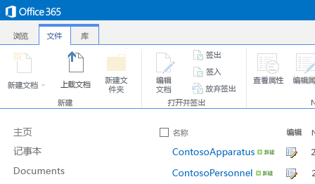
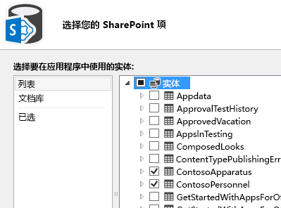
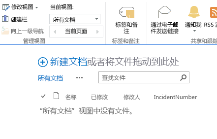
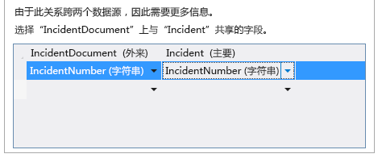
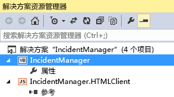

# 事件管理器：云企业外接程序教程
通过使用 Visual Studio 中的"云企业外接程序"模板，您可以创建一个 SharePoint 托管的外接程序，通过该外接程序，移动用户可以使用现代触屏设备（如手机和平板电脑）从远程位置查看、添加和更新数据。在此教程中，您将为虚拟的 Contoso 消防局创建外接程序，以处理现场事件管理。此演练涵盖构建云企业外接程序的核心概念以及更高级的概念，例如集成 SharePoint 列表和文档库。您可以从 MSDN 示例库下载事件管理示例应用程序和相关文件： [事件管理器：云企业外接程序教程](http://code.msdn.microsoft.com/Incident-Manager-A-Cloud-c32d9b04)。
## 先决条件

本演练要求安装 Visual Studio 2013 Update 1 和 Microsoft Visual Studio 2013 开发人员工具 - 2014 年 3 月更新。


要托管外接程序，您还需要在 Office 365 上具有 SharePoint 开发人员网站，您可从 [注册 Office 365 开发人员网站](http://go.microsoft.com/fwlink/?LinkId=263490)开始。


> **注释**
> 您还可以在 SharePoint 2013 网站上托管云企业外接程序。 


## 创建事件管理应用程序
<a name="add-in"> </a>

Contoso 消防局负责处理火灾、医疗援助紧急情况、机动车事故和其他紧急情况。每个紧急事件都需要进行大量的文案工作来记录事故。他们目前在现场使用纸质表格输入信息，然后在回到消防局后将信息输入到计算机系统。最近他们采用了 SharePoint for Office 365 进行记录管理，并购买了平板电脑，使事故指挥员可以在现场输入数据。


您将构建可用于输入事件基本信息的移动外接程序。因为很多事件也涉及医疗援助，外接程序还需要能够为每个事件的多个患者输入数据。本节中您将构建基本应用程序，以学习云企业外接程序的基础知识。


### 创建项目


1. 在菜单栏上，依次选择"文件"、"新建"、"项目"。

    将打开"新建项目"对话框。


2. 在模板列表中，展开"Visual Basic"或"Visual C#"节点，展开"Office/SharePoint"节点，选择"外接程序"节点，然后选择"云企业外接程序"模板，如图 1 中所示。

   **图 1. 云企业外接程序模板**


3. 在"名称"文本框中，输入 IncidentManager，然后选择"确定"按钮。

    "新建云企业外接程序"向导将打开。


4. 在"新建云企业外接程序"向导中，输入 Office 365 开发人员网站的 URL，然后选择"完成"按钮。

    URL 的格式应为 https://  _MySite_.sharepoint.com/sites/Developer/。

    "IncidentManager"解决方案将添加到包含以下四个项目的解决方案资源管理器：顶级"IncidentManager"项目、"IncidentManager.HTMLClient"项目、"IncidentManager.Server"项目和"IncidentManager.SharePoint"项目。


    下一步，添加表示事件集合的实体。实体将创建外接程序固有的 SQL Server 数据库表。它将存储有关每个事件的信息。


### 添加事件实体


1. 在"开始"屏幕上，选择"创建新表"超链接。

    实体设计器将打开。


2. 在"属性"窗口的"名称"属性文本框中，输入 Incident。


3. 在实体设计器中，选择"<添加属性>"链接，然后输入 IncidentNumber。


4. 选择 Enter 键，接受默认的"类型" **String**，并将"必填"复选框保留选中状态。


5. 在"属性"窗口中，选中"包含在唯一索引中"复选框。

    事件编号必须对每个事件唯一。


6. 选择"<添加属性>"链接，输入 IncidentDate，然后选择"Tab"键。


7. 在"类型列中，选择"日期"，然后选择 Tab 键两次。


8. 在"名称"列中输入 DispatchTime，在"类型"列中选择 **DateTime** 数据类型。


9. 在下一行中输入 IncidentType，然后选择 **Integer** 作为数据类型。


10. 在下一行中输入 IncidentAddress，然后选择 **String** 作为数据类型。


11. 在下一行中输入 ReportingPartyName，选择"字符串"作为数据类型，然后取消选中"必填"复选框。

    有时事件是匿名报告的，因此您不需要在此字段中输入值。


12. 在下一行中输入 ReportingPhone，然后选择 **PhoneNumber** 作为数据类型。

    "电话号码"是自定义业务类型，它可自动格式化并提供电话号码验证。


13. 在"属性"窗口中，选择"电话号码格式"超链接。

    "电话号码格式"对话框将打开。


14. 在"电话号码格式"对话框中，选择适用于您的区域设置的格式，然后选择"上移"按钮将其移到列表顶部。


15. 在"测试电话号码验证"文本框中，输入电话号码并确认其格式正确，然后选择"保存"按钮。

    "电话号码"业务类型在其出现的任何屏幕上进行格式化和验证。


16. 在下一行中输入 IncidentCommander，然后选择 **Person** 作为数据类型。

    "个人"业务类型提供到 SharePoint User Profile Service 的连接，这将从 Active Directory 中拉取用户信息。

    图 2 显示完成的实体。


   **图 2. 事件实体**


    下一步，添加允许用户从固定值集中进行选择的选项列表。在本例中，消防局具有常规事件类型集。


### 添加选项列表


1. 在实体设计器中，选择"IncidentType"字段，然后在"属性"窗口中选择"选项列表"超链接。

    "选项列表"对话框将打开。


2. 在"选项列表"对话框中，选择"添加值"链接并输入 1。


3. 在"显示名称"列中，输入"火灾 - 商业"。


4. 输入下列值和显示名称，然后选择"确定"按钮。


|**值**|**显示名称**|
|:-----|:-----|
|2  <br/> |火灾 - 住宅  <br/> |
|3  <br/> |火灾 - 单引擎响应  <br/> |
|4  <br/> |救援 - 高级生命支持  <br/> |
|5  <br/> |救援 - 基本生命支持  <br/> |
|6  <br/> |机动车辆碰撞  <br/> |
|7  <br/> |服务调用  <br/> |
|||
 

    在运行时，将向用户呈现显示名称列表。用户做出选择后，将在数据库中存储相应的 **Integer** 值。


    下一步，添加患者实体。消防局的很多事件均涉及医疗救援，一次事件通常涉及多个患者。


### 添加患者实体


1. 在"解决方案资源管理器"中，打开"数据源"节点的快捷菜单并选择"添加表"。


2. 在"属性"窗口的"名称"属性文本框中，输入 Patient。


3. 在实体设计器中，添加下列字段，如图 3 中所示：

   **图 3. 已完成的患者实体**


    下一步，定义事件和患者实体之间的关系。事件可能有多个相关的患者。


### 定义关系


1. 在"解决方案资源管理器"中，打开"Incidents.lsml"节点的快捷菜单并选择"打开"。


2. 在工具栏上，选择"关系"按钮。

    将显示"添加新关系"对话框。


3. 在"添加新关系"对话框中，在"名称"行的"至"列中，选择"患者"。


4. 在"多重性"行的"自"列中，选择"零或一"。


5. 在"至"列中，选择"多"，然后选择"确定"按钮。

    图 4 显示了关系。


   **图 4. 事件和患者关系**


    这将在事件和患者之前创建零或一对多的关系。事件记录中不一定有患者，但患者必须有相关事件记录。


    下一步，添加用于查看、添加和编辑患者与事件记录的屏幕。


### 添加屏幕


1. 在"解决方案资源管理器"中，打开"Incidents.lsml"节点的快捷菜单并选择"打开"。


2. 在屏幕设计器的"角度"栏中，选择"HTML 客户端"选项卡，然后在工具栏上选择"屏幕"按钮。

    将打开"添加新屏幕"对话框。


3. 在"添加新屏幕"对话框的"选择屏幕模板"列表中，选择"常规屏幕集"。


4. 在"屏幕集名称"文本框中，输入 Incidents。


5. 在"屏幕数据"列表中，选择"事件"。


6. 选中"事件详细信息"和"事件患者"复选框，然后选择"确定"按钮。

    图 5 显示了"添加新屏幕"对话框。


   **图 5. "添加新屏幕"对话框**


    "浏览"、"查看详细信息"和"添加/编辑"屏幕已添加到 HTMLClient 项目。"浏览"屏幕将自动设置为应用程序的主屏幕，并自动提供用于启动"查看"和"添加/编辑"屏幕的必要命令。


7. 在菜单栏上，选择"调试"，然后选择"启动调试"运行应用程序。如果"连接到 SharePoint"对话框显示，请输入您的用户名和密码。


8. 收到提示时，选择"信任它"按钮。外接程序将打开一个空白屏幕。请注意，屏幕标题为"IncidentsSet"。


9. 选择"添加"按钮。

    将打开"事件"对话框。请注意，您可以输入事件数据，但不会规定要添加患者。您可通过自定义屏幕来修复此问题以及其他设计问题。


    下一步，自定义"浏览"屏幕。


10. 关闭"事件"对话框，然后关闭浏览器窗口返回到设计模式。


### 自定义浏览屏幕


1. 在"解决方案资源管理器"屏幕中，打开"BrowseIncidentsSet.lsml"节点的快捷菜单并选择"打开"。


2. 在"属性"窗口中，选择"显示名称"属性并输入 Incidents。


3. 在屏幕设计器中，选择"行布局 | 行"节点，然后展开"添加"列表并选择"事件地址"。


4. 选择"调度时间"节点，然后在工具栏上选择"删除"按钮。

    图 6 显示了已完成的屏幕布局。


   **图 6. "浏览"屏幕布局**


    在运行时，屏幕将为每个事件显示一个图块，每个图块显示事件编号、日期和地址。


    下一步，自定义"添加/编辑"屏幕。


### 自定义添加/编辑屏幕


1. 在"解决方案资源管理器"屏幕中，打开"AddEditIncidents.lsml"节点的快捷菜单并选择"打开"。


2. 选择"事件地址"、"报告方名称"和"报告电话"节点，并将其拖放到"事件类型"节点下的"行布局 | 左侧"部分。


3. 选择"调度事件"节点，在"属性"窗口中取消选中"日期选取器启用"复选框。

    不需要日期，因为日期始终与事件日期相同。


4. 在屏幕设计器的左侧窗格中，选择"添加患者"链接，如图 7 中所示。

   **图 7. 添加患者链接**


5. 在左侧窗格中，选择"患者"节点，并将其拖放到中央窗格中的"事故指挥员"节点下。

    图 8 显示了已完成的屏幕布局。


   **图 8. "添加/编辑"屏幕布局**


    下一步，创建用于添加患者记录的屏幕。


### 添加患者屏幕


1. 在"解决方案资源管理器"屏幕中，打开"AddEditIncidents.lsml"节点的快捷菜单并选择"打开"。


2. 在屏幕设计器中的"行布局 | 详细信息(选项卡)"节点下，打开"命令栏"节点的快捷菜单并选择"添加按钮"。


3. 在"添加按钮"对话框中，展开"showTab"列表并在"患者"组中选择"addAndEditNew"，然后选择"确定"按钮。

    将打开"添加新屏幕"对话框。


4. 在"添加新屏幕"对话框中，接受默认值并选择"确定"按钮。

    "AddEditPatient"屏幕将在屏幕设计器中打开。


5. 在"属性"窗口中，选择"显示名称"属性并输入 Add Patient。


6. 在屏幕设计器中，选择"事件"节点并将其删除。

    不需要"事件"字段，因为患者已与事件关联。

    图 9 显示了已完成的屏幕布局。


   **图 9. "添加/编辑"屏幕布局**


    下一步，运行外接程序并添加一些数据。


### 测试外接程序


1. 在菜单栏上，选择"调试"，然后选择"启动调试"。


2. 在运行的外接程序中，选择"添加"按钮。

    将打开"事件"弹出框，如图 10 中所示。


   **图 10. 事件弹出框**


3. 在"事件编号"文本框中，输入 2014-1。


4. 在"事件日期"和"调度事件"字段中，使用"日期选取器"和"时间选取器"控件选择日期和时间。


5. 在"事件类型"列表中，选择"救援 - 基本生命支持"。


6. 在"事件地址"文本框中，输入您所在城市的街道地址。

    请勿包含城市、省或邮政编码。假定消防局仅为一个城市服务。


7. 在"事故指挥员"和"人员选取器"控件中，输入 SharePoint 网站上某位用户的姓名。

    请注意，在您输入时，将显示所有匹配名称的列表。


8. 选择"添加患者"按钮。

    将打开"添加患者"弹出框，如图 11 中所示。


   **图 11. "添加患者"弹出框**


9. 输入患者的信息，然后选择"保存"按钮。

    您添加的患者名称将显示在"事件"弹出框中。如果需要，您可以添加更多患者。


10. 在"事件"弹出框中，选择"保存"按钮。

    如果按照说明操作，您将看到一条验证错误消息。"报告电话"字段为必填字段。云企业外接程序具有必填字段的内置验证。


11. 输入电话号码，然后再次选择"保存"按钮。

    将在"事件"屏幕上选择图块，其中包含事件编号、日期和地址。


12. 选择图块，打开事件的"查看"屏幕。

    请注意，"报告电话"字段将显示为超链接，使您可以直接访问默认的电话应用程序。


13. 选择"编辑"按钮打开"AddEditIncidents"屏幕，选择"放弃"按钮返回到"查看"屏幕。


14. 选择"患者"选项卡显示患者列表，然后选择患者图块。

    请注意，它不会打开患者的查看屏幕，因为您尚未创建查看屏幕。


15. 在浏览器中选择"关闭"按钮返回到设计模式。


    下一步，添加用于查看患者的屏幕。


### 添加查看屏幕


1. 在"解决方案资源管理器"屏幕中，打开"Patients.lsml"节点的快捷菜单并选择"打开"。


2. 在实体设计器的"角度"栏中，选择"HTML 客户端"选项卡，然后在工具栏上选择"屏幕"按钮。

    将打开"添加新屏幕"对话框。


3. 在"添加新屏幕"对话框的"选择屏幕模板"列表中，选择"查看详细信息屏幕"。


4. 在"屏幕名称"文本框中，输入"ViewPatient"，在"屏幕数据"列表中选择"患者"，然后选择"确定"按钮。

    "ViewPatient"屏幕将在屏幕设计器中打开。


5. 在屏幕设计器中的"行布局 | 详细信息(选项卡)"节点下，打开"命令栏"节点的快捷菜单并选择"添加按钮"。


6. 在"添加按钮"对话框中，展开"showTab"列表并在"患者"组中选择"编辑"，然后选择"确定"按钮。


7. 运行应用程序并确认您可以查看和编辑患者记录。


    现在您已构建一个功能完善的事件管理外接程序，但云企业外接程序的功能远不止这些。在下一节中，您将学习如何从事件管理外接程序利用 SharePoint 网站上的资源。


## 集成 SharePoint 资源
<a name="integrate"> </a>

Contoso 消防局已开始使用事件管理器外接程序，与在软件开发项目中一样，他们现在需要一项新功能。除了事件和患者信息，他们还需要管理消防设备和人员等资源。他们已在 SharePoint 网站上放置设备和人员列表，因此您可以将这些列表用作外接程序的其他数据源。


第一步是将多个预先填充的列表模板添加到您的开发人员网站。


### 添加列表模板


1. 在菜单栏上，选择"调试"，然后选择"启动调试"运行外接程序。


2. 在运行的外接程序中，在部件版式栏上选择"返回站点"链接以导航到您的 SharePoint 开发人员网站，如图 12 中所示。

   **图 12. "返回站点"链接**


3. 在"开发人员"页面上，选择"网站内容"链接。


4. 在"网站内容"页面上，选择"设置"链接，如图 13 中所示。

   **图 13. "设置"链接**


5. 在"网站设置"页面上的"Web 设计器库"列表中，选择"列表模板"链接，如图 14 中所示。

   **图 14. "列表模板"链接**


6. 在"列表模板库"页面，选择"文件"选项卡，然后在功能区上选择"上载文档"按钮。


7. 在"添加模板"对话框中，选择"浏览"按钮，然后导航到"资源"文件夹，查看下载的事件管理示例。


8. 依次选择"ContosoApparatus.stp"文件、"打开"按钮、"确定"按钮。


9. 在"列表模板库"对话框中，选择"保存"按钮。


10. 重复此过程并上载"ContosoPersonnel.stp"文件。

   **图 15. 上载的文件**





11. 选择"网站内容"链接，在"网站内容"页面上选择"添加外接程序"磁贴。


12. 在"网站内容 > 您的外接程序"页面上，选择"Contoso 设备"磁贴。

    > **注释**
      > 您可能需要转到外接程序的第二页查找"Contoso 设备"磁贴。 
13. 在"添加自定义列表"对话框中，选择"名称"文本框并输入 Contoso Apparatus，然后选择"创建"按钮。


14. 重复此过程并添加"Contoso 人员"列表，输入 Contoso Personnel 作为名称。


15. 在"网站内容"页面上，确认"Contoso 设备"和"Contoso 人员"列表出现。


    下一步，将 SharePoint 网站添加为数据源。


### 添加 SharePoint 数据源


1. 在"解决方案资源管理器"中，打开"数据源"节点的快捷菜单并选择"添加数据源"。

    "附加数据源向导"将打开。


2. 在"附加数据源向导"中，选择"SharePoint"图标（如图 16 中所示），然后选择"下一步"按钮。

   **图 16. SharePoint 数据源**


3. 在"输入连接信息"页面上，确认您的 SharePoint 开发人员网站的 URL 正确无误，然后选择"下一步"按钮。


4. 在"选择 SharePoint 项"页面上，选中"ContosoApparatus"和"ContosoPersonnel"列表的复选框（如图 17 中所示），然后选择"完成"按钮。

   **图 17. 选择的列表**





    实体已添加到"解决方案资源管理器"中"数据源"节点下的新"开发人员数据"节点，"ContosoApparatus"实体将在实体设计器中打开。


    > **注释**
      > 您可能已经注意到，还添加了"UserInformationLists"实体。SharePoint 使用此列表来管理列表的"CreatedBy"和"ModifiedBy"字段。 
5. 在"属性"窗口中，选择"显示名称"属性并将其更改为 Apparatus。


    下一步，定义查询以限制"ApparatusSet"实体返回的数据。在这种情况下，您只需查看运行中的设备。


### 定义 AvailableApparatus 查询


1. 在"解决方案资源管理器"中，打开"ApparatusSet.lsml"节点的快捷菜单并选择"添加查询"。

    查询设计器将打开。


2. 在"属性"窗口中，选择"名称"属性并输入 AvailableApparatus。


3. 在查询设计器中，选择"添加过滤器"链接，然后在第二个下拉列表中选择"可用"。


4. 在最后一个文本框中，将"False"更改为"True"。

    图 18 显示了查询。


   **图 18. AvailableApparatus 查询**


    下一步，定义"ContosoPersonnel"实体的另一个查询。在这种情况下，您仅需查看分配至"A"班次的人员。


### 定义 AvailablePersonnel 查询


1. 在"解决方案资源管理器"中，打开"ContosoPersonnels.lsml"节点的快捷菜单并选择"添加查询"。

    查询设计器将打开。


2. 在"属性"窗口中，选择"名称"属性并输入 AvailablePersonnel。


3. 在查询设计器中，选择"添加过滤器"链接，然后在第二个下拉列表中选择"班次"。


4. 在最后一个文本框中，输入"A"。

    图 19 显示了查询。


   **图 19. AvailablePersonnel 查询**


    下一步，将可用设备和人员列表添加到"ViewIncidents"屏幕。


### 将查询添加到屏幕


1. 在"解决方案资源管理器"中，打开"ViewIncidents.lsml"节点的快捷菜单并选择"打开"。


2. 在屏幕设计器中，打开"选项卡"节点的快捷菜单并选择"添加选项卡"。


3. 在"属性"窗口中，将"名称"属性更改为 Resources。


4. 在屏幕设计器中的工具栏上选择"添加数据项目"。

    将打开"添加数据项目"对话框。


5. 在"添加数据项目"对话框中，选择"查询"选项按钮。


6. 在列表中选择"DeveloperData.AvailableApparatus"（如图 20 中所示），然后选择"确定"按钮。

   **图 20. AvailableApparatus 查询**


    "AvailableApparatus"集合已添加到屏幕设计器的左侧窗格中。


7. 重复此过程，将"AvailablePersonnel"查询添加到屏幕。


8. 在"行布局 | 资源"节点下，打开"添加"列表并选择"可用设备"。


9. 选择"列表 | 可用设备"节点，打开"列表"列表并选择"图块列表"。


10. 删除"行布局 | Contoso 设备"节点下的所有项目，"设备编号"和"设备类型"除外。


11. 在"行布局 | 资源"节点下，打开"添加"列表并选择"可用人员"。


12. 选择"列表 | 可用人员"节点，打开"列表"列表并选择"表"。


13. 删除"表行 | Contoso 人员"节点下的所有项目，"名称"、"排名"和"分配"除外。

    图 21 显示了屏幕布局。


   **图 21. 屏幕布局**


14. 运行外接程序并观察更改。选择事件，然后选择"资源"选项卡查看可用资源列表。


    更改现已完成。在下一节中，您将学习如何添加 SharePoint 文档库并将其与外接程序相关联。


## 关联文档库
<a name="associate"> </a>

在事故现场，事故指挥员必须记录很多信息，其中一些使用现有表单，一些使用临时表单。在现场创建的文档必须可在稍后访问，必须按事件进行组织以便于检索。对于事件管理外接程序，您可以利用 SharePoint 中的自定义文档库功能将文档与每个事件相关联。


### 将文档库添加到 SharePoint 网站


1. 在菜单栏上，选择"调试"，然后选择"启动调试"运行外接程序。


2. 在运行的外接程序中，在部件版式栏上选择"返回站点"链接以导航到您的 SharePoint 开发人员网站，如图 22 中所示。

   **图 22. "返回站点"链接**


3. 在"开发人员"页面上，选择"网站内容"链接。


4. 在"网站内容"页面上，选择"添加外接程序"磁贴。


5. 在"网站内容 > 您的外接程序"页面上，选择"文档库"磁贴。


6. 在"添加文档库"对话框中，在"名称"文本框中输入 Incident Documents，然后选择"创建"按钮。


7. 在"网站内容"页面上，选择"事件文档"图块打开库，然后选择"库"选项卡。


8. 在"功能区"上，选择"创建列"按钮。


9. 在"创建列"对话框中，在"列名称"文本框中输入 IncidentNumber，然后选择"确定"按钮。

    图 23 显示了新添加的列。


   **图 23. "事件文档"文档库**





    要将文档库与您的外接程序相关联，文档库必须包含映射到实体中的唯一字段的自定义列。在这种情况下，"IncidentNumber"列将映射到"事件"实体中的"IncidentNumber"字段。


    下一步，将文档库添加到外接程序。


### 将文档库添加到项目


1. 在"解决方案资源管理器"中，打开"开发人员数据"节点的快捷菜单并选择"更新数据源"。


2. 在"选择 SharePoint 项目"页面的左侧窗格中，选择"文档库"列表项，在右侧窗格中选中"IncidentDocuments"复选框（如图 24 中所示），然后选择"完成"按钮。

   **图 24. IncidentDocuments 实体**


    "IncidentDocuments.lsml"节点已添加到解决方案资源管理器中。


    下一步，在文档库和事件实体之间创建关系。


### 创建跨数据源的关系


1. 在"解决方案资源管理器"中，打开"IncidentDocuments.lsml"节点的快捷菜单并选择"打开"。


2. 在实体设计器的"角度"栏中，选择"服务器"，然后在工具栏上选择"关系"。


3. 在"添加新关系"对话框的"至"下拉列表中，选择"事件"，如图 25 中所示。

   **图 25. "添加新关系"对话框**


4. 在"外键"下拉列表中，从"IncidentDocuments"实体中选择"IncidentNumber (字符串)"字段。


5. 在"主键"下拉列表中，从"事件"实体中选择"IncidentNumber (字符串)"字段，然后选择"确定"按钮。

    图 26 显示了外键和主键。


   **图 26. 外键和主键**





    下一步，将文档库添加到"ViewIncidents"屏幕。


### 将文档库添加到屏幕


1. 在"解决方案资源管理器"中，打开"ViewIncidents.lsml"节点的快捷菜单并选择"打开"。


2. 在屏幕设计器中，打开"选项卡"节点的快捷菜单并选择"添加选项卡"。


3. 在"属性"窗口中，将"名称"属性更改为 Documents。


4. 在屏幕设计器的左侧窗格中，选择"添加 IncidentDocuments"链接。


5. 在中央窗格中的"行布局 | 文档"节点下，打开"添加"列表并选择"事件文档"。


6. 在"行布局 | 文档"节点下，打开"命令栏"节点的快捷菜单，并选择"添加按钮"。


7. 在"添加按钮"对话框中，展开"showTab"列表并在"IncidentDocuments"组中选择"createOrUploadDocument"（如图 27 中所示），然后选择"确定"按钮。

   **图 27. "添加按钮"对话框**


8. 在"属性"窗口中，选择"显示名称"属性并输入 Add Document。


9. 展开"图标"属性列表并选择"附件"。


10. 在菜单栏上，选择"调试"，然后选择"启动调试"运行外接程序。


11. 选择一个事件，然后选择"文档"选项卡、"添加文档"按钮。

    SharePoint"创建新文件"对话框将打开，如图 28 中所示。


   **图 28. "创建新文件"对话框**


12. 选择"上载现有文件"链接，并选择任何要上载的文件，然后选择"打开"按钮。

    文件将添加到"文档"选项卡。

    > **提示**
      > 如果您选择 Office 文档，则可以在外接程序中进行查看。 
13. 选择"添加文档"按钮，然后在"创建新文件"对话框中，选择"Word 文档"。

    新的 Word 文档将在"Word Online"中打开。


14. 在标题栏上，选择"文档"名称字段（如图 29 中所示），并输入 Incident Report。

   **图 29. "文档"名称字段**


    这将用作文档的文件名。


    > **注释**
      > 如果您不输入文件名，将使用默认名称"Document.docx"进行保存。保存后，只能通过在 SharePoint 中的文档库中访问来更改文件名。 
15. 在浏览器中选择后退按钮返回到外接程序。"事件报告"文档应该出现在"文档"选项卡上。


16. 在浏览器中选择"关闭"按钮返回到设计模式。


    在下一节中，自定义外接程序并添加一些 JavaScript 代码。


## 自定义外接程序
<a name="custom"> </a>

Contoso 消防局非常高兴增加了事件管理外接程序，但列表中很少有更"合适和完整"的项目。他们希望在屏幕上显示自己的徽标而不是默认图标。他们不喜欢"AddEditPatient"屏幕上"已投保"字段的"FlipSwitch"控件，希望将其替换为一个复选框。最后，并非所有事件都有患者，因此他们希望在没有患者时，"ViewIncidents"屏幕上的"患者"选项卡不出现。


### 显示自定义徽标


1. 在"解决方案资源管理器"中，在"IncidentManager.HtmlClient"项目中展开"内容"和"图像"节点。


2. 选择"user-logo.png"和"user-splash-screen.png"文件（如图 30 中所示）并将其删除。

   **图 30. 要删除的文件**


3. 打开"图像"节点的快捷菜单，选择"添加"、"现有项目"。


4. 在"添加现有项目"对话框中，选择"浏览"按钮，然后导航到"资源"文件夹，查看下载的事件管理示例。


5. 选择"user-logo.png"和"user-splash-screen.png"文件，然后选择"添加"按钮。

    新图像将显示在外接程序的标题栏以及加载外接程序时显示的启动屏幕中。


    下一步，将"FlipSwitch"控件替换为一个复选框。


### 替换 FlipSwitch 控件


1. 在"解决方案资源管理器"中，打开"AddEditPatient.lsml"屏幕节点的快捷菜单并选择"打开"。


2. 在屏幕设计器中，展开"已投保"节点的列表，并选择"自定义控件"。


3. 在"属性"窗口中，选择"编辑呈现代码"链接。


4. 在代码编辑器中，将以下代码添加到 **Insured_render** 方法：

  ```

// Create the checkbox and add it to the DOM.
    var checkbox = $("<input type='checkbox'/>")
            .css({
                height: 20,
                width: 20,
                margin: "10px"
            })
            .appendTo($(element));

    // Determine if the change was initiated by the user.
    var changingValue = false;

    checkbox.change(function () {
        changingValue = true;
        contentItem.value = checkbox[0].checked;
        changingValue = false;
    });
    contentItem.dataBind("value", function (newValue) {
        if (!changingValue) {
            checkbox[0].checked = newValue;
        }
    });
  ```


    此代码将在呈现屏幕时创建"复选框"控件。您还需要添加代码以设置初始值。


5. 在"解决方案资源管理器"中，打开"Patients.lsml"实体节点的快捷菜单并选择"打开"。


6. 在实体设计器中，在"角度"栏上选择"HTMLClient"选项卡。


7. 在工具栏上，展开"编写代码"列表并选择"创建时间"。


8. 在代码编辑器中，将以下代码添加到 **created** 方法：

  ```

entity.Insured = new Boolean();
    entity.Insured = 'true';
  ```


    此代码将在创建屏幕时设置要选中的控件的初始值 (true)。


    下一步，添加代码以隐藏"患者"选项卡（如果不存在患者）。


### 有条件地隐藏选项卡


1. 在"解决方案资源管理器"中，打开"ViewIncidents.lsml"屏幕节点的快捷菜单并选择"打开"。


2. 在工具栏上，打开"编写代码"列表并选择"创建时间"。


3. 在代码编辑器中，将以下代码添加到 **ViewIncidents_created** 方法：

  ```

screen.getPatients().then(function (results) {
        var queryCount = results.count;
        if (queryCount == 0 ) {
            screen.findContentItem("Patients").isVisible = false;
        }
    });
  ```


    此代码将运行 **GetPatients** 查询以获取 **Patients** 计数。如果结果为零， **findContentItem** 方法会将"患者"选项卡的 **isVisible** 属性设置为 false 将其隐藏。


4. 在菜单栏上，选择"调试"、"启动调试"运行外接程序。请注意，新的徽标将出现在屏幕上。打开您在之前创建的第一个事件并编辑患者。确认"已投保"字段现在为复选框。添加没有任何患者的新事件，确认"患者"选项卡在查看屏幕中为隐藏状态。


    最后，将完成的外接程序发布到 SharePoint。


## 发布到 SharePoint
<a name="pub"> </a>

到现在为止，您仅在调试模式下运行外接程序，该外接程序使用 SharePoint 提供身份验证并重定向到本地计算机的 IIS Express 实例。接下来，您可以将外接程序作为自动托管的 SharePoint 外接程序进行发布，这可在 Office 365 中为外接程序和固有数据库自动配置控件。具体地说，外接程序将托管在 Microsoft Azure 中以及 SQL Azure 中的数据库中。发布外接程序后，其他人可以使用自己的计算机和移动设备从 SharePoint 启动此外接程序。


### 发布外接程序


1. 在 Visual Studio 工具栏上，打开"调试"列表并选择"发布"。


2. 在"解决方案资源管理器"中，打开"IncidentManager"节点的快捷菜单（如图 31 中所示），然后选择"发布"。

   **图 31. IncidentManager 节点**





    此时将显示"LightSwitch 发布应用程序向导"。


3. 在"SharePoint"选项页面，选择"自动承载"选项按钮（如图 32 中所示），然后选择"发布"按钮。

   **图 32. 自动承载选项**


    外接程序发布后，"文件资源管理器"将打开并显示项目的"发布"文件夹。


4. 在浏览器中，导航到 SharePoint 开发人员网站


5. 在"正在测试的外接程序"列表中，选择"IncidentManager"旁边的省略号 (…) 链接，然后选择"删除"链接，如图 33 中所示。

   **图 33. "删除"链接**


6. 选择"要部署的新外接程序"链接。


7. 在"部署外接程序"对话框中，选择"上载"链接，如图 34 中所示。

   **图 34. "上载"链接**


    将打开"上载外接程序"对话框。


8. 在"上载外接程序"对话框中，选择"浏览"按钮并导航到外接程序的"发布"文件夹，然后依次选择"IncidentManager.SharePoint.app"文件、"打开"按钮、"确定"按钮。

    文件上载完之后，将打开"部署外接程序"对话框。


9. 在"部署外接程序"对话框中，选择"部署"按钮。


10. 在"上载外接程序"对话框中，选择"信任它"按钮。

    外接程序将安装在 SharePoint 网站上。此过程需要几分钟时间。

    图 35 显示在安装外接程序时"正在测试的外接程序"列表。


   **图 35. "正在测试的外接程序"列表**


11. 选择"网站内容"链接。

    图 37 显示在安装外接程序时的"网站内容"列表。


   **图 37. 正在安装外接程序**


12. 外接程序安装完之后，选择"事件管理器"磁贴运行外接程序。

    图 38 显示安装外接程序后的"网站内容"列表。


   **图 38. 已安装外接程序**


    外接程序在浏览器中打开，其外观与在调试模式下运行外接程序时完全相同。请注意，您在开发过程中输入的数据已消失。部署外接程序时，将部署数据库而不是数据。


13. 输入一些数据，并确认一切按预期运行。

    图 39 显示了外接程序在桌面浏览器中显示时的外观。


   **图 39. 图块视图**


    您也可以在移动设备上验证外接程序。在设备上从 Web 浏览器登录到 SharePoint 网站，然后启动外接程序。

    图 40 显示了外接程序在移动浏览器中显示时的外观。


   **图 40. 列表视图**


恭喜！您现在已经完成教程，现在您已了解创建云企业外接程序的基础知识。立即开始构建您自己的外接程序 - 下面提供了更多资源，应该能够帮助您执行更多操作。
## 其他资源
<a name="bk_addresources"> </a>


-  [云企业外接程序开发入门](get-started-developing-cloud-business-add-ins.md)


-  [开发云企业外接程序](develop-cloud-business-add-ins.md)


-  [发布云企业外接程序](publish-cloud-business-add-ins.md)


