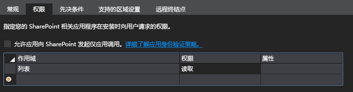
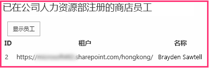

# 在提供程序托管的外接程序中包含自定义按钮
了解如何在提供程序托管的 SharePoint 外接程序中包含自定义功能区按钮。
这是关于开发 SharePoint 托管的 SharePoint 外接程序的基础知识系列文章中的第三篇文章。您应该首先熟悉  [SharePoint 外接程序](sharepoint-add-ins.md)以及本系列中之前的文章：


-  [开始创建提供程序承载的 SharePoint 加载项](get-started-creating-provider-hosted-sharepoint-add-ins.md)


-  [使提供程序托管的外接程序具有 SharePoint 的外观](give-your-provider-hosted-add-in-the-sharepoint-look-and-feel.md)


> **注释**
> 如果您阅读过关于提供程序托管的外接程序的系列文章，那么您应该具有 Visual Studio 解决方案，可以继续阅读本主题。您还可以从  [SharePoint_Provider-hosted_Add-Ins_Tutorials](https://github.com/OfficeDev/SharePoint_Provider-hosted_Add-ins_Tutorials) 下载存储库并打开 BeforeRibbonButton.sln 文件。


SharePoint 外接程序可以包括自定义操作，这是针对自定义菜单项或功能区按钮的 SharePoint 术语。在本文中，您将了解如何创建可将 SharePoint 列表与远程数据库同步的自定义按钮。
## 在主机网站上创建自定义列表

自定义按钮将位于记录本地分店的员工的特定列表的功能区上。在本系列的后续文章中，您将了解如何以编程方式将自定义列表添加到主机网站，但现在您需要手动添加。


1. 从 Fabrikam 香港分店的主页，导航到"网站内容 | 添加外接程序 |自定义列表"。


2. 在"添加自定义列表"对话框中，指定 Local Employees 作为名称并按"创建"。


3. 在"网站内容"页面上，打开"Local Employees"列表。


4. 在功能区上打开"列表"选项卡，然后单击"列表设置"按钮。


5. 在"列表设置"页面的"列"部分，单击"标题"列。


6. 在"编辑列"表单中，将"列名称"从 Title 更改为 Name，然后单击"确定"。


7. 在"设置"页面上，单击"创建列"。


8. 在"创建列"表单中，执行下列操作：

1. 输入 Added to Corporate DB 作为"列名称"。


2. 将类型设置为"是/否(复选框)"。


3. 将"默认值"设置为"否"。


4. 按"确定"。您将返回到"设置"页面。


9. 单击"网站内容"打开"网站内容"页面。新列表的图块就位于其中，将其打开。


10. 单击"新建项目"，然后在创建项目表单中输入一个名称，但请勿选中"已添加到公司数据库"。然后单击"保存"。列表看起来应该如下所示：


## 添加自定义按钮

在本部分中，您可在将按钮部署到列表功能区的外接程序中包含一个标记。当用户突出显示列表中的某个员工并单击该按钮时，该员工的名字将添加到公司数据库，该员工的"已添加到公司数据"字段将从"否"切换为"是"。


1.  *如果 Visual Studio 为打开状态，您必须将其关闭*  并重新打开连锁店解决方案，以便 Visual Studio 可以发现您的新列表。（以管理员身份运行 Visual Studio。）

    > **注释**
      >  Visual Studio 中的启动项目的设置可能会在重新打开解决方案时恢复为默认值。重新打开本系列文章中的示例解决方案后，请始终立即执行下列步骤：>  右键单击"解决方案资源管理器"顶部的解决方案节点，然后选择"设置启动项目"。>  确保所有三个项目在"操作"列中均设置为"启动"。
2. 右键单击"解决方案资源管理器"中的"ChainStore"项目并选择"添加 | 新项目"。


3. 在"添加新项目"对话框中，选择"功能区自定义操作"，为其指定名称 AddEmployeeToCorpDB，然后单击"添加"。


4. 打开的对话框会询问三个问题。提供以下答案：


|**问题**|**提供此答案：**|
|:-----|:-----|
|**要在哪个位置公开自定义操作?** <br/> |主机 Web <br/> |
|**限制在哪个位置执行自定义操作?** <br/> |列表实例 <br/> |
|**限制对哪个特定项执行自定义操作?** <br/> |本地员工 <br/> |
 
5. 单击"下一步"，将再显示三个问题：


|**问题**|**提供此答案：**|
|:-----|:-----|
|**控件位于什么位置?** <br/> |Ribbon.ListItem.Actions <br/> |
|**按钮控件的标签文本是什么？** <br/> |添加到公司数据库 <br/> |
|**按钮控件导航到何处？** <br/> |ChainStoreWeb\\Pages\\EmployeeAdder.aspx（该页面的隐藏代码会将员工添加到数据库中。）  <br/> |
 
6. 单击"完成"。

    定义自定义操作的 elements.xml 文件将添加到项目并打开。大多数情况下，您可以将此文件视为一个黑匣子，在阅读本系列中的后续文章之前，您不需要对其进行任何更改。现在仅需注意以下事项：

  - **CommandUIDefinition** 元素的 **Location** 属性的值为 `Ribbon.ListItem.Actions.Controls_children`。此属性的第二部分  `ListItem` 标识将在其中放置按钮的功能区选项卡（但可能不是选项卡确切的显示名称），第三部分 `Actions` 是将放置按钮的功能区部分的名称。


  - **CommandUIHandler** 元素的 **CommandAction** 属性以占位符 `~remoteAppUrl` 开头。占位符将在部署按钮时被替换为远程 Web 应用程序的 URL。


  - 有几个查询参数已添加到 **CommandAction** 值，其中占位符值放在大括号"{ }"内。这些占位符在运行时解析。请注意，其中一个是用户在按下功能区上的自定义按钮之前选择的列表项的 ID。


7. 在"ChainStoreWeb"项目中，打开"Pages/EmployeeAdder.aspx"文件。请注意，它没有任何 UI。外接程序将使用此页面作为一种 Web 服务。这是可能的，因为 ASP.NET **System.Web.UI.Page** 类实施 **System.Web.IHttpHandler**，且 ** Page_Load** 事件会在请求页面时自动运行。


8. 打开文件"Pages/EmployeeAdder.aspx.cs"的隐藏代码。将员工添加到远程数据库  `AddLocalEmployeeToCorpDB` 的方法已存在。它使用 **SharePointContext** 对象获取主机 Web 的 URL，外接程序将其用作租户鉴别符。因此， **Page_Load** 方法需要做的第一件事是初始化此对象。对象在加载外接程序的起始页时在会话中创建和缓存，因此请将以下代码添加到 **Page_Load** 方法。（ **SharePointContext** 对象在创建外接程序解决方案时 Visual Studio Office 开发人员工具 生成的 SharePointContext.cs 文件中定义。）

  ```cs

spContext = Session["SPContext"] as SharePointContext;
  ```

9.  `AddLocalEmployeeToCorpDB` 方法将员工名字作为参数，因此请将以下行添加到 **Page_Load** 方法。您将在后续步骤中创建 `GetLocalEmployeeName` 方法。

  ```cs
  // Read from SharePoint
string employeeName = GetLocalEmployeeName();
  ```

10. 在该行下方，将调用添加到  `AddLocalEmployeeToCorpDB` 方法。

  ```cs

// Write to remote database
AddLocalEmployeeToCorpDB(employeeName);
  ```

11. 将 **using** 语句添加到命名空间 `Microsoft.SharePoint.Client` 的文件。（在创建"ChainStoreWeb"项目时，Visual Studio Office 开发人员工具 在其中包括 Microsoft.SharePoint.Client 程序集。）


12. 现在，将以下方法添加到  `EmployeeAdder` 类。SharePoint .NET 客户端对象模型 (CSOM) 在 MSDN 上的其他位置有详细介绍，我们建议您在阅读完本系列文章后再去浏览。对于本文，请注意， **ListItem** 类表示 SharePoint 列表中的项目，且项目中某个字段的值可以使用"索引程序"语法引用。另请注意，代码将该字段称为"Title"，尽管您已将字段名称更改为"Name"。这是因为字段在代码中始终按内部名称引用，而不是按显示名称引用。字段的内部名称在字段创建时设置，且无法更改。您可在后续步骤中完成 `TODO1`。

  ```cs

private string GetLocalEmployeeName()
{
    ListItem localEmployee;

    // TODO1: Initialize the localEmployee object by getting
    // the item from SharePoint.
 
    return localEmployee["Title"].ToString();
}
  ```

13. 我们的代码需要列表项的 ID，然后才能从 SharePoint 中检索该列表项。将以下声明添加到  `EmployeeAdder` 类中 `spContext` 对象的声明下方。

  ```cs

private int listItemID;
  ```

14. 现在，将以下方法添加到  `EmployeeAdder` 类，从查询参数中获取列表项的 ID。

  ```cs
  private int GetListItemIDFromQueryParameter()
{
    int result;
    Int32.TryParse(Request.QueryString["SPListItemId"], out result);
    return result;
}
  ```

15. 若要初始化  `listItemID` 变量，请将以下行添加到 **Page_Load** 方法中初始化 `spContext` 变量的行下方。

  ```cs

listItemID = GetListItemIDFromQueryParameter();
  ```

16. 在  `GetLocalEmployeeName` 中，将 `TODO1` 替换为以下代码。目前，我们专注于使自定义按钮正常运行，因此只需将此代码视为一个黑匣子。我们将在本系列的下一篇文章中了解有关此代码的详细信息，下一篇文章是完全关于 SharePoint 客户端对象模型的。

  ```cs
  using (var clientContext = spContext.CreateUserClientContextForSPHost())
{
    List localEmployeesList = clientContext.Web.Lists.GetByTitle("Local Employees");
    localEmployee = localEmployeesList.GetItemById(listItemID);
    clientContext.Load(localEmployee);
    clientContext.ExecuteQuery();
}

  ```


    现在整个方法看起来应该如下所示。


  ```cs

private string GetLocalEmployeeName()
{
    ListItem localEmployee;

    using (var clientContext = spContext.CreateUserClientContextForSPHost())
    {
        List localEmployeesList = clientContext.Web.Lists.GetByTitle("Local Employees");
        selectedLocalEmployee = localEmployeesList.GetItemById(listItemID);
        clientContext.Load(selectedLocalEmployee);
        clientContext.ExecuteQuery();
    }
    return localEmployee["Title"].ToString();
}
  ```

17. EmployeeAdder 页面实际上不会呈现，因此请添加以下内容作为 **Page_Load** 方法中的最后一行。这会将浏览器重定向回"本地员工"列表的列表视图页面。

  ```cs

// Go back to the Local Employees page
Response.Redirect(spContext.SPHostUrl.ToString() + "Lists/LocalEmployees/AllItems.aspx", true);

  ```


    现在整个 **Page_Load** 方法看起来应该如下所示：


  ```cs

protected void Page_Load(object sender, EventArgs e)
{
    spContext = Session["SPContext"] as SharePointContext;
    listItemID = GetListItemIDFromQueryParameter();

    // Read from SharePoint
    string employeeName = GetLocalEmployeeName();

    // Write to remote database
    AddLocalEmployeeToCorpDB(employeeName);

    // Go back to the preceding page
    Response.Redirect(spContext.SPHostUrl.ToString() + "Lists/LocalEmployees/AllItems.aspx", true);
}
  ```


## 请求读取主机 Web 列表的权限

正如您所看到的，SharePoint 在安装外接程序时，会提示您向其授予对主机 Web 的权限。每次按 F5 时，即已重新安装外接程序。到目前为止，外接程序仅具有所需的最低权限，但  `GetLocalEmployeeName` 方法需要读取主机网站列表的权限。外接程序使用外接程序清单将自己所需的权限告知 SharePoint。请执行以下步骤。


1. 在"解决方案资源管理器"中，打开"ChainStore"项目中的 AppManifest.xml 文件。（该文件被称为 AppManifest 是因为外接程序以前被称为"apps"。）清单设计器将打开。


2. 打开"权限"选项卡，单击"作用域"列下方的空单元格，然后从下拉列表中选择"列表"。


3. 在"权限"字段中，从下拉列表中选择"读取"。


4. 将"属性"字段保留为空并保存该文件。现在"权限"选项卡看起来应该如下所示：




## 运行外接程序并测试按钮


1. 使用 F5 键部署并运行您的外接程序。Visual Studio 在 IIS Express 中托管远程 Web 应用程序，在 SQL Express 中托管 SQL 数据库。它还会在 SharePoint 测试网站上临时安装外接程序并立即运行它。在起始页打开之前，将提示您向外接程序授予权限。这次提示有一个下拉列表，您可选择应用程序需要读取的列表，如以下屏幕截图中所示。


2. 从列表中选择"本地员工"，然后单击"信任它"。


3. 当外接程序的起始页打开时，单击顶部部件版式控件上的"返回到网站"。


4. 从网站的主页中导航到"网站内容 | 本地员工"。列表视图页将打开。


5. 向列表中添加几个员工。 *请勿选中"已添加到公司数据库"复选框。* 


6. 在功能区上，打开"项目"选项卡。选项卡的"操作"部分中是自定义按钮"添加到公司数据库"。


7. 在列表中选择一个项。页面和功能区看起来应该如下所示：


8. 按"添加到公司数据库"按钮。 * **必须先选择一个项！*** 


9. 页面似乎会重新加载，因为 EmployeeAdder 页面的 **Page_Load** 方法会重定向回该页面。


10. 使用浏览器的后退按钮两次以返回到外接程序的起始页。


11. 单击"显示员工"，员工列表中将填充您添加的员工。列表看起来应该如下所示：




12. 要结束调试会话，请关闭浏览器窗口或在 Visual Studio 中停止调试。每次按 F5 时，Visual Studio 将撤回外接程序的之前版本并安装最新版本。


13. 您将在其他文章中使用此外接程序和 Visual Studio 解决方案，因此最好是当您使用一段时间后，最后一次撤回外接程序。在"解决方案资源管理器"中右键单击此项目，然后选择"撤回"。


## 
<a name="Nextsteps"> </a>

在下一篇文章中，我们将暂时中断代码的讲述，简要介绍一下 SharePoint 客户端对象模型： [获取 SharePoint 对象模型的快速概述](get-a-quick-overview-of-the-sharepoint-object-model.md)。


