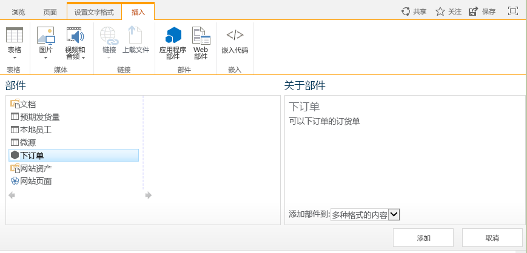
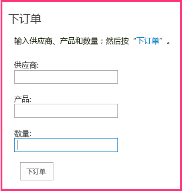

# 在提供程序托管的外接程序中包括外接程序部件
了解在提供程序托管的 SharePoint 外接程序中，如何将远程 Web 表单显示在 SharePoint 页面中。
这是关于开发提供程序托管的 SharePoint 外接程序的基础知识系列文章中的第六篇文章。您应该首先熟悉  [SharePoint 外接程序](sharepoint-add-ins.md)以及本系列中之前的文章：

-  [开始创建提供程序承载的 SharePoint 加载项](get-started-creating-provider-hosted-sharepoint-add-ins.md)

-  [使提供程序托管的外接程序具有 SharePoint 的外观](give-your-provider-hosted-add-in-the-sharepoint-look-and-feel.md)

-  [在提供程序托管的外接程序中包含自定义按钮](include-a-custom-button-in-the-provider-hosted-add-in.md)

-  [获取 SharePoint 对象模型的快速概述](get-a-quick-overview-of-the-sharepoint-object-model.md)

-  [将 SharePoint 写入操作添加到提供程序托管的外接程序](add-sharepoint-write-operations-to-the-provider-hosted-add-in.md)

> **注释**
> 如果您阅读过关于提供程序托管的外接程序的系列文章，那么您应该具有 Visual Studio 解决方案，可以继续阅读本主题。您还可以从  [SharePoint_Provider-hosted_Add-Ins_Tutorials](https://github.com/OfficeDev/SharePoint_Provider-hosted_Add-ins_Tutorials) 下载存储库并打开 BeforeAdd-inPart.sln 文件。

在本文中，您向 SharePoint 外接程序添加了一种特殊类型的 Web 部件，称为外接程序部件。外接程序部件会在 SharePoint 页面上公开外接程序的订单表。
## 创建外接程序部件

> **注释**
>  Visual Studio 中的启动项目的设置可能会在重新打开解决方案时恢复为默认值。重新打开本系列文章中的示例解决方案后，请始终立即执行下列步骤：>  右键单击"解决方案资源管理器"顶部的解决方案节点，然后选择"设置启动项目"。>  确保所有三个项目在"操作"列中均设置为"启动"。

1. 在"解决方案资源管理器"中，右键单击"ChainStore"项目并选择"添加 | 新项目"。

2. 选择"客户端 Web 部件(主机 Web)"，将其命名为 Place Order，然后按"添加"。（"客户端 Web 部件"是"外接程序部件"的另一个名称。）

3. 在向导的下一页上，选择第二个单选按钮："选择或输入客户端 Web 部件内容的现有网页的 URL"。

4. 在下拉列表中，选择"OrderForm.aspx"页面的 URL，然后按"完成"。

    定义外接程序部件的 elements.xml 文件将添加到项目并打开。

5. 在 **ClientWebPart** 元素中，将以下属性更改为以下值：

|**属性**|**值**|
|:-----|:-----|
|标题    |下订单    |
|说明    |下订单的表单    |
|DefaultHeight    |320    |
 

    将所有其他属性保留为默认值并保存该文件。

## 运行外接程序并测试外接程序部件

1. 使用 F5 键部署并运行您的外接程序。Visual Studio 在 IIS Express 中托管远程 Web 应用程序，在 SQL Express 中托管 SQL 数据库。它还会在 SharePoint 测试网站上临时安装外接程序并立即运行它。在起始页打开之前，将提示您向外接程序授予权限。

2. 外接程序的起始页打开后，表示外接程序已部署，"下订单"外接程序部件可供用户添加到香港分店网站的任何 SharePoint 页面上的任何 Web 部件区域。请按照下列步骤将其添加到主页。

1. 按起始页顶部部件版式控件上的"返回站点"打开香港分店的主页。

2. 在功能区上，打开"页面"选项卡并按"编辑"按钮。

3. 在页面处于编辑模式之后，打开功能区上的"插入"选项卡，然后按"外接程序部件"按钮。（该按钮可能仍称为"应用程序部件"。）

4. 在打开的 Web 部件插入控件上，选择"下订单"外接程序部件。控件看起来应该如下所示。

5. 单击表单某个 Web 部件区域中的任意位置。这是为了设置外接程序部件将放置的位置。

6. 在 Web 部件插入控件上单击"添加"。"下订单"外接程序部件将添加到 Web 部件区域。

7. 在功能区上按"保存"。

3. 订单表现在将显示在页面上，且其外观与页面其余部分一样。它看起来应该如下所示：

4. 输入"供应商"、"产品"和"数量"的值，然后按"下订单"。似乎什么都没有发生，但实际上在公司数据库中输入了一个订单。您可以选择通过刷新页面，清空外接程序部件的字段。

5. 单击浏览器的后退按钮，直到您后退到连锁店外接程序的起始页，然后按"显示订单"按钮。将列出您的新订单。

6. 要结束调试会话，请关闭浏览器窗口或在 Visual Studio 中停止调试。每次按 F5 时，Visual Studio 将撤回外接程序的之前版本并安装最新版本。

7. 您将在其他文章中使用此外接程序和 Visual Studio 解决方案，因此最好是当您使用一段时间后，最后一次撤回外接程序。在"解决方案资源管理器"中右键单击此项目，然后选择"撤回"。

## 

外接程序依赖于您手动创建的两个列表。您不希望您的用户必须执行此操作。在下一篇文章中，您将开始自动创建这些列表。第一个主要步骤是为安装外接程序的事件创建自定义处理程序： [处理提供程序托管的外接程序中的外接程序事件](handle-add-in-events-in-the-provider-hosted-add-in.md)

