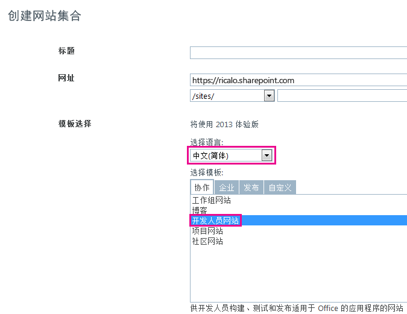

# 本地化 SharePoint 外接程序
使用资源文件、JavaScript 资源文件和其他技术本地化 SharePoint 外接程序。
> **注释**
> 本主题假定您熟悉 SharePoint 外接程序的基本创建、SharePoint 功能、外接程序 Web 和主机 Web 之间的区别、 [外接程序中可以有哪些类型的 SharePoint 组件](host-webs-add-in-webs-and-sharepoint-components-in-sharepoint-2013.md#TypesOfSPComponentsInApps)以及使用 .resx 文件进行本地化的基础知识。 
  
    
    


## 为本地化 SharePoint 外接程序做好准备
<a name="Prerequisites"> </a>

在开始之前，确定下列事项：
  
    
    

- 您的外接程序需要支持的区域设置。SharePoint Online 以及安装了语言包的本地 SharePoint 使用户可以使用特定语言和文化创建网站。确定您的客户将使用哪些本地化网站，并确定您需要为其中的哪些网站提供外接程序组件本地化版本支持。
    
  
- 您的外接程序中需要本地化的组件。
    
  
此外，请注意以下事项：
  
    
    

- 本文中的步骤假定您使用的是  [Visual Studio 2013 的 Office 开发工具](http://aka.ms/OfficeDevToolsForVS2013)的最新版本，或  [Visual Studio 2015 的 Office 开发工具](http://aka.ms/OfficeDevToolsForVS2015)。
    
    > **注释**
      > 如果不是在 Microsoft SharePoint Online 开发人员网站而是在本地 SharePoint 场上测试 SharePoint 网站，可能需要针对翻译 SharePoint 外接程序所使用的语言安装语言包。有关详细信息，请参阅 [安装或卸载用于 SharePoint 2013 的语言包](http://technet.microsoft.com/zh-cn/library/cc262108%28v=office.15%29.aspx)和  [SharePoint Server 2013 中的语言包](http://technet.microsoft.com/zh-cn/library/ff463597%28v=office.15%29.aspx)以及下文的下载链接。 
- 本文中的屏幕截图和代码示例取自示例  [SharePoint-Add-in-Localization](https://github.com/OfficeDev/SharePoint-Add-in-Localization)。您可以下载该示例以查看本文中所描述过程的结果。
    
  

## 本地化外接程序 Web 组件
<a name="LocalizingAppWeb"> </a>

外接程序 Web 可能包含特定类型的 SP 组件。有关可包含在 SharePoint 外接程序中的 SharePoint 组件的类型的详细信息，请参阅 [可位于 SharePoint 外接程序中的 SharePoint 组件的类型](host-webs-add-in-webs-and-sharepoint-components-in-sharepoint-2013.md#TypesOfSPComponentsInApps)。要对部署到外接程序 Web 的组件进行本地化，请在包含该外接程序 Web 组件的相同功能的模块中添加 .resx 文件。然后在该组件的标记中引用这些资源。但是，SharePoint 外接程序中的自定义网站页将使用 JavaScript 字符串变量文件而不是 .resx 文件，如本节后面所述。
  
    
    

> **注释**
> 资源文件无法由多个外接程序 Web 功能共享。对于 .wsp 文件中的每个功能，您必须创建单独的资源文件集。 
  
    
    


### 创建外接程序 Web 资源文件


1. 打开 Visual Studio 中的 SharePoint 外接程序项目。（ 本主题中屏幕截图所摘自的示例是带有 ASP.NET Web 表单的提供程序托管的外接程序，它是该项目远程 Web 应用程序的一部分。）
    
  
2. 在"解决方案资源管理器"中，打开功能名称的快捷菜单，然后选择"添加功能资源"。
    
  
3. 在"添加资源"对话框中，选择"固定语言(固定国家/地区)"，然后选择"确定"按钮。会在"解决方案资源管理器"中将 Resources.resx 文件添加到该功能的文件夹中，并且会在 Visual Studio"资源编辑器"中打开该文件。
    
    编辑时，此"固定语言"文件包含在所有网站上的 **功能**库中使用的字符串，而您 *不*  打算为这些网站使用的语言提供字符串的本地化版本。所以，用于此文件中字符串的语言应该最有可能成为 SharePoint 用户的第二语言。通常，英语会用于此用途，但在某些情况下，其他语言可能更合适。例如，在某些区域，法语将成为比英语更常用的第二语言。本主题中接下来的示例将使用英语作为默认语言。
    
    > **注释**
      > 如果外接程序清单的"支持的区域设置"部分中没有列出网站所使用的语言，就不能将 SharePoint 外接程序安装在该网站上。请记住，当本文谈到您 *不*  打算提供本地化外接程序的语言时，您仍然需要将这些语言添加到外接程序清单中。请参阅本文中 **为主机 Web 创建资源文件** 的步骤，了解有关外接程序清单中支持的区域设置的详细信息。
4. 在"资源编辑器"中的第一行的"名称"列中，输入字符串（或其他资源）的描述性名称 — 例如，OrdersListInstance_Title 和OrdersListInstance_Description。这些可本地化资源的名称不是它们自行本地化的。每个资源都必须拥有自己的名称。
    
  
5. 在"值"列中，以固定语言输入适当的字符串（或者 URL 或其他资源）— 例如，订单和用于存储订单的列表。
    
  
6. 为应该本地化以用于您的功能的任何组件中的所有字符串和资源添加其他名称和值对。
    
  
7. 保存该文件。
    
  
8. 按照前面的方法向功能中添加其他资源文件，但选择特定语言，而不是"固定语言(固定国家/地区)"。例如，您可以选择"西班牙语(西班牙)"。会在"解决方案资源管理器"中将 Resources.LL-CC.resx 文件（其中， `LL` 和 `CC` 是 [与 Internet 工程任务组 (IETF) 兼容的](http://tools.ietf.org/html/rfc1766) 语言和区域设置代码）添加到功能的文件夹，并且会在 Visual Studio"资源编辑器"打开该文件。
    
  
9. 使用"资源编辑器"从 Resources.resx 复制所有行，并将它们粘贴到新 Resources.LL-CC.resx 文件中。（如果资源编辑器上下文菜单上的"复制"不可用，请使用Ctrl-C将行复制到剪贴板。）
    
  
10. 在 Resources.LL-CC.resx 文件中，将"值"单元格替换为字符串值的翻译版本。对于 URL 和其他非字符串资源，将值替换为适用于语言和区域性的新值。
    
  
11. 保存新文件。
    
  
12. 对每种外语重复前面四个步骤。
    
    > **注释**
      > 考虑添加语言特定的文件用于您用作固定语言的同一语言。您可复制这些行，而无需更改字符串的值。在许多情形下，不必对资源文件中与固定语言相同的语言使用特定语言的文件，尤其是当文件中的唯一资源是字符串时。但资源文件还可以包含图像、图标、文件和其他类型的资源。有时候，需要固定语言资源文件才能使用与 *任意*  特定语言的文件中的相应资源不同的图像或其他资源。
13. 对于每个文件，验证"生成操作"属性是否已设置为"内容"。
    
  

### 在自定义列表中调用本地化的资源


1. 若要本地化自定义列表的标题和说明属性，请打开列表实例的"Elements.xml"文件。例如，在此主题随附的示例中，您可以在"解决方案资源管理器"中导航"BookstoreApp">"订单状态">"OrderStatusInstance">"Elements.xml"。
    
  
2. 在"标题"属性中，输入 $Resources: _StringName_，其中， _StringName_ 是您在上一个步骤中向为自定义列表命名的字符串提供的名称（而不是值）— 例如，$Resources: OrdersListInstance_Title。请注意，与某些使用了 .resx 文件的上下文不同，此处的资源文件名称 *不是*  您输入的内容的一部分。
    
  
3. 使用"说明"属性，以相同的方式调用列表说明的字符串资源 — 例如，$Resources: OrdersListInstance_Description。以下是使用列表实例的 Elements.xml 文件中本地化后的字符串的标记。
    
 ```XML
  
<?xml version="1.0" encoding="utf-8"?>
<Elements xmlns="http://schemas.microsoft.com/sharepoint/">
  <ListInstance 
      Title="$Resources:OrdersListInstance_Title" 
      OnQuickLaunch="TRUE" 
      TemplateType="10000" 
      Url="Lists/Orders" 
      Description="$Resources:OrdersListInstance_Description">
  </ListInstance>
</Elements>
 ```


    下图显示了英语的本地化后的自定义列表。
    

   **本地化后的自定义列表**

  

!\[本地化的自定义列表](images/LocSPApp_AppwebList.png)
  

  

  

### 本地化自定义列表的列名称


1. 您不能用本地化标题和说明的方法来本地化自定义列表的列名称。要本地化列名称，您必须在 **Elements.xml** 文件中声明列表字段，并将 **DisplayName** 属性值设置为引用外接程序 Web 资源文件中的参考值。要开始，请打开您的自定义列表的 **Schema.xml** 文件。找到 **Fields** 节点并复制它的所有 **Field** 节点。
    
  
2. 打开您的自定义列表的 **Elements.xml** 文件。确保您打开的是列表定义（而不是列表实例）的 Elements.xml 文件。将上一步骤中的各节点作为 **Elements** 节点的子节点粘贴。
    
  
3. 对于每个 **Field** 节点，在 **DisplayName** 属性中输入$Resources: _StringName_ 的值，其中 _StringName_ 是外接程序 Web 资源文件中一个条目的名称。
    
  
4. 在自定义列表的 **Schema.xml** 文件中，删除您之前复制的每个 **Field** 节点的 **DisplayName** 属性。以下是在列表定义的 **Elements.xml** 文件中使用本地化后的字符串的示例标记。
    
 ```
  
<?xml version="1.0" encoding="utf-8"?>
<Elements xmlns="http://schemas.microsoft.com/sharepoint/">
    <ListTemplate
        Name="Orders"
        Type="10000"
        BaseType="0"
        OnQuickLaunch="TRUE"
        SecurityBits="11"
        Sequence="410"
        DisplayName="Orders"
        Description="My List Definition"
        Image="/_layouts/15/images/itgen.png"/>
    <Field
        Name="Bookname"
        ID="{2ef60a05-29b6-41db-9611-c0cf7d8e73c5}"
        DisplayName="$Resources:OrdersListColumn_Bookname"
        Type="Text"
        Required="TRUE" />
    <Field
        Name="Price"
        ID="{7af42815-d69e-426a-a1c8-9da5610e362c}"
        DisplayName="$Resources:OrdersListColumn_Price"
        Type="Currency"
        Required="FALSE" />
    <Field
        Name="Orderstatus"
        ID="{687ee751-2e0a-4099-966e-d2c225d48234}"
        DisplayName="$Resources:OrdersListColumn_Orderstatus"
        Type="Lookup"
        Required="FALSE"
        List="Lists/Order status"
        ShowField="Title" />
</Elements>
 ```


### 为自定义页面创建 JavaScript 资源文件


1. SharePoint 外接程序中的自定义网站页面使用 JavaScript 字符串变量文件，而不是 .resx 文件。
    
    要开始，在"解决方案资源管理器"中，向 SharePoint 外接程序项目（而不是 Web 应用程序项目）添加文件夹名称 Scripts（如果尚不存在）。右键单击"脚本"文件夹，并选择"添加">"新项目">"Web">"JavaScript 文件"。将文件命名为 Resources. _LL_- _CC_.js（其中， _LL_ 是语言代码， _CC_ 是国家/地区或区域性代码）；例如，Resources.en-US.js。
    
  
2. 对每种外语重复前的步骤。您现在应该为每种语言提供了对应的空 JavaScript 文件。 *不要*  创建名为"Resources.js"的固定语言文件。原因将在后面的步骤中说明。
    
  
3. 打开新 JavaScript 文件的第一个。
    
  
4. 对于您的每个自定义页面中的每个可本地化字符串，在文件中声明一个具有用于标识字符串的用途的名称的变量，并为其赋予适用于语言的值。下面是 Resources.en-US.js 文件的内容。
    
 ```
  
var instructionstitle = "Instructions:";
var step01 = "Go to any document library in the host web.";
var step02 = "Go to the Library tab.";
var step03 = "Click \\"Request a book\\" in the Settings group.";
var step04 = "Click the contextual menu in any document.";
var step05 = "Click \\"Buy this book\\" in the contextual menu.";
var step06 = "Go to any SharePoint page in the host web and add the" +
    " Bookstore orders add-in part.";
var step07 = "Review the localized <a href=\\"../Lists/Orders\\">Orders</a>" +
    " and <a href=\\"../Lists/Order status\\">Order status</a> custom lists.";

 ```

5. 将文件的内容复制到剩余的每个 JavaScript 文件，然后保存所有文件。
    
  
6. 在每个文件中，将每个变量的值替换为适用于该文件的语言的新值。 *不要更改变量名称。* 
    
  

### 在自定义 ASPX 页面中调用本地化变量


1. 在"解决方案资源管理器"中，打开自定义 ASPX 页面文件。
    
  
2. 确保在您的页面加载时只加载了一个本地化 JavaScript 文件，且该文件应适用于 SharePoint 外接程序 Web 的语言。为此，请将以下标记添加到具有  `PlaceholderAdditionalPageHead` 值的 `ContentPlaceholderId` 的页面中的 **asp:content** 元素。 *以下标记中没有占位符。如果出现占位符。请完全按照此标记在此处显示的形式输入它。* 
    
 ```HTML
  
<script type="text/javascript" src="../scripts/Resources.<SharePoint:EncodedLiteral runat='server' text='<%$Resources:wss,language_value%>' EncodeMethod='HtmlEncode' />.js"></script>
 ```


    此标记将加载您的其中一个 JavaScript 文件。它通过读取名为"language_value"的 SharePoint 资源确定要加载的语言。此资源将解析为前面的步骤中所述的  _LL_- _CC_ 形式的语言-区域性名称。具体而言，此资源将解析为外接程序 Web 的语言。
    
    > **注释**
      > SharePoint 资源"language_value"绝不为 Null，因此此脚本绝不会调用名为"Resources.js"的文件。这就是您前面的步骤中不创建该文件的原因。当"language_value"的值是没有对应的 .js 文件的语言时，此脚本不加载任何内容。下一个步骤将介绍字符串如何在这种情况下获取固定语言值。 
3. 对于页面上的每个可本地化元素和属性值，使用固定语言为其提供一个默认值，但随后使用 JavaScript 为其分配 Resources. _LL_- _CC_.js 文件中的相应变量。例如，如果页面具有 **h2** 元素中的标题，则为该元素提供 **id** 属性，然后在本地化的元素下面插入 **script** 元素以将本地化字符串分配给该本地化元素的 **innerText** 属性。此本地化代码只有在加载了 Resources. _LL_- _CC_.js 文件并声明了变量的情况下才能运行。因此，要将其放在一个条件块中，首先测试是否定义了变量。如果没有，则不会加载资源脚本，默认（不变）值也不会发生改变。以下是一个示例。
    
    > **提示**
      > "INVARIANT"这个词已添加到首个固定字符串。您不能在生产外接程序中如此操作，但在测试时，这是查看是否使用了固定语言字符串或是否加载了语言恰好是您固定语言的 Resources. _LL_- _CC_.js 文件的有效方法。 

 ```HTML
  <h2 id="instructionsheading">INVARIANT Instructions</h2>
<ol>
    <li id="step01">Go to any document library in the host web.</li>
    <li id="step02">Go to the Library tab.</li>
    <li id="step03">Click "Request a book" in the Settings group.</li>
    <li id="step04">Click the contextual menu in any document.</li>
    <li id="step05">Click "Buy this book" in the contextual menu.</li>
    <li id="step06">Go to any SharePoint page in the host web and add the Bookstore orders add-in part.</li>
    <li id="step07">Review the localized <a href="../Lists/Orders">Orders</a> and <a href="../Lists/Order status">Order status</a> custom lists.</li>
</ol>

<!-- Use the localized strings in the resource JavaScript file -->
<script type="text/javascript">
    window.onload = function () {
        <!-- Test whether a Resources.LL-CC.js loaded.
             If none was, the invariant values remain unchanged. -->
        if (typeof instructionstitle != 'undefined')  
        {
            document.getElementById("instructionsheading").innerText = instructionstitle;
            document.getElementById("step01").innerText = step01;
            document.getElementById("step02").innerText = step02;
            document.getElementById("step03").innerText = step03;
            document.getElementById("step04").innerText = step04;
            document.getElementById("step05").innerText = step05;
            document.getElementById("step06").innerText = step06;
            document.getElementById("step07").innerHTML = step07;
        }
    }
</script>

 ```


    下图显示了当外接程序完成后页面的英文版本外观的预览。
    

   **使用来自 JavaScript 资源文件的本地化后的字符串的网页**

  

!\[使用本地化字符串的 SharePoint 页面](images/LocSPApp_AppwebPage.png)
  

  

  

## 本地化主机 Web 组件
<a name="LocalizingHostWeb"> </a>

您可以本地化在 AppManifest.xml 文件中指定的外接程序标题。这是用户在 **Your Add-ins** 页面上看到的内容。SharePoint 外接程序的主机 Web 还包括自定义操作、外接程序部件或两者兼而有之。它们都部署在主机 Web 功能中。这两个组件都可能包含可本地化的字符串。
  
    
    
本地化主机 Web 组件的基本方法与本地化外接程序 Web 组件的相同：在 .resx 文件中明细化本地化资源，并从标记文件中调用该资源。但是，Visual Studio对此过程没有像它对主机 Web 功能那样多的工具支持。本节下文将介绍相关的手动流程。
  
    
    

### 创建主机 Web 的相关资源文件


1. 在"解决方案资源管理器"中，选择 AppManifest.xml 文件以打开外接程序清单设计器工具。
    
  
2. 打开"支持的区域设置"选项卡。
    
  
3. 在"区域设置"列的顶部空白单元格中，打开下拉列表，并选择要支持的第一个区域设置。会创建两个文件并将其添加到 SharePoint 外接程序项目：Resources.resx 是固定语言资源文件，Resources. _LL_- _CC_.resx 将包含本地化后的资源。 *不要更改这些文件的名称。* 
    
  
4. 对于您要使用外接程序的本地化版本支持的每个区域设置，请重复以上步骤。将会为每个区域设置创建另一个 Resources. _LL_- _CC_.resx 文件。
    
    > **注释**
      > 其中每个文件的"生成操作"属性都会设置为"内容"，而不是"资源"。 *不要更改此设置。* 
5. 对您要实现外接程序可安装的每个区域设置（应使用固定语言的区域设置除外）也要添加区域设置条目；也就是说，您 *不*  提供外接程序本地化版本的区域设置。 *删除为这些区域设置创建的 .resx 文件。* 
    
  
6. 打开 Resources.resx 文件并将资源名称和值添加到文件，就像对外接程序 Web 资源文件所做的那样。至少应为外接程序标题分配一个资源。主机 Web 功能在 SharePoint UI 中并不是随处可见的，因此不需要本地化主机 Web 功能标题或说明中的字符串。如果功能具有自定义操作，则需要用于 **CustomAction** 元素的 **Title** 属性的资源，可能还需要在自定义操作标记中使用的其他字符串。如果存在外接程序部件，则需要用于 **ClientWebPart** 元素的"标题"和"说明"属性的资源。如果外接程序部件具有自定义属性，则每个 **Property** 也都有应该本地化的属性。对于以上每一项，需要在资源文件中包含相应的行。
    
  
7. 将 Resources.resx 文件的内容复制到每个 Resources. _LL_- _CC_.resx 文件中。
    
  
8. 本地化每个 Resources. _LL_- _CC_.resx 文件中的每个资源，就像您对外接程序 Web 资源文件所做的那样。
    
  

### 在外接程序清单和其他 XML 文件中调用本地化资源


1. 打开 AppManifest.xml 文件并将"Title"元素值替换为对合适的资源字符串的调用。例如，如果将字符串命名为 Addin_Title，则 **Title** 元素应类似于以下形式：
    
 ```XML
  
<Title>$Resources:Addin_Title;</Title>
 ```


    > **警告**
      > **Title** 的值 *只能*  包含对资源的调用。不能存在其他文本、符号或空格。
2. 要调用其他 XML 文件中的本地化资源，例如外接程序部件和自定义操作的 Elements.xml，您使用的格式应该与外接程序清单文件中使用的格式相同。
    
  

## 本地化 SharePoint 外接程序中的远程组件
<a name="LocalizingAutohosted"> </a>

如果远程组件采用 PHP 或其他非 Microsoft 形式，请参阅相应平台的本地化说明。当远程组件是 ASP.NET，您对它们本地化的步骤与对任何其他 ASP.NET 应用程序的操作一样。有关详细信息，请参阅  [ASP.NET Globalization and Localization](http://msdn.microsoft.com/library/8ef3838e-9d05-4236-9dd0-ceecff9df80d.aspx)。
  
    
    
为了匹配主机 Web 的语言，请覆盖页面语言和线程语言。您可以通过覆盖 ASP.NET 页面后台代码中继承的 **InitializeCulture** 方法实现该操作。若要确定主机 Web 使用的语言，请使用 SharePoint 传递给远程页面的 **SPLanguage** 查询参数。以下代码显示如何在 ASP.NET 中进行操作。您也应当在 PHP Web 应用程序或其他平台上进行类似的操作。
  
    
    



```cs
protected override void InitializeCulture()
{
    if (Request.QueryString["SPLanguage"] != null)
    {
        string selectedLanguage = Request.QueryString["SPLanguage"];
        
        // Override the page language.
        UICulture = selectedLanguage;
        Culture = selectedLanguage;

        // Reset the thread language.
        Thread.CurrentThread.CurrentCulture =
            CultureInfo.CreateSpecificCulture(selectedLanguage);
        Thread.CurrentThread.CurrentUICulture = new
            CultureInfo(selectedLanguage);
    }
    base.InitializeCulture();
}
```


## 本地化远程 JavaScript 和 SharePoint chrome 控件
<a name="JSandChrome"> </a>

如果您的 Web 应用程序的 JavaScript 中有可本地化的字符串值，您可以使用 JavaScript 资源文件对它们进行本地化。可本地化 JavaScript 的一个非常重要的示例是  [SharePoint chrome 控件](use-the-client-chrome-control-in-sharepoint-add-ins.md)，它可以用于将远程网页显示为 SharePoint 页面。本节中，我们将演示如何本地化部件版式控件。
  
    
    

> **注释**
> 本节只介绍字符串的本地化。如有本地化日期或货币格式等更为强大的本地化需求，可以考虑使用本地化或全球化库，如 [全球化 jQuery 的相关加载项](https://github.com/jquery/globalize)。 
  
    
    


### 本地化部件版式控件


1. 部件版式控件可以运行后，请返回到设置部件版式选项的  `renderChrome` 方法。
    
 ```
  
function renderChrome() {
    var options = {
        "appIconUrl": "siteicon.png",
        "appTitle": "My SharePoint add-in", // Localizable string
        "appHelpPageUrl": "Help.html?"
            + document.URL.split("?")[1],
        "onCssLoaded": "chromeLoaded()",
        "settingsLinks": [
            {
                "linkUrl": "Account.html?"
                    + document.URL.split("?")[1],
                "displayName": "Account settings" // Localizable string
            },
            {
                "linkUrl": "Contact.html?"
                    + document.URL.split("?")[1],
                "displayName": "Contact us" // Localizable string
            }
        ]
    };

 ```

2. 正如注释中指出，至少有三个本地化的字符串。使用您在后面步骤中声明的变量名来替换这些字符串中的每一个。
    
 ```
  
function renderChrome() {
    var options = {
        "appIconUrl": "siteicon.png",
        "appTitle": chromeAppTitle, // Localized value
        "appHelpPageUrl": "Help.html?"
            + document.URL.split("?")[1],
        "onCssLoaded": "chromeLoaded()",
        "settingsLinks": [
            {
                "linkUrl": "Account.html?"
                    + document.URL.split("?")[1],
                "displayName": chromeAccountLinkName // Localized value
            },
            {
                "linkUrl": "Contact.html?"
                    + document.URL.split("?")[1],
                "displayName": chromeContactUsLinkName // Localized value
            }
        ]
    };

 ```

3. 将名为 ChromeStrings.js 的 JavaScript 文件添加到 Web 应用程序项目。应当在前面的步骤中声明这些变量，并用固定语言为每一个变量分配一个值。
    
 ```
  
var chromeAppTitle = "My SharePoint add-in";
var chromeAccountLinkName = "Account settings";
var chromeContactUsLinkName = "Contact us";

 ```

4. 对于您本地化外接程序所使用的语言，添加另一个名为 ChromeStrings. _LL-CC_.js 的 JavaScript 文件，其中， _LL-CC_ 是语言 ID。 *文件名中的基本体（此例中是"ChromeStrings"）必须与您用于固定语言文件的完全相同。*  将固定语言文件的内容复制到每个本地化文件中，并用翻译版本替换各值。
    
 ```
  
var chromeAppTitle = "Mi aplicación SharePoint";
var chromeAccountLinkName = "Preferencias";
var chromeContactUsLinkName = "Contacto";

 ```

5. 在调用 SP.UI.controls.js 的任何页面文件中，在其上方添加对 ChromeStrings.js 的调用。例如，如果将对 SP.UI.controls.js 的调用加载在名为 ChromeLoader.js 的中间文件中，此时页面上的标记应该类似于下面的示例。
    
 ```
  
<Scripts>
  <asp:ScriptReference Path="Scripts/ChromeStrings.js" />
  <asp:ScriptReference Path="Scripts/ChromeLoader.js" />
</Scripts>
 ```

6. 将 **ResourceUICultures** 属性添加到调用您字符串的 **ScriptReference** 元素。它的值是一个用逗号分隔您所支持的语言的列表。
    
 ```
  
<Scripts>
  <asp:ScriptReference Path="Scripts/ChromeStrings.js" ResourceUICultures="en-US,es-ES" />
  <asp:ScriptReference Path="Scripts/ChromeLoader.js" />
</Scripts>
 ```


    **ResourceUICultures** 属性的效果就是使 ASP.NET 查找有 ChromeStrings. _LL-CC_.js 名称的文件（其中， _LL-CC_ 是页面语言）并加载它。如果没有找到这样的文件，将加载 ChromeStrings.js 文件。
    
  

## 测试本地化的 SharePoint 外接程序
<a name="TestingLocalizedApps"> </a>

通过将外接程序部署到一个 SharePoint 网站来测试该外接程序，该网站使用此外接程序支持的语言之一进行配置。您可以在 SharePoint Online 网站或本地网站上测试您的外接程序。
  
    
    

### 在 SharePoint Online 网站上测试外接程序


1. 转到您的 Office 365 管理中心。
    
  
2. 选择导航菜单上的"服务设置"，然后选择"网站"。
    
  
3. 在网站集下，选择"创建网站集"。
    
  
4. 在"选择语言"下，选择要用于测试外接程序的语言。
    
  
5. 在"选择模板"下，选择"开发人员网站"。
    
  
6. 在您的 SharePoint 外接程序项目中，使用新网站集的 URL 更新 **SiteUrl** 属性。
    
  
7. 按 F5 键运行外接程序。
    
  

**创建网站集页面**

  
    
    

  
    
    

  
    
    

### 在本地网站上测试外接程序


1. 安装要用于测试外接程序的语言包。有关详细信息，请参阅 [安装或卸载用于 SharePoint 2013 的语言包](http://technet.microsoft.com/library/cc262108.aspx)和  [SharePoint Server 2013 中的语言包](http://technet.microsoft.com/zh-cn/library/ff463597%28v=office.15%29.aspx)。
    
  
2. 打开服务器场的管理中心。
    
  
3. 在"应用程序管理"中，选择"创建网站集"。
    
  
4. 在"选择语言"下，选择要用于测试外接程序的语言。
    
  
5. 在"选择模板"下，选择"开发人员网站"。
    
  
6. 在您的 SharePoint 外接程序项目中，使用最近创建的网站集的 URL 更新 **SiteUrl** 属性。
    
  
7. 按 F5 键运行外接程序。
    
  

## 其他资源
<a name="SP15Localizeapp_addlresources"> </a>


-  [开发 SharePoint 外接程序](develop-sharepoint-add-ins.md)
    
  
-  [Office 外接程序的本地化](http://msdn.microsoft.com/library/5a1a1cd7-b716-4597-b51f-fa70357d0833%28Office.15%29.aspx)
    
  
-  [ASP.NET 全球化和本地化](http://msdn.microsoft.com/library/8ef3838e-9d05-4236-9dd0-ceecff9df80d.aspx)
    
  
-  [SharePoint 外接程序本地化](https://github.com/OfficeDev/SharePoint-Add-in-Localization)
    
  

