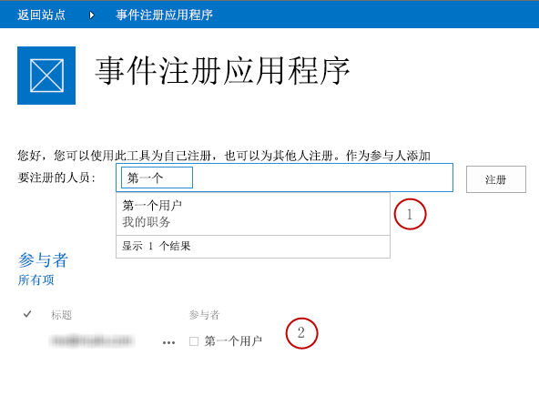
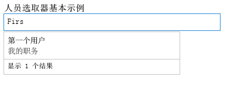
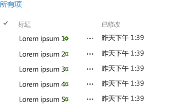

# Office Web 小部件 - 实验概述
了解您在 Office 外接程序、SharePoint 外接程序和网站中可以使用的"Office Web 小部件 - 实验"。
> **警告**
> "Office Web 小部件 - 实验"仅用于研究和反馈。请勿用于生产方案。Office Web 小部件的行为在未来版本中可能会发生重大变化。请阅读并查看  [Office Web 小部件 - 实验许可条款](office-web-widgetsexperimental-license-terms.md)。 

"Office Web 小部件 - 实验"等客户端控件可以大大减少构建外接程序所需的时间，同时提高外接程序的质量。为实现这一点，我们必须确保小部件满足以下条件：
- 小部件必须设计为用于任何网页，即使该页面未承载在 SharePoint 上。

- 小部件可在 Office 运行时控件内工作。这样我们就可以提供一套通用要求和一致的语法来使用小部件。

- 与 SharePoint 通信的小部件使用跨域库。小部件不会依赖于特定的服务器端平台或技术。不论您选择何种服务器技术，均可使用小部件。

- 小部件必须与页面中的其他元素共存。在页面中包含小部件不应修改其中的其他元素。

- 与现有框架完美运行。我们希望确保您仍可使用习惯的工具和技术。

**图 1. 使用"Office Web 小部件 - 实验"的外接程序**

您可以通过安装 Visual Studio 中的 **Office Web 小部件 - 实验** NuGet 程序包来使用小部件。有关详细信息，请参阅 [使用对话框管理 NuGet 程序包](http://docs.nuget.org/docs/start-here/managing-nuget-packages-using-the-dialog)。您也可以浏览  [NuGet 库页](http://www.nuget.org/packages/Microsoft.Office.WebWidgets.Experimental/)。您的反馈和意见可帮助我们决定要提供的小部件。正如您在图 1 中所看到，(1) 人员选取器和 (2) 桌面列表视图小部件已准备就绪，可供您试用和实验。请通过以下网站提供反馈： [Office 开发人员平台 UserVoice site](http://officespdev.uservoice.com/)您还可以在  [Office Web 小部件 - 实验演示](http://code.msdn.microsoft.com/SharePoint-2013-Office-Web-6d44aa9e)代码示例中查看使用的小部件。
## "人员选取器"小部件

您可以在外接程序中使用实验性"人员选取器"小部件，帮助您的用户查找和选择租户中的人员和组。用户可以开始在文本框中键入内容，小部件将检索名字或电子邮件与用户所键入文本匹配的人员。

**图 2. "人员选取器"小部件解决查询**

您可以在 HTML 标记中或以编程方式使用 JavaScript 来声明小部件。不论是哪种情况，您均可使用 **div** 元素作为小部件的占位符。您还可以为"人员选取器"小部件设置属性和事件处理程序。下表显示了"人员选取器"小部件中可用的属性和事件。

|**属性/事件**|**类型**|**说明**|
|:-----|:-----|:-----|
|**objectType**   |JSON 对象（字符串列表）    | 小部件将解析的项目的类型。选项：    用户    组    默认为仅用户。   |
|**allowMultipleSelections**   |布尔值    |True/False。如果为 False，小部件应允许一次仅选择一项。          默认值为 False。    |
|**rootGroupName**   |字符串    |如果提供，小部件将仅选择此组中的项目。          如果未提供，小部件将查询整个租赁的对象。    |
|**selectedItems**   |JSON 数组    |选定项的列表。每一项将返回一个表示用户或组的对象。    |
|**onAdded**   |函数    |将新对象添加到所选内容时触发的事件。处理程序函数接收到所添加的对象。    |
|**onRemoved**   |函数    |将新对象从所选内容删除时触发的事件。处理程序函数接收到所删除的对象。    |
|**onChange**   |函数    |添加或删除对象都会触发此事件。不会将任何参数传递到处理程序函数。    |
|**validationErrors**   |数组    | 可能的验证错误的数组：    empty    unresolvedItem    tooManyItems   |
|**autoShowValidationMessage**   |布尔值    |True=显示          False=不显示    |
|**hasErrors**   |布尔值    |True= 1 个或多个验证错误          False=没有验证错误    |
|**errors**   |数组    | 可能的验证错误的数组：    empty    unresolvedItem    tooManyItems   |
|**displayErrors**   |布尔值    |True=显示错误          False=不显示错误    |
 
"人员选取器"小部件的 CSS 类在 **Office.Controls.css** 样式表中定义。您可以覆盖类并确定外接程序的小部件的样式。

有关详细信息，请参阅 [在 SharePoint 外接程序中使用实验性"人员选取器"小部件](use-the-experimental-people-picker-widget-in-sharepoint-add-ins.md)和 [在外接程序中使用"人员选取器"实验小部件](http://code.msdn.microsoft.com/SharePoint-2013-Use-the-57859f85)代码示例。

## "桌面列表视图"小部件

您的用户可以受益于"列表视图"小部件，并像常规"列表视图"小部件一样显示数据，但您可以将其用于不必在 SharePoint 中托管的外接程序。

**图 3."桌面列表视图"小部件在列表中显示数据**

您可以在列表上指定现有视图，小部件将按其在视图中出现的顺序呈现字段。

> **注释**
> 此时，"桌面列表视图"小部件仅显示数据。它不提供编辑功能。 

您可以使用 **div** 元素为小部件提供占位符。您可以编程方式或声明方式使用小部件。

您还可以为"桌面列表视图"小部件设置属性或事件处理程序。下表显示了"桌面列表视图"小部件中的可用属性和事件。

|**属性/事件**|**类型**|**说明**|
|:-----|:-----|:-----|
|**listUrl**   |URL    |从中拉取项目的列表视图的 URL。它可以是假定位于外接程序网站本身的相对 URL，也可以是绝对 URL。    |
|**viewName**   |字符串    |要显示的视图的名称。这是视图的编程名称（而非显示名称）。    |
|**onItemSelected**   |函数    |在列表中选择项目时触发的事件。    |
|**onItemAdded**   |函数    |将新项目添加到列表时触发的事件。    |
|**onItemRemoved**   |函数    |将项目从列表中删除时触发的事件。    |
|**selectedItems**   |数组    |JSON 格式的所选项目的列表。    |
 
小部件需要 SharePoint 网站样式表。您可以直接引用 SharePoint 样式表，或使用部件版式小部件。有关样式表的详细信息，请参阅 [在 SharePoint 外接程序中使用 SharePoint 网站的样式表](use-a-sharepoint-website-s-style-sheet-in-sharepoint-add-ins.md)和 [在 SharePoint 外接程序中使用客户端部件版式控制](use-the-client-chrome-control-in-sharepoint-add-ins.md)。

要查看使用的"列表视图"小部件，请参阅 [在外接程序中使用"桌面列表视图"实验小部件](http://code.msdn.microsoft.com/SharePoint-2013-Use-the-c3edb076)代码示例。另请参阅 [在 SharePoint 外接程序中使用实验性"桌面列表视图"小部件](use-the-experimental-desktop-list-view-widget-in-sharepoint-add-ins.md)。

## 结论

小部件有助于加速开发过程并降低外接程序的成本和上市时间。"Office Web 小部件 - 实验"可提供您可以用于非生产外接程序的小部件。欢迎您在  [Office 开发人员平台 UserVoice 网站](http://officespdev.uservoice.com/)上提供反馈和意见。

## 其他资源

-  [Office Web 小部件 - 实验许可条款](office-web-widgetsexperimental-license-terms.md)

-  [Office Web 小部件 - 实验 NuGet 库页](http://www.nuget.org/packages/Microsoft.Office.WebWidgets.Experimental/)

-  [在 SharePoint 外接程序中使用实验性"人员选取器"小部件](use-the-experimental-people-picker-widget-in-sharepoint-add-ins.md)

-  [代码示例：Office Web 小部件 - 实验演示](http://code.msdn.microsoft.com/SharePoint-2013-Office-Web-6d44aa9e)

-  [在 SharePoint 外接程序中使用实验性"桌面列表视图"小部件](use-the-experimental-desktop-list-view-widget-in-sharepoint-add-ins.md)

-  [代码示例：在外接程序中使用"人员选取器"实验小部件](http://code.msdn.microsoft.com/SharePoint-2013-Use-the-57859f85)

-  [代码示例：在外接程序中使用"桌面列表视图"实验小部件](http://code.msdn.microsoft.com/SharePoint-2013-Use-the-c3edb076)

