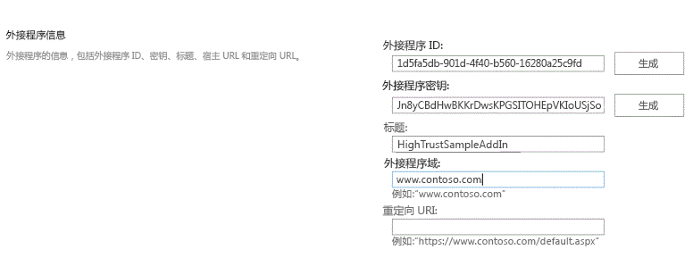
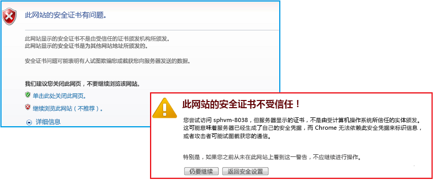

# 打包和发布高度可信的 SharePoint 外接程序
了解如何打包和发布高信任 SharePoint 外接程序以供本地使用。
## 打包并发布高信任外接程序的先决条件
<a name="Prereqs"> </a>

您需要具备以下条件：
  
    
    

- 本地 SharePoint 2013 开发环境。相关设置说明，请参阅 [设置 SharePoint 加载项的本地开发环境](set-up-an-on-premises-development-environment-for-sharepoint-add-ins.md)。
    
  
- 用于承载远程 Web 应用程序的 IIS Web 服务器。应安装 IIS 管理器。
    
  
- 远程安装的或在已安装 SharePoint 2013 的计算机上安装的 Visual Studio。
    
  
- Visual Studio Microsoft Office 开发人员工具
    
  
- 安装在 Visual Studio 计算机上的  [Web Deploy](http://www.iis.net/downloads/microsoft/web-deploy)，以及安装在远程 Web 应用程序服务器上的相同版本的 **Web Deploy** 。
    
  
表 1 列出了一些有助于您理解创建 SharePoint 外接程序所涉及的概念的有用文章。
  
    
    

**表 1. 发布高信任外接程序的核心概念**


|**文章标题**|**说明**|
|:-----|:-----|
| [开始创建提供程序承载的 SharePoint 加载项](get-started-creating-provider-hosted-sharepoint-add-ins.md) <br/> |了解如何使用 SharePoint 外接程序 创建提供程序承载的基本 Visual Studio Office 开发人员工具。  <br/> |
| [创建 SharePoint 高信任外接程序](create-high-trust-sharepoint-add-ins.md) <br/> |了解如何使用 SharePoint 外接程序 通过自签名证书和关联的颁发者 ID 创建基本的高信任 Visual Studio Office 开发人员工具。  <br/> |
| [Web Deploy](http://www.iis.net/downloads/microsoft/web-deploy) <br/> |Web Deploy 简化了 Web 应用程序和网站到 IIS 服务器的部署。  <br/> |
| [Digital Certificates](http://msdn.microsoft.com/library/e523b335-0156-4f47-b55c-b80495587c4f.aspx)和 [Working with Certificates](http://msdn.microsoft.com/library/6ffb8682-8f07-4a45-afbb-8d2487e9dbc3.aspx) <br/> |了解数字证书背后的基本思想。  <br/> |
   

> **注释**
> 高信任 SharePoint 外接程序只能安装到本地 SharePoint，不能安装到 Microsoft SharePoint Online，它们主要用于本地 Web 应用程序，而不是基于云的 Web 应用程序。本文介绍在该场景中如何发布外接程序。同样，在本文中，"客户"指安装 SharePoint 外接程序并托管外接程序的远程组件的企业。 
  
    
    


## 注册高信任外接程序
<a name="Register"> </a>

要发布外接程序，必须将其注册到 SharePoint 服务器场的外接程序管理服务。高信任 SharePoint 外接程序通常在将安装外接程序的 SharePoint 服务器场上注册。（它们不能通过 Office 商店出售。）注册在页面 http:// _SharePoint_website_/_layouts/15/appregnew.aspx 上完成，如以下过程中所述。
  
    
    

### 注册外接程序


1. 导航到 http:// _SharePoint_website_/_layouts/15/appregnew.aspx 页面。选择"生成"按钮以生成外接程序 ID 和密钥的值。（密钥并不会在高信任 SharePoint 外接程序中实际使用，但表单需要密钥。）提供将在其中运行外接程序的远程 Web 应用程序的域的基 URL。不要将协议 (HTTPS) 包含在域中，但您必须包含远程组件将用于 HTTPS 请求的端口（如果不是 443），例如 www.contoso.com:5555 或MyAppServer:4444。
    
    如果您需要重定向 URI，则还需输入它的值。有关如何使用重定向 URI 的说明，请参阅  [SharePoint 外接程序的身份验证代码 OAuth 流](authorization-code-oauth-flow-for-sharepoint-add-ins.md)。
    
    该页面上的表单应类似于图 1。在本示例中，远程 Web 应用程序服务器将侦听默认端口 443 上的 HTTPS 请求，因此不需要在外接程序域中指定端口。
    

   **图 1. 在 appregnew.aspx 上注册外接程序**

  

     
  

  

  
2. 选择"创建"。您为外接程序输入的信息将显示在下一页上。务必保持此信息可用，因为当您使用 Visual Studio 发布工具时将需要此信息。可以考虑创建此页面的快速屏幕截图。
    
  

## 选择用于获取、维护并部署高信任 SharePoint 外接程序的证书的策略
<a name="Certificate"> </a>

开发人员在 Visual Studio 中使用"F5"开发和调试高信任 SharePoint 外接程序时，开发人员可以使用自签名证书，如 [创建 SharePoint 高信任外接程序](create-high-trust-sharepoint-add-ins.md)中所述。但是，当外接程序 *发布*  时，使用自签名证书将导致浏览器显示一个警告页面，然后才会打开远程 Web 应用程序的启动页面。用户必须选择是否继续。图 3 显示了此类警告的示例。
  
    
    

**图 3. 自签名证书的警告**

  
    
    

  
    
    

  
    
    
此警告的困扰对于开发人员来说可能可以接受，但对于客户来说无法接受。因此，在最终发布到生产环境之前，客户必须获得由受信任第三方签署的证书。第三方可以为商业证书颁发机构 (CA) 或内部部署 CA。对于商业 CA，请注意，行业将逐步淘汰用于 Web 服务器的"仅 Intranet"证书。您仍然可以购买这些证书，但这些证书将于 2016 年 11 月或更早过期。不需要将此类证书用于高信任 SharePoint 外接程序，因为可用于面向 Intranet 的 Web 服务器的证书也可用于 Intranet Web 服务器，但后者通常成本更高。
  
    
    
证书应使用两种格式：个人信息交换 (pfx) 和安全证书 (cer)。如果最初获取时两种格式都不是，客户可以使用实用工具进行转换。此外，获取 pfx 格式的证书版本后，可以将 pfx 文件导入到 IIS，然后导出 cer 版本，如下所述。
  
    
    
如果证书最初获取时为 cer 格式，它将包含私钥和公钥。常规做法是，SharePoint 使用的 .cer 文件不应包含私钥。可以考虑将原始证书导入到 IIS，然后导出不包含私钥的新 cer 版本，如下所述。有关 .pfx 文件和 .cer 文件的详细信息，请参阅 [软件发布者证书](http://msdn.microsoft.com/zh-cn/library/windows/hardware/ff552299%28v=vs.85%29.aspx)。
  
    
    
此外，客户必须考虑是对所有高信任 SharePoint 外接程序使用一个证书，还是对每个应用程序使用单独的证书。有关此决定的详细信息，请参阅 [决定对高信任 SharePoint 外接程序使用一个还是多个证书](creating-sharepoint-add-ins-that-use-high-trust-authorization.md#Deciding)。
  
    
    

## 使用证书配置远程 Web 服务器
<a name="ConfigureRemote"> </a>

下列过程将在承载远程 Web 应用程序的远程 Web 服务器上执行。
  
    
    

### 配置远程 Web 服务器和 pfx 证书


1. 对 .pfx 证书指定一个强密码。有关详细信息，请参阅 [创建强密码的指南](http://msdn.microsoft.com/zh-cn/library/bb416446.aspx)和 [强密码](http://msdn.microsoft.com/zh-cn/library/ms161962.aspx)。
    
  
2. 执行下列步骤，将证书导入到远程 Web 服务器上的 IIS 中：
    
1. 在 IIS 管理器中，选择左侧树视图中的  _ServerName_ 节点。
    
  
2. 双击"服务器证书"图标。
    
  
3. 在右侧"操作"窗格中选择"导入"。
    
  
4. 在"导入证书"对话框中，使用"浏览"按钮浏览到 .pfx 文件，然后输入证书密码。
    
  
5. 如果您使用的是 IIS 管理器 8，则会有"选择证书存储"下拉列表。选择"个人"。（这是指计算机的而不是用户的"个人"证书存储。）
    
  
6. 如果您还没有 cer 版本，或者您有 cer 版本但其中包含私钥，请启用"允许导出此证书"。
    
  
7. 单击"确定"。
    
  

### 打开 Windows 证书存储


1. 在同一台服务器上，打开"Microsoft 管理控制台"，如 [打开 MMC 3.0](http://technet.microsoft.com/zh-cn/library/cc766121.aspx) 中所述。
    
  
2. 为计算机帐户添加"证书"管理单元，如 [将"证书"管理单元添加到 MMC](http://technet.microsoft.com/zh-cn/library/cc754431.aspx) 中所述。请确保对 *计算机*  而不是用户或服务执行此过程。收到提示时，选择 *本地*  计算机，而不是其他计算机。
    
  
如果您使用的是 IIS 管理器 8，请跳过下一过程。
  
    
    

### 在 IIS 管理器 7 中将证书获取到 Windows 证书存储中的其他步骤


1. 在服务器文件系统上创建一个文件夹，用作证书的临时存储位置。
    
  
2. 在 IIS 管理器中，选择左侧树视图中的  _ServerName_ 节点。
    
  
3. 双击"服务器证书"图标。
    
  
4. 在"服务器证书"列表中，右键单击该证书，然后选择"导出"，如上面的图 4 所示。
    
   **图 4. 导出证书**

  

     
  

  

  
5. 将文件导出到所创建的文件夹中并输入密码。
    
  
6. 在"Microsoft 管理控制台"中导入证书，如 [导入证书](http://technet.microsoft.com/zh-cn/library/cc754489.aspx)中所述。请务必指定"个人"存储。
    
  
7. 将控制台保持打开状态以用于下一过程。
    
  
8.  *删除您在第一步中创建的文件夹及其中的证书文件。*  如果也将证书保留在文件系统中，将证书保留在证书存储中的安全优势将被抵消。
    
  
下一步适用于 IIS 管理器 7 和 8。
  
    
    

### 获取证书的序列号


1. 在"Microsoft 管理控制台"中，导航到"证书(本地计算机)"管理单元中"个人"文件夹下的"证书"文件夹（如果尚未打开）。
    
  
2. 双击您的 SharePoint 外接程序的证书将其打开，然后打开"详细信息"选项卡。
    
  
3. 选择"序列号"字段，将整个序列号显示在框中。
    
  
4. 将序列号（ *不包括空格*  ）复制到文本文件，然后将其提供给 SharePoint 外接程序的开发人员。
    
    > **提示**
      > 某些开发人员博客文章和论坛问题报告称，将序列号直接复制到剪贴板会产生一个包含隐藏字符的字符串，导致序列号对 SharePoint 外接程序中的代码不可识别。可以考虑手动键入数字，而不是进行复制。 
接下来，您将创建证书的 cer 版本。此版本包含远程 Web 服务器的公钥，供 SharePoint 用于解密远程 Web 应用程序发出的请求并验证这些请求中的访问令牌。此版本在远程 Web 服务器上创建，然后移至 SharePoint 服务器场。
  
    
    

### 创建 cer 证书


1. 在 IIS 管理器中，选择左侧树视图中的  _ServerName_ 节点。
    
  
2. 双击"服务器证书"。
    
  
3. 在"服务器证书"视图中，双击证书以显示证书详细信息。
    
  
4. 在"详细信息"选项卡上，选择"复制到文件"以启动"证书导出向导"，然后选择"下一步"。
    
  
5. 使用默认值"不，不导出私钥"，然后选择"下一步"。
    
  
6. 使用下一页上的默认值。选择"下一步"。
    
  
7. 选择"浏览"并浏览到任何文件夹。（cer 文件将从此计算机中移出。）对文件指定与 pfx 文件相同的名称，然后选择"保存"。将证书另存为 .cer 文件。
    
  
8. 选择"下一步"。
    
  
9. 选择"完成"。
    
  

## 将 SharePoint 配置为使用证书
<a name="ConfigureSP"> </a>

本节中的过程可以在安装了 **SharePoint 命令行管理程序**的任何 SharePoint 服务器上执行。
  
    
    

### 将 cer 文件分发到 SharePoint


1. 创建一个文件夹，并确保以下 IIS 外接程序池的外接程序池标识符具有对该文件夹的读取权限：
    
  - **SecurityTokenServiceApplicationPool**
    
  
  - 可服务于 IIS 网站的外接程序池，该网站托管用于测试 SharePoint 网站的父 SharePoint Web 应用程序。对于"SharePoint - 80"IIS 网站，该池称为"OServerPortalAppPool"。
    
  
2. 将 .cer 文件从远程 Web 服务器 *移动*  （不只是复制）至您刚刚在 SharePoint 服务器上创建的文件夹。文件仅临时存储在该文件夹中。
    
  
以下过程将证书配置为 SharePoint 中的受信任令牌颁发者。此过程对每个高信任 SharePoint 外接程序仅执行一次。
  
    
    

### 配置证书


1. 创建所需的高信任配置 Windows PowerShell 脚本（如果尚未创建），如  [SharePoint 2013 的高信任配置脚本](high-trust-configuration-scripts-for-sharepoint-2013.md)中所述。
    
  
2. 将脚本复制到 SharePoint 服务器。
    
  
3. 以管理员身份打开"SharePoint 命令行管理程序"并运行相应的脚本。
    
  
4. 其中一个脚本用于客户在多个 SharePoint 外接程序之间共享一个证书的情况。该脚本会输出包含令牌颁发者的 GUID 的文件。如果您使用该脚本，请将其输出的文件提供给高信任 SharePoint 外接程序的开发人员。
    
  
5.  *从 SharePoint 服务器的文件系统中删除 cer 文件。* 
    
  

> **注释**
> 将证书注册为令牌颁发者不会立即生效，外接程序需等注册生效后才能运行。可能需要 24 小时，才能使所有 SharePoint 服务器识别新的令牌颁发者。在所有 SharePoint 服务器上运行 iisreset 会使它们立即识别颁发者，前提是您可以在不影响 SharePoint 用户的情况下执行此操作。 
  
    
    


## 修改 web.config 文件
<a name="WebConfig"> </a>


> **提示**
> 对于包含已修改 web.config 的代码示例，请参阅  [PnP / Samples / Core.OnPrem.S2S.WindowsCertStore](https://github.com/OfficeDev/PnP/tree/dev/Samples/Core.OnPrem.S2S.WindowsCertStore)。 
  
    
    

编辑 web.config 文件，使其包含  `appSettings` 节点中以下注册表项的新值：
  
    
    

- **ClientID：**这是 Web 应用程序的客户端 ID (GUID)，在 appregnew.aspx 上生成。
    
  
- **ClientSigningCertificateSerialNumber：** *（如果 Visual Studio Microsoft Office 开发人员工具 尚未添加此注册表项，您需进行添加。）*  这是证书的序列号。值中不应包含空格或连字符。
    
  
- **IssuerId：**这是令牌颁发者的 GUID（ *必须为小写*  ）。它的值取决于客户的证书策略：
    
  - 如果高信任 SharePoint 外接程序具有自己的证书，不与其他 SharePoint 外接程序共享， `IssuerId` 将与 `ClientId` 相同。
    
  
  - 如果 SharePoint 外接程序与其他 SharePoint 外接程序 共享同一个证书，则  `IssuerId` 为任意 GUID。用于此方案的脚本（您可以在 [SharePoint 2013 的高信任配置脚本](high-trust-configuration-scripts-for-sharepoint-2013.md)中找到）将生成一个文本文件，其中包含此 GUID。IT 员工可以将输出文件传送给外接程序开发人员，以作为  `IssuerId` 插入到 web.config 文件中。
    
  

> **注释**
> Visual Studio Office 开发人员工具 可能已添加 **ClientSigningCertificatePath** 和 **ClientSigningCertificatePassword** 的外接程序设置键。这些键在生产外接程序中不能使用，应该删除。
  
    
    

示例如下。请注意，高信任 SharePoint 外接程序没有 **ClientSecret** 键。
  
    
    


```XML

<appSettings>
  <add key="ClientID" value="c1c12d4c-4900-43c2-8b89-c05725e0ba30" />
  <add key="ClientSigningCertificateSerialNumber" value="556a1c9c5a5415994941abd0ef2f947b" />
  <add key="IssuerId" value="f94591d5-89e3-47cd-972d-f1895cc158c6" />
</appSettings>

```


## 修改 TokenHelper 文件
<a name="WebConfig"> </a>

Visual Studio Office 开发人员工具 生成的 TokenHelper.cs（或 .vb）文件需进行修改，以用于 Windows 证书存储中所存储的证书 ，并按其序列号进行检索。下面是一个单向示例，该示例使用 C#。
  
    
    

> **提示**
> 对于包含已修改 tokenhelper.cs 的代码示例，请参阅  [PnP / Samples / Core.OnPrem.S2S.WindowsCertStore](https://github.com/OfficeDev/PnP/tree/dev/Samples/Core.OnPrem.S2S.WindowsCertStore)。 
  
    
    


### 修改 TokenHelper


1. 文件的  `#region private fields` 部分底部附近是 `ClientSigningCertificatePath`、 `ClientSigningCertificatePassword` 和 `ClientCertificate` 的声明。请全部删除。
    
  
2. 在对应的位置添加以下行：
    
  ```
  
private static readonly string ClientSigningCertificateSerialNumber
    = WebConfigurationManager.AppSettings.Get("ClientSigningCertificateSerialNumber");
  ```

3. 找到声明  `SigningCredentials` 字段的行。将其替换为以下行：
    
  ```
  
private static readonly X509SigningCredentials SigningCredentials
    = GetSigningCredentials(GetCertificateFromStore());
  ```

4. 转到文件的  `#region private methods` 部分，添加以下两个方法：
    
  ```
  
private static X509SigningCredentials GetSigningCredentials(X509Certificate2 cert)
{
    return (cert == null) ? null 
                          : new X509SigningCredentials(cert, 
                                                       SecurityAlgorithms.RsaSha256Signature, 
                                                       SecurityAlgorithms.Sha256Digest);
}

private static X509Certificate2 GetCertificateFromStore()
{
    if (string.IsNullOrEmpty(ClientSigningCertificateSerialNumber))
    {
        return null;
    }  

    // Get the machine's personal store
    X509Certificate2 storedCert;
    X509Store store = new X509Store(StoreName.My, StoreLocation.LocalMachine); 

    try
    {
        // Open for read-only access                 
        store.Open(OpenFlags.ReadOnly);

        // Find the cert
        storedCert = store.Certificates.Find(X509FindType.FindBySerialNumber, 
                                             ClientSigningCertificateSerialNumber, 
                                             true)
                       .OfType<X509Certificate2>().SingleOrDefault();
    }
    finally
    {
        store.Close();
    }

    return storedCert;
}
  ```


## 使用 Visual Studio 向导打包远程 Web 应用程序和 SharePoint 外接程序以便于发布
<a name="Package"> </a>


> **提示**
> Microsoft 对 Visual Studio 和 Visual Studio Office 开发人员工具 的更新比过去频繁得多，文档无法始终与变更保持一致。本节使用 2013 年 10 月发布的 Visual Studio 版本及其中的 Visual Studio Office 开发人员工具 版本编写。如果您使用 Visual Studio 或工具的更早或更晚版本，您可能需要查阅 Visual Studio 帮助和博客文章，以查找执行这些过程中的步骤的相当方式。 
  
    
    


### 打包远程 Web 应用程序


1. 在"解决方案资源管理器"中，右键单击 Web 应用程序项目（而不是 SharePoint 外接程序项目），然后选择"发布"。
    
  
2. 在"配置文件"选项卡上，从下拉列表中选择"新建配置文件"。
    
  
3. 收到提示时，为配置文件指定一个合适的名称。例如，Payroll SP 外接程序 - 远程 Web 应用程序。
    
  
4. 在"连接"选项卡上，在"发布"方法下拉列表中选择"Web Deploy 包"。
    
  
5. 对于"打包位置"，可使用任何文件夹。为简化后面的过程，这应该是一个空文件夹。通常使用项目的 bin 文件夹的子文件夹。
    
  
6. 对于站点名称，输入将承载 Web 应用程序的 IIS 网站的名称。不要在名称中包含协议、端口或斜线；例如"PayrollSite"。如果您希望 Web 应用程序是默认网站的子网站，请使用 Default Web Site _/<website name>_；例如"Default Web Site/PayrollSite"。（如果 IIS 网站还不存在，当您在稍后的过程中执行 Web Deploy 包时将创建。）
    
  
7. 单击"下一步"。
    
  
8. 在"设置"选项卡上，从"配置"下拉列表中选择"发布"或"调试"。
    
  
9. 单击"下一步"，然后单击"发布"。将在打包位置创建一个 zip 文件和其他各种文件，在稍后的过程中将使用这些文件来安装 Web 应用程序。
    
  

### 创建 SharePoint 外接程序包


1. 右键单击您的解决方案中的 SharePoint 外接程序项目，然后选择"发布"。
    
  
2. 在"当前配置文件"下拉列表中，选择您在上一过程中创建的配置文件。
    
  
3. 如果"编辑"按钮旁边出现一个小的黄色警告符号，单击"编辑"按钮。将打开一个表单，要求您提供在 web.config 文件中提供的相同信息。由于您使用的是"Web Deploy 包"发布方法，此信息并非必填，但您不能将此表单留空。在四个文本框中输入任意字符，然后单击"完成"。
    
  
4. 单击"打包外接程序"按钮。（不要单击"部署 Web 项目"。此按钮仅重复您在上一过程的最后一步执行的操作。）将打开一个"打包外接程序"表单。
    
  
5. 在"您的网站在哪里托管?"文本框中，输入远程 Web 应用程序的域的 URL。您必须包含协议 HTTPS；如果 Web 应用程序将侦听 HTTPS 请求的端口不是 443，您必须也包含端口；例如，https://MyServer:4444。（这是 Visual Studio Office 开发人员工具 用于替换 SharePoint 外接程序的外接程序清单中的 ~remoteAppUrl 令牌的值。）
    
  
6. 在"外接程序的客户端 ID 是什么?"文本框中，输入在 appregnew.aspx 页上生成的客户端 ID，您在 web.config 文件中也输入了此客户端 ID。
    
  
7. 单击"完成"。您的外接程序包即已创建。
    
  

## 发布远程 Web 应用程序并安装 SharePoint 外接程序
<a name="PublishRemote"> </a>


  
    
    

### 发布 Web 应用程序


1. 导航到打包远程 Web 应用程序时作为"打包位置"的文件夹，然后将其中的所有文件复制到远程服务器上的某个文件夹中。
    
  
2. 在该文件夹中，打开  _project_name_.deploy-readme.txt 文件（其中  _project_name_ 是 Visual Studio Web 应用程序项目的名称），然后按照文件中的说明，使用 _project_name_.deploy.cmd 文件安装 Web 应用程序。
    
  

### 为 Web 应用程序配置协议绑定


1. 在 IIS 管理器中，在"连接"窗格中突出显示新网站。（如果新 Web 应用程序是"默认网站"的子项，则突出显示"默认网站"并对"默认网站"执行此过程。）
    
  
2. 单击"操作"窗格中的"绑定"。
    
  
3. 单击"站点绑定"对话框中的"添加"。在打开的"添加站点绑定"对话框中，执行以下步骤。
    
1. 在"类型"下拉列表中选择"HTTPS"。
    
  
2. 在"IP 地址"下拉列表中选择"所有未分配"。
    
  
3. 在"端口"文本框中输入端口。如果您在 appregnew.aspx 上注册 SharePoint 外接程序时在外接程序域中指定了端口（如 [注册高信任外接程序](#Register)中所述），您必须在此处使用相同的端口号。如果您在 appregnew 上未指定端口，则在此处使用 443。
    
  
4. 在"SSL 证书"下拉列表中，选择您在上面的 [使用证书配置远程 Web 服务器](#ConfigureRemote)部分中配置服务器时使用的证书。
    
  
5. 单击"确定"。
    
  
4. 单击"关闭"。
    
  

### 为 Web 应用程序配置身份验证


1. 在 IIS 中安装新的 Web 应用程序时，它最初配置为用于匿名访问，但几乎所有的高信任 SharePoint 外接程序均设计为需要用户进行身份验证，因此您需要对其进行更改。在 IIS 管理器中，在"连接"窗格中突出显示该 Web 应用程序。它是默认网站的同级网站或子网站。
    
  
2. 双击中心窗格中的"身份验证"图标以打开"身份验证"窗格。
    
  
3. 突出显示"匿名身份验证"，然后单击"操作"窗格中的"禁用"。
    
  
4. 突出显示 Web 应用程序设计使用的身份验证系统，然后单击"操作"窗格中的"启用"。
    
    如果 Web 应用程序的代码使用 TokenHelper 和 SharePointContext 文件中的生成代码，而不修改文件的用户身份验证部分，则表示 Web 应用程序使用的是"Windows 身份验证"，这是您应该启用的选项。
    
  
5. 如果您使用生成的代码文件，而不修改文件的用户身份验证部分，则您还需要执行以下步骤以配置身份验证提供程序：
    
1. 在"身份验证"窗格中突出显示"Windows 身份验证"。
    
  
2. 单击"提供程序"。
    
  
3. 在"提供程序"对话框中，确保""NTLM在"Negotiate" *之上*  列出。
    
  
4. 单击"确定"。
    
  

### 上载和安装 SharePoint 外接程序


1. 将 SharePoint 外接程序的 *.app 包文件上载到组织外接程序目录。（高信任 SharePoint 外接程序无法通过 Office 商店分发。）有关详细信息，请参阅 [将外接程序添加到外接程序目录](http://technet.microsoft.com/zh-cn/library/fp161234.aspx#AddApps)。
    
  
2. 在包含外接程序目录的相同父 SharePoint Web 应用程序内的任意网站上安装外接程序。有关上载和安装 SharePoint 外接程序的详细信息，请参阅 [将 SharePoint 外接程序添加到 SharePoint 2013 网站](http://technet.microsoft.com/zh-cn/library/fp161231)。
    
  

## 其他资源
<a name="bk_addresources"> </a>


-  [创建 SharePoint 高信任外接程序](create-high-trust-sharepoint-add-ins.md)
    
  
-  [使用 Visual Studio 发布 SharePoint 外接程序](publish-sharepoint-add-ins-by-using-visual-studio.md)
    
  
-  [注册 SharePoint 2013 外接程序](register-sharepoint-add-ins-2013.md)
    
  
-  [开始创建提供程序承载的 SharePoint 加载项](get-started-creating-provider-hosted-sharepoint-add-ins.md)
    
  

