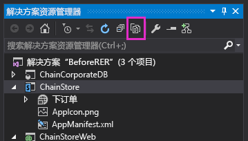

# 以编程方式在提供程序托管的外接程序中部署自定义按钮
了解在提供程序托管的相同 SharePoint 外接程序中，如何以编程方式在自定义列表中注册自定义功能区按钮。
这是关于开发 SharePoint 托管的 SharePoint 外接程序的基础知识系列文章中的第 9 篇文章。您应该首先熟悉  [SharePoint 外接程序](sharepoint-add-ins.md)以及本系列中之前的文章：


-  [开始创建提供程序承载的 SharePoint 加载项](get-started-creating-provider-hosted-sharepoint-add-ins.md)


-  [使提供程序托管的外接程序具有 SharePoint 的外观](give-your-provider-hosted-add-in-the-sharepoint-look-and-feel.md)


-  [在提供程序托管的外接程序中包含自定义按钮](include-a-custom-button-in-the-provider-hosted-add-in.md)


-  [获取 SharePoint 对象模型的快速概述](get-a-quick-overview-of-the-sharepoint-object-model.md)


-  [将 SharePoint 写入操作添加到提供程序托管的外接程序](add-sharepoint-write-operations-to-the-provider-hosted-add-in.md)


-  [在提供程序托管的外接程序中包括外接程序部件](include-an-add-in-part-in-the-provider-hosted-add-in.md)


-  [处理提供程序托管的外接程序中的外接程序事件](handle-add-in-events-in-the-provider-hosted-add-in.md)


-  [将首次运行逻辑添加到提供程序托管的外接程序](add-first-run-logic-to-the-provider-hosted-add-in.md)


> **注释**
> 如果您阅读过关于提供程序托管的外接程序的系列文章，那么您应该具有 Visual Studio 解决方案，可以继续阅读本主题。您还可以从  [SharePoint_Provider-hosted_Add-Ins_Tutorials](https://github.com/OfficeDev/SharePoint_Provider-hosted_Add-ins_Tutorials) 下载存储库并打开 BeforeProgrammaticButton.sln 文件。


在本文中，您将了解当其功能区获得按钮的列表本身以编程方式部署在相同的外接程序中时，如何将自定义功能区按钮包括在 SharePoint 外接程序中。
## 将自定义按钮重新添加到项目中


> **注释**
>  Visual Studio 中的启动项目的设置可能会在重新打开解决方案时恢复为默认值。重新打开本系列文章中的示例解决方案后，请始终立即执行下列步骤：>  右键单击"解决方案资源管理器"顶部的解决方案节点，然后选择"设置启动项目"。>  确保所有三个项目在"操作"列中均设置为"启动"。


在前一篇文章中，您从项目中删除了自定义 **AddEmployeeToCorpDB** 功能区按钮。使用下面的步骤将其添加回去。


1. 在"解决方案资源管理器"中，按顶部小型工具栏上的"显示所有文件"。




2. 在"ChainStore"项目中，右键单击"AddEmployeeToCorpDB"，然后选择"包括在项目中"。


3. 再次按"显示所有文件"按钮。


4. 在"ChainStore"项目中，展开"AddEmployeeToCorpDB"，然后打开 elements.xml 文件。


## 了解一种两难情况以及它的解决方案

在 elements.xml 文件中， **CustomAction** 元素的 **RegistrationId** 属性标识已在其功能区上添加按钮的列表： `{$ListId:Lists/Local Employees;}`。当列表已手动添加到主机 Web 时，这运行良好。但现在我们正在首次运行逻辑中以编程方式部署列表，当 SharePoint 安装外接程序并尝试部署按钮时，列表不存在。安装外接程序将抛出异常并失败。


在安装事件处理程序而非首次运行逻辑中部署列表无法解决这一两难问题，因为 SharePoint 在运行自定义处理程序 *之前*  部署描述性的自定义组件，例如自定义按钮（和"下订单"外接程序部件），因此在 SharePoint 尝试部署按钮时列表不存在。


完全以编程方式创建自定义按钮并不可行，原因太过高深，在此处不进行讨论。幸运的是，我们不需要执行此操作。有一种相对简单的方式，即以半编程方式创建自定义按钮，然后将其分配到自定义列表。基本步骤如下：


1. 将描述性按钮保留在项目中，但将其分配到 SharePoint 网站上始终存在的功能区，而不是以编程方式部署在相同外接程序中的列表。


2. 在首次运行逻辑中，以编程方式创建列表后，请以编程方式将未定义的按钮添加到列表的功能区。


3. 使用原始按钮的值初始化新按钮的属性。此时有两个完全相同的按钮。第二个按钮将分配到"本地员工"列表的功能区。


4. 以编程方式删除原始按钮。


## 以编程方式注册自定义按钮。

下面的过程演示如何实现此策略。


1. 在"ChainStore"项目中，展开"AddEmployeeToCorpDB"，打开 elements.xml 文件，然后将 **CustomAction** 元素的 **RegistrationId** 属性的值更改为"100"。这是列表类型的 ID。即使网站上没有此类列表的实例，列表 *类型*  将位于每个 SharePoint 网站上。现在属性看起来应该如下所示：

  ```XML

RegistrationId="100"
  ```

2. 在文件 SharePointComponentDeployer.cs 中，将以下行添加到  `DeployChainStoreComponentsToHostWeb` 方法中，位置为调用 `CreateLocalEmployeesList` 的行下方。您将在下一步中创建该方法。

  ```cs
  ChangeCustomActionRegistration();
  ```

3. 将以下方法添加到  `SharePointComponentDeployer` 类。对于此代码，请注意以下事项。

  - 因为自定义操作（即自定义按钮）已注册到列表 *类型*  的功能区中，它的作用域是整个网站并且位于网站的自定义操作集合中，因此代码将从该集合进行检索。


  -  `action.Name` 的值来自"AddEmployeeToCorpDB"中 element.xml 文件的 **CustomAction** 元素的 **ID** 属性。

    > **重要信息**
      > **必须更改下面的代码中的  `action.Name` 值，以与 elements.xml 文件中的值匹配。** 名称的 GUID 部分不能相同。请注意，GUID 和名称的其余部分之间有一个"."字符。下面是行的一个示例。>  `where action.Name == "4a926a42-3577-4e02-9d06-fef78586b1bc.AddEmployeeToCorpDB"`

  ```cs
  private static void ChangeCustomActionRegistration()
{
    using (var clientContext = sPContext.CreateUserClientContextForSPHost())
    {
         var query = from action in clientContext.Web.UserCustomActions
                     where action.Name == "{button_GUID} .AddEmployeeToCorpDB"
                     select action;
          IEnumerable<UserCustomAction> matchingActions = clientContext.LoadQuery(query);	   
	         clientContext.ExecuteQuery();
	
          UserCustomAction webScopedEmployeeAction = matchingActions.Single();

         // TODO8: Get a reference to the (empty) collection of custom actions 
         // that are registered with the custom list.

         // TODO9: Add a blank custom action to the list's collection.

         // TODO10: Copy property values from the descriptively deployed
         // custom action to the new custom action

        // TODO11: Delete the original custom action.     

          clientContext.ExecuteQuery();
    }
}
  ```

4. 将  `TODO8` 替换为以下代码。

    请注意，当您撤回外接程序时，不会删除外接程序创建的组件。执行首次运行逻辑后，列表的 **UserCustomActions** 集合中将出现一个自定义操作，下次您按 F5 时它不会撤回。为了避免混淆，此代码中的最后一行 `listActions.Clear();` 将清空集合。


  ```cs

var queryForList = from list in clientContext.Web.Lists
                   where list.Title == "Local Employees"
                   select list;
IEnumerable<List> matchingLists = clientContext.LoadQuery(queryForList);
clientContext.ExecuteQuery();

List employeeList = matchingLists.First();
var listActions = employeeList.UserCustomActions;
clientContext.Load(listActions);
listActions.Clear();
  ```

5. 将  `TODO9` 替换为以下行，该行会在"本地员工"列表中添加一个未定义的自定义操作。

  ```cs

var listScopedEmployeeAction = listActions.Add();
  ```

6. 将  `TODO10` 替换为以下代码。对于此代码，请注意以下事项。

  - 它将 Web 范围的按钮（使用描述性标记部署的按钮）的属性值分配到列表范围的按钮的相应属性，因此两个按钮除了作用域之外完全相同。


  - **Sequence** 属性指定按钮将在功能区中的对应区域出现的相对顺序。在本例中，按钮位于功能区的"项目"选项卡中的"操作"部分。在描述性标记中，该值设置为 10001，这足够高，可确保它出现在 SharePoint 本身在功能区的"操作"部分放置的任何框中按钮之后（即右边）。


  ```cs
  listScopedEmployeeAction.Title = webScopedEmployeeAction.Title;
listScopedEmployeeAction.Location = webScopedEmployeeAction.Location;
listScopedEmployeeAction.Sequence = webScopedEmployeeAction.Sequence;
listScopedEmployeeAction.CommandUIExtension = webScopedEmployeeAction.CommandUIExtension;
listScopedEmployeeAction.Update();
  ```

7. 将  `TODO11` 替换为以下行，该行将删除原始的描述性按钮。如果没有这一行，网站上使用列表模板"100"的所有列表将具有自定义按钮。因为按钮的功能与"本地员工"列表密切相关，因此在任何其他列表上设置按钮没有任何意义。此外，如果没有这一行，按钮将出现在"本地员工"列表上两次，因为该列表使用模板"100"。

  ```cs

webScopedEmployeeAction.DeleteObject();
  ```


    整个方法现在看起来应该如下所示（除了应该有一个 GUID 替换占位符）。


  ```cs
  private static void ChangeCustomActionRegistration()
{
    using (var clientContext = SPContext.CreateUserClientContextForSPHost())
    {
         var query = from action in clientContext.Web.UserCustomActions
                     where action.Name == "{button_GUID} .AddEmployeeToCorpDB"
                     select action;
          IEnumerable<UserCustomAction> matchingActions = clientContext.LoadQuery(query);	   
	         clientContext.ExecuteQuery();
	
          UserCustomAction webScopedEmployeeAction = matchingActions.Single();

         var queryForList = from list in clientContext.Web.Lists
                            where list.Title == "Local Employees"
                            select list;
         IEnumerable<List> matchingLists = clientContext.LoadQuery(queryForList);
         clientContext.ExecuteQuery();

        List employeeList = matchingLists.First();
        var listActions = employeeList.UserCustomActions;
        clientContext.Load(listActions);
        listActions.Clear();

        var listScopedEmployeeAction = listActions.Add();

        listScopedEmployeeAction.Title = webScopedEmployeeAction.Title;
        listScopedEmployeeAction.Location = webScopedEmployeeAction.Location;
        listScopedEmployeeAction.Sequence = webScopedEmployeeAction.Sequence;
        listScopedEmployeeAction.CommandUIExtension = webScopedEmployeeAction.CommandUIExtension;
        listScopedEmployeeAction.Update();

        webScopedEmployeeAction.DeleteObject();     

        clientContext.ExecuteQuery();
    }
}
  ```


## 请求对主机 Web 的完全控制

由于外接程序现在可以添加和删除 Web 范围的自定义操作，我们需要将外接程序请求的权限从"管理"提升到"完全控制"。请执行下列步骤。


1. 在"解决方案资源管理器"中，打开"ChainStore"项目中的 AppManifest.xml 文件。


2. 打开"权限"选项卡。将"作用域"值保留为"Web"，但在"权限"字段中，从下拉列表中选择"完全控制"。


3. 保存该文件。


## 运行外接程序并测试按钮部署


1. 打开香港分店网站的"网站内容"页面， *然后删除"本地员工"列表。* 

    > **注释**
      > 在 Visual Studio 中撤回外接程序不会删除该外接程序创建的列表，因此只要您测试创建它的代码，就需要将其手动删除。 
2. 使用 F5 键部署并运行您的外接程序。Visual Studio 在 IIS Express 中托管远程 Web 应用程序，在 SQL Express 中托管 SQL 数据库。它还会在 SharePoint 测试网站上临时安装外接程序并立即运行它。在起始页打开之前，将提示您向外接程序授予权限。


3. 当外接程序的起始页打开时，选择顶部部件版式控件上的"返回到网站"链接。


4. 导航到"网站内容"页面。"本地员工"列表已存在，因为您的首次运行逻辑添加了它。

    > **注释**
      > 如果该列表不存在或者有其他指示称首次运行代码未执行，可能是当您按 F5 时，"租户"表未恢复为空。最常见的原因是"ChainCorporateDB"项目在 Visual Studio 中不再设置为启动项目。请参阅本文顶部附近的注释，了解如何解决此问题。另外，请确保您已按照 [将 Visual Studio 配置为在每次调试会话时重建公司数据库](give-your-provider-hosted-add-in-the-sharepoint-look-and-feel.md#Rebuild)中所述，将数据库配置为重建。 
5. 打开列表并添加项目。


6. 在列表视图中，选择该项目并打开功能区上的"项目"选项卡。"添加到公司数据库"按钮位于功能区上。


7. 单击该按钮，员工将添加到公司数据库，"已添加到公司数据库"字段将更改为"是"。


8. 导航回"网站内容" 页面并选择"添加外接程序"。


9. 添加一个新的"自定义列表"，默认为"通用"类型。（通用为列表类型 100。）创建此列表后，在功能区上打开"项目"选项卡。请注意，"添加到公司数据库"按钮不位于功能区上。这是因为您的代码已删除 Web 范围的按钮。


10. 要结束调试会话，请关闭浏览器窗口或在 Visual Studio 中停止调试。每次按 F5 时，Visual Studio 将撤回外接程序的之前版本并安装最新版本。


11. 您将在其他文章中使用此外接程序和 Visual Studio 解决方案，因此最好是当您使用一段时间后，最后一次撤回外接程序。在"解决方案资源管理器"中右键单击此项目，然后选择"撤回"。


## 
<a name="Nextsteps"> </a>

列表和列表项事件也可能在 SharePoint 中具有自定义处理程序。您可在下一篇文章中了解如何创建自定义处理程序并将其部署到首次运行逻辑中： [处理提供程序托管的外接程序中的列表项事件](handle-list-item-events-in-the-provider-hosted-add-in.md)


