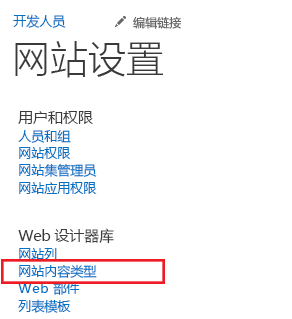
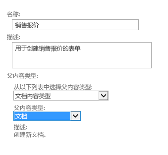
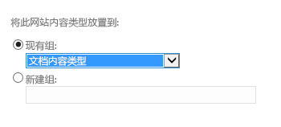
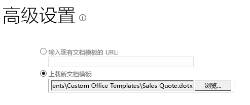
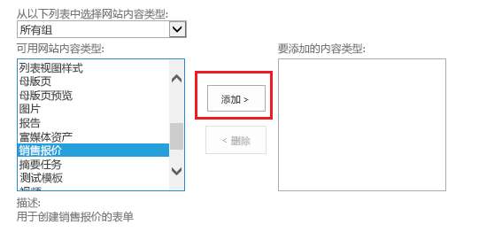
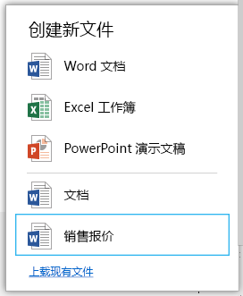

# 在云企业外接程序中为文档库提供模板
除了将文档添加到 SharePoint 文档库时可用的 Office 模板，您还可以提供您自己的模板。例如，您在添加新订单时可能有想使用的销售报价模板。
## 

如果您尚未执行此操作，请将文档库与云企业外接程序关联起来。请参阅 [将文档库与实体相关联](associate-a-document-library-with-an-entity.md)。

### 添加模板

1. 转到 SharePoint 开发人员网站，在"开发人员"页面上，选择"网站内容"。

2. 在"网站内容"页面上，选择"设置"，如图 1 中所示。

   **图 1. "设置"链接**

3. 在"网站设置"页面上的"Web 设计器库"列表中，选择"网站内容类型"，如图 2 中所示。

   **图 2. "网站内容类型"链接**

4. 在"网站内容类型"页面上，选择"创建"，如图 3 中所示。

   **图 3. "创建"链接**

5. 在"新建网站内容类型"页面上，输入模板的名称和说明。对于"父内容类型"，选择"文档内容类型"和"文档"，如图 4 中所示。

   **图 4. 父内容类型选择**

6. 在"组"部分的"现有组"列表中，选择"文档内容类型"（如图 5 中所示），然后选择"确定"。

   **图 5. 组设置**

7. 在"网站内容类型"页面上，选择"高级设置"。

8. 在"高级设置"页面上，输入现有文档模板的 URL 或上载新的文档模板（如图 6 中所示），然后选择"确定"。

   **图 6. 指定文档模板**

9. 转到"网站内容"页面，选择您的文档库，然后转到"设置"页面。

10. 在"设置"页面上，选择"从现有网站内容类型添加"。

11. 在"添加内容类型"页面上，添加您的模板（如图 7 中所示），然后选择"确定"。

   **图 7. 添加模板**

12. 运行外接程序并添加文档。您应该在"新建文件"对话框中看到您的模板，如图 8 中所示。

   **图 8. 带有新模板的"创建新文件"对话框**

## 其他资源

-  [开发云企业外接程序](develop-cloud-business-add-ins.md)

-  [将文档库与实体相关联](associate-a-document-library-with-an-entity.md)

