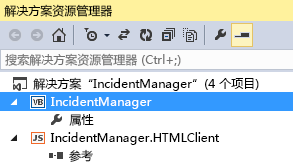

# 将云企业外接程序发布到 SharePoint
您可以将云企业外接程序作为提供程序托管的 SharePoint 外接程序进行发布。提供程序托管的外接程序使您可以将 Web 应用程序和数据库灵活地部署到本地 SharePoint 网站、Microsoft Azure 或第三方托管网站。发布外接程序后，其他人可以使用自己的计算机和移动设备从 SharePoint 运行该外接程序。您可以使用 WebDeploy 将外接程序直接发布到网站，也可以为外接程序创建一个程序包，以部署到多台服务器。
## 发布外接程序

1. 在"解决方案资源管理器"中，打开顶级应用程序节点的快捷菜单（如图 1 中所示），然后选择"发布"。
    
   **图 1. 顶级节点**

  

     
  

  

  
2. 在"LightSwitch 发布应用程序向导"中，在"SharePoint 选项"页面上，选择"提供程序承载"选项按钮，然后选择"下一步"。
    
  
3. 在"应用程序服务器配置"页面上，选择"IIS 服务器"选项按钮，然后选择"下一步" 。
    
    > [!注释]
      > 如果您具有为其他外接程序创建的发布设置（.publishsettings 或 .pubxml）文件，您可以使用该文件提供发布所需的其余信息。如果是这样，请在向导中选择"导入设置"按钮。 
4. 在"发布输出"页面上，选择"立即直接发布到服务器"选项按钮，然后选择"下一步"。
    
  
5. 在"发布设置"页面上的"服务 URL"文本框中，输入您希望发布外接程序的服务器的 URL。
    
    如果您发布到托管公司，公司将提供此值。此值可为下列任一格式：
    
  -  _HostingCompanyURL_（例如  `contoso.com`）
    
  
  -  `https://` _HostingCompanyURL_（例如  `https://contoso.com`）
    
  
  -  `https://` _HostingCompanyURL_ `:8172/msdeploy.axd`（例如  `https://contoso.com:8172/msdeploy.axd`）
    
  

    如果您发布到自己的计算机上的 Internet 信息服务 (IIS) 以进行测试，请输入  `localhost` 或计算机的名称。
    
    如果您发布到自己的网络上的服务器，请输入以下 URL：
    
  -  `http://` _ServerName_
    
  
  -  `http://` _ServerName_ `/msdeployagentservice`
    
  

    > [!注释]
      > 如果您通过防火墙发布，您可能需要打开端口 8172。 
6. 在"网站/应用程序"文本框中，输入 IIS 网站和您的外接程序的名称。
    
    如果您发布到托管公司，公司将提供此值。此值通常为域名（例如  `contoso.com`）或域和外接程序名称（例如  `contoso.com/MyApp`）。
    
    如果您发布到您自己的计算机上的 IIS 以进行测试，或者发布到内部网络上的服务器，请输入在 IIS 管理器中出现的网站和外接程序名称。例如，如果您在 IIS 中将外接程序 MyApp 发布到默认网站，请输入 Default Web Site/MyApp。
    
    > [!注释]
      > 如果您发布到现有 Web 文件夹并且希望删除任何现有内容，请选中"删除目标位置的其他文件"复选框。 
7. 在"用户名"和"密码"文本框中，输入具有充分权限的帐户的凭据，在目标 Web 服务器上执行部署任务，然后选择"下一步"。
    
    如果您发布到托管公司，公司将提供此值。
    
  
8. 在"安全设置"页面上，选择"是，用户必须使用 HTTPS 连接"选项按钮，然后选择"下一步"。
    
  
9. 在"数据连接"页面上，在"数据库连接"选项卡，输入您希望发布外接程序数据库的数据库服务器的管理员和用户连接字符串。
    
    > [!注释]
      > 数据库不一定要位于您发布外接程序的服务器。 
10. 在"附加的数据源"选项卡上，根据需要更新任何其他连接的连接字符串，然后选择"下一步"。
    
  
11. 在"提供程序托管"页面上，在"您的 LightSwitch 应用程序托管位置"文本框中，输入您的外接程序的完整 URL。
    
    大多数情况下，此 URL 与您之前输入的"服务 URL"和"网站/应用程序"值相同（例如  `https://contoso.com/MyApplication`）。
    
  
12. 输入外接程序的"客户端 ID"和"客户端密钥"值。
    
    您可以从 SharePoint 网站的"appregnew"页面或从卖家面板获取这些值。请参阅 [注册 SharePoint 2013 外接程序的指南](https://msdn.microsoft.com/zh-cn/z-cn/library/office/jj687469%28v=office.15%29.aspx)。
    
  
13. 选择"发布"以发布外接程序。
    
    外接程序发布后，"文件资源管理器"将打开并显示项目的"发布"目录。
    
  

## 打包外接程序

1. 在"解决方案资源管理器"中，打开顶级应用程序节点的快捷菜单（如图 1 中所示），然后选择"发布"。
    
   **图 1. 顶级节点**

  

     
  

    
    
  
2. 在"LightSwitch 发布应用程序向导"中，在"SharePoint 选项"页面上，选择"提供程序承载"选项按钮，然后选择"下一步"。
    
  
3. 在"应用程序服务器配置"页面上，选择"IIS 服务器"选项按钮，然后选择"下一步" 。
    
    > [!注释]
      > 如果您具有为其他外接程序创建的发布设置（.publishsettings 或 .pubxml）文件，您可以使用该文件提供发布所需的其余信息。如果是这样，请在向导中选择"导入设置"按钮。 
4. 在"发布输出"页面上，选择"在磁盘上创建程序包"选项按钮，然后选择"下一步"。
    
  
5. 在"发布设置"页面上，在"网站应如何命名?"文本框中，为网站输入一个名称。
    
    默认名称为外接程序名称。
    
  
6. 在"应在何处创建程序包?"文本框中，输入您希望输出发布到的位置的路径，然后选择"下一步"。
    
    默认位置是项目目录下的"Publish"子目录。
    
  
7. 在"安全设置"页面上，选择"是，用户必须使用 HTTPS 连接"选项按钮，然后选择"下一步"。
    
  
8. 在"数据库配置"页面上，选择"生成新数据库，名为"选项按钮，并输入您的外接程序名称作为数据库名称。
    
  
9. 选择"附加的数据源"选项卡，根据需要更新任何其他连接的连接字符串，然后选择"下一步"。
    
  
10. 在"提供程序托管"页面上，在"您的 LightSwitch 应用程序托管位置"文本框中，输入您的外接程序的完整 URL。
    
    大多数情况下，此 URL 与您之前输入的"服务 URL"和"网站/应用程序"值相同（例如  `https://contoso.com/MyApplication`）。
    
  
11. 输入外接程序的"客户端 ID"和"客户端密钥"。
    
    您可以从 SharePoint 网站的"appregnew"页面或从卖家面板获取这些值。请参阅 [注册 SharePoint 2013 外接程序的指南](https://msdn.microsoft.com/zh-cn/z-cn/library/office/jj687469%28v=office.15%29.aspx)。
    
  
12. 选择"发布"以发布外接程序。
    
    您的外接程序发布后，将在您在步骤 4 中指定的目录中放置一个包含程序包的 .zip 文件。创建此程序包后，服务器管理员可以使用 MSDeploy 工具将外接程序部署到运行 IIS 和 SQL Server 的服务器。
    
  

## 其他资源

-  [注册 SharePoint 2013 外接程序](register-sharepoint-add-ins-2013.md)
    
  
-  [发布云企业外接程序](publish-cloud-business-add-ins.md)
    
  

