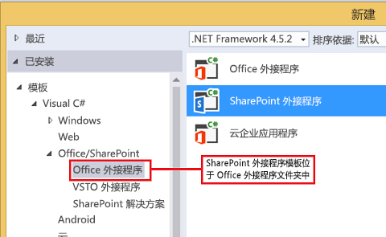

# 使用 SharePoint 2013 中的 Web 代理查询远程服务
了解如何使用 Web 代理从 SharePoint 2013 中承载的页面访问远程域中的数据。
在构建 SharePoint 外接程序时，您通常必须包含来自各个源的数据。出于安全原因，我们制定了防止跨域通信的阻止机制。当您使用 Web 代理时，您的外接程序中的网页可访问远程域和 SharePoint 域中的数据。


作为开发人员，您可以使用客户端 API 中公开的 Web 代理（如 JavaScript 和 .NET 客户端对象模型）。在使用 Web 代理时，可向 SharePoint 发出初始请求。SharePoint 进而会请求将数据传递到指定终结点并将响应转发回您的页面。当您希望在服务器级别进行通信时，可使用 Web 代理。有关详细信息，请参阅  [SharePoint 外接程序的安全数据访问和客户端对象模型](secure-data-access-and-client-object-models-for-sharepoint-add-ins.md)。
**SharePoint Web 代理是您的代码和外部数据源之间的中间人**


## 使用本文中的示例的先决条件
<a name="SP15Queryremoteservice_Prereq"> </a>

若要按照此示例中的步骤操作，您需要以下内容：


-  [Visual Studio 2015 和最新的 Microsoft Office 开发人员工具](https://www.visualstudio.com/features/office-tools-vs.aspx)


- SharePoint 2013 开发环境（本地方案需要外接程序隔离）


### 使用 Web 代理前要了解的核心概念

下表列出了一些有用的文章，可帮助您了解 SharePoint 外接程序中的跨域方案中涉及的概念。


**表 1. Web 代理的核心概念**


|**文章标题**|**说明**|
|:-----|:-----|
| [SharePoint 外接程序](sharepoint-add-ins.md) <br/> |了解 SharePoint 2013 中新的外接程序模型，您可以利用此模型来创建对最终用户来说是小型的易于使用的解决方案的外接程序。  <br/> |
| [SharePoint 外接程序的安全数据访问和客户端对象模型](secure-data-access-and-client-object-models-for-sharepoint-add-ins.md) <br/> |了解 SharePoint 外接程序中的数据访问选项。本文提供了有关在使用外接程序中的数据时必须从中进行选择的高级别备用项的指南。  <br/> |
| [SharePoint 2013 中的主机 Web、外接程序 Web 和 SharePoint 组件](host-webs-add-in-webs-and-sharepoint-components-in-sharepoint-2013.md) <br/> |了解主机 Web 和外接程序 Web 之间的差异。了解 SharePoint 外接程序中可以包括哪些 SharePoint 2013 组件、将哪些组件部署到主机 Web、将哪些组件部署到外接程序 Web 以及如何将外接程序 Web 部署到隔离域中。  <br/> |
| [客户端跨域安全性](http://msdn.microsoft.com/en-us/library/cc709423%28v=vs.85%29.aspx) <br/> |了解跨域威胁和用例以及跨源请求的安全准则，并权衡开发人员增强从在浏览器中运行的 Web 应用程序进行的跨域访问的风险。  <br/> |
 

## 代码示例：使用 Web 代理访问远程服务中的数据
<a name="SP15Queryremoteservice_Codeexample"> </a>

若要从远程服务中读取数据，则必须执行以下操作：


1. 创建 SharePoint 外接程序项目。


2. 修改"Default.aspx"页以使用 Web 代理查询远程服务。


3. 修改外接程序清单以允许与远程域的通信。


图 1 所示的浏览器窗口中的 SharePoint 网页包含远程服务中的数据。


**图 1. 包含远程服务中的数据的 SharePoint 网页**


### 创建 SharePoint 相关外接程序项目


1. 以管理员身份打开 2015。（若要执行此操作，请右键单击"开始"菜单中的 2015 图标，然后选择"以管理员身份运行"。）


2. 使用"SharePoint 外接程序"模板创建新的项目

    图 2 显示了 2015 中"SharePoint 外接程序"模板的位置，具体位于"模板"、"Visual C#"、"Office/SharePoint"、"Office 外接程序"下。


   **图 2. SharePoint 外接程序 Visual Studio 模板**





3. 提供您要用于调试的 SharePoint 网站的 URL。


4. 选择"Sharepoint 托管"作为您的外接程序的托管选项。


### 使用 JavaScript 对象模型修改 Default.aspx 页以使用 Web 代理


1. 双击"页面"文件夹中的"Default.aspx"页。


2. 复制以下标记并将其粘贴到页面的 **PlaceHolderMain** 内容标记中。该标记将执行以下任务：

  - 为远程数据提供占位符。


  - 引用 SharePoint JavaScript 文件。


  - 准备包含 **WebRequestInfo** 对象的请求。


  - 准备请求 **Accept** 标头来以 JavaScript 对象表示法 (JSON) 格式指定响应。


  - 发出对远程终结点的调用。


  - 处理成功完成的操作，并在 SharePoint 网页中呈现远程数据。


  - 处理任何错误，并在 SharePoint 网页中呈现错误消息。


  ```

Categories from the Northwind database exposed as an OData service:

<!-- Placeholder for the remote content -->
<span id="categories"></span>

<!-- Add references to the JavaScript libraries. -->
<script 
    type="text/javascript" 
    src="../_layouts/15/SP.Runtime.js">
</script>
<script 
    type="text/javascript" 
    src="../_layouts/15/SP.js">
</script>
<script type="text/javascript">
(function () {
    "use strict";

    // Prepare the request to an OData source
    // using the GET verb.
    var context = SP.ClientContext.get_current();
    var request = new SP.WebRequestInfo();
    request.set_url(
        "http://services.odata.org/Northwind/Northwind.svc/Categories"
        );
    request.set_method("GET");

    // We need the response formatted as JSON.
    request.set_headers({ "Accept": "application/json;odata=verbose" });
    var response = SP.WebProxy.invoke(context, request);

    // Let users know that there is some
    // processing going on.
    document.getElementById("categories").innerHTML =
                "<P>Loading categories...</P>";

    // Set the event handlers and invoke the request.
    context.executeQueryAsync(successHandler, errorHandler);

    // Event handler for the success event.
    // Get the totalResults node in the response.
    // Render the value in the placeholder.
    function successHandler() {

        // Check for status code == 200
        // Some other status codes, such as 302 redirect
        // do not trigger the errorHandler. 
        if (response.get_statusCode() == 200) {
            var categories;
            var output;

            // Load the OData source from the response.
            categories = JSON.parse(response.get_body());

            // Extract the CategoryName and Description
            // from each result in the response.
            // Build the output as a list.
            output = "<UL>";
            for (var i = 0; i < categories.d.results.length; i++) {
                var categoryName;
                var description;
                categoryName = categories.d.results[i].CategoryName;
                description = categories.d.results[i].Description;
                output += "<LI>" + categoryName + ":&amp;nbsp;" +
                    description + "</LI>";
            }
            output += "</UL>";

            document.getElementById("categories").innerHTML = output;
        }
        else {
            var errordesc;

            errordesc = "<P>Status code: " +
                response.get_statusCode() + "<br/>";
            errordesc += response.get_body();
            document.getElementById("categories").innerHTML = errordesc;
        }
    }

    // Event handler for the error event.
    // Render the response body in the placeholder.
    // The body includes the error message.
    function errorHandler() {
        document.getElementById("categories").innerHTML =
            response.get_body();
    }
})();
</script>
  ```


### （可选）使用 REST 终结点修改 Default.aspx 页以使用 Web 代理


1. 双击"页面"文件夹中的"Default.aspx"页。


2. 复制以下标记并将其粘贴到页面的 **PlaceHolderMain** 内容标记中。该标记将执行以下任务：

  - 为远程数据提供占位符。


  - 引用 jQuery 库。


  - 准备请求 **SP.WebRequest.Invoke** 终结点。


  - 使用 **SP.WebrequestInfo** 对象准备请求的正文。该对象包括用于以 JavaScript 对象表示法 (JSON) 格式指定响应的 **Accept** 标头。


  - 发出对远程终结点的调用。


  - 处理成功完成的操作，并在 SharePoint 网页中呈现远程数据。


  - 处理任何错误，并在 SharePoint 网页中呈现错误消息。


  ```

Categories from the Northwind database exposed as an OData service:

<!-- Placeholder for the remote content -->
<span id="categories"></span>

<script 
    type="text/javascript" 
    src="//ajax.aspnetcdn.com/ajax/jQuery/jquery-1.8.0.min.js">
</script>

<script type="text/javascript">
(function () {
    "use strict";

    // The Northwind categories endpoint.
    var url =
        "http://services.odata.org/Northwind/Northwind.svc/Categories";

    // Let users know that there is some
    // processing going on.
    document.getElementById("categories").innerHTML =
                "<P>Loading categories...</P>";

    // Issue a POST request to the SP.WebProxy.Invoke endpoint.
    // The body has the information to issue a GET request
    // to the Northwind service.
    $.ajax({
        url: "../_api/SP.WebProxy.invoke",
        type: "POST",
        data: JSON.stringify(
            {
                "requestInfo": {
                    "__metadata": { "type": "SP.WebRequestInfo" },
                    "Url": url,
                    "Method": "GET",
                    "Headers": {
                        "results": [{
                            "__metadata": { "type": "SP.KeyValue" },
                            "Key": "Accept",
                            "Value": "application/json;odata=verbose",
                            "ValueType": "Edm.String"
                        }]
                    }
                }
            }),
        headers: {
            "Accept": "application/json;odata=verbose",
            "Content-Type": "application/json;odata=verbose",
            "X-RequestDigest": $("#__REQUESTDIGEST").val()
        },
        success: successHandler,
        error: errorHandler
    });

    // Event handler for the success event.
    // Get the totalResults node in the response.
    // Render the value in the placeholder.
    function successHandler(data) {
        // Check for status code == 200
        // Some other status codes, such as 302 redirect,
        // do not trigger the errorHandler. 
        if (data.d.Invoke.StatusCode == 200) {
            var categories;
            var output;

            // Load the OData source from the response.
            categories = JSON.parse(data.d.Invoke.Body);

            // Extract the CategoryName and Description
            // from each result in the response.
            // Build the output as a list
            output = "<UL>";
            for (var i = 0; i < categories.d.results.length; i++) {
                var categoryName;
                var description;
                categoryName = categories.d.results[i].CategoryName;
                description = categories.d.results[i].Description;
                output += "<LI>" + categoryName + ":&amp;nbsp;" +
                    description + "</LI>";
            }
            output += "</UL>";

            document.getElementById("categories").innerHTML = output;
        }
        else {
            var errordesc;

            errordesc = "<P>Status code: " +
                data.d.Invoke.StatusCode + "<br/>";
            errordesc += response.get_body();
            document.getElementById("categories").innerHTML = errordesc;
        }
    }

    // Event handler for the error event.
    // Render the response body in the placeholder.
    // The 2nd argument includes the error message.
    function errorHandler() {
        document.getElementById("categories").innerHTML =
            arguments[2];
    }
})();
</script>

  ```


### 编辑外接程序清单文件


1. 在"解决方案资源管理器"中，打开"AppManifest.xml"文件的快捷菜单，然后选择"查看代码"。


2. 复制以下 **RemoteEndPoints** 定义作为 **App** 节点的子级。

  ```XML

<RemoteEndpoints>
    <RemoteEndpoint Url=" http://services.odata.org" />
</RemoteEndpoints>
  ```


    **RemoteEndpoint** 元素用于指定远程域。Web 代理将验证发往远程域的请求是否已在外接程序清单中声明。您最多可在 **RemoteEndpoints** 元素中创建 20 个条目。将只考虑授权部件； `http://domain:port` 和 `http://domain:port/website` 被视为相同的终结点。您可以向同一个域中的很多不同的终结点（只有一个 **RemoteEndpoint** 定义）发出调用。


### 生成并运行解决方案


1. 按 F5 键。

    > **注释**
      > 按 F5 时，Visual Studio 将生成解决方案、部署外接程序并打开外接程序的权限页。 
2. 选择"信任"按钮。


3. 在"网站内容"页中单击外接程序图标。

    图 3 显示了 SharePoint 网页中的远程数据。


   **图 3. SharePoint 网页中的远程数据**


**表 2. 解决方案故障排除**


|**问题**|**解决方案**|
|:-----|:-----|
|Visual Studio 不会在您按 F5 键后打开浏览器。  <br/> |将 SharePoint 外接程序项目设置为启动项目。  <br/> |
|不仅支持方案-端口的组合。  <br/> |调用方案-端口组合必须满足以下条件：  <br/> |**方案**|**端口**|
|:-----|:-----|
|http  <br/> |80  <br/> |
|https  <br/> |443  <br/> |
|http 或 https  <br/> |7000-10000  <br/> |
 

> **重要信息**
> 出站端口受主机防火墙可用性限制。尤其需要注意的是，仅 http-80 和 https-443 在 SharePoint Online 上可用。 


|
|未经处理的异常"未定义 SP"。  <br/> |确保可在浏览器窗口中访问 SP.RequestExecutor.js 文件。  <br/> 如果要将本地服务器用作开发环境，则必须禁用 IIS 环回检查。请从 Windows PowerShell 命令提示符运行以下命令。  <br/> ```New-ItemProperty HKLM:\\System\\CurrentControlSet\\Control\\Lsa -Name "DisableLoopbackCheck" -value "1" -PropertyType dword```> **警告**> 不建议在生产环境中禁用 IIS 环回检查。           |
|来自远程终结点的响应的大小超过配置的限制。  <br/> |Web 代理请求的响应大小不得大于 200 KB。  <br/> |
 

## 后续步骤
<a name="SP15Queryremoteservice_Next"> </a>

本文演示了如何从 SharePoint 网页中读取远程服务中的数据。在下一个步骤中，您可以了解 SharePoint 外接程序中提供的其他数据访问选项。若要了解更多信息，请参阅以下内容：


-  [代码示例：使用 Web 代理从远程服务中获取数据](http://code.msdn.microsoft.com/SharePoint-2013-Get-data-705bdcd5)


-  [为 SharePoint 2013 中的跨域库创建自定义代理页](create-a-custom-proxy-page-for-the-cross-domain-library-in-sharepoint-2013.md)


-  [使用跨域库从外接程序访问 SharePoint 2013 数据](access-sharepoint-2013-data-from-add-ins-using-the-cross-domain-library.md)


-  [如何：在 SharePoint 2013 中使用 REST 访问外部数据](http://msdn.microsoft.com/library/0663cc8c-a736-434d-9858-6ce12ce7f748%28Office.15%29.aspx)


## 其他资源
<a name="SP15Queryremoteservice_Addresources"> </a>


-  [设置 SharePoint 加载项的本地开发环境](set-up-an-on-premises-development-environment-for-sharepoint-add-ins.md)


-  [在 SharePoint 2013 中处理外部数据](work-with-external-data-in-sharepoint-2013.md)


-  [SharePoint 外接程序的安全数据访问和客户端对象模型](secure-data-access-and-client-object-models-for-sharepoint-add-ins.md)


-  [SharePoint 外接程序的授权和身份验证](authorization-and-authentication-of-sharepoint-add-ins.md)


-  [在 SharePoint REST 请求中使用 OData 查询操作](use-odata-query-operations-in-sharepoint-rest-requests.md)


-  [考虑 SharePoint 外接程序设计选项的三种方法](three-ways-to-think-about-design-options-for-sharepoint-add-ins.md)


-  [SharePoint 外接程序体系结构的重要方面和开发前景](important-aspects-of-the-sharepoint-add-in-architecture-and-development-landscap.md)


-  [SharePoint 加载项中的数据](important-aspects-of-the-sharepoint-add-in-architecture-and-development-landscap.md#Data)


