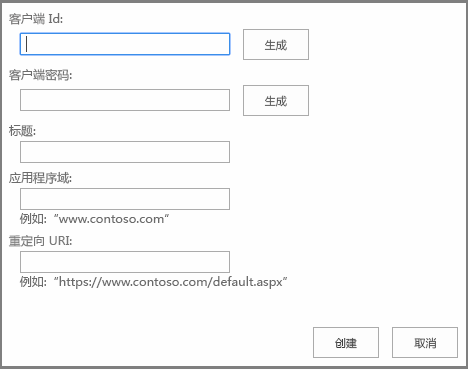

# 注册 SharePoint 2013 外接程序
使用 Visual Studio、卖家面板或AppRegNew.aspx 页在 Azure ACS 中注册您的 SharePoint 外接程序，然后检索注册信息。
要使提供程序托管的 SharePoint 外接程序的远程组件可以使用 OAuth 与 SharePoint 交互，外接程序必须首先注册  [Azure ACS](https://msdn.microsoft.com/zh-cn/library/azure/gg429788.aspx) 基于云的服务和租户或场的 SharePoint 应用程序管理服务。（称为"应用程序管理服务"是因为 SharePoint 外接程序最初称为"SharePoint 相关应用程序"。）


> **注释**
> SharePoint 托管的外接程序则无此要求。 


若要使用 Azure ACS 注册您的外接程序，您应指定以下信息：


- 外接程序的 GUID，称为客户端 ID。


- 外接程序的密码，称为客户端密码。


- 当用户收到信任此外接程序的提示时，在同意页面上使用的外接程序的显示名称。


- 托管远程外接程序的域的 URL。


- 重定向 URL。


在注册您的外接程序后，您的外接程序将具有外接程序标识，它是称为外接程序主体的 *安全主体*  。在您安装外接程序后，SharePoint 管理员将能够检索有关该特定外接程序主体的信息。当用户首次向外接程序授予访问 SharePoint 资源的权限（可能在外接程序安装或运行时授予，具体取决于应用程序的设计）时，SharePoint 将从 Azure ACS 获取有关外接程序的信息。然后 SharePoint 将此信息存储在 SharePoint 租户或场的应用程序管理服务数据库中。客户端密码仅存储在 Azure ACS 中。SharePoint 永远不知道外接程序的密码。内容数据库服务和其他组件（例如 User Profile Service）可以直接从应用程序管理共享服务获取外接程序的显示名称和其他基本信息。有关详细信息，请参阅本文中的 [检索外接程序注册信息和外接程序主体信息](register-sharepoint-add-ins-2013.md#Retrieve)。
> **注释**
> 本文假定您熟悉 OAuth 2.0 Framework 的基本概念和原理。有关详细信息，请参阅  [OAuth.net](http://oauth.net/) 和 [Web 授权协议 (oauth)](http://datatracker.ietf.org/doc/active/)。 


## 在 Azure ACS 中注册您的 SharePoint 外接程序

您可以使用以下三种方法中的一种来注册外接程序，具体取决于您处于外接程序开发生命周期的什么阶段、您外接程序的体系结构以及您计划如何推广它。


|**注册方法**|**详细信息**|
|:-----|:-----|
|使用 Visual Studio 和 Visual Studio Microsoft Office 开发人员工具来创建一个临时外接程序标识。  <br/> |Visual Studio Office 开发人员工具 向导将通过您的 SharePoint 测试网站的 ACS 和应用程序管理服务为您的外接程序创建临时注册。当您从 Visual Studio (F5) 运行此外接程序时，将使用此标识。这些工具还会将客户端 ID 和密码插入 web.config 和 AppManifest.xml 文件中。  <br/> 准备好发布外接程序之后，您可以使用 Visual Studio 发布向导进入卖家面板对其进行注册。如果您没有在 Office 商店中推广您的 SharePoint 外接程序，则可以使用 AppRegNew.aspx 注册该外接程序。（具体步骤如下。）  <br/> > **注释**> 如果您的外接程序请求在运行时（而非外接程序安装时）获得动态访问 SharePoint 资源的权限，您将无法使用 Visual Studio 创建外接程序标识。           |
|通过卖家面板注册外接程序。  <br/> |如果您要在一个或多个 SharePoint 租户或场中使用您的外接程序，可以使用卖家面板注册外接程序，而无需考虑您是在 Office 商店中推广外接程序，还是通过外接程序目录进行发布。在卖家面板中注册时，可为外接程序设计多租户体系结构，而无需租户或场的管理员单独进行注册。此外，如果您希望在 Office 商店中发布您的外接程序，必须使用卖家面板注册外接程序，但您无需使用商店发布在卖家面板中注册的外接程序。  <br/> 有关详细信息，请参阅 [在卖方仪表板中创建或更新客户端 ID 和密码](http://msdn.microsoft.com/library/f7852781-922f-4499-9dd4-c266907a8c14%28Office.15%29.aspx)。  <br/> |
|使用 AppRegNew.aspx 页。  <br/> |如果您将仅在一个租户或场中使用此外接程序，则应该使用 AppRegNew 表单注册您的 SharePoint 外接程序。例如，如果您为单个组织创建外接程序并且将要使用组织外接程序目录分发外接程序，您可以在租户或场中使用任何网站的 AppRegNew.aspx 页来注册此外接程序。  <br/> 您无法将在 AppRegNew.aspx 中注册的外接程序以发布到 Office 商店。对于发布到 Office 商店的外接程序，您必须从卖家面板中获取标识。  <br/> |
 

### 使用 AppRegNew.aspx 进行注册


1. 导航到租户或场上的  `http://` *<SharePointWebsite>*  `/_layouts/15/AppRegNew.aspx`。

   **AppRegNew 页表单**





2. 输入以下表单字段的值：

  - **外接程序 ID** - 也称为客户端 ID，它是可以生成的 GUID（当选择"生成"时）或者可粘贴到 AppRegNew.aspx 中的 GUID。值必须对每个外接程序具有唯一性，且 *必须为小写*  。


  - **外接程序密码** - 也称为客户端密码，是不透明字符串。它使用"生成"按钮在 AppRegNew.aspx 页上生成。下面是外接程序密码的一个示例： **xvVpG0AgVIJfch6ldu4dLUlcZyysmGqBRbpFDu6AfJw=** 。

    > **重要信息**
      > 外接程序密码过期。如果您在卖家面板上注册此外接程序，您可以将过期时间设置为长达 3 年。在仪表板中，您也可以在旧的密码接近过期日期时添加新的密码。新密码将在外接程序的所有实例中启用。如果您使用 AppRegNew.aspx 注册外接程序，密码将在 1 年后过期。有关详细信息，请参阅 [替换 SharePoint 外接程序中即将过期的客户端密码](replace-an-expiring-client-secret-in-a-sharepoint-add-in.md)。 
  - **标题** - 用户友好标题；例如，Contoso 照片打印外接程序。用户将收到提示，对外接程序授予或拒绝其请求的权限。在出现此许可提示时，此标题显示为外接程序的名称。


  - **外接程序域** - SharePoint 外接程序的远程组件的主机名。如果远程应用程序没有使用端口 443，则外接程序域还必须包括端口号。外接程序域必须与您用于 Web 应用程序的 URL 绑定匹配。该值中不要包括协议 ("https:") 或"/"字符。如果您的 Web 应用程序主机使用 DNS CNAME 别名，请使用该别名。例如：

  - www.contoso.com:3333


  - www.fabrikam.com


  - **重定向 URI：** - ACS 向其发送身份验证代码的远程应用程序或服务中的终结点。严格地说，SharePoint 外接程序不使用此值。对于在 SharePoint 外部启动并使用 [身份验证代码流](creating-sharepoint-add-ins-that-use-low-trust-authorization.md#Flows)来获取对 SharePoint 数据的访问授权的 Web 应用程序来说，需要重定向 URI；但对于（从 SharePoint 启动并使用 [上下文令牌流](creating-sharepoint-add-ins-that-use-low-trust-authorization.md#Flows)的）的真正 SharePoint 外接程序来说，则会忽略重定向 URI。重定向 URI 通常为同一个页面、控制器方法，或者从 ACS 请求身份验证代码的 Web 服务方法，但也可能是不同的终结点。终结点的逻辑必须从由 ACS 发送的 HTTP 响应中获取授权代码，然后使用该代码请求访问令牌和刷新令牌。有关详细信息，请参阅 [SharePoint 外接程序的身份验证代码 OAuth 流](authorization-code-oauth-flow-for-sharepoint-add-ins.md)。即使对于真正的 SharePoint 外接程序（尽管不使用）但表单仍要求您输入一个有效值。

    该值必须为包含协议（ *必须为 HTTPS*  ）的完整终结点 URL。例如：

  - https://www.contoso.com/Default.aspx


  - https://www.fabrikam.com/RedirectAccept.aspx


  - https://www.northwindtraders.com/home/index


  - https://adventureworks.com/vacationdata.svc


3. 选择表单上的"创建"。页面将重新加载并显示对您的输入值的确认。请以一种易于复制和粘贴的形式在表单中记录这些值。您将需要在 web.config 和 AppManifest.xml 文件中或在 Visual Studio"发布"向导中输入这些值。


不论您如何注册 SharePoint 外接程序，当您准备好将外接程序部署到暂存或生产环境时，都必须 [将注册值输入到 web.config 和 AppManifest.xml 文件中](#EditConfigFiles)。如果您使用 Visual Studio，则 Visual Studio Microsoft Office 开发人员工具 将为您执行此配置。


## 将注册值输入到 web.config 和 AppManifest.xml 文件中
<a name="EditConfigFiles"> </a>

在打包 SharePoint 外接程序并部署其远程组件之前，请在 AppManifest.xml 和 web.config 文件中输入一些注册值。


> **提示**
> 如果您使用 Visual Studio 发布向导发布 SharePoint 外接程序，Visual Studio 将在发布过程中提示您输入客户端 ID 和客户端密码，并且会为您将信息放在正确的位置。 


1. 在 Visual Studio 项目的 Web.config 文件中，输入外接程序 ID 值作为 **ClientId** 值（替换工具输入的临时值）。

    > **重要信息**
      > 客户端 ID GUID 中的所有字母都必须是小写字母。 

    示例如下。


  ```XML

<appSettings>
  <add key="ClientId" value="a044e184-7de2-4d05-aacf-52118008c44e " />
   .  .  .
</appSettings>
  ```

2. 输入外接程序密码值作为 **ClientSecret** 值（替换工具输入的临时值）。

    下面是如何在 Web 应用程序的 Web.config 文件中使用这些值的示例。


  ```XML

<appSettings>
  <add key="ClientId" value="a044e184-7de2-4d05-aacf-52118008c44e " />
  <add key="ClientSecret" value="l0z/8TzWN0yQBzMBSEZtYts2Vt3Eo/oE3rfCdPaogKQ= " />
</appSettings>
  ```

3. 在 Visual Studio 项目的 AppManifest.xml 文件中，输入外接程序 ID 值作为 **ClientId** 值 *（为小写字母）*  。

    > **注释**
      > 外接程序清单不适用于实时请求访问 SharePoint 资源的权限的 Web 应用程序。没有真正意义上的"SharePoint 外接程序"。它们未安装在 SharePoint 上，没有外接程序清单。有关详细信息，请参阅 [SharePoint 外接程序的身份验证代码 OAuth 流](authorization-code-oauth-flow-for-sharepoint-add-ins.md)。 

    下面是如何在 AppManifest.xml 文件中使用 **ClientId** 值的示例。


  ```XML

<AppPrincipal>
  <RemoteWebApplication ClientId="a044e184-7de2-4d05-aacf-52118008c44e "/>
</AppPrincipal>
  ```

4. Visual Studio Office 开发人员工具 使用 **StartPage** 元素中的令牌 `~remoteAppUrl`。（例如， `<StartPage>~remoteAppUrl/Pages/Default.aspx?{StandardTokens}</StartPage>`。）如果您使用 Visual Studio 中的"发布"向导，此令牌将解析到远程组件的 URL。如果您不使用此向导（或者如果您确实使用此向导，但是将远程组件发布到 Azure），则您必须将令牌手动替换为您在注册外接程序时使用的"外接程序域"值。它必须为 *完全*  相同的值，包括端口号（如果有），除非您也包含了 HTTPS 协议。下面是一个示例。

  ```XML

<StartPage>https://www.contoso.com/Pages/Default.aspx?{StandardTokens}</StartPage>
  ```

5. 对于 AppManifest.xml 文件中的 **Title** 元素，考虑使用与 AppRegNew.aspx 中"标题"字段相同的值。 **Title** 元素值是用户在外接程序安装后看到的外接程序名称。在同意对话框中看到的外接程序名称与在 SharePoint UI 中看到的不同，用户可能会产生混淆。

    下面的示例在外接程序清单中显示这些值。


  ```XML
  <Properties>
  <Title>Contoso photo printing app</Title>
  <StartPage>https://www.contoso.com/Pages/Default.aspx?{StandardTokens}</StartPage>
</Properties>
  ```


## 使用实时请求权限的外接程序中的重定向 URL
<a name="UseRedirectUrl"> </a>

如果您的 Web 应用程序是从 SharePoint 的外部启动的（因此不是真正的 SharePoint 外接程序），则必须将它设计为在运行时从 SharePoint 请求权限。它必须具有使用重定向 URI 的代码以及其他信息，以从 ACS 获取访问令牌。找到此 URI 设置的位置并使用与用于 AppRegNew.aspx 或卖家面板中"重定向 URI"字段 *完全*  相同的值。该值可能位于代码文件或配置文件中。


## 检索外接程序注册信息和外接程序主体信息
<a name="Retrieve"> </a>

您可以检索您在 SharePoint 上安装或注册的外接程序的外接程序注册信息和外接程序主体信息。


要查找您已注册的外接程序的注册信息，请转到  `http://` *<SharePointWebsite>*  `/_layouts/15/AppInv.aspx`。


若要执行查找，您必须记得用于注册您的外接程序的客户端 ID（又称为外接程序 ID）。查找会返回特定客户端 ID 的以下信息：


- Title


- 外接程序域


- 重定向 URL（这与重定向 URI 相同。）


此查找不返回外接程序密码值。


要查看已注册的外接程序主体的列表，请转到：


 `http://` *<SharePointWebsite>*  `/_layouts/15/AppPrincipals.aspx`


## 其他资源
<a name="AR"> </a>


-  [SharePoint 外接程序的授权和身份验证](authorization-and-authentication-of-sharepoint-add-ins.md)


-  [SharePoint 外接程序的三个授权系统](three-authorization-systems-for-sharepoint-add-ins.md)


-  [开始创建提供程序承载的 SharePoint 加载项](get-started-creating-provider-hosted-sharepoint-add-ins.md)


