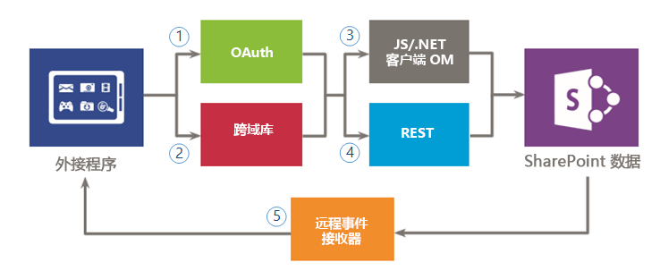
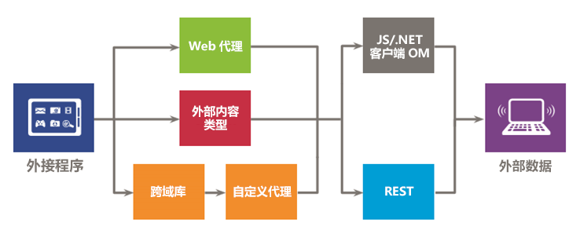

# SharePoint 外接程序的安全数据访问和客户端对象模型
了解您在构建 SharePoint 外接程序时可用的数据访问选项（包括针对 SharePoint 和外部系统的访问数据连接选项）以及您在希望从外接程序访问数据时可用的 API。
在评估 SharePoint 外接程序的数据访问选项时，您必须评估您的外接程序环境并考虑几个因素，如客户端与服务器之间的通信，以及您的外接程序在执行所需任务时需要的权限级别。您还必须评估 SharePoint 外接程序的模型中可用的 API。

## SharePoint 外接程序中数据的高级概述

很难想象一个 SharePoint 外接程序（或与此相关的任何外接程序）不需要查询、存储或操作数据。在您的外接程序中，您经常需要检索和操作 SharePoint 数据，如文档库和列表中的项目、元数据或用户配置文件。同样，在某些情况下，您可能需要访问外接程序中的外部数据。SharePoint 外接程序的模型提供了多个连接选项和一组可用于访问驻留在 SharePoint 和外部系统上的数据和服务的丰富 API。

在设计外接程序并规划数据访问时，您必须做出两项关键决定：

1. 我应使用哪一个连接选项？

2. 我应使用哪些 API 访问所需数据？

以下各图汇总了由 SharePoint 外接程序的模型提供的不同选项。在后面几节中，您将详细查看每个选项并了解如何使用这些选项。

图 1 说明了可供您用来从外接程序访问 SharePoint 数据的选项。在处理这些方案时，您需要决定是使用 (1)"OAuth" 还是 (2)"跨域库"对 SharePoint 进行身份验证并与其通信。然后，对于数据访问 API，您必须在 (3)"客户端对象模型(JavaScript/.NET 客户端对象模型)"或 (4)"代表性状态传输(REST)" 之间进行抉择。

请记住，您还可以使用 (5)  *远程事件接收器*  访问特定数据，但是远程事件接收器的主要方案是远程代码执行。

**图 1. 用于使用外接程序中的 SharePoint 数据的选项**

图 2 说明了可供您用来访问外接程序中的外部数据的选项。在处理这些方案时，您需要决定是使用 (1)  *Web 代理*  、(2) *外部内容类型*  还是 (3) *包含自定义代理页的跨域库*  对外部服务或系统进行身份验证并与其通信。您还可以使用 (4)"客户端对象模型(JavaScript/.NET 客户端对象模型)"或 (5)"表示状态传输(REST)"。

**图 2. 用于使用外接程序中的外部数据的选项**

## 针对 SharePoint 外接程序的数据连接选项

在使用外接程序中的数据时，您必须考虑多个方面。例如，数据使用的路由是什么？数据是来自服务器还是通过服务器？数据是否通过客户端？是否能以登录用户的身份对数据进行身份验证？外接程序是否需要提升权限？以下几节可帮助您解答上述问题以及您可能遇到的其他问题。

### SharePoint 数据连接

以下连接选项适用于访问 SharePoint 数据（见图 1）：

- **OAuth：** 一种可通过简单而标准的方式实现安全授权的开放式协议。利用 OAuth，用户可以批准应用程序代表自己执行操作而无需共享其用户名和密码。您可以将 OAuth 与客户端代码结合使用。如果您需要运行非交互式进程，或者需要将权限提升到登录用户的权限之外的权限，这是一个不错的选择。有关 OAuth 的信息，请参阅 [SharePoint 外接程序的授权和身份验证](authorization-and-authentication-of-sharepoint-add-ins.md)。

- **跨域库：** SharePoint 网站中托管的 JavaScript 文件 ( **SP.RequestExecutor.js** ) 形式的客户端替代项，您可以在远程外接程序中引用它。利用跨域库，您可以通过代理与远程外接程序页中的多个域进行交互。如果您更希望您的外接程序代码在客户端而非服务器中运行，或者如果 SharePoint 与您的远程基础结构之间存在连接障碍（如防火墙），这是一个不错的选择。有关详细信息，请参阅 [使用跨域库从外接程序访问 SharePoint 2013 数据](access-sharepoint-2013-data-from-add-ins-using-the-cross-domain-library.md).

- **远程事件接收器：** 您可以使用远程事件接收器来处理外接程序中的项目（如列表、列表项或 Web）所发生的事件。这些事件与传统 SharePoint 解决方案中的事件相似，不同的是它们可以与 SharePoint 外接程序的远程组件结合使用。请注意，项目的某些属性可用于远程事件接收器。有关详细信息，请参阅 [在 SharePoint 外接程序中创建远程事件接收器](create-a-remote-event-receiver-in-sharepoint-add-ins.md)。同样，您可以使用外接程序事件接收器来自定义外接程序的安装、更新和卸载方式。有关详细信息，请参阅 [在 SharePoint 外接程序中创建外接程序事件接收器](create-an-add-in-event-receiver-in-sharepoint-add-ins.md)。

### SharePoint 数据连接选项：我应使用哪一个选项？

下表列出了您在构建外接程序时可能遇到的常见要求和方案。列中的 **x** 指示您可在每种情况下使用的选项。

**表 1. SharePoint 数据连接选项**

|**要求/方案**|**OAuth**|**跨域库**|
|:-----|:-----|:-----|
|我使用客户端技术 (HTML + JavaScript)。    ||x    |
|我希望使用 REST 接口。    |x    |x    |
|SharePoint 与我的远程外接程序之间有防火墙，并且我需要通过浏览器发出调用。    ||x    |
|我的外接程序需要以登录用户的身份访问资源。    |x    |x    |
|我的外接程序需要将权限提升到当前登录用户的权限之外的权限。    |x    ||
|我的外接程序需要代表登录用户之外的用户执行操作。    |x    ||
|我的外接程序需要仅在用户登录时执行操作。    |x    |x    |
|我的外接程序需要执行操作，即使用户未登录也是如此。    |x    ||
|我的外接程序需要执行远程代码作为对 SharePoint 中的事件的响应。    |||
 
由于远程事件接收器构建于 OAuth 之上，因此此表中的比较并不是决定是否应使用远程事件接收器的最好方式。如果您除了数据转换之外还需要执行远程代码，请使用远程事件接收器。

### 外部数据连接

以下连接选项适用于访问外部数据（见图 2）：

- **Web 代理：** 作为开发人员，您可以使用在客户端 API（如 JSOM）中公开的 Web 代理。在您使用 Web 代理时，将向 SharePoint 发出初始请求。然后，SharePoint 会请求将数据传递到指定终结点并将响应转发回您的页面。如果您希望在服务器级别上进行通信，请使用 Web 代理。Web 代理旨在访问不要求身份验证的非结构化数据。有关详细信息，请参阅 [使用 SharePoint 2013 中的 Web 代理查询远程服务](query-a-remote-service-using-the-web-proxy-in-sharepoint-2013.md)。

- **外部内容类型：** 您可以创建访问来自 SAP、Netflix 和所有者的外部数据以及其他类型的数据的外接程序，而无需租户管理员参与。通过 Business Connectivity Services (BCS) 维护对外部应用程序的访问，它提供了可供其他 SharePoint 应用程序使用的一致且统一的接口。如果您使用的是 BCS 模型并且访问的是要求身份验证的数据，那么应用程序范围内 ECT 是个很好的选择。有关详细信息，请参阅 [SharePoint 2013 中外接程序范围的外部内容类型](http://msdn.microsoft.com/library/a34cbbba-dc38-4d3d-b796-d54b5848bdfb%28Office.15%29.aspx)。

- **跨域库的自定义代理页：** 如果您提供在远程外接程序基础结构中托管的自定义代理页，则可以使用跨域库访问远程外接程序中的数据。作为开发人员，您负责自定义代理页的实现，并且您必须向远程外接程序提供自定义逻辑（如身份验证机制）。如果您希望在客户端级别上进行通信，则可以将跨域库与自定义代理页结合使用。有关详细信息，请参阅 [为 SharePoint 2013 中的跨域库创建自定义代理页](create-a-custom-proxy-page-for-the-cross-domain-library-in-sharepoint-2013.md)。

### 外部数据连接选项：我应使用哪一个选项？

下表列出了您在构建外接程序时可能遇到的常见要求和方案。列中的 **x** 指示您可在每种情况下使用的选项。

**表 2. 外部数据连接选项**

|**要求/方案**|**Web 代理**|**外部内容类型**|**包括自定义代理页的跨域库**|
|:-----|:-----|:-----|:-----|
|我使用客户端技术 (HTML + JavaScript)。    |x    |x    |x    |
|我无法向远程外接程序或服务添加页面或组件。    |x    |x    ||
|我希望使用 REST 接口。    |x    |x    |x    |
|我希望使用 JavaScript CSOM。    |x    |x    |x    |
|我希望使用 .NET CSOM。    |x    |x    ||
|SharePoint 基础结构与我的外接程序之间没有直接连接。我需要通过浏览器发出调用。    ||x    |x    |
|我的外接程序需要以登录用户的身份访问资源。    |x    |x    |x    |
 

## 对 SharePoint 外接程序可用的数据访问 API

当您希望从外接程序访问 SharePoint 数据时，有以下 API 选项可供选择：

- **代表性状态传输 (REST)：** 对于您需要通过不使用 JavaScript 且不是在 .NET Framework 平台上构建的客户端技术访问 SharePoint 实体的方案，SharePoint 提供了对使用 [Open Data (OData) 协议](http://www.odata.org/)对 SharePoint 数据执行 CRUDQ（创建、读取、更新、删除和查询）操作的 REST Web 服务的实现。此外，客户端对象模型中的几乎每个 API 均具有一个对应的 REST 终结点。这使得您的代码能够使用支持标准 REST 功能的任何技术直接与 SharePoint 进行交互。为了使用 SharePoint 中内置的 REST 功能，您的代码构造了对与所需 SharePoint 对象对应的终结点的 RESTful HTTP 请求。REST 服务将处理 HTTP 请求并为 Atom 或 JavaScript 对象表示法 (JSON) 格式的响应提供服务。若要了解有关 SharePoint 中的 REST 的详细信息，请参阅 [在 SharePoint REST 请求中使用 OData 查询操作](use-odata-query-operations-in-sharepoint-rest-requests.md)。

- **.NET Framework 客户端对象模型（.NET 客户端 OM）：** 核心网站和列表服务器端对象模型中的几乎每个类均在 .NET Framework 客户端对象模型中有一个对应的类。此外，.NET Framework 客户端对象模型还公开了一组用于扩展其他功能的完整 API，其中包括一些 SharePoint 级别的功能，例如 ECM、分类、用户配置文件、高级搜索、分析、BCS 等。若要了解有关客户端对象模型的详细信息，请参阅 [在 SharePoint 2013 中选择正确的 API 集](http://msdn.microsoft.com/library/f36645da-77c5-47f1-a2ca-13d4b62b320d%28Office.15%29.aspx)。

- **JavaScript 客户端对象模型 (JSOM)：** SharePoint 提供了一个可在内联脚本或单独的 .js 文件中使用的 JavaScript 对象模型。它包括与 .NET Framework 客户端对象模型相同的所有功能。JSOM 是一种包含外接程序中的自定义 SharePoint 代码的有用方式，特别是在 SharePoint 承载的外接程序中，不允许自定义服务器端代码。此外，Web 开发人员可通过此模型使用其现有的 JavaScript 技能创建 SharePoint 外接程序应用程序（此过程的学习曲线最小）。若要了解有关客户端对象模型的详细信息，请参阅 [在 SharePoint 2013 中选择正确的 API 集](http://msdn.microsoft.com/library/f36645da-77c5-47f1-a2ca-13d4b62b320d%28Office.15%29.aspx)。

您在访问外部数据时，还可以使用 SharePoint 外接程序中的其他 API。具体取决于必须提供外部服务和系统的接口。您在设计中还应考虑这些接口。

## 其他资源

-  [SharePoint 外接程序的授权和身份验证](authorization-and-authentication-of-sharepoint-add-ins.md)

-  [使用跨域库从外接程序访问 SharePoint 2013 数据](access-sharepoint-2013-data-from-add-ins-using-the-cross-domain-library.md)

-  [为 SharePoint 2013 中的跨域库创建自定义代理页](create-a-custom-proxy-page-for-the-cross-domain-library-in-sharepoint-2013.md)

-  [使用 SharePoint 2013 中的 Web 代理查询远程服务](query-a-remote-service-using-the-web-proxy-in-sharepoint-2013.md)

-  [在 SharePoint 外接程序中创建远程事件接收器](create-a-remote-event-receiver-in-sharepoint-add-ins.md)

-  [在 SharePoint 2013 中选择正确的 API 集](http://msdn.microsoft.com/library/f36645da-77c5-47f1-a2ca-13d4b62b320d%28Office.15%29.aspx)

-  [在 SharePoint REST 请求中使用 OData 查询操作](use-odata-query-operations-in-sharepoint-rest-requests.md)

