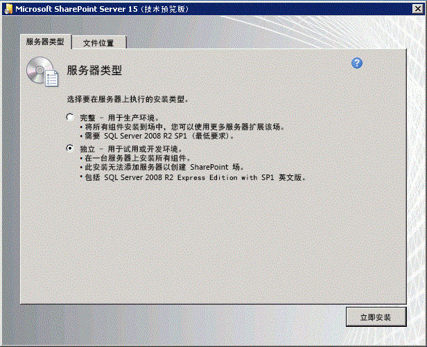

# 设置 SharePoint 加载项的本地开发环境
了解如何设置一个专门适合利用本地安装的 SharePoint 开发 SharePoint 外接程序的开发环境。
## 为 SharePoint 外接程序的开发环境安装操作系统
<a name="bk_installOS"> </a>

与生产环境的要求相比，开发环境的要求较为宽松并且成本较低，此处描述的指南不支持生产环境安装。有关设置 SharePoint 的生产环境安装的说明，请参阅  [SharePoint 2013 安装和配置概述](http://technet.microsoft.com/zh-cn/library/ee667264%28v=office.15%29)、 [SharePoint 2013 的硬件和软件要求](http://technet.microsoft.com/zh-cn/library/cc262485%28v=office.15%29)以及 [为 SharePoint 加载项配置环境 ](http://technet.microsoft.com/zh-cn/library/fp161236%28office.15%29.aspx)。


在任何开发环境中，所使用的计算机都应具有支持 x64 功能的 CPU，以及至少 16 GB 的 RAM 用于安装和运行 SharePoint；最好是 24 GB RAM。


根据您的具体要求和预算，您可以从以下选项中进行选择：


- 在 Windows Server 2008 R2Service Pack 1 x64 或 Windows Server 2012 上安装 SharePoint。


- 在运行 Windows Server 2008 R2Service Pack 1 x64 或 Windows Server 2012 来宾操作系统的虚拟机上，使用 Microsoft Hyper-V 并安装 SharePoint。有关为 SharePoint 设置 Microsoft Hyper-V 虚拟机的指导，请参阅 [将最佳实践配置用于 SharePoint 2013 虚拟机和 Hyper-V 环境](http://technet.microsoft.com/zh-cn/library/ff621103%28v=office.15%29.aspx)。


> **注释**
> 仅支持在 Windows Server 2008 R2Service Pack 1 x64 或 Windows Server 2012 上安装 SharePoint。如果想要在 Windows 7 或 Windows 8 上为 SharePoint 开发 SharePoint 外接程序，则可以注册 Office 365 开发人员网站并远程开发应用程序。 


## 安装操作系统和 SharePoint 的必备组件
<a name="bk_prereqsOS"> </a>


1. 运行安装文件附带的 PrerequisiteInstaller.exe 工具。


2. 运行安装文件附带的 Setup.exe 工具。


3. 接受 Microsoft 软件许可条款。


4. 在"选择所需的安装"页上，选择"独立"。

   **图 1. 安装类型选择**





5. 如果在安装中出现任何错误，请查看日志文件。若要查找日志文件，请打开命令提示符窗口并在命令提示符处键入以下命令。此外，在安装完成时，将显示指向日志文件的链接。

  ```

cd %temp%
dir /od *.log
  ```

6. 安装完成后，系统将提示您启动 SharePoint 产品和技术配置向导。

    > **注释**
      > 如果您使用加入域但未连接到域控制器的计算机，则 SharePoint 产品和技术配置向导可能失败。如果出现此错误，请直接或通过虚拟专用网络 (VPN) 连接来连接到域控制器，或者使用在计算机上拥有管理权限的本地帐户登录。 
7. 完成配置向导后，您会看到新 SharePoint 网站的"模板选择"页面。在此页面上，选择"开发人员网站"模板。您只能将 Visual Studio 中的 SharePoint 外接程序部署到开发人员网站。

   **图 2. 选择网站模板页面**


## 配置 SharePoint 中的服务以实现服务器到服务器加载项部署
<a name="Servertoserver"> </a>

在此步骤中，将配置 SharePoint 中的服务以实现服务器到服务器加载项部署。这些步骤确保您将能够使用您的安装创建提供程序承载的高信任加载项。有关创建此类加载项的详细信息，请参阅 [创建 SharePoint 高信任外接程序](create-high-trust-sharepoint-add-ins.md)。


1. 确保配置 App Management Service 和用户配置文件应用程序。步骤如下：

1. 在"管理中心"中的"应用程序管理"下，选择"管理服务应用程序"。


2. 在"服务应用程序"页上，确保启动下列服务：

  - User Profile Service 应用程序


  - 应用程序管理服务


3. 在"应用程序管理"下，选择"管理服务器上的服务"。


4. 在"服务器上的服务"页上，确保启动下列服务：

  - User Profile Service


2. 确保在"User Profile Service 应用程序"中至少启动了一个配置文件。步骤如下：

1. 在"管理中心"中的"应用程序管理"下，选择"管理服务应用程序"。


2. 接着选择"User Profile Service 应用程序"。


3. 在"管理配置文件服务: User Profile Service 应用程序"页上的"人员"下，选择"管理用户配置文件"。


4. 在"管理用户配置文件"页上，选择"新建配置文件"。


5. 在"添加用户配置文件"页上，键入帐户名和电子邮件地址。


6. 选择"保存并关闭"。

    > **注释**
      > 如果您收到一条消息告知您尝试创建的配置文件已存在，则请选择"取消并返回"。 
7. 返回"管理用户配置文件"页上，您应看到"配置文件总数: 1"。


## 安装 Visual Studio 和 Visual Studio Office 开发人员工具
<a name="SP15Appdevonprem_bk_installVS"> </a>


- 如果您还没有安装 **Visual Studio** 2013 或更高版本，请按照 [Install Visual Studio](http://msdn.microsoft.com/library/da049020-cfda-40d7-8ff4-7492772b620f.aspx) 中的说明进行安装。建议您使用 [Microsoft 下载中心的最新版本](https://www.visualstudio.com/downloads/download-visual-studio-vs)。


- Visual Studio 提供了 **Visual Studio Microsoft Office 开发人员工具** ，但有时这些工具的版本发布的各个更新之间 Visual Studio。若要确保您拥有最新版本的工具使用运行 [Visual Studio 2013 的 Office 开发人员工具的安装程序 ](http://aka.ms/OfficeDevToolsForVS2013)，或  [Visual Studio 2015 的 Office 开发人员工具的安装程序 ](http://aka.ms/OfficeDevToolsForVS2015)。


### Visual Studio 中的详细日志记录

如果想要启用详细日志记录，请执行以下步骤：


1. 打开注册表，导航到 **HKEY_CURRENT_USER\\Software\\Microsoft\\VisualStudio\\ _nn.n_\\SharePointTools** ，其中 _nn.n_ 是 Visual Studio 的版本，如 12.0 或 14.0。


2. 添加名为 **EnableDiagnostics** 的 DWORD 项。


3. 为此项提供值 **1** 。


在 Visual Studio 的将来版本中，注册表路径将会更改。


## 在 SharePoint 中配置一个独立的加载项域
<a name="SP15appdevonprem_bk_configure"> </a>

请阅读 [主机 Web、外接程序 Web 以及独立的域](host-webs-add-in-webs-and-sharepoint-components-in-sharepoint-2013.md#IsolatedDomain)，然后再执行此部分中的任何过程。


您必须在您的测试 SharePoint 场中创建一个独立域。同时，您安装的 SharePoint 需要一个可在其中设置 Sharepoint 承载的加载项的普通通配符主机标头域。


为了进行开发，您可以根据需要修改主机文件，以将开发计算机路由到 SharePoint 外接程序的测试实例。当您构建和部署加载项时，Visual Studio 会自动修改主机文件。


> **注释**
> 对于生产场而言，必须在 Intranet 内部创建 DNS 路由策略，还可以选择配置防火墙。有关如何为 SharePoint 外接程序创建和配置生产环境的详细信息，请参阅 [安装和管理 SharePoint 加载项](http://technet.microsoft.com/zh-cn/library/fp161232%28v=office.15%29)。 


执行以下过程中的步骤以创建独立的加载项域。


> **注释**
> 以场管理员身份登录后，您必须执行以下过程中的所有步骤，并且必须作为管理员运行命令提示符和 SharePoint Management Shell。 


### 在开发计算机上创建独立的加载项域


1. 通过打开命令提示符并键入以下命令来确保 spadmin 和 sptimer 服务正在运行。

  ```

net start spadminv4
net start sptimerv4
  ```

2. 作为管理员运行 SharePoint Management Shell 并键入以下命令以创建独立的加载项域。将  _contosoaddins.com_ 替换为您的加载项域。它 *不*  应是 SharePoint 主机域的子域。这样做在很大程度上抵消了隔离加载项域的安全优势。例如，如果主机域是 contoso.com，则不要将 addins.contoso.com 用作加载项域。

  ```

Set-SPAppDomain "contosoaddins.com"
  ```

3. 通过在 SharePoint Management Shell 中键入以下命令来确保 SPSubscriptionSettingsService 和 AppManagementServiceInstance 服务正在运行。

  ```
  Get-SPServiceInstance | where{$_.GetType().Name -eq "AppManagementServiceInstance" -or $_.GetType().Name -eq "SPSubscriptionSettingsServiceInstance"} | Start-SPServiceInstance
  ```

4. 通过在 SharePoint Management Shell 中键入以下命令来验证 SPSubscriptionSettingsService 和 AppManagementServiceInstance 服务是否正在运行。输出将指明每项服务是否处于联机状态。

  ```
  Get-SPServiceInstance | where{$_.GetType().Name -eq "AppManagementServiceInstance" -or $_.GetType().Name -eq "SPSubscriptionSettingsServiceInstance"}
  ```

5. 您必须指定运行 SPSubscriptionService 和 AppManagementServiceInstance 服务实例将使用的帐户。此帐户必须是 SPManagedAccount。通过在 SharePoint Management Shell 中键入以下命令，您可以创建 SPManagedAccount（将会提示您输入帐户域\\用户和密码）。

  ```
  $account = New-SPManagedAccount
  ```

6. 通过在 SharePoint Management Shell 中键入以下代码，为 SPSubscriptionService 和 AppManagementServiceInstance 服务指定帐户、应用程序池和数据库设置。如果在上一步骤中创建了 SPManagedAccount，请在此处使用该帐户名称。

  ```
  $account = Get-SPManagedAccount "domain\\user"
$appPoolSubSvc = New-SPServiceApplicationPool -Name SettingsServiceAppPool -Account $account
$appPoolAppSvc = New-SPServiceApplicationPool -Name AppServiceAppPool -Account $account
$appSubSvc = New-SPSubscriptionSettingsServiceApplication -ApplicationPool $appPoolSubSvc -Name SettingsServiceApp -DatabaseName SettingsServiceDB 
$proxySubSvc = New-SPSubscriptionSettingsServiceApplicationProxy -ServiceApplication $appSubSvc
$appAppSvc = New-SPAppManagementServiceApplication -ApplicationPool $appPoolAppSvc -Name AppServiceApp -DatabaseName AppServiceDB
$proxyAppSvc = New-SPAppManagementServiceApplicationProxy -ServiceApplication $appAppSvc

  ```

7. 通过在 SharePoint 命令行管理程序中键入以下代码来指定加载项前缀（请参阅 [主机 Web、外接程序 Web 以及独立的域](host-webs-add-in-webs-and-sharepoint-components-in-sharepoint-2013.md#IsolatedDomain)）。

  ```

Set-SPAppSiteSubscriptionName -Name "add-in" -Confirm:$false
  ```

 **仅在您的环境使用代理服务器时执行以下过程。** 创建独立的加载项域之后，请执行以下过程中的步骤，以在 Internet Explorer 中将该域添加到您的绕过列表中。这可以确保在部署 Sharepoint 承载的加载项或部署包含加载项 Web 的提供程序承载的加载项之后可以导航到此域。


### 在 Internet Explorer 中将独立的加载项域添加到您的绕过列表中


1. 在 Internet Explorer 中，转至"工具"。


2. 选择"Internet 选项"。


3. 在"连接"选项卡上，选择"局域网设置"按钮。


4. 清除"自动检测设置"复选框。


5. 选中"为 LAN 使用代理服务器"复选框。


6. 选择"高级"按钮，然后将 *.YourAddinsDomain.com 添加到"例外"列表中。


7. 选择"确定"按钮。


8. 选择"确定"按钮以关闭"局域网(LAN)设置"对话框。


9. 选择"确定"按钮以关闭"Internet 选项"对话框。


有关用于部署加载项的选项的信息，请参阅 [部署和安装SharePoint 外接程序：方法和选项](deploying-and-installing-sharepoint-add-ins-methods-and-options.md)。


> **提示**
> 在将 Sharepoint 承载的加载项部署到您的安装中后，系统可能会在您尝试启动应用程序时提示您使用凭据登录。您将需要禁用环回检查来清除这些提示。有关如何禁用环回检查的说明，请参阅 [当您浏览的网站使用集成身份验证并承载于 IIS 5.1 或更高版本上时收到 401.1 错误](http://support.microsoft.com/kb/896861)。 


## 其他资源
<a name="SP15SetupSPO365_bk_addlresources"> </a>


-  [SharePoint 外接程序](sharepoint-add-ins.md)


-  [开始创建提供程序承载的 SharePoint 加载项](get-started-creating-provider-hosted-sharepoint-add-ins.md)


-  [开始创建 SharePoint 承载的 SharePoint 外接程序](get-started-creating-sharepoint-hosted-sharepoint-add-ins.md)


