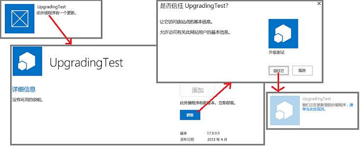

# SharePoint 外接程序更新过程
了解更新 SharePoint 外接程序的过程。
如果您要添加功能、修复 Bug 或进行安全更新，则必须更新 SharePoint 外接程序。将通过部署第一个版本的外接程序的相同方式在 SharePoint 外接程序包中部署对外接程序的更新。SharePoint 外接程序更新过程确保在更新因任何原因失败时保留外接程序的数据。

> **重要信息**
> 不能使用更新系统更改 *外接程序类型*  。例如，您不能使用更新将 SharePoint 托管的外接程序更改为提供程序托管的外接程序。若要更改类型，需要 [从旧外接程序迁移到新外接程序](#Major)。特别是，由于 [自动托管的外接程序的预览计划已结束](http://blogs.office.com/2014/05/16/update-on-autohosted-apps-preview-program/)，应该意识到无法将自动托管的外接程序更新为提供程序托管的外接程序。必须按 [将自动托管的 SharePoint 外接程序转换为提供商托管的外接程序](convert-an-autohosted-sharepoint-add-in-to-a-provider-hosted-add-in.md)中的说明转换外接程序。 

## SharePoint 外接程序的更新过程

对于更新，在外接程序清单中使用原始版本中使用的同一产品 ID。外接程序清单中的版本号应大于原始外接程序或最新更新的版本号。

将更新上载到组织外接程序目录后的 24 小时内，以及在将其上载到 Office 商店后的一周内，在每个安装了该应用程序的网站的"网站内容"页上，外接程序列表旁将显示更新可用的指示。用户可单击链接更新外接程序，如图 1 所示。可用更新还会在租户管理 UI 中显示。

**图 1. SharePoint 外接程序升级过程**

> **提示**
>  开发更新时，您一定不希望在每次将新版本上载到测试 SharePoint 外接程序目录后等待 24 个小时。请参阅 [更新外接程序时无需等待 24 小时](update-sharepoint-add-ins.md#ImmediateUpdateNotice)，获取有关如何立即更新外接程序的信息。 >  默认情况下，SharePoint 每 24 小时会检查一次已安装外接程序的更新。场管理员可以使用以下 SharePoint Management Shell命令将检查时间设置为另一个值，在此命令中n 是检查之间的小时数。>  `Set-SPInternalAppStateUpdateInterval -AppStateSyncHours n`>  如果该值设置为 0，那么在每次执行内置计时器任务"内部外接程序状态更新"时进行检查，默认情况下为每小时一次。场管理员可以使用管理中心更改计时器任务的频率或立即运行该任务。

SharePoint 2013 将在用户安装对 SharePoint 外接程序的更新时执行下列操作。这些事件不一定按照此顺序执行，其中一些操作可以同时进行。此外，如果更新失败，将会完全回滚。

- SharePoint 2013 提示用户审批外接程序请求的权限。

- SharePoint 2013 使外接程序对用户暂时不可用。

- 如果外接程序包含 SharePoint 解决方案包 (.wsp)，并且该解决方案包中的内容已通过任何方式更改，则 SharePoint 将执行下列操作：

  - 备份外接程序 Web。（但在 SharePoint Online 和本地 SharePoint 2016 及更高版本中，只有在更新使得列表架构发生变化时，才需要备份 SharePoint 列表中的实际数据。）

  - 测试对备份的更新。

  - 如果测试成功，则将更新原始外接程序 Web。请注意，外接程序包中的新 .wsp 文件将用于更新外接程序 Web 中的 Features 和其他元素。（Feature 架构的更新部分已在 SharePoint 2013 中扩展。）

- 如果外接程序清单中已有任何已注册的 **UpgradedEventEndpoint** Web 服务，则 SharePoint 2013 会执行它。

    > **注释**
    > 如果外接程序是提供程序托管的外接程序，请为该外接程序的所有非 SharePoint 组件提供更新逻辑。大多数情况下，您对这些组件的更新会独立于 SharePoint 外接程序本身的更新，正如安装这些组件时独立于外接程序的更新一样。但是也可能会有一些只应在用户更新 SharePoint 外接程序时发生的更改。此逻辑可进入 **UpgradedEventEndpoint** Web 服务或外接程序本身的"更新后首次运行"逻辑。
- SharePoint 2013 会再次使外接程序及其组件可用。

> **注释**
> 如果更改外接程序 Web 中任何列表的架构，则该列表会与该外接程序 Web 的其余部分一起进行备份。如果列表中有大量的数据，会需要花些时间。如果未能在 1 小时内完成更新过程，就会停止下来，并回滚该更新。 

## 从旧外接程序迁移到新外接程序

在某些方案中，您可能希望生成全新的外接程序来替换旧的外接程序，而不是更新原始的外接程序。新外接程序可具有与旧外接程序相同的友好名称，但必须在外接程序清单中为其提供一个新的产品 ID，该 ID 将作为与原始版本不同的项显示在公共 Office 商店和 SharePoint 网站的"添加外接程序"页中。

> **注释**
> 组织外接程序目录中的项目通过外接程序包的 *文件名*  ，而不是产品 ID 或者外接程序的名称来区分。如果新外接程序的软件包文件名与旧外接程序相同，它将替换外接程序目录中的旧外接程序，并且旧外接程序将不再会在"添加外接程序"页显示。如果将外接程序包上载到目录时对其启用版本控制，旧版本的文件（即旧应用程序）在项目历史记录中仍然可用。可以下载或者还原到旧外接程序包，但是无法让旧的和新的外接程序以独立项目的形式在目录或"添加外接程序"页中共存，除非它们具有不同的文件名。

在某些情况下，您可能需要迁移数据。例如，新的外接程序可能使用具有不同于旧外接程序的架构的 Microsoft Azure SQL 数据库。或者新外接程序可能使用不同的数据存储机制；例如，外部数据库而不是 SharePoint 列表。您必须为数据迁移提供代码。

如果旧数据位于远程事件处理程序可以访问的位置，则可以在新外接程序的 **InstalledEventEndpoint** Web 服务中实现迁移逻辑。或者，如果新外接程序可以访问旧数据，则可将迁移逻辑置于用户启动新外接程序时首次运行的代码中。如果远程处理程序或新外接程序均无法访问旧数据，则可创建旧外接程序的更新，以添加数据导出功能和该功能的 UI。用户首先更新旧外接程序，然后使用它将数据导出到新外接程序可访问的位置。在新外接程序中添加功能和 UI 以导入数据。

原则上，您可在新的外接程序中重复使用旧外接程序中使用的外部数据源、计算组件或其他外部组件。但是，请考虑一下，卸载 SharePoint 外接程序时，SharePoint 2013 基础架构将卸载其安装的所有内容。因此，SharePoint 外接程序仅依赖于它所安装的组件或者不由 SharePoint 2013 基础架构安装的外部组件通常是很好的做法。

> **注释**
> 我们的建议是，如果要实施用于安装组件的 **InstalledEventEndpoint** 或者 **UpgradedEventEndpoint**，还应该实施用于卸载那些组件的 **UninstallingEventEndpoint**。这样做符合外接程序应该自包含且可以完全卸载这一设计原则。但是，在外接程序卸载后对用户而言仍然有用的数据不应该删除。除外接程序 Web 以外，外接程序创建的网站都应视为数据。 

如果旧外接程序和新外接程序均包含一个外接程序 Web，则考虑在安装新外接程序时创建一个新的外接程序 Web。因此，您不应在 SharePoint 2013 Feature 架构中使用与更新相关的 XML 标记。此类标记不起作用，因为您不会更新现有 SharePoint 组件；而是将旧外接程序更换为新外接程序。

## 其他资源

-  [更新 SharePoint 外接程序](update-sharepoint-add-ins.md)

-  [更新 SharePoint 2013 中的外接程序 Web 组件](update-add-in-web-components-in-sharepoint-2013.md)

-  [更新 SharePoint 2013 中的主机 Web 组件](update-host-web-components-in-sharepoint-2013.md)

-  [在 SharePoint 外接程序中创建更新事件的处理程序](create-a-handler-for-the-update-event-in-sharepoint-add-ins.md)

-  [更新 SharePoint 外接程序中的远程组件](update-remote-components-in-sharepoint-add-ins.md)

-  [发布 SharePoint 外接程序](publish-sharepoint-add-ins.md)

-  [SharePoint 外接程序体系结构的重要方面和开发前景](important-aspects-of-the-sharepoint-add-in-architecture-and-development-landscap.md)

-  [部署和安装SharePoint 外接程序：方法和选项](deploying-and-installing-sharepoint-add-ins-methods-and-options.md)

