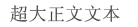
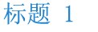
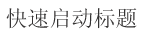
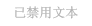
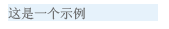

# SharePoint 外接程序 UX 设计准则
了解 SharePoint 2013 中外接程序的常规用户体验 (UX) 设计指南，包括选择版式、使用 CSS、管理用户许可证以及其他设计任务。
外接程序 是 SharePoint 2013 的新概念，它使最终用户能够将新功能添加到其网站中，同时仍可确保 SharePoint 网站本身的可靠性。创建良好的外接程序不但需要出色的功能（虽然其重要性很明显），而且还需要确保外接程序看上去很好并且与可以完美地适合安装它的网站。
  
    
    


## 选择外接程序的部件版式
<a name="UXGuide_AppChrome"> </a>

生成外接程序时首先必须确定想要标记页面的程度以及想在何处托管页面。根据这些选择，您用于支持部件版式的技术将会相对明显：
  
    
    

- **在 SharePoint 中托管的 ASPX 页面：**使用外接程序模板。
    
  
- **SharePoint 中托管的 HTML 页或 SharePoint 外部的任何页面：**使用版式控件。
    
  
- **自定义标记页面：**使用您自己的版式。
    
  

### 将外接程序模板用于 SharePoint 托管的页面
<a name="UXGuide_AppTemplate"> </a>

外接程序模板只能用于 SharePoint 托管的 ASPX 页面。此模板包括 **app.master** 母版页（包含适合外接程序的部件版式并且旨在对主机网站赋予主题），并且它隐藏了外接程序 Web 内部某些无用或无意义的 SharePoint 功能。图 1 显示了使用外接程序模板的 SharePoint 托管的页面。
  
    
    

**图 1. 使用外接程序模板的 SharePoint 托管的页面**

  
    
    

  
    
    

  
    
    
当您创建外接程序 Web 以及该 Web 内的页面时，外接程序模板是 Visual Studio 中的默认模板。
  
    
    

### 在 SharePoint 外接程序中使用版式控件
<a name="UXGuide_ChromeControl"> </a>

如果未生成 SharePoint 托管的 ASPX 页面，但是仍希望外接程序自然适合从中使用该外接程序的主机网站，那么部件版式控制是正确的选择。图 2 显示了部件版式控制。
  
    
    

**图 2. 网页中的版式控件**

  
    
    

  
    
    

  
    
    

  
    
    

**观看视频：SharePoint 2013 部件版式控制**

  
    
    

  
    
    

  
    
    

  
    
    

  
    
    

  
    
    

### 使用版式控件


1. 添加对控件库的引用。可使用以下两种方法执行此操作：
    
  - 指向布局文件夹根目录中的库，如以下示例中所示。
    
  ```
  
<script
    type="text/javascript" 
    src="http://{server URL}/_layouts/15/sp.ui.controls.js">
</script>
  ```

  - 将库复制到您自己的网站，并从其中引用库。
    
    > [!警告]
      > 如果您选择此替代方法，则您的外接程序将不会从控制更新中受益。 
2. 添加将在其中呈现控件的占位符 DOM 元素，如此示例中所示。
    
  ```
  
<div id='chromeControlContainer'></div>
  ```

3. 实例化此控件。
    
  ```
  function addchromecontrol(){
    var options = {};
    options.siteTitle ="{host site title}";
    options.siteUrl = "{host URL}";
    options.appHelpPageUrl = "{help page URL}";
    options.appIconUrl = "{app icon URL}";
    options.appTitle = "add-in Title";
    nav = new SP.UI.Controls.Navigation("chromeControlContainer", options);
    nav.setVisible(true);
}
  ```

4. （可选）如果不希望页面上有标题区域，则可以运行以下 JavaScript 代码删除此区域。
    
  ```
  
nav.setBottomHeaderVisible(false);
  ```

部件版式控制提供了两个可选的外接程序图标：一个在顶部导航栏上，一个在标题区域中。顶部导航栏上的外接程序图标为 24 x 24 像素 (px)，标题区域中的图标与 SharePoint 网站图标大小相同 — 最大为 64 像素高 x 180 像素长。建议您使用在白色、黑色、灰色、明亮和静音的背景中测试过的 PNG 图像，因为用户和管理员可能会更改网站主题。有关使用部件版式控制的详细信息，请参阅 [在 SharePoint 外接程序中使用客户端部件版式控制](use-the-client-chrome-control-in-sharepoint-add-ins.md)。
  
    
    

### 在 SharePoint 外接程序中创建自定义标记 UI
<a name="UXGuide_CustomUI"> </a>

如果想要在外接程序内使用您自己的标记，而不是与主机网站的主题保持一致并适合在其中安装了外接程序的 SharePoint 网站，您将必须从头生成您的版式。然而，您仍然应该在页面的左上角（在从右到左 [RTL] 的语言中的右上方）中保留"返回网站"链接，此链接可以将用户重定向回在其中安装外接程序的网站。
  
    
    

## 在 SharePoint 外接程序中使用主机 Web CSS
<a name="UXGuide_CSS"> </a>

通过使用在主机 Web 上使用的相同样式，您可以确保外接程序将与它们所来自的 SharePoint 网站保持一致。实际样式可能会根据网站设计发生变化，但是通过引用主机 Web 的 CSS 文件，您将知道无论在哪里安装外接程序，该外接程序均合适。
  
    
    
若要从主机 Web 中获取 CSS 样式，您必须引用其 CSS 文件。您可以通过几种不同的方式来执行此操作。
  
    
    

### 引用主机 Web 的 CSS 文件


1. 如果使用的是外接程序模板或外接程序部件版式控制，则会自动为您处理此事。
    
  
2. 如果您在外接程序 Web 内，则通过将以下代码放在母版页或 ASPX 页面上，您可以使用 **CssRegistration** 和 **CssLink** 控件引用 CSS 文件：
    
  ```HTML
  <SharePoint:CssRegistration runat="server" name="default" />
<SharePoint:CssLink runat="server />

  ```

3. 通过生成一个 URL 以离开主机 Web 的 URL，您可以使用 <link> 元素引用 CSS 文件，如此示例中所示。
    
  ```HTML
  
<link rel="stylesheet" href="{host web URL}/_layouts/15/defaultcss.ashx" />
  ```


    如果使用此方法，则必须在页面中运行 JavaScript，以使主机 Web 的 URL 避开查询字符串。然后，在将 **link** 元素写入到页面的 DOM 之前，可以将主机 Web 的 URL 插入到该元素中。
    
  
设置外接程序样式时首先要做的是尽可能使用语义 HTML。这意味着将 **H1**、 **H2**、 **H3** 等用于各个标题，以及将输入标记用于按钮。您还应该尝试尽可能使用 SharePoint 核心样式，以便在主机网站的主题发生变化时，您的外接程序可以不断地自动选择这些更改。以下表格表明了在默认主题中使用样式的方式。
  
    
    

**表 1. 粗体文本样式**


|**示例**|**用途**|**样式**|
|:-----|:-----|:-----|
||特大正文文本  <br/> |.ms-textXLarge  <br/> |
||大号正文文本  <br/> |.ms-textLarge  <br/> |
||普通正文文本  <br/> |自动继承  <br/> |
||小号正文文本  <br/> |.ms-textSmall  <br/> |
||元数据文本  <br/> |.ms-metadata  <br/> |
   

**表 2. 标题和页眉样式**


|**示例**|**用途**|**样式**|
|:-----|:-----|:-----|
||页面上的主要标题  <br/> |.ms-core-pageTitle  <br/> |
||对话框、表单、博客和讨论文章的标题。它是特殊内容类型或外接程序的替代"主要"标题，这些特殊内容类型或应用程序会接纳您希望有别于常规 wiki 网页或 Web 部件页的整个页面。  <br/> |H1  <br/> |
||相对于 H1 的副标题。例如，社区对文章标题使用 H1 强调文字颜色，对文章的最佳"响应"使用 H2 强调文字颜色。  <br/> |H2  <br/> |
||通常是 H2 下面的副标题。  <br/> |H3  <br/> |
||H3 下面的副标题。  <br/> |H4  <br/> |
||页面上的主要 Web 部件的标题或主要部分标题的标题。  <br/> |.ms-webpart-titleText  <br/> |
||用作对话框或标注内的标题的标题。  <br/> |.ms-dlg-heading  <br/> |
   

**表 3. 导航样式**


|**示例**|**用途**|**样式**|
|:-----|:-----|:-----|
||左侧导航栏的标题。  <br/> |.ms-core-listMenu-verticalBox > .ms-core-listMenu-root > li > .ms-core-listMenu-item  <br/> |
||左侧导航栏中的链接。  <br/> |.ms-core-listMenu-verticalBox  <br/> |
||左侧导航栏中的选定项。  <br/> |.ms-core-listMenu-verticalBox + .ms-accentText  <br/> |
||顶部导航栏中的项。  <br/> ||
||顶部导航栏中的选定项。  <br/> ||
   

**表 4. 命令样式**


|**示例**|**用途**|**样式**|
|:-----|:-----|:-----|
||您期望用户在给定容器或页面内执行的主要操作的链接。例如，这将用于在标注下面设置命令的样式。对于已访问和未访问的命令，这将始终为相同颜色。  <br/> |.ms-commandLink  <br/> |
||也用于设置操作链接的样式，但适合次要于内容的操作。此样式用于这些次要操作，因此其被关注的程度比不上内容。  <br/> |.ms-secondaryCommandLink  <br/> |
||标注中的链接。  <br/> |.ms-calloutLink  <br/> |
   

**表 5. 修饰符样式**


|**示例**|**用途**|**样式**|
|:-----|:-----|:-----|
||将为文本提供当前主题中的强调文字颜色的帮助器类。  <br/> |.ms-accentText  <br/> |
||内容中的链接应该继承自默认的超链接样式设置和行为。超链接样式设置会应用颜色和悬停效果以指明这是链接而不是普通文本。  <br/> |通过使用 <a> 继承。  <br/> |
||表单中出现的错误消息。  <br/> |.ms-error  <br/> |
||为着重程度应不如普通正文文本的文本提供柔和灰色的帮助器类。  <br/> |.ms-soften  <br/> |
||对文本应用"已禁用"颜色的帮助器类，这用于表示禁用状态。  <br/> |.ms-disabled  <br/> |
||将文本转换为全大写的帮助器类。  <br/> |.ms-uppercase  <br/> |
||用于将文本样式设置为与表单相似的帮助器类。  <br/> |.ms-helper  <br/> |
||用于在快速启动和菜单中分隔部分的虚线分隔线。  <br/> |HR  <br/> |
   

**表 6. 部件用户界面样式**


|**示例**|**用途**|**样式**|
|:-----|:-----|:-----|
||部件顶部的主要嵌入式文本。  <br/> |.ms-textXLarge + .ms-soften  <br/> |
||部件顶行中的命令；每个部件最多只能有一两个顶行命令。  <br/> |.ms-heroCommandLink  <br/> |
||所显示用于在部件不包含数据时诱惑用户与部件交互的文本。  <br/> |.ms-attractMode  <br/> |
||在没有可用数据时向用户显示的文本。  <br/> |.ms-emptyMode  <br/> |
||视图控件，如透视。  <br/> |.ms-pivot-link  <br/> |
||也为链接的列表项。  <br/> |.ms-listLink  <br/> |
   

**表 7. 背景和边框样式**


|**示例**|**用途**|**样式**|
|:-----|:-----|:-----|
||设置应该在页面上重点强调的矩形的样式。  <br/> |.ms-emphasis  <br/> |
||强调的元素的边框。  <br/> |.ms-emphasisBorder  <br/> |
||元素的更细微的强调。  <br/> |.ms-subtleEmphasis  <br/> |
||采用 ms-subtleEmphasis 设置样式的元素中的命令。  <br/> |.ms-subtleEmphasisCommand  <br/> |
||采用 ms-subtleEmphasis 设置样式的元素中的禁用命令。  <br/> |.ms-subtleEmphasisCommand-disabled  <br/> |
||侧导航栏元素  <br/> |.ms-sideNav  <br/> |
||设置所选侧导航栏元素的样式。  <br/> |.ms-sideNav-selected  <br/> |
||使用边框强调元素。  <br/> |.ms-lines  <br/> |
||使用细微型边框强调元素。  <br/> |.ms-subtleLines  <br/> |
||使用增强或彩色的边框强调元素。  <br/> |.ms-strongLines  <br/> |
||使用边框强调禁用的元素。  <br/> |.ms-disabledLines  <br/> |
||使用强调文字颜色边框强调元素。  <br/> |.ms-accentLines  <br/> |
||包含弹出窗口。  <br/> |.ms-popupBorder  <br/> |
||对背景元素应用覆盖。  <br/> |.ms-bgOverlay  <br/> |
||使元素的背景显示为禁用状态。  <br/> |.ms-bgDisabled  <br/> |
||应用页眉背景色。  <br/> |.ms-bgHeader  <br/> |
||应用页脚背景色。  <br/> |.ms-bgFooter  <br/> |
||悬停时应具有高亮颜色的元素。此示例显示了其上未悬停鼠标时的元素。  <br/> |.ms-bgHoverable  <br/> |
||悬停时应具有高亮颜色的元素。此示例显示了其上悬停鼠标时的元素。  <br/> |.ms-bgHoverable  <br/> |
||显示对元素所做的选择。  <br/> |.ms-bgSelected  <br/> |
||页面顶栏中的元素。  <br/> |.ms-topBar  <br/> |
   
有关详细信息，请参阅 [在 SharePoint 外接程序中使用 SharePoint 网站的样式表](use-a-sharepoint-website-s-style-sheet-in-sharepoint-add-ins.md)。
  
    
    

## 在 SharePoint 外接程序中统一设置常用项的样式
<a name="UXGuide_Styling"> </a>

为了帮助用户学习在 SharePoint 和外接程序之间进行转换的技能，应该统一设置多个常用元素的样式。
  
    
    

### 内部导航

若要在外接程序内部提供导航，则可以采用以下两种主要模式：左侧导航和顶部导航。您所使用的选项在某种程度上取决于外接程序其余部分中的内容。通常，左侧导航将是正确的选择，尤其是在不同列表之间进行切换或者外接程序的焦点是主要详细信息视图的情况下。另一方面，如果导航主要是在可能被认为是相同列表的不同视图之间切换，则可以改为选用顶部导航。
  
    
    
左侧导航和顶部导航都具有对象模型表示形式，在 SharePoint 中设置这些表示形式时将正确设置其样式。在 SharePoint 页面之外，您必须做少量的其他工作才能亲自为顶部或左侧导航创建标记，然后必须添加合适的 CSS 类，以便正确设置其样式。
  
    
    

### 工具栏

在许多情况下，您具有希望向用户快速显示的少数命令。如果您已在页面上使用功能区，则最佳选择是将这些命令添加到现有功能区内的逻辑位置中。然而，在页面上还没有功能区的情况下，添加少数命令中的一个命令可能没有意义。在该情况下，建议您添加一个与项目上下文相关的工具栏，以在其中应用命令。您应该使用标志符号和/或用 ms-commandLink 设置样式的文本，以在工具栏上显示您的命令，工具栏应该与页面的其余部分具有相同的背景色。
  
    
    

### 列表

列表是向用户呈现数据的一种常用方法。如果您的外接程序使用的是 SharePoint 页面，则可以使用列表视图 Web 部件向用户呈现数据，以及获取其附带的样式和交互。然而，如果在别处具有页面，或者想要加强控制用户与列表的交互，则应该在 SharePoint 中模仿列表样式，同时提供自己的呈现和交互方式。以下是在外接程序中使用列表时要记住的一些样式问题：
  
    
    

- **视图：**在单一列表上呈现多个视图时，应该在列表顶部使用透视，就像在常规 SharePoint 列表顶部使用透视一样。绝不要使用透视作为呈现主要详细信息数据的方法。
    
  
- **筛选器：**在现有列表或主要详细信息排列上提供筛选器时，应该使用与内容区域左侧对齐并且宽度至少为 300 像素的提要栏。您还应该复制 SharePoint 选择样式，以向用户指明所选择的筛选器或项目。
    
  
- **表单：**如果用户要查看或编辑单个项目，则应该使用内置的 SharePoint 表单或者模仿其样式以获取一致的体验。
    
  

### 表单、对话框和标注

以下三种不同的模式可向用户提供关于对象的详细信息，或者提供用于用户输入的用户界面 (UI)：完整页面表单、对话框和标注。具体使用哪一种，则取决于用户意图以及将显示或请求的信息量。
  
    
    

- **完整页面表单：** 如果想要用户输入若干条不同的信息，或者想要同时向用户显示许多结构化信息，那么这是最佳选择。此外，在需要诸如功能区之类的更复杂交互模型的情况下，完整页面表单最有意义。在此情况下，必要时应将用户指向表单页面。您应该确保可以使用按钮或功能区以明确的方式保存或取消用户的更改。在可能需要滚动的非常长的表单中，在表单的顶部和底部放置"保存"和"取消"选项是一个好主意。
    
  
- **对话框：** 这些是模式 UI 容器，通常用于根据上下文显示更多信息和操作。它们还用于更短的表单或用户输入。通常，在对话框中托管的 UI 应该既简单又非常适合较小的呈现图面。而完整页面表单可以更好地为诸如功能区之类的较长表单或较复杂交互模型提供服务。
    
  
- **标注：** 这些标注围绕着特定项提供相关的上下文信息和操作。标注通常用于在轻型 UI 中向用户显示关于某个项的更多信息或操作。如果滚动条或用户输入是必需的，则标注可能不是一个好的选择。
    
  

### 动画

虽然动画能够产生更加鲜明和动人的体验，但是应该小心不要在您的 UI 中过度使用动画。用户几乎不会注意到制作精美的动画，但是，它能够给人一种更快更好地执行 UI 的印象。使用动画时，应该确保遵循像物理学和惯性这样的原理，并提供看上去自然且优美的 UI。我们建议不要过度使用动画，如过度跳动或过度灵活，或者在进行最微小的用户操作时让对象在屏幕四周飘移。通常，对象应该采用到其目标的直接路径，并且，为了使用户能够感觉到发生了移动，通常只需要对实际更改的前面或最后 10% 进行动画处理。
  
    
    

### 选项卡和数据透视

在 SharePoint 中，只应该在功能区上使用选项卡。在 SharePoint 中的其他每个地方，都应该使用透视来表示更改内容区域的概念。
  
    
    

## Office UI Fabric 与 SharePoint 外接程序的常见问题
<a name="Fabric"> </a>

使用此常见问题来了解如何使用 Office UI Fabric 并使您的 SharePoint 外接程序的外观与 Office 365 的其余部分相似。
  
    
    
 **1. 什么是 Office UI Fabric？**
  
    
    
Office UI Fabric 是一个响应式移动优先的前端框架，使您可以使用 Office 设计语言创建 web 体验。它是通过使用一组字体以及提供 UI 组件、图标、动画和 Office 官方调色板的 CSS 类实现的。有关详细信息，请参阅  [Office UI Fabric](https://github.com/OfficeDev/Office-UI-Fabric)。
  
    
    
 **2. 我可以在我的 SharePoint 外接程序中使用 Office UI Fabric 吗？**
  
    
    
可以。您的外接程序页面可以使用与引用其他 CSS 框架（如 bootstrap）的相同方式来引用 Office UI Fabric 文件。
  
    
    
 **3. 我应当何时将 Office UI Fabric 与 SharePoint 外接程序协同使用？**
  
    
    
当您想让您的外接程序具有 Office 365 的外观体验时，就可以使用它。它是使用 SharePoint 主机 Web 的 CSS 文件的一种可替代方法。
  
    
    
 **4. Office UI Fabric 如何用在 SharePoint 外接程序中？**
  
    
    
只需将 Office UI Fabric 文件添加到您的开发项目，并包括对应用到 HTML 或 ASPX 页的 fabric.css 库的引用即可。有关详细信息，请参阅 [入门](https://github.com/OfficeDev/Office-UI-Fabric#get-started)。
  
    
    
 **5. Office UI Fabric 组件如何用在 SharePoint 外接程序中？**
  
    
    
只需将对 fabric.components.css 库的引用添加到 HTML 或 ASPX 页面即可。有关详细信息，请参阅 [入门](https://github.com/OfficeDev/Office-UI-Fabric/blob/master/ghdocs/GETTINGSTARTED.md)。
  
    
    
 **6. 我可以同时使用 Office UI Fabric 和 SharePoint 外接程序的主机 Web CSS 吗？**
  
    
    
目前，我们建议不要混合使用 Office UI Fabric 和主机 Web CSS。这是为了防止类名冲突和样式不匹配。
  
    
    
 **7. Office UI Fabric 是否支持 SharePoint 主题？**
  
    
    
否。Office UI Fabric 不支持 SharePoint 主题。但是，应用 Office UI Fabric 主题不会与 SharePoint 主题发生冲突。
  
    
    

## 在外接程序中扩展 SharePoint UI
<a name="UXGuide_Extending"> </a>

SharePoint 允许外接程序扩展现有 UI 的某些部分，这样，您就可以在用户可能需要外接程序的地方提供外接程序。您可以使用以下方法扩展主机 Web 的 UI：
  
    
    

- **外接程序部件：** 使您能够显示 **iframe** 元素以包含外接程序中的内容。
    
  
- **自定义操作：** 您可以通过自定义操作扩展功能区或上下文菜单。利用自定义操作，可以在列表项、文档或显示功能区的任何其他地方使用您的外接程序。
    
  

### 将外接程序部件添加到主机 Web 中

部件 是供外接程序在安装了外接程序的主机 Web 中显示某些信息或小交互点的一种方法。最终用户通过在 SharePoint 中使用 Web 部件框架，可以在其页面中嵌入这些部件。图 3 将标记云部件显示为部件示例。
  
    
    

**图 3. 标记云部件**

  
    
    

  
    
    

  
    
    
在图 3 中，"UX 设计外接程序中的标记云"是部件的标题。将从外接程序内容中提供标记云本身，并且标记云是在 **iframe** 元素中托管的，与托管页面完全隔离。因为外接程序内容将使用主机 Web 的 CSS 文件，所以它可以完美地适合主机页面。
  
    
    
某些类型的 UI 非常适合通过部件 UI 来公开。例如，您可能想要提供一组不同外接程序体验的快捷方式，或者甚至想提供用户可在其他页面上嵌入的单一启动点。另一个用户可能要在应用程序中显示一小部分数据，或者显示最近对某些内容所做的更改。您可能需要提供一个小型交互区域，以利用外接程序执行快速操作，而不必打开外接程序来执行这些操作。您提供的部件的类型将由外接程序支持的方案来控制。您应该记住并非所有外接程序都有部件，只有部件对用户体验有意义时才应该提供部件。
  
    
    
部件内部显示的页面将在 **iframe** 中托管，因此，您应该确保您编写的任何 JavaScript 都知道这一点并且能够智能地访问像窗口对象之类的内容。即使大范围地对外接程序的其他部分进行标记，也应该对部件考虑采用主机 Web 的样式，因为部件将嵌入在主机 Web 的页面内，如果部件不合适，则看上去将不协调并且不吸引人。为了使用主机 Web 的样式，必须手动生成一个指向默认 CSS 文件的链接。有关详细信息，请参阅本文中的 [如何：引用主机 Web 的 CSS 文件](sharepoint-add-ins-ux-design-guidelines.md#UXGuide_CSSHowto)。另外，页面上不应该有任何版式，因为版式将嵌入在本身已具有版式的页面上。
  
    
    
页面必须跨不同的域在 **iframe** 中很好地工作，因此，必须确保不要仅对本页面的 X-Framing-Options 指定相同的源。默认情况下，SharePoint 页面的确规定页面应该仅在相同域内的 **iframe** 中。因此，对于 SharePoint 中托管的页面，必须在页面上的某个地方添加 **AllowFraming** Web 部件，以便不为想要在部件中显示的页面选择该行为，如以下示例中所示。
  
    
    


```

<WebPartPages:AllowFraming ID="AllowFraming1" runat="server" />
```

因为无法强行规定用 Iframe 将页面嵌入到哪些域中，所以在外接程序部件中托管的页面很容易受到点击劫持安全攻击。在点击劫持攻击中，页面可能位于恶意页面上的 iframe 中，并且可能会引诱用户选择按钮以执行他们不了解的操作。设计页面时，应该注意这一点，如果恶意页面中显示了将具有危险性的部件，则应确保不要在页面中对该部件公开任何功能。
  
    
    
虽然用户可以对部件手动设置不同的大小，但是您可以在部件定义中为部件设置特定大小。您还可以请求通过 **postmessages** 动态调整部件的大小。默认情况下，建议以 30px 为增量为您的部件选择大小（例如 150px 或 210px），以便在相同页面上混合来自不同外接程序的部件时，用户仍然可以感觉出为在相同区域中工作已生成了每个部件。如果想要部件从入门体验中模仿平铺，则部件的高度和宽度应该为 150px。如果想要部件显示在侧栏中以显示详细信息，则部件的宽度应该为 300px。
  
    
    
如果您的部件显示动态内容，则请求调整大小以减少页面内所嵌入的滚动条是一个好主意。以下示例向您表明如何使用 **postmessages** 调整部件的大小：
  
    
    


```
window.parent.postMessage('<message senderId={your ID}>resize(120, 300)</message>', {hostweburl});
```

在以上示例中，呈现页面时，外接程序部件代码将对页面的查询字符串自动设置 **senderId** 值。在请求调整大小时，您的页面只需从查询字符串中读取 **SenderId** 值并使用该值即可。您可以通过将 **StandardTokens** 或 **HostUrl** 令牌追加到外接程序部件定义中的 **Src** 属性来检索查询字符串的主机 Web URL。
  
    
    
要为主机 Web 指定部件，您必须在外接程序包内的功能文件（不是包内 WSP 中的功能文件）中指定客户端 Web 部件。您可以创建可由最终用户配置的部件，如通过指定 ZIP 或邮政编码来创建。以下标记指定了外接程序部件，并且 **Properties** 元素为可选元素：
  
    
    


```XML
<ClientWebPart
    Name="Sample Add-in Part" 
    DefaultWidth="600" 
    DefaultHeight="300" 
    Title="Sample Add-in Part" 
    Description="This is a sample part with properties.">
    <Content Type="html" Src="~appWebUrl/Pages/Part.aspx?Property1=_prop1_&amp;amp;Property2=_prop2_&amp;amp;Property3=_prop3_&amp;amp;Property4=_prop4_" />
    <Properties>
        <Property 
            Name="prop1" 
            Type="string" 
            WebBrowsable="true" 
            WebDisplayName="First Property" 
            WebDescription="Description 1" 
            WebCategory="Custom Properties" 
            DefaultValue="String Property" 
            RequiresDesignerPermission="true" />
        <Property 
            Name="prop2" 
            Type="boolean" 
            WebBrowsable="true" 
            WebDisplayName="Second Property" 
            WebDescription="Description 2" 
            WebCategory="Custom Properties" 
            DefaultValue="TRUE" 
            RequiresDesignerPermission="true" />
        <Property 
            Name="prop3" 
            Type="int" 
            WebBrowsable="true" 
            WebDisplayName="Third Property" 
            WebDescription="Description 3" 
            WebCategory="Custom Properties" 
            DefaultValue="1" 
            RequiresDesignerPermission="true" />
        <Property 
            Name="prop4" 
            Type="enum" 
            WebBrowsable="true" 
            WebDisplayName="Fourth Property" 
            WebDescription="Description 4" 
            WebCategory="Custom Properties" 
            DefaultValue="one" 
            RequiresDesignerPermission="true" >
            <EnumItems>
                <EnumItem Value="one" WebDisplayName="One" />
                <EnumItem Value="two" WebDisplayName="Two" />
                <EnumItem Value="three" WebDisplayName="Three" />
            </EnumItems>
        </Property>
    </Properties>
</ClientWebPart>
```

在您的 **ClientWebPart** 元素中，您将指定以下各项：
  
    
    

- **名称：** 用于标识外接程序的内部名称；必须唯一。
    
  
- **DefaultWidth/DefaultHeight：** Web 部件的默认大小。如有必要，可以在部件内部调整页面大小。
    
  
- **标题：** 最终用户通过 Web 部件添加器将部件添加到页面中时向最终用户显示的名称。
    
  
- **描述：** 最终用户通过 Web 部件添加器将部件添加到页面中时向最终用户显示的描述。
    
  
您可以指定 **string**、 **enum**、 **int**和 **Boolean**类型的部件属性。也可以使用 **WebCategory** 特性指定想要在其中显示您的属性的 **toolpart** 类别。您想要指定的 **Property** 元素的属性如下：
  
    
    

- **名称：** 用于将此属性与查询字符串上要替换的令牌匹配的名称。
    
  
- **WebDisplayName：** 工具部件中使用的名称。
    
  
- **WebCategory：** 要将此属性添加到的工具窗格中的工具部件。
    
  
- **类型：** 期待用户提供的输入数据类型。类型可以为 **string**、 **enum**、 **int**或 **Boolean**。
    
  
- **DefaultValue：** 属性的默认值。
    
  
向页面添加部件时，查询字符串中与 _propertyName_ are 模式匹配的任何字符串会被自动替换为在 Web 部件实例上具有该名称的属性的值，如果用户尚未设置该值，则会替换为默认值。然后您应该运行页面内的代码以通过查询字符串进行分析，并提取属性以在页面呈现和交互中使用这些属性。
  
    
    
您也可以选择针对查询字符串发送 Web 部件 ID，方法是使用 _wpid_ string 表示想在查询字符串上替换此 ID 的位置。如果希望能够按实例存储有关用户选择或交互的信息，那么，这对于区分不同的部件实例可能有用。有关详细信息，请参阅 [创建外接程序部件以安装 SharePoint 外接程序](create-add-in-parts-to-install-with-your-sharepoint-add-in.md)。
  
    
    

### 向主机 Web 添加自定义操作

如果您所具有的功能在列表项或文档上下文中显示是有意义的，或者在主机 Web 内的特定功能区选项卡上显示是有意义的，则可以使用自定义操作将这些内容添加到上下文菜单或功能区中。若要在主机 Web 上显示自定义操作，则需要在外接程序包内某种类型的宽松功能文件中定义自定义操作，这种类型与包含 **ClientWebPart** 定义的类型相同。
  
    
    

**图 4. 上下文菜单中的自定义操作**

  
    
    

  
    
    

  
    
    
显示在主机 Web 中的自定义操作的代码与以前版本的 SharePoint 中的代码相同，但具有以下限制：
  
    
    

- **Location** 属性必须为 **CommandUI.Ribbon** 或 **EditControlBlock**。
    
  
- **CustomAction** 不能包含 JavaScript：
    
  - 任何 **UrlActions** 或 **CommandActions** 都必须是要导航到的 URL。可以用普通自定义操作标记以及特定于应用程序的标记对 URL 进行参数化操作。
    
  
  - 功能区自定义中不允许 **EnabledScript**。
    
  
通常，当用户选择自定义操作时，自定义操作会根据用户的选择将用户导航到您用任何解析的标记指定的 URL。但是，在某些情况下，您可能想要用户保留在页面上下文中，例如，为了对特定文档执行快速操作。如果想要让自定义操作打开对话框，而不是导航，应该向 **CustomAction** 元素添加以下属性。
  
    
    


```

HostWebDialog="TRUE"
HostWebDialogHeight="500" 
HostWebDialogWidth="500"
```

 **HostWebDialogHeight** 属性和 **HostWebDialogWidth** 属性是可选属性。如果未指定这些属性，则将使用 SharePoint 中对话框的默认大小。但是，通常，您应该指定对话框的大小，以在向用户显示对话框时，对话框看上去正常并且不使用滚动条。
  
    
    
对话框始终在对话框版式中包括"关闭"按钮。您也可以在页面上包括按钮，这些按钮将关闭对话框并告诉来源页面它是否应该刷新。如果您做了可在用户查看的视图中反映出来的某些操作（例如：更新文档属性），则应该刷新页面。另一方面，如果未更新任何项（例如："取消"操作或将文件发送到存档但未更新任何属性），则可以告诉页面不需要刷新。以下示例向您表明如何发送"公告"消息以关闭对话框。
  
    
    


```

window.parent.postMessage('CloseCustomActionDialogRefresh', '*');
window.parent.postMessage('CloseCustomActionDialogNoRefresh', '*');
```

根据您使用的是 **CloseCustomActionDialogRefresh** 还是 **CloseCustomActionDialogNoRefresh**，对话框将会关闭，并且会刷新其背后的页面，或者不会刷新。
  
    
    
您无法通过外接程序将自定义选项卡添加到主机 Web 的功能区中。您只能添加自定义组或单个控件。您不应该替代任何默认的 SharePoint 功能区控件。您应该让您的控件与 SharePoint 控件并行存在。
  
    
    
如果具有少数彼此相关的控件，或者具有用户可能使用您的外接程序关联的控件，则应该按其自定义组对这些控件进行分组，以使用户找到它们的可能性较大。另一方面，如果您正在添加的功能比较有可能被用户视为其网站核心体验的一部分，则应该尝试将该控件安装到现有功能区位置中的逻辑点。有关详细信息，请参阅 [创建自定义操作以部署 SharePoint 外接程序](create-custom-actions-to-deploy-with-sharepoint-add-ins.md)。
  
    
    

## 为外接程序配置提供设置页面
<a name="UXGuide_Settings"> </a>

在许多情况下，让外接程序具有一些可由用户更改的配置信息以及让外接程序使用设置页面公开这些信息是有意义的。理想情况下，您可以为这些设置选择合理的默认值，用户只有在需要修改这些默认值时才能选择转至设置 UI。在某些情况下，运行外接程序之前，需要向外接程序提供某些信息或选项。如果外接程序在运行之前需要信息，则应该提供用户体验来指导用户到达设置页面以更新配置。
  
    
    
如果适用，应该将设置页面 URL 添加到应用程序的右上部菜单中，以便用户可以轻松地找到此 URL。如果您的外接程序具有入门体验或其他设置，则也可以添加这些内容。有关详细信息，请参阅 [在 SharePoint 外接程序中使用客户端部件版式控制](use-the-client-chrome-control-in-sharepoint-add-ins.md)。
  
    
    
您还应该记住当前正在访问外接程序的用户可能无法配置外接程序。另外，您的 UI 不应该假定当前用户能够完成配置。如果用户无法配置您的外接程序，则您的外接程序应该指导用户找到合适的人员。
  
    
    

## 在外接程序中管理用户许可证
<a name="UXGuide_License"> </a>

如果您的外接程序不是免费的，则应该在试用或非许可模式下的可用或受限功能与完全付费版本的功能之间寻找一个合理的平衡点。
  
    
    
如果您提供限时试用版，则在试用期间，试用版应该表现得与付费版一样。请为用户提供他们对您的外接程序付款之后实际期待得到的产品。如果选择在试用期间限制某些功能，请非常明确地表明用户在付款后如何能够获得更多的功能。对于不受限制的试用版，您应该尽量向用户提供您认为需要的功能，以便他们很好地体验外接程序的价值。请说明用户在对外接程序付款后具体可获得哪些好处。
  
    
    
当人们首次看到您的外接程序时，他们可能没有外接程序许可证。例如，一个用户可能会将您的外接程序添加到团队网站中，但忘记给任何其他人颁发许可证。团队网站上的其他用户将在没有许可证的情况下使用您的外接程序，直到许可证经理解决这种情况为止。您应该确保他们获得一个好的印象，以便他们更有可能需要或购买许可证。始终允许用户在您的外接程序中查看和浏览数据是一个好主意。请说明具有许可证如何能够启用更多功能，但不要在每个会话中多次提醒用户。
  
    
    
如果应用程序的核心价值是显示数据（您不希望免费提供），则应该显示受限制的数据子集，或者显示无任何交互的数据。您不应该阻止未授权的用户查看您的外接程序。未授权的用户应该尝试外接程序可以为其做哪些事情，以便他们购买外接程序的可能性较大。
  
    
    

### 鼓励用户获取许可证

在未许可用户或试用许可用户正在使用外接程序的情况下，您应该鼓励他们获取完整许可证。可采用以下两种方法鼓励用户获取完整许可证：
  
    
    

- 用页面顶部的状态栏指明其许可证状态。
    
  
- 在用户尝试访问需要许可证的内容或功能的上下文中。
    
  
您应该格外小心，不要在第二种情况下过多使用许可证警告。与因无法执行操作而令用户感到不愉快的意外相比，使用顶级状态消息并禁用任何未许可的功能可为用户带来更好的体验。无论是哪种情况，您的消息应该是友好且鼓舞人心的，而非严肃的。您应该为用户提供一个指向外接程序的店面外接程序详细信息页面的链接，在此页面中，他们可以获取许可证。
  
    
    

### 许可证状态栏

SharePoint 具有一个可以通过调用 JavaScript API 在 SharePoint 页面上使用的内置状态栏。您还可以复制内置状态栏的样式。您应该将黄色的"警告"色与适合用户所处情况的消息一起使用，例如：
  
    
    

- 对于"无限制试用版"的用户：这是  _<应用程序名称>_ 的试用版本。请转到此处购买完整版本并解除锁定 _<付费功能>_。
    
  
- 对于"未到期限时试用版"的用户：此试用版  _<应用程序名称>_ 还剩下 _<以用户可读指标表示的时间量，如"3 天"，而非"73:42:12">_。请转到此处购买完整版本并确保一刻也不要错误完整的功能。
    
  
- 对于"到期限时试用版"的用户：很遗憾，此试用版  _<应用程序名称>_ 已经没有剩余时间。请转到此处购买完整版本并恢复为完整功能。
    
  
- 对于"无任何许可证"的用户：很遗憾，您没有  _<应用程序名称>_ 的许可证。请转到此处购买完整版本并启用 _<付费功能>_。
    
  

## SharePoint 外接程序的其他设计注意事项
<a name="UXGuide_Other"> </a>

除了已经探讨的内容以外，在创建 SharePoint 外接程序时，您还应该记住以下事项。
  
    
    

### 在 Cookie 中保留必要信息

为了与 SharePoint 交互，您的外接程序将需要许多信息，比如主机网站的 URL 或具有 SharePoint 凭据的"公告"消息。在客户端 Cookie 中保留信息意味着外接程序不必总是从 SharePoint 中请求信息，从而可以为最终用户带来更加流畅、更具有出色表现的体验。
  
    
    

### 请求新的 OAuth 令牌

如果您的外接程序没有凭据，则可以通过将用户重定向到重定向页面（具有外接程序 ID 以及用户尝试转到的 URL）来请求一个新凭据。URL 必须在为正在使用的 OAuth 外接程序 ID 注册的重定向 URL 域的下面。以下 URL 是如何重定向您的外接程序用户的示例。（占位符放在大括号内。）
  
    
    
 `{hostWebURL}/_layouts/15/appredirect.aspx?client_id={OAuth_app_ID}&amp;redirect_uri={redirectUrl}`
  
    
    

### 检查 SharePoint 网站上的只读模式

由于升级或站点维护的缘故，有时在用户访问外接程序时，SharePoint 处于只读模式。如果您打算允许用户处理 SharePoint 数据，则应该确保不要让用户进行无法保存回服务器的更改。请禁止在处于只读模式时编辑 UI。要检查网站是否处于只读模式，您可以调用此 API：
  
    
    
 `{hostWebUrl}/_api/site/ReadOnly`
  
    
    

## 其他资源
<a name="bk_addresources"> </a>


-  [SharePoint 外接程序的 UX 设计](ux-design-for-sharepoint-add-ins.md)
    
  
-  [在 SharePoint 2013 中创建 UX 组件](create-ux-components-in-sharepoint-2013.md)
    
  
-  [在 SharePoint 外接程序中使用 SharePoint 网站的样式表](use-a-sharepoint-website-s-style-sheet-in-sharepoint-add-ins.md)
    
  
-  [在 SharePoint 外接程序中使用客户端部件版式控制](use-the-client-chrome-control-in-sharepoint-add-ins.md)
    
  
-  [创建外接程序部件以安装 SharePoint 外接程序](create-add-in-parts-to-install-with-your-sharepoint-add-in.md)
    
  
-  [创建自定义操作以部署 SharePoint 外接程序](create-custom-actions-to-deploy-with-sharepoint-add-ins.md)
    
  
-  [使用客户端呈现在 SharePoint 外接程序中自定义列表视图](customize-a-list-view-in-sharepoint-add-ins-using-client-side-rendering.md)
    
  

  
    
    

