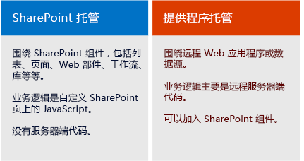

# SharePoint 外接程序
SharePoint 外接程序是您创建的 SharePoint 网站的自包含扩展，无需自定义代码即可在 SharePoint 服务器上运行。
## SharePoint 外接程序概述

SharePoint 外接程序有两种基本类型 — SharePoint 托管和提供程序托管。为了做出关于针对您的方案应开发哪种类型的最佳决定，请首先了解这两种类型的 SharePoint 外接程序有何共同之处。

> **注释**
> 像移动应用程序这种设备应用程序并不是真正的"SharePoint 外接程序"，即使它可以访问 SharePoint，这还包括从 SharePoint 外部启动的 Web 应用程序。如果您想开发这些类型的应用程序，请参阅 [从移动和本机设备应用程序访问 SharePoint](http://msdn.microsoft.com/library/42014171-5ee5-421d-9cde-413efc3aecef%28Office.15%29.aspx)。 

- **SharePoint 外接程序均为自包含功能** ，您可以扩展 SharePoint 网站的功能，从而解决明显的业务问题。

- **加载项没有可运行在 SharePoint 服务器上的自定义代码** 。相反，所有自定义逻辑均可"上"移至云，"下"移至客户端计算机，或"遍及"SharePoint 场或 SharePoint Online 订阅之外的本地服务器。将自定义代码保存在 SharePoint 服务器之外可使 SharePoint 管理员不必顾虑该加载项会危害到其服务器或降低其 SharePoint Online 网站的性能。

- **SharePoint 外接程序中的业务逻辑可以通过 SharePoint 中包含的某些客户端 API 来访问 SharePoint 数据** 。您的外接程序使用哪一个 API 取决于您做出的其他一些设计决策。

- **几乎所有主要类型的 SharePoint 组件都可作为 SharePoint 外接程序** 的一部分，包括页面、列表、工作流、自定义内容类型、列表模板、Web 部件等。

- **安装了 SharePoint 外接程序和用户从其启动应用程序的 SharePoint 网站称为主机 Web。** 但是，SharePoint 组件通常是在称作外接程序 Web 的主机 Web 的特定子网站中。

- **SharePoint 外接程序可以通过多种方式应用到 SharePoint 网站** ：

|||
|:-----|:-----|
||**作为一种沉浸式完整页面体验** ，可以具有 SharePoint 页面的外观和感受。   |
||**作为网页的一部分，使用一种名为加载项部件** 的特定控件类型显示包含加载项的 iframe 元素。   |
||**作为 UI 命令，扩展了** 列表、文档等的功能区和菜单。   |
 
- **用户安装的所有 SharePoint 外接程序在 SharePoint 网站的"网站内容"页上都有一个图块。** 单击此图块可运行外接程序。

- **SharePoint 外接程序可通过使用 *外接程序清单* ** ——一种声明外接程序的基本属性、运行位置以及 SharePoint 在外接程序启动时应执行哪些操作的 XML 文件——来进行配置。除此之外，该清单可以指定外接程序支持哪些语言，它依赖于哪些 SharePoint 服务和功能，以及外接程序针对主机 Web 需要具有哪些权限。（SharePoint 外接程序可完全控制自身的外接程序 Web。）

- **SharePoint 外接程序作为外接程序包进行分发** ，其中始终至少包括外接程序清单。（如果没有 SharePoint 组件，外接程序清单可能会是在外接程序包中的唯一项目。）如果外接程序的 SharePoint 组件位于外接程序 Web 中，这些组件会作为一组 XML 文件包含在程序包中。托管在 SharePoint 外部的远程组件（如远程 Web 应用程序或数据库）不包含在外接程序包中，并在外接程序包中单独部署。（但是，外接程序清单要指定远程组件的 URL。）

- **外接程序包也可以包括 Office 外接程序。** 当安装 SharePoint 外接程序时，会将 Office 外接程序添加到 SharePoint 中的 Office 外接程序目录。用户可以将它从目录安装到 Office 应用程序，如 Word 或 Excel。

> **提示**
> **查看** [Office 商店](https://store.office.com/appshome.aspx?productgroup=SharePoint)中的一些 SharePoint 外接程序，了解可以开发哪些应用程序。或者，打开一个 SharePoint 2013 网站并安装一些免费 SharePoint 外接程序。只要导航到"网站内容 | 添加外接程序 | SharePoint 商店"即可。 

### 对有经验的 SharePoint 开发人员的几点提示

我们已经停用包含自定义服务器端代码的 沙盒解决方案。仍然支持"无代码"的 沙盒解决方案 或仅包含 JavaScript 的 沙盒解决方案。

SharePoint 外接程序不使用服务器端的 SharePoint 对象模型。SharePoint 2013 中对客户端对象模型进行了大幅扩展。虽然 SharePoint 服务器对象模型中的某些 API 在客户端对象模型中不可用，但存在一些几乎完全与管理和安全相关的类。解决这些方面的问题的自定义 SharePoint 逻辑更适合用于 Windows PowerShell 脚本或典型 SharePoint 服务器场解决方案。有关在 SharePoint 外接程序、典型 SharePoint 服务器场解决方案和 沙盒解决方案 之间做出选择的详细信息，请参阅 [SharePoint 加载项与 SharePoint 解决方案比较](http://msdn.microsoft.com/library/0e9efadb-aaf2-4c0d-afd5-d6cf25c4e7a8%28Office.15%29.aspx)。

## 两种分发或销售加载项包的方法

您可以通过两种方式分发加载项包：

- **分发至组织的加载项目录** ，它是 SharePoint Online 订阅或本地场中的专用 SharePoint 网站集。在加载项是针对特定组织所自定义构建的情况下，使用此方法。

- **分发至  [Office 商店](https://store.office.com/appshome.aspx?productgroup=SharePoint)** 。商店可为您处理从发现到购买到更新等一系列市场营销过程。Microsoft 提供了 **卖方仪表板** 帮助您通过 Office 商店销售加载项。

在通过任一方法部署完外接程序后，就可在 SharePoint 网站的"添加外接程序"页面上提供以供安装。如果外接程序需要访问主机 Web 或其父订阅的权限，SharePoint 将提示要安装该外接程序的用户授予这些权限。

当您需要更新加载项以修复缺陷或添加功能时，可在加载项清单中进行更改并提供加载项的版本号。然后将加载项包重新部署到商店或加载项目录中。用户会在 24 小时内在 SharePoint UI 中收到通知，提示有可用的更新。只要单击一次即可安装此更新。

## 两种类型的 SharePoint 外接程序：SharePoint 托管和提供程序托管

### SharePoint 托管的 SharePoint 外接程序

SharePoint 承载的加载项几乎完全由加载项 Web 中的 SharePoint 组件组成。这些组件有时被称为占据 SharePoint 的核心地位。

与所有 SharePoint 外接程序类似，用户可以通过对其进行安装的 SharePoint 网站的"网站内容"页面上的图块运行 SharePoint 托管的外接程序。（可选）它还可以在主机 Web 中拥有两种其他类型的 UI 组件，即外接程序部件和自定义操作（即，自定义功能区按钮或菜单项）。 **SharePoint 托管的外接程序中的其他所有内容将部署到外接程序 Web。** 可以通过声明方式，使用 XML 文件定义这些组件，包括以下各项：

||||
|:-----|:-----|:-----|
|自定义页面    |工作流    |模块（文件集）    |
|列表模板    |列表和库实例    |自定义列表表单和视图    |
|自定义内容类型    |Web 模板    |内置列（不是自定义列）    |
|内置 Web 部件（不是自定义 Web 部件）    |JavaScript 文件    |加载项 Web 的自定义按钮和菜单项    |
 

SharePoint 承载的加载项中的所有业务逻辑都使用 JavaScript，要么直接位于自定义页上，要么位于从自定义页引用的 JavaScript 文件中。JavaScript 版本的 SharePoint 对象模型 (JSOM) 使加载项可轻松地对 SharePoint 数据执行创建、读取、更新和删除 (CRUD) 操作。

SharePoint 承载的加载项中的自定义页面通常是 ASP.NET 页面 (ASPX)，能够以声明的方式引用 ASP.NET 和自带的 SharePoint 控件，但后面可能没有代码。但是，您可以使用客户端呈现选项和自定义 JavaScript 来自定义 SharePoint 控件。

SharePoint 承载的加载项中的 JavaScript 可以访问加载项 Web 之外的数据和资源，使用以下两种技术均可安全处理浏览器的同一源策略：特定的 JavaScript 跨域库或特定的 JavaScript WebProxy 类。通过使用这些技术，SharePoint 承载的加载项可以处理主机 Web 上的数据、其父订阅或 Internet 上的任何位置。

### 提供程序托管的 SharePoint 外接程序

任何可以添加在 SharePoint 承载的加载项中的 SharePoint 组件也可以添加在提供程序承载的加载项中。但是提供程序承载的加载项有别于 SharePoint 承载的加载项，因为它们至少包含一个远程组件，例如在 SharePoint 场 SharePoint Online 订阅外部承载的或 Web 应用程序、服务或数据库。这可能是一台与 SharePoint 场或云帐户处于同一公司网络中的服务器。外部组件可以托管在任何 Web 托管堆栈中，包括 Linux、Apache、MySQL、PHP (LAMP) 堆栈。

> **注释**
> **"提供程序"是服务器或云帐户的持有者。** 它可以是拥有将安装外接程序的 SharePoint 场或 SharePoint Online 租赁的同一公司或组织。但外接程序的开发人员也可以是提供程序。通常，当为特定组织创建某个外接程序时，该组织可提供托管。但是，当为多个组织创建某个外接程序时，很可能开发人员会托管远程组件。如果 SharePoint 外接程序通过 Office 商店进行市场投放，则要求开发人员进行托管，因为开发人员没有外接程序购买者的任何联系信息。在此方案中，外接程序的各种实例都知道远程组件的 URI，因为在外接程序清单中进行了指定。

对于用于远程组件的托管框架，您具有充分的灵活性。不必使用 Microsoft 堆栈。可以使用任何 Web 托管框架，包括 LAMP（Linux、Apache 服务器、MySQL、PHP）、MEAN（MongoDB、ExpressJS、AngularJS、Nodejs）、Java、Python 等；可以使用非 Microsoft 开发工具。此外，远程组件可以托管在非 Microsoft 云服务中。

 **通过使用特定的部件版式控件可以使加载项中的远程页获得 SharePoint 页的外观和感觉** 。

 **远程数据可以是 Blob、缓存、消息队列、内容交付网络 (CDN) 和数据库** 等。数据库可以是任何类型，包括面向关系和对象的类型。可通过多种方式访问远程数据。例如，您可以使用 Business Connectivity Services (BCS) 在 SharePoint 列表中呈现数据。另一种选择是，在远程 Web 应用程序的页面上的网格中公开数据。

SharePoint 外接程序 **使用 SharePoint API 连接 SharePoint** 功能（搜索、工作流、社交网络、分类、用户配置文件和 BCS 等）并与之进行集成。这样用户就可以阅读文档、进行搜索、与人员联系、执行 CRUD 操作等。提供多个 API 集：

- 当使用 .NET 执行远程组件时，托管代码 **SharePoint 客户端对象模型 (CSOM)** 库可用。

- 对于不基于 .NET 的远程组件，有一组 **REST/OData API** 可用于访问 SharePoint 数据。如果您喜欢使用 OData 接口，也可以通过 .NET 客户端来使用这些 API。

- 如前所述， **JSOM 库** 不能在远程页上使用，但提供程序托管的外接程序可以将自定义 SharePoint 页置于外接程序 Web 中，这些页面上的 JavaScript 可以使用 JSOM 库。

 **正如用户和组一样，能够访问 SharePoint 的提供程序托管的外接程序也是安全主体** 。和用户一样，外接程序主体也必须经过身份验证和授权。外接程序需要具有对主机 Web 中的 SharePoint 数据执行操作的权限。在大多数方案中，用户通过 SharePoint 外接程序使用 SharePoint 的有效权限是用户权限与外接程序权限的交集，虽然在某些方案中用户可以使用某个外接程序执行原本并不具备执行权限的操作。

 **提供程序承载的加载项可以连接到任何内部或公共 Web 服务** ；与 SharePoint 承载的加载项不同，这些应用程序可以 **处理 SharePoint 列表和列表项事件** ，如将项目添加到文档库。

## 选择您的 SharePoint 开发路径

准备好开始了吗？

- **如果您是经验丰富的 SharePoint 开发人员，我们建议您从 SharePoint 承载的加载项开始着手。** 它们与您过去构建的 SharePoint 扩展类型最为相似。

     [开始创建 SharePoint 承载的 SharePoint 外接程序](get-started-creating-sharepoint-hosted-sharepoint-add-ins.md)

- **如果您是经验丰富的 ASP.NET Web 应用程序开发人员，我们建议您从围绕 Web 应用程序而构建的提供程序承载的加载项开始着手。**

     [开始创建提供程序承载的 SharePoint 加载项](get-started-creating-provider-hosted-sharepoint-add-ins.md)

- **如果您想要在非 Microsoft 堆栈上开发提供程序承载的加载项，下面介绍了入门方法：**

  - 如果您手边还没有自己的开发工具，请安装适用于您的堆栈的工具。

  - 在 Office 365 上获取一个用于测试和调试的开发人员帐户。有关详细信息，请转到 [在 Office 365 上设置 SharePoint 加载项的开发环境](set-up-a-development-environment-for-sharepoint-add-ins-on-office-365.md)；如果您已有 Office 365 订阅，则只需 [在其上创建一个开发人员网站](create-a-developer-site-on-an-existing-office-365-subscription.md)即可。

  - 您的加载项将使用 SharePoint 的 REST/OData API 来针对 SharePoint 数据执行 CRUD 操作。

  - 我们的解释性文档位于文章 [了解 SharePoint 2013 REST 服务](get-to-know-the-sharepoint-2013-rest-service.md)中和该文章链接到的其他文章中。

  - 参考文档位于  [SharePoint 2013 的 REST API 引用](http://msdn.microsoft.com/library/3514e753-19f9-4b41-a1ae-f35c5ffc17d2%28Office.15%29.aspx)。

  - 如果您不使用 Visual Studio，就必须创建加载项清单文件和加载项包。有关信息，请参阅 [了解 SharePoint 外接程序的应用程序清单结构和包](explore-the-app-manifest-structure-and-the-package-of-a-sharepoint-add-in.md)。使用 Visual Studio 和 Visual Studio Microsoft Office 开发人员工具 来构建清单和程序包有很多优势，可帮助您节省时间。我们建议您考虑它们，即使您使用其他工具创建远程 Web 应用程序本身。 [社区版本的 Visual Studio](https://www.visualstudio.com/news/vs2013-community-vs.aspx) 免费提供。

  -  [GitHub 的 OfficeDev 部分](https://github.com/OfficeDev)中提供了一些针对某些非 Microsoft 语言和平台的提供程序承载的加载项示例；例如， [PHP-App-for-SharePoint](https://github.com/OfficeDev/PHP-App-for-SharePoint)。

> **注释**
> 如果您是 SharePoint 和 Web 开发的初学者，请从 Microsoft 虚拟学院中的免费课程开始，或者阅读关于 SharePoint 2013 开发的书籍，这会对您大有帮助。 

## 另请参阅

#### 其他资源

 [开发 Microsoft SharePoint Server 2013 核心解决方案跳转启动](http://www.microsoftvirtualacademy.com/training-courses/developing-microsoft-sharepoint-server-2013-core-solutions-jump-start)
