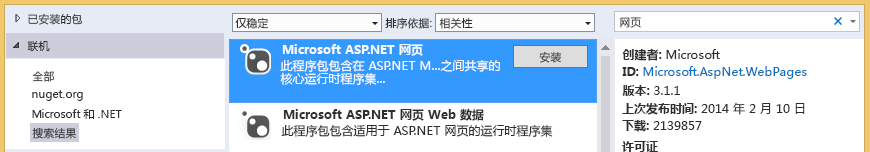

# 对文档库进行故障排除
在本主题中，您将了解当从云业务外接程序访问 SharePoint 文档库时可能发生的问题，以及用于解决这些问题的技术。

## 错误：此外接程序不支持从当前浏览器上载文档

当尝试将文档上载到云业务外接程序中的相关文档库时，上载失败并显示错误消息"此外接程序不支持从当前浏览器上载文档。请使用最新版本。"此问题仅在不支持 HTML5 FileReader API 的一些旧版浏览器上才会出现。通过将 NuGet 程序包添加到您的项目中并重新部署外接程序，可解决此问题。

### 防止错误

1. 在"解决方案资源管理器"中，打开"服务器"项目的快捷菜单并选择"管理 NuGet 程序包"。

2. 在"管理 NuGet 程序包"对话框中，展开"在线"节点，然后在"在线搜索"框中输入网页，如图 1 中所示。

   **图 1. "管理 NuGet 程序包"对话框中的选择**

3. 在结果列表中，选择"Microsoft ASP.NET 网页"，然后选择"安装"按钮。

    "许可证接受"对话框将打开。

4. 在"许可证接受"对话框中，检查许可者条款，如果您同意这些条款，请选择"我接受"按钮。

5. 程序包完成安装后，选择"关闭"按钮。

6. 将已更新的外接程序发布到 SharePoint 网站。

## 其他资源

-  [将文档库与实体相关联](associate-a-document-library-with-an-entity.md)

