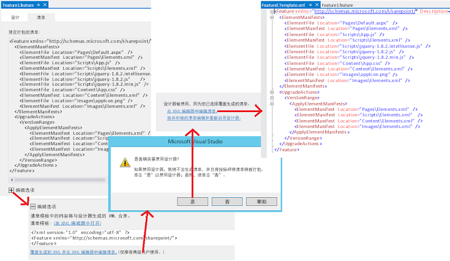

# 更新 SharePoint 2013 中的外接程序 Web 组件
更新 SharePoint 外接程序中的页面、列表、内容类型和其他外接程序 Web 组件。
## 更新外接程序 Web 组件的先决条件
<a name="Prerequisites"> </a>

了解 [更新 SharePoint 外接程序](update-sharepoint-add-ins.md)和先决条件，以及其中包含的核心概念。


此主题假设您已根据 [创建新版本并像对待全新外接程序一样调试新版本](update-sharepoint-add-ins.md#DebugFirst)中所述开发和测试了最新版本的外接程序。


## 在外接程序 Web 中更新 SharePoint 组件
<a name="UpdatingAppWeb"> </a>

所有部署到外接程序 Web 的 SharePoint 组件都包含在外接程序包中的 **Web** 范围功能中。为此，更新这些组件的关键就是更新一项或多项功能。此过程从 SharePoint 2010 开始就未改变，并记录在 SharePoint 2010 SDK 的 [如何：向现有功能中添加元素](http://msdn.microsoft.com/library/b007f419-e0d6-4e3a-a3ae-b8e448656d02%28Office.15%29.aspx)中。 [升级功能](http://msdn.microsoft.com/library/e917f709-6491-4d50-adbe-2ab8f35da990%28Office.15%29.aspx)节点中的其他文章也可能很有帮助，但是考虑到外接程序不能包含 SharePoint 服务器中的自定义代码，所以在 SharePoint 2010 中某些方面的功能升级与更新外接程序无关。例如，升级 SharePoint 外接程序的功能时不能使用  [CustomUpgradeAction](http://msdn.microsoft.com/library/16a2182e-80aa-4184-8071-8f717ee5c572%28Office.15%29.aspx) 元素。


### 通过声明方式可以执行和不能执行的操作

在 SharePoint 托管的外接程序中，您只能使用 XML 标记更新外接程序，您在更新中可以通过声明方式更改外接程序的方式存在一些限制。在提供程序托管的外接程序中，您可以实现  [UpdatedEventEndpoint 处理程序](create-a-handler-for-the-update-event-in-sharepoint-add-ins.md)，以执行无法通过声明方式执行的操作。


向外接程序添加组件非常容易。任何有资格包含在外接程序中的组件也可以包含在更新中。（有关外接程序包含哪些组件的详细信息，请参阅  [可位于 SharePoint 外接程序中的 SharePoint 组件的类型](host-webs-add-in-webs-and-sharepoint-components-in-sharepoint-2013.md#TypesOfSPComponentsInApps)。）但是，如果您想通过声明方式修改现有组件，请考虑下列几点。


- 在任何情况下，执行初始部署之后，都不要更改列表或内容类型字段（列）的数据类型。尤其需要注意的是，在外接程序更新中不要更改字段的数据类型（ *即使通过编程方式也是如此*  ）。作为替代方式，您可以添加一个新字段。如果外接程序包括自定义项目的创建、编辑或查看窗体。请务必对这些窗体进行相应的更改。例如，添加新字段的 UI 并删除旧字段的 UI。（在提供程序托管的外接程序中，您可以通过编程方式将数据从旧字段移到新字段，然后删除旧字段。）


- 不要删除列表、列表实例、内容类型或更新标记中的字段。


- 不能在更新标记中从外接程序 Web 删除文件。但是，您可以更改任何文件的内容。


- 更新 SharePoint 外接程序时不能使用 **CustomUpgradeAction** 和 **MapFile** 元素，尽管它们在 Visual Studio 智能感知中可能显示为可用。


### 首次更新外接程序 Web

本部分中的过程说明了如何添加或更新外接程序 Web 中的内容类型、列表、文件和其他 SharePoint 组件。为简单起见，我们假定所有组件都是外接程序 Web 单个功能的一部分，但是外接程序 Web 可以有多个功能，您可以在同一更新中更新多个功能。


Visual Studio Microsoft Office 开发人员工具旨在创建新的外接程序，当您更新外接程序时，工具的默认行为有时并非最佳。要更好地控制此过程，您应该首先使用以下程序禁用功能设计器，以便直接编辑原始 Feature XML。


### 编辑 Feature XML


1. 在"解决方案资源管理器"中，打开  _{FeatureName}_.features 文件。它会在功能设计器中打开。


2. 打开"清单"选项卡并展开"编辑选项"。


3. 选择"覆盖生成的 XML，并在 XML 编辑器中编辑清单"。


4. 在获得禁用设计器的提示时选择"是"。


5. 在打开的视图中，选择"在 XML 编辑器中编辑清单"。 _{FeatureName}_.Template.xml 文件将会打开。

   **打开 Feature XML 编辑器**





> **警告**
> 请勿将"<!-- -->"注释添加到  _{FeatureName}_.features 文件。升级基础架构不支持注释，如果文件中有注释，升级将会失败。它们在本文中的标记示例中使用，仅仅是为了提示您标记应放置的位置。 


使用以下步骤更新外接程序 Web 功能。


### 首次更新外接程序 Web 功能


1. 增加  [Feature](http://msdn.microsoft.com/library/265cd648-1a7e-410f-a1d7-0da8c64b4006%28Office.15%29.aspx) 元素的 **Version** 属性，如果当您在外接程序清单中增加版本号时 Visual Studio Office 开发人员工具 未执行此操作。（工具不会在所有情况下执行此操作，因此您需要进行验证。）您应当使用用于外接程序的相同版本号。您甚至应考虑在更新外接程序的其他组件时提升功能版本，但不提升外接程序 Web 功能本身。当外接程序版本和功能版本始终相同时， [VersionRange](http://msdn.microsoft.com/library/cd715e38-6ec3-43b2-8007-6d0ed8865d91%28Office.15%29.aspx) 元素的逻辑（如 [外接程序 Web 的后续更新](#SubsequentUpgrades)一节中所述）更易于管理。


2. 不要删除文件的  [ElementManifests](http://msdn.microsoft.com/library/d8d4db7e-2bc2-40c6-958b-d5683bdee87a%28Office.15%29.aspx) 部分中的任何内容。不要删除此部分中的任何内容。


3. 如果它们尚不存在，将以下元素添加到文件：

  - **Feature** 元素中的 [UpgradeActions](http://msdn.microsoft.com/library/5af24ac1-a290-454d-b32b-bc7f7a4634f0%28Office.15%29.aspx) 子元素。 *不要*  将 **ReceiverAssembly** 或 **ReceiverClass** 属性添加到此元素。这些属性在更新 SharePoint 外接程序时不起作用。（这些属性指向一个在 SharePoint 外接程序中不受支持的自定义程序集。如果将自定义程序集包含在外接程序中，SharePoint 将不会安装该外接程序。）


  - **UpgradedActions** 元素中的 **VersionRange** 子元素。 *不要*  将 **BeginVersion** 或 **EndVersion** 属性添加到此元素。这些属性在外接程序首次更新时不起作用。 [外接程序 Web 的后续更新](#SubsequentUpgrades)部分讨论了它们的使用。


  - **VersionRange** 元素中的 [ApplyElementManifests](http://msdn.microsoft.com/library/c087a0c3-1e27-4034-b4da-e025991454d6%28Office.15%29.aspx) 子元素。


    此时该文件应与以下示例类似。

    > **重要信息**
      > Visual Studio Office 开发人员工具 可能已经添加以上标记并将一些元素从 **ElementManifests** 部分复制到 **ApplyElementManifests** 部分用作说明。 *删除这些元素。*  虽然您可能在后续步骤中最终将其中部分元素放回原处，但从空的 **ApplyElementManifests** 部分开始的做法更加容易，也更安全。尚未更改的组件的冗余条目可能会产生不良后果，包括有可能延长更新过程，从而导致超时或失败。


  ```XML

<Feature <!-- Some attributes omitted -->
               Version="2.0.0.0">
  <ElementManifests>
    <!-- ElementManifest elements omitted -->
  </ElementManifests>
  <UpgradeActions>
   <VersionRange>
     <ApplyElementManifests>
   
     </ApplyElementManifests>
   </VersionRange>
  </UpgradeActions>
</Feature>
  ```


### 将组件添加到外接程序


1. 遵照创建新 SharePoint 外接程序项目时的要求将任何新组件添加到功能。


2. 当您添加外接程序之前版本中没有的组件类型时，例如向以前没有列表的外接程序中添加列表，Visual Studio Office 开发人员工具 将向项目添加一个 elements.xml 文件。这是组件的元素清单。您应当将外接程序的新版本号添加到此文件中（例如，elements.2.0.0.0.xml）。这可能有助于进行故障排除。请务必在"解决方案资源管理器"中进行更改，以确保对文件（如 csproj 文件和 Feature XML）的引用相应更改。


3. 对于每个新的元素清单，添加  [ElementManifest](http://msdn.microsoft.com/library/5a6a2865-5d31-45a2-a402-6da6e0f5567a%28Office.15%29.aspx) 元素，作为 Feature XML 的 **ElementManifests** 和 **ApplyElementManifests** 元素的子项。（两处完全相同的 **ElementManifest** 元素。）元素的 **Location** 属性应指向 elements.2.0.0.0.xml 文件的相对路径。例如，如果您添加了名为 MyCustomList 的列表， **ElementManifest** 元素将如下所示。

  ```XML

<ElementManifest Location="MyCustomList\\elements.2.0.0.0.xml" />
  ```

4. 某些类型的组件将文件添加到项目。例如，当您添加列表时，会创建一个 schema.xml 文件；当您添加页面时，会创建一个页面文件。对于每个文件，添加  [ElementFile](http://msdn.microsoft.com/library/bd43638e-8f18-4a0d-b122-1c055f97aa71%28Office.15%29.aspx) 元素，作为 **ElementManifests** 元素的子项。（不要将其添加到 **ApplyElementManifests** 元素。） **Location** 属性应指向文件的相对路径。例如，如果您添加了列表，schema.xml 的 **ElementFile** 元素将如下所示。

  ```XML
  <ElementFile Location="MyCustomList\\Schema.xml" />
  ```

5. 当您添加外接程序的之前版本中已有的项目类型时，Visual Studio Office 开发人员工具 可能会将对新项目的引用添加到现有的元素清单中，而非创建新的清单。例如，将页面添加到外接程序 Web 的标准方法是右键单击"解决方案资源管理器"中的"页面"节点，然后浏览"添加 | 新项目 | 页面 | 添加"。Visual Studio Office 开发人员工具 会将一个新的 **File** 元素添加到现有元素清单文件（通常称为 elements.xml）中的 **Pages** 模块，而非创建新的元素清单。

    这并非期望的结果。最佳做法是在更新外接程序时尽可能避免编辑任何现有的元素清单文件（即，外接程序之前版本的任何元素清单）。通常情况下，新项目应位于新的元素清单文件中（这些文件本身在 Feature XML 的 **ApplyElementManifests** 元素中引用。）（本文稍后将介绍此做法的一些例外情况。）例如，要添加新页面，请执行以下步骤：

1. 创建一个名为 Pages.2.0.0.0 的新模块


2. 从中删除 Visual Studio Office 开发人员工具 自动添加的 sample.txt 文件。


3. 将新模块中的元素清单重命名为 elements.2.0.0.0.xml。


4. 右键单击 **Pages.2.0.0.0** 模块，然后浏览"添加 | 新项目 | 页面 | 添加"。将创建新页面，并在"Pages.2.0.0.0"（而非"页面"）的元素清单中引用此页面。


5. 确保 Feature XML 的 **ElementManifests** 元素中具有新页面的 **ElementsFile** 元素，并确保 **ElementManifests** 和 **ApplyElementManifests** 部分中具有 elements.2.0.0.0.xml 文件的 **ElementManifest** 元素。


    在 Visual Studio Office 开发人员工具 已更改现有元素清单的任何情况下，另一个选项是手动创建新的 elements.2.0.0.0.xml 并将已添加到旧清单的标记移动到新清单。（如果需要，您可以将新清单放在与旧清单相同的"解决方案资源管理器"节点中。）


6. 如果您为功能中的内容类型添加了一个字段，将  [AddContentTypeField](http://msdn.microsoft.com/library/cb04a3ac-f41a-4ffe-aaa1-d4bf3fb6347d%28Office.15%29.aspx) 元素添加到 **VersionRange** 部分。确保为 **ContentTypeId** 和 **FieldId** 属性分配正确的值。（可选）使用 **PushDown** 属性指定是否应该为任何派生内容类型添加新字段。示例如下。

  ```XML
  <VersionRange>
  <AddContentTypeField 
    ContentTypeId="0x0101000728167cd9c94899925ba69c4af6743e"
    FieldId="{CCDD361F-A3FB-40D8-A272-3A3C858F4116}"
    PushDown="TRUE" />
  <!-- Other child elements of VersionRange -->
</VersionRange>
  ```


### 修改外接程序的现有组件


1. 如果您已更改元素清单文件中引用的文件，例如 Default.aspx 文件，则您根本无需更改文件的 **ElementFile** 元素。但是您必须通知更新基础结构使用新文件版本取代旧版本。您可以通过将模块的 **ElementManifest** 元素添加到 **ApplyElementManifests** 部分来执行此操作。因为 **ElementManifests** 部分中已有此类元素，因此仅将其复制（不是移动）到 **ApplyElementManifests** 有时就是一个选项，但仅当清单中引用的所有文件都已更改时，才需执行此操作。作为常规做法，您不应使用文件本身的副本替代未更改的文件。在某些情况下，这会产生不良影响。例如，如果页面已配置为允许用户自定义它，则将其替换可能会导致自定义项被删除。（如果您已更改页面，则必须接受此后果，但您不希望对您的客户造成这种不便。）

    为确保仅替代模块中的已更改文件，请执行下列步骤，为仅引用已更改文件的模块创建第二个元素清单，并在 **ApplyElementManifests** 中应用第二个清单。

1. 在"解决方案资源管理器"中右键单击模块的节点，并添加名为 elements.2.0.0.0.xml 的 XML 文件（不是页面）。


2. 在"解决方案资源管理器"中选择新文件，使其在属性窗格中可见，并将 **Deployment Type** 属性更改为"ElementManifest"。这对于确保 Visual Studio Office 开发人员工具 正确处理文件非常重要。


3. 将原始清单的内容复制到新清单，然后从新清单中删除与 **未** 更改的文件对应的所有 [File](http://msdn.microsoft.com/library/c270e4ce-8110-4da7-b0e7-c223604bfce7%28Office.15%29.aspx) 元素。


4. 将 **ElementManifest** 元素添加到引用新清单文件（如本示例中所示）的 **ApplyElementManifests** 部分。

  ```XML

<ElementManifest Location="Pages\\elements.2.0.0.0.xml" />
  ```


    > **注释**
      >  不要删除原始清单。Feature XML 会使用新旧两个清单。>  不要将任何 **ElementFile** 元素从 **ElementManifests** 部分复制到 **ApplyElementManifests** 部分，即使 **ElementFile** 中引用的文件已更改也是如此。
2. 打开 **ApplyElementManifests** 部分引用的每个元素清单文件，并确保所有 [File](http://msdn.microsoft.com/library/c270e4ce-8110-4da7-b0e7-c223604bfce7%28Office.15%29.aspx) 元素都有 **ReplaceContents** 属性，并且被设置为 **TRUE**。示例如下。Visual Studio Office 开发人员工具 可能已执行此操作，但您应该进行验证。即使对外接程序之前版本的元素清单也应执行此操作。这是编辑现有元素清单文件的几种方式之一。

  ```XML
  <Module Name="Pages">
  <File Path="Pages\\Default.aspx" Url="Pages/Default.aspx" ReplaceContent="TRUE" />
</Module>
  ```

3. 页面中应可以嵌入 Web 部件，如 [在外接程序 Web 上的网页中包含 Web 部件](include-a-web-part-in-a-webpage-on-the-add-in-web.md)中所述。如果您更改具有 Web 部件的页面（或更改 Web 部件的属性），则还需执行一个步骤：您必须将以下标记添加到页面，以防止 SharePoint 将 Web 部件的第二个副本添加到页面。标记应添加到 ID 为  `PlaceHolderAdditionalPageHead` 的 **asp:Content** 元素。（首次创建页面时，Visual Studio Office 开发人员工具 可能已添加，但您应进行验证。）

  ```XML

<meta name="WebPartPageExpansion" content="full" />
  ```


    > **注释**
      >  如果页面已配置为允许用户进行自定义，此标记将存在删除这些自定义的副作用。用户将必须重复执行这些自定义。>  如果 Web 部件已按照 [在外接程序 Web 上的网页中包含 Web 部件](include-a-web-part-in-a-webpage-on-the-add-in-web.md)中的指南添加到页面，Web 部件标记将位于元素清单中，因此更改 Web 部件的属性是常规规则的一个例外，常规规则是您在外接程序更新时不应编辑元素清单文件。 
4. 作为更改页面的替代方法，还可以选择执行下列步骤，使用到新页面的重定向。

1. 创建新页面，并配置其更新标记，如前面 **将组件添加到外接程序** 中的过程中所述。


2. 打开旧页面，并将所有标记从 ID 为  `PlaceHolderAdditionalPageHead` 的 **asp:Content** 元素中删除。


3. 将以下标记添加到 **asp:Content** 元素，然后将 _{RelativePathToNewPageFile}_ 替换为新路径和文件名。此脚本将浏览器重定向到新页面并包括查询参数。它还会将旧页面从浏览器历史记录中删除。

  ```
  <script type="text/javascript">
        var queryString = window.location.search.substring(1);
        window.location.replace("{RelativePathToNewPageFile}" + "?" + queryString);
</script>
  ```

4. 删除页面上的任何其他 **asp:Content** 元素。


5. 如果您要替换的页面是外接程序的起始页面，请将外接程序清单中的 **StartPage** 元素更改为指向新页面。


5. 如果外接程序的外接程序 Web 包含 **CustomAction** 或 **ClientWebPart**，并且您在更新时对其进行修改，您必须修改元素清单，因为这是对组件进行定义的位置。（这是常规做法的例外情况，常规做法是您在更新外接程序时不应编辑外接程序上一版本中的元素清单。）您还必须将 **ElementManifest** 元素从 **ElementManifests** 部分复制（不是移动）到 **ApplyElementManifests** 部分。


#### 第一次升级外接程序的 Feature XML 示例

下面是第一次更新外接程序时的完整  _{FeatureName}_.Template.xml 文件的示例。此示例中更新的外接程序包括  `Pages\\Elements.xml` 文件中引用的修改后的 Default.aspx 文件，并且它部署了三个新的 jQuery 文件，每个文件在 `Scripts\\Elements.xml` 文件中都有引用。请注意，所有 **ElementFile** 将进入 **ElementManifests** 部分，并注意 `<ElementManifest Location="Pages\\Elements.xml" />` 如何从 **ElementManifests** 部分复制（而非移动）到 **ApplyElementManifests** 部分。


```XML

<Feature xmlns="http://schemas.microsoft.com/sharepoint/" Title="MyApp Feature1"
      Description="SharePoint Add-in Feature" Id="85d309a8-107e-4a7d-b3a2-51341d3b11ff" 
      Scope="Web" Version="2.0.0.0">
  <ElementManifests>
    <ElementFile Location="Pages\\Default.aspx" />
    <ElementManifest Location="Pages\\Elements.xml" />
    <ElementFile Location="Content\\App.css" />
    <ElementManifest Location="Content\\Elements.xml" />
    <ElementFile Location="Images\\AppIcon.png" />
    <ElementManifest Location="Images\\Elements.xml" />
    <ElementFile Location="Scripts\\jquery-3.0.0.intellisense.js" />
    <ElementFile Location="Scripts\\jquery-3.0.0.js" />
    <ElementFile Location="Scripts\\jquery-3.0.0.min.js" />
  </ElementManifests> 
  <UpgradeActions>
      <VersionRange>  
        <ApplyElementManifests>
          <ElementManifest Location="Pages\\Elements.xml" />
          <ElementManifest Location="Scripts\\elements.2.0.0.0.xml" />
        </ApplyElementManifests>
      </VersionRange>
  </UpgradeActions>
</Feature>

```


### 外接程序 Web 的后续更新
<a name="SubsequentUpgrades"> </a>

第二次（或第三次等）更新 SharePoint 外接程序时，必须考虑到一些客户之前可能没有进行过更新。所以，如果在您的最新更新部署到组织外接程序目录或 Office 商店之后，用户响应"更新可用"提示，他们的外接程序实例可能会在单个更新过程中经历多个版本更新。大多数情况下，这正是应该发生的情况：您希望每个较早版本的外接程序都更新到最新版本。但是，您不一定始终希望为每个外接程序实例重新执行外接程序 Web 功能的每个更新操作。有些更新操作不应在给定外接程序实例中多次执行。例如，如果您在一次更新中将一个字段添加到内容类型中，则不会希望在下一次更新中再次添加该字段。以下过程显示了如何根据正在更新的功能的版本使用 **VersionRange** 元素来控制执行哪个更新操作。


### 在之后的更新中更改外接程序 Web 功能


1. 如本文前面的 **编辑 Feature XML** 过程所述，打开 _FeatureName_.Template.xml 文件进行编辑，并递增  [Feature](http://msdn.microsoft.com/library/265cd648-1a7e-410f-a1d7-0da8c64b4006%28Office.15%29.aspx) 元素的 **Version** 属性。您应当使用与外接程序功能相同的版本号。

    在接下来的示例中，让我们假设您之前将外接程序从版本 1.0.0.0 更新到版本 2.0.0.0，现在，您正在将其更新到版本 3.0.0.0。所以将 **Version** 属性设置为 3.0.0.0。


2. 在所有现有 **VersionRange** 元素下添加新的 **VersionRange** 元素。 *不要*  将 **BeginVersion** 或 **EndVersion** 属性添加到此元素。


3. 如本文前面的 **首次更新外接程序 Web 功能** 过程所述，填充 **VersionRange** 元素，以解释此更新版本功能中进行的更改。此过程针对 **ApplyElementManifests** 部分，但应将其视为针对 **ApplyElementManifests** 元素，它是您刚刚添加的 **VersionRange** 元素的子项，即 Feature XML 文件中 *最低*  的元素。


4. 转到之前的 **VersionRange** 元素，即上次更新外接程序（在接下来的示例中，从 1.0.0.0 更新到 2.0.0.0）时添加的元素，并为其添加 **EndVersion** 属性。您希望此 **VersionRange** 中的升级操作应用到尚未应用该元素的所有版本的外接程序（版本 1.0.0.0）中，但是不希望将它们重新应用到已经应用了该元素的版本（版本 2.0.0.0）中。 **EndVersion** 值是 *唯一的*  ，因此，请将其设置为您 *不*  希望应用升级操作的最低版本。在接下来的示例中，您将其设置为 2.0.0.0。现在，您的文件应该如下所示。

  ```XML

<Feature <!-- Some attributes omitted -->
               Version="3.0.0.0">
  <ElementManifests>
    <!-- ElementManifest elements omitted -->
  </ElementManifests>
  <UpgradeActions>
    <VersionRange EndVersion="2.0.0.0">
      <!--  Child elements for upgrade from 1.0.0.0 to 2.0.0.0 go here. -->
    </VersionRange>
   <VersionRange>
      <!--  Child elements for upgrade from 2.0.0.0 to 3.0.0.0 go here. -->
   </VersionRange>
  </UpgradeActions>
</Feature>
  ```


    每次升级功能时，请遵照相同的模式。为最近的更新操作添加新的 **VersionRange**。然后，将 **EndVersion** 元素添加到之前的 **VersionRange** 元素中，并将其设置为之前的版本号。在接下来的示例中，对于从 3.0.0.0 到 4.0.0.0 的更新，文件将如下所示。


  ```XML

<Feature <!-- Some attributes omitted -->
               Version="4.0.0.0">
  <ElementManifests>
    <!-- Child elements omitted -->
  </ElementManifests>
  <UpgradeActions>
    <VersionRange EndVersion="2.0.0.0">
       <!-- Child elements for upgrade from 1.0.0.0 to 2.0.0.0 go here. -->
    </VersionRange>
    <VersionRange EndVersion="3.0.0.0">
       <!-- Child elements for upgrade from 2.0.0.0 to 3.0.0.0 go here. -->
    </VersionRange>
    <VersionRange>
       <!-- Child elements for upgrade from 3.0.0.0 to 4.0.0.0 go here. -->
    </VersionRange>
  </UpgradeActions>
</Feature>
  ```


    请注意，最新的 **VersionRange** 元素没有 **BeginVersion** 或 **EndVersion** 属性。这样可以确保涉及此 **VersionRange** 元素的升级操作应用于功能所有之前的版本，这正是您希望的，因为所有最新更改都会在此 **VersionRange** 中引用，并且任何功能实例都未发生这些更改。

    还请注意， **BeginVersion** 属性没有在任何 **VersionRange** 中使用。这是因为 **BeginVersion** 属性的默认值为 0.0.0.0，这个值就是您希望看到的值，因为您希望所有升级操作应用于早于 **EndVersion** 属性中指定版本的每个外接程序实例。

    > **重要信息**
      > **VersionRange** 元素只决定将升级应用到功能的版本。它不能决定哪个版本的 *外接程序*  会收到更新可用的通知，该通知只能由外接程序版本号触发。新版本的外接程序在组织外接程序目录或 Office 商店中可用后的 24 小时内，外接程序的每个已安装实例（无论哪个版本）都会在其"网站内容"页的标题中显示更新可用的通知。> **VersionRange** 不影响新升级的功能或最新更新的外接程序的新版本号。无论升级前功能处于哪个版本范围，这两个编号始终会更改为最新的版本号。这为避免使用 **BeginVersion** 属性提供了另一个很好的理由。 **BeginVersion** 属性可用于阻止某些升级操作在某些外接程序实例中执行。但是，它不能阻止功能或外接程序版本升级到最高版本。所以，使用 **BeginVersion** 属性会造成这样一种情况：外接程序的两个实例在其外接程序 Web 中拥有相同的外接程序版本号和相同的外接程序 Web 功能版本号，但是拥有不同的组件。

## 验证外接程序 Web 组件的部署
<a name="VerifyDeployAppWebComp"> </a>

按照以下步骤验证外接程序 Web 功能及其组件的部署。


### 验证外接程序 Web 的设置


1. 打开主机 Web 的"网站设置"。在"网站集管理"部分，选择"网站层次结构"链接。


2. 在"网站层次结构"页上，您会看到按其 URL 列出的外接程序 Web。不要启动它。相反，请复制该 URL 并在其余步骤中使用该 URL。


3. 导航到  _URL_of_app_web_/_layouts/15/ManageFeatures.aspx，并在打开的"网站功能"页上验证 Feature 是否是按字母顺序排列的功能列表成员，及其状态是否为"活动"。


4. 如果您的外接程序 Web 功能包括自定义网站列，打开  _URL_of_app_web_/_layouts/15/mngfield.aspx，并且在打开的"网站列"页上验证新的自定义网站列是否列出。


5. 如果您的外接程序 Web 功能包括任何自定义内容类型，打开  _URL_of_app_web_/_layouts/15/mngctype.aspx，并且在打开的"网站内容类型"页上验证新的内容类型是否列出。


6. 对于每个自定义内容类型和您已添加列的每个内容类型，选择内容类型的链接。在打开的"网站内容类型"页上，验证内容类型是否拥有应有的网站列。


7. 如果您的外接程序 Web 功能包括任何列表实例，打开  _URL_of_app_web_/_layouts/15/mcontent.aspx，并在打开的"网站库和列表" 页上，验证是否每个自定义列表实例都拥有 **自定义"name_of_list"**链接。


8. 对于每个自定义列表实例，选择"自定义'name_of_list'" 链接，并在列表设置页验证列表是否拥有预期的内容类型和列。

    > **注释**
      > 如果该页上没有"内容类型"部分，则必须启用内容类型的管理。选择"高级设置"链接，在"高级设置"页上，启用内容类型的管理，然后选择"确定"。您将返回到上一页，那里现在有"内容类型"部分的列表。 
9. 页面顶部附近有列表的"Web 地址"。如果您已在列表实例定义中加入了示例项目，则复制该地址并将其粘贴到浏览器的地址栏，然后导航到列表。验证列表是否拥有您创建的示例项目。


## 后续步骤
<a name="Next"> </a>

返回到 [更新外接程序的主要步骤](update-sharepoint-add-ins.md#MajorAppUpgradeSteps)，或直接转到以下文章之一，以了解如何更新 SharePoint 外接程序的下一主要组件。


-  [更新 SharePoint 2013 中的主机 Web 组件](update-host-web-components-in-sharepoint-2013.md)


-  [在 SharePoint 外接程序中创建更新事件的处理程序](create-a-handler-for-the-update-event-in-sharepoint-add-ins.md)


-  [更新 SharePoint 外接程序中的远程组件](update-remote-components-in-sharepoint-add-ins.md)


## 其他资源
<a name="bk_addresources"> </a>


-  [更新 SharePoint 外接程序](update-sharepoint-add-ins.md)


- 在 Microsoft SharePoint 2010 软件开发工具包 (SDK)中， [如何：向现有功能中添加元素](http://msdn.microsoft.com/library/b007f419-e0d6-4e3a-a3ae-b8e448656d02%28Office.15%29.aspx)。


- 在 Microsoft SharePoint 2010 软件开发工具包 (SDK)中， [升级功能](http://msdn.microsoft.com/library/e917f709-6491-4d50-adbe-2ab8f35da990%28Office.15%29.aspx)。


