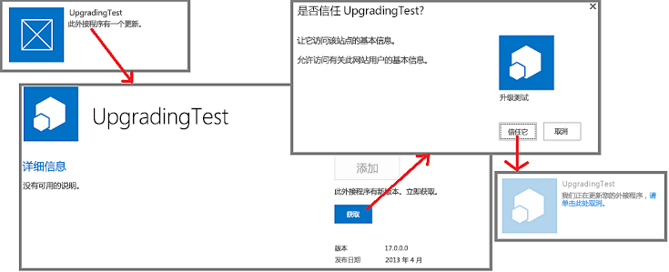

# 更新 SharePoint 外接程序
了解如何创建和部署 SharePoint 外接程序更新。
可以使用内置于 SharePoint 2013 的更新支持更新 SharePoint 外接程序。在将外接程序的更新版本上载到组织外接程序目录或外接程序被 Office 商店接受之后的 24 小时内，在每个安装了该外接程序的网站的"网站内容"页上的该外接程序旁将显示更新可用的通知。如图 1 所示，会为用户提供立即安装更新的链接。

**图 1. SharePoint 外接程序更新过程**

用户在安装更新时无需先卸载较早版本。更新基础架构会测试更新安装，如果有任何错误便会回滚安装。

> **重要信息**
> 不能使用更新系统更改 *外接程序类型*  。例如，您不能使用更新将 SharePoint 托管的外接程序更改为提供程序托管的外接程序。若要更改类型，需要 [从旧外接程序迁移到新外接程序](sharepoint-add-ins-update-process.md#Major)。特别是，由于 [自动托管的外接程序的预览计划已结束](http://blogs.office.com/2014/05/16/update-on-autohosted-apps-preview-program/)，您应该意识到无法将自动托管的外接程序更新为提供程序托管的外接程序。必须按 [将自动托管的 SharePoint 外接程序转换为提供商托管的外接程序](convert-an-autohosted-sharepoint-add-in-to-a-provider-hosted-add-in.md)中所述转换外接程序。 

## 更新 SharePoint 外接程序的先决条件

- 为外接程序隔离配置的测试 SharePoint 2013 安装。有关如何设置 Office 365 开发人员网站的说明，请参阅 [在 Office 365 上设置 SharePoint 加载项的开发环境](set-up-a-development-environment-for-sharepoint-add-ins-on-office-365.md)。

- 用于创建 SharePoint 外接程序的工具通常也用于对其进行更新。例如，大多数开发人员使用 Visual Studio 和 Visual Studio Microsoft Office 开发人员工具创建 SharePoint 外接程序。

### 更新 SharePoint 外接程序要了解的核心概念

**表 1. 更新 SharePoint 外接程序的核心概念**

|**文章标题**|**说明**|
|:-----|:-----|
| [为开发和托管 SharePoint 外接程序选择模式](choose-patterns-for-developing-and-hosting-your-sharepoint-add-in.md)   |了解 SharePoint 外接程序的不同类型。更新过程因类型而异。    |
| [SharePoint 外接程序更新过程](sharepoint-add-ins-update-process.md)   |了解更新 SharePoint 外接程序的过程。    |
| [升级功能](http://msdn.microsoft.com/library/e917f709-6491-4d50-adbe-2ab8f35da990%28Office.15%29.aspx)   |了解如何更新功能 (SharePoint 2010 SDK)。    |
| [部署和安装SharePoint 外接程序：方法和选项](deploying-and-installing-sharepoint-add-ins-methods-and-options.md)   |了解发布、安装和卸载 SharePoint 外接程序的方法。    |
| [处理 SharePoint 外接程序中的事件](handle-events-in-sharepoint-add-ins.md)   |了解 SharePoint 2013 中的远程事件接收器。    |
 

## 更新外接程序的主要步骤

以下是创建 SharePoint 外接程序更新时可能会需要的主要步骤。每个步骤在链接的部分或文章中有详细介绍。在每个更新项目中，并非所有步骤都必需。您必须执行的步骤取决于外接程序中已有的组件和要添加的组件。只有标记有 ***** 的项目是始终必需的。

- 更新外接程序清单。

  - ***** 增加 appmanifest.xml 文件的 [App](http://msdn.microsoft.com/library/d5f30dfe-7500-5f85-0f08-f4f220c0c692%28Office.15%29.aspx) 元素中的 **Version** 编号。（当架构首次发布时，外接程序被称为"应用程序"。） *不要*  更改 **ProductID** 编号。

  - 更改 appmanifest.xml 文件的  [AppPermissionRequests](http://msdn.microsoft.com/library/4e617622-78d3-3d23-677d-9957eb1fb107%28Office.15%29.aspx) 部分。

  - 更改 appmanifest.xml 文件的  [AppPrerequisites](http://msdn.microsoft.com/library/7622b55f-01a1-2c39-9daa-7cfb1a3c890f%28Office.15%29.aspx) 部分。

    有关详细信息，请参阅 [更新外接程序版本、权限请求和先决条件](#UpdateManifest)。

- 添加或更新外接程序 Web 组件的标记。有关详细信息，请参阅 [更新 SharePoint 2013 中的外接程序 Web 组件](update-add-in-web-components-in-sharepoint-2013.md)。

- 添加或更新主机 Web 组件的标记。有关详细信息，请参阅 [更新 SharePoint 2013 中的主机 Web 组件](update-host-web-components-in-sharepoint-2013.md)。

- 为  [UpgradedEventEndpoint](http://msdn.microsoft.com/library/09a93d44-d295-47bb-f91c-d243178b0f53%28Office.15%29.aspx) 添加自定义逻辑并在 appmanifest.xml 文件中进行注册。有关详细信息，请参阅 [在 SharePoint 外接程序中创建更新事件的处理程序](create-a-handler-for-the-update-event-in-sharepoint-add-ins.md)。

- 更新远程组件：

  - 对于提供程序托管的外接程序，使用适合托管平台堆栈的技术更新远程组件。

    有关详细信息，请参阅 [更新 SharePoint 外接程序中的远程组件](update-remote-components-in-sharepoint-add-ins.md)。

- ***** 将外接程序包上载到 Office 商店或组织的外接程序目录。

## 外接程序更新的最佳实践

以下部分讨论了规划更新时您应该遵守的实践和要考虑的重要因素。

### 确定是否确实需要更新

对于提供程序托管的 SharePoint 外接程序，外接程序的改进并不一定需要更新外接程序。如果所有更改均针对远程组件，并且那些更改并不需要反映在 SharePoint 组件中，则可以更改远程组件，而不更新外接程序。只要用于访问远程组件的 SharePoint 组件的 URL 和连接字符串未改变，SharePoint 外接程序便可以继续工作。例如，假设您为远程 Web 应用程序添加一个按钮，用于从 Web 应用程序之前未读取的 SharePoint 列表读取一列。如果该列已经存在于此列表中，则不需要对 SharePoint 的内容进行任何更改。您可以将修改的网页和修改的代码隐藏或 JavaScript 上载到远程 Web 应用程序。用户启动 SharePoint 外接程序时，新功能会立即可用。

### 记住，更新对用户来说是可选的

当 SharePoint 外接程序的新版本在 Office 商店或组织外接程序目录中可用时，"网站内容"页上外接程序的磁贴中会显示消息，通知用户有可用更新。此消息会在 24 小时内显示。但是，不会强迫用户更新 SharePoint 基础架构中的任何内容。因此，您对远程组件进行的更改不得破坏较旧版本的外接程序。一个常见但并非很通用的规则是，您应该向远程组件 *添加*  内容，但要避免删除、重命名、移动或更改任何现有组件的架构、连接字符串或 URL。

如果远程组件需要知道对其进行调用的外接程序实例的版本，可以从 SharePoint 传递此信息。例如，您可以在外接程序的  [StartPage](http://msdn.microsoft.com/library/3092674c-a6c3-9021-3d7e-e716562a4a4f%28Office.15%29.aspx) URL 上将外接程序版本添加为查询参数。

### 创建新版本并像对待全新外接程序一样调试新版本

应该将外接程序新版本的开发和调试与更新标记和逻辑的调试区分开。为此，请从开发测试 SharePoint 网站卸载较早版本的外接程序。保存较早版本外接程序包文件的备份副本。根据需要添加和更改外接程序的组件，然后根据测试网站进行测试和调试，就像对待从头开始创建的全新外接程序一样。

### 对每个外接程序的较早版本测试更新

当新版本的外接程序和"新"外接程序一样正常工作时，重组代码和标记，以便项目成为旧外接程序的更新。例如，按照 [更新外接程序的主要步骤](#MajorAppUpgradeSteps)中的说明增加外接程序版本号。

准备好测试更新后，从测试网站取消新版本并重新部署较早的版本，以便测试更新逻辑。如果已经售出了多个之前版本的外接程序，将每个较早版本安装在测试网站的不同子网中。然后将外接程序的最新版本上载到测试网站的外接程序目录中，并更新外接程序的每个实例。验证每个外接程序是否拥有最新的外接程序版本号以及是否所有组件都为最新版本。如果外接程序中有外接程序 Web，则使用 [验证外接程序 Web 组件的部署](update-add-in-web-components-in-sharepoint-2013.md#VerifyDeployAppWebComp)中的过程验证外接程序 Web 组件是否已部署。

### 更新外接程序时无需等待 24 小时

在 SharePoint 测试网站中开发外接程序更新时，在两次更新之间等待 24 小时很不切合实际。使用以下步骤，您（和生产 SharePoint 网站中的用户）可以在外接程序上载到 Office 商店或组织的外接程序目录中后立即更新：

### 立即更新外接程序

1. 最新更新上载到外接程序目录后，在安装外接程序的网站中打开"网站内容"页，并选择外接程序磁贴中的"..."按钮。

2. 在打开的标注中，选择"关于"选项卡。在打开的"关于"页中，会出现有可用新版本的通知。

3. 选择"获取"按钮。"网站内容"页会重新打开，并且外接程序磁贴上会有一个通知，显示外接程序正在更新。

图 2 说明了这些步骤。

**图 2. 立即更新 SharePoint 外接程序的过程**

> **注释**
> 如果需要更频繁地查看外接程序磁贴中的"更新可用"通知，而不是每 24 小时查看一次，可以使用  [SharePoint 外接程序的更新过程](sharepoint-add-ins-update-process.md#Minor)中描述的方法让通知立即显示。 

## 更新外接程序版本、权限请求和先决条件

制作 Visual Studio 项目文件夹的备份副本后，打开外接程序项目。打开外接程序清单，并在清单设计器中的"常规"选项卡上增加版本号。

如果外接程序的更新版本需要拥有对主机 Web 组件更多（或更少）的权限，可根据需要更改该外接程序的  [AppPermissionRequests](http://msdn.microsoft.com/library/4e617622-78d3-3d23-677d-9957eb1fb107%28Office.15%29.aspx) 部分。在 Visual Studio 中，使用清单设计器的"权限"选项卡。外接程序进行更新时，会始终提示用户授予权限，无论自上一版本以来是否对权限做过更改。如果新的版本要求的权限 *少于*  以前的版本，那么以前版本的其他权限 *未被吊销*  。若要对外接程序限制最新版本所需的权限，唯一方法是在外接程序已更新后，让用户打开页面 *{SharePointDomain}*  `/_layouts/15/appinv.aspx`，然后手动输入符合  [AppPermissionRequests](http://msdn.microsoft.com/library/4e617622-78d3-3d23-677d-9957eb1fb107%28Office.15%29.aspx) 架构的权限标记。

如果外接程序的更新版本拥有较早版本没有的先决条件（或者不再拥有较早版本中拥有的某些先决条件），根据需要对外接程序的  [AppPrerequisites](http://msdn.microsoft.com/library/7622b55f-01a1-2c39-9daa-7cfb1a3c890f%28Office.15%29.aspx) 部分进行更改。在 Visual Studio 中, 使用清单设计器的"先决条件"选项卡。

## 后续步骤

继续 [更新外接程序的主要步骤](#MajorAppUpgradeSteps)部分中的下一个点符项或者直接转到以下任一文章：

-  [更新 SharePoint 2013 中的外接程序 Web 组件](update-add-in-web-components-in-sharepoint-2013.md)

-  [更新 SharePoint 2013 中的主机 Web 组件](update-host-web-components-in-sharepoint-2013.md)

-  [在 SharePoint 外接程序中创建更新事件的处理程序](create-a-handler-for-the-update-event-in-sharepoint-add-ins.md)

-  [更新 SharePoint 外接程序中的远程组件](update-remote-components-in-sharepoint-add-ins.md)

## 其他资源

-  [开发 SharePoint 外接程序](develop-sharepoint-add-ins.md)

-  [SharePoint 外接程序更新过程](sharepoint-add-ins-update-process.md)

