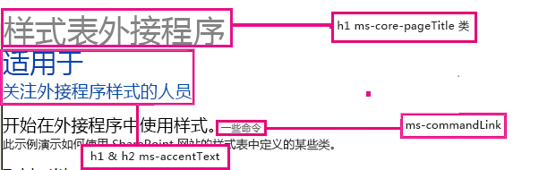
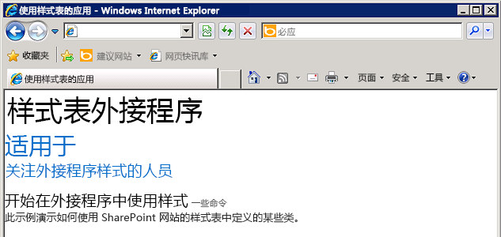

# 在 SharePoint 外接程序中使用 SharePoint 网站的样式表
了解如何在 SharePoint 外接程序中使用 SharePoint 网站样式表。
可以在您的 SharePoint 外接程序中引用 SharePoint 网站的样式表，并通过使用 SharePoint 中的样式表将其用于设置您网页的样式。此外，如果有人更改了 SharePoint 网站的样式表或主题，则您可以在您的外接程序中采用一组新的样式，而无需修改您的外接程序中的样式表引用。
  
    
    


> **重要信息**
> 如果您的网页使用部件版式控制或外接程序母版页，则这些样式可供您使用，并且您不必使用本文中的过程手动引用样式表。 
  
    
    


## 使用本文中的示例的先决条件
<a name="SP15Usestylesheetcontrol_Prereq"> </a>

您需要一个如 [开始创建提供程序承载的 SharePoint 加载项](get-started-creating-provider-hosted-sharepoint-add-ins.md)中所述的开发环境。
  
    
    

### 在 SharePoint 外接程序中使用 SharePoint 样式表之前要了解的核心概念

下表列出了可帮助您了解与使用 SharePoint 样式表的方案相关的概念的有用文章。
  
    
    

**表 1. 使用样式表之前要了解的核心概念**


|**文章标题**|**说明**|
|:-----|:-----|
| [SharePoint 外接程序](sharepoint-add-ins.md) <br/> |了解 SharePoint 中新的外接程序模型，您可以利用此模型来创建对最终用户来说是小型的易于使用的解决方案的外接程序。  <br/> |
| [SharePoint 外接程序的 UX 设计](ux-design-for-sharepoint-add-ins.md) <br/> |了解在生成 SharePoint 外接程序时可使用的用户体验 (UX) 选项和替代项。  <br/> |
| [SharePoint 2013 中的主机 Web、外接程序 Web 和 SharePoint 组件](host-webs-add-in-webs-and-sharepoint-components-in-sharepoint-2013.md) <br/> |了解主机 Web 和外接程序 Web 之间的区别。找出哪些 SharePoint 组件可以包含在 SharePoint 外接程序中、哪些组件部署到主机 Web、哪些组件部署到外接程序 Web，以及如何将外接程序 Web 部署在独立的域中。  <br/> |
   

## 代码示例：在 SharePoint 外接程序中使用 SharePoint 网站的样式表
<a name="SP15Usestylesheetcontrol_Example"> </a>

此代码示例演示如何使用 SharePoint 网站的样式表。这使您的远程 Web 应用程序页能够匹配 SharePoint 主机 Web 中页面的外观。
  
    
    
若要在 SharePoint 外接程序中使用样式表，请执行以下步骤：
  
    
    

1. 创建提供程序承载的 SharePoint 外接程序。
    
  
2. 通过创建空白页来强制设置外接程序 Web。
    
  
3. 向 Web 项目添加网页并引用样式表。
    
  
4. 编辑外接程序清单中的元素。
    
  
图 1 显示了使用样式表的 SharePoint 网页。
  
    
    

**图 1. 使用样式表的网页**

  
    
    

  
    
    

  
    
    

### 创建 SharePoint 相关外接程序和远程 Web 项目


1. 以管理员身份打开 Visual Studio。（为此，请右键单击"启动"菜单上的 Visual Studio 图标，然后选择"以管理员身份运行"。）
    
  
2. 如 [开始创建提供程序承载的 SharePoint 加载项](get-started-creating-provider-hosted-sharepoint-add-ins.md)中所述创建提供程序托管的 SharePoint 外接程序并将其命名为 StylesheetAdd-in。
    
  

### 通过创建空白页来强制设置外接程序 Web


1. 右键单击 SharePoint 外接程序项目并添加新模块。
    
  
2. 右键单击该新模块并添加新项。
    
  
3. 在"Visual C# 项"、"Web"下，选择"HTML 页"。将该页重命名为 **blank.html** 。
    
  
4. 删除 blank.html 的内容。
    
  

### 在 Web 项目中添加引用样式表的网页


1. 右键单击 Web 项目，并添加一个新 Web 表单。将该 Web 表单重命名为 **StyleConsumer.aspx** 。
    
  
2. 用以下代码替换 Web 表单 .aspx 文件的内容。该代码执行以下任务：
    
  - 从外接程序 Web 将 blank.html 页加载到不可见的 IFrame 中。
    
  
  - 从外接程序 Web 加载 defaultcss.ashx 文件。
    
  
  - 使用可用样式。
    
  

 ```
  
<%@ Page Language="C#" AutoEventWireup="true" CodeBehind="StyleConsumer.aspx.cs" Inherits="StylesheetAppWeb.StyleConsumer" %>

<!DOCTYPE html>
<html>
<head>
    <title>Add-in using stylesheet</title>
</head>
<body>

    <!-- The main page title -->
    <h1 class="ms-core-pageTitle">Stylesheet add-in</h1>

    <!-- Some subtitle -->
    <h1 class="ms-accentText">For people</h1>

    <!-- Subtitle comments -->
    <h2 class="ms-accentText">who care about the style in their add-ins</h2>
    <p></p>
    <div>
        <h2 class="ms-webpart-titleText">Get started with style in your add-in... </h2>
        <a class="ms-commandLink" href="#">some command</a>
        <br />
        This sample shows you how to use some of the classes defined in the SharePoint website's style sheet.
    </div>

    <!-- Script to load SharePoint resources
        and load the blank.html page in
        the invisible iframe
        -->
    <script type="text/javascript">
        "use strict";
        var appweburl;

        (function () {
            var ctag;

            // Get the URI decoded add-in web URL.
            appweburl =
                decodeURIComponent(
                    getQueryStringParameter("SPAppWebUrl")
            );
            // Get the ctag from the SPClientTag token.
            ctag =
                decodeURIComponent(
                    getQueryStringParameter("SPClientTag")
            );

            // The resource files are in a URL in the form:
            // web_url/_layouts/15/Resource.ashx
            var scriptbase = appweburl + "/_layouts/15/";

            // Dynamically create the invisible iframe.
            var blankiframe;
            var blankurl;
            var body;
            blankurl = appweburl + "/Pages/blank.html";
            blankiframe = document.createElement("iframe");
            blankiframe.setAttribute("src", blankurl);
            blankiframe.setAttribute("style", "display: none");
            body = document.getElementsByTagName("body");
            body[0].appendChild(blankiframe);

            // Dynamically create the link element.
            var dclink;
            var head;
            dclink = document.createElement("link");
            dclink.setAttribute("rel", "stylesheet");
            dclink.setAttribute("href", scriptbase + "defaultcss.ashx?ctag=" + ctag);
            head = document.getElementsByTagName("head");
            head[0].appendChild(dclink);
        })();

        // Function to retrieve a query string value.
        // For production purposes you may want to use
        //  a library to handle the query string.
        function getQueryStringParameter(paramToRetrieve) {
            var params;
            var strParams;

            params = document.URL.split("?")[1].split("&amp;");
            strParams = "";
            for (var i = 0; i < params.length; i = i + 1) {
                var singleParam = params[i].split("=");
                if (singleParam[0] == paramToRetrieve)
                    return singleParam[1];
            }
        }
    </script>
</body>
</html>

 ```


    在某些情况下，必须向 SharePoint 验证用户身份，然后您的页面才能下载样式的 CSS 和图像。链接标记不会自动对尚未登录的用户进行身份验证。请考虑从外接程序 Web 将页资源加载到您的网页中，以在链接到 CSS 文件之前强制验证用户身份。在此示例中，将 blank.html 页加载到不可见的 IFrame 中。
    
  

### 编辑外接程序清单中的 StartPage 元素


1. 在"解决方案资源管理器"中，双击"AppManifest.xml"文件。
    
  
2. 在"起始页"下拉菜单上，选择使用样式表的网页。
    
  

### 生成并运行解决方案


1. 确保将 SharePoint 外接程序项目设置为启动项目。
    
  
2. 按 F5 键。
    
    > **注释**
      > 按 F5 时，Visual Studio 将生成解决方案、部署外接程序并打开外接程序的权限页。 
3. 选择"信任"按钮。
    
  
4. 单击"StylesheetBasic"外接程序图标。
    
  
5. 图 2 显示了使用 SharePoint 样式的结果网页。
    
   **图 2. 页面中使用的样式表**

  

     
  

  

  
6. 您还可以转到主机 Web 并更改主题。然后，重新加载外接程序网页以使用新样式。
    
  

**表 2. 对解决方案进行疑难解答**


|**问题**|**解决方案**|
|:-----|:-----|
|Visual Studio 在您按 F5 键后未打开浏览器。  <br/> |将 SharePoint 外接程序项目设置为启动项目。  <br/> |
|证书错误。  <br/> |将您的 Web 项目的 **SSL Enabled** 属性设置为 false。在 SharePoint 外接程序项目中，将 **Web Project** 属性设置为无，然后将该属性设置回您的 Web 项目的名称。  <br/> |
   

## 后续步骤
<a name="SP15Usestylesheetcontrol_Nextsteps"> </a>

本文说明如何在 SharePoint 外接程序中使用样式表。作为后续步骤，您可了解有关其他可供 SharePoint 外接程序使用的 UX 组件的信息。若要了解更多信息，请参阅以下内容：
  
    
    

-  [代码示例：在外接程序中使用 SharePoint 样式表](http://code.msdn.microsoft.com/SharePoint-2013-Use-the-7a8684e2)
    
  
-  [在 SharePoint 外接程序中使用客户端部件版式控制](use-the-client-chrome-control-in-sharepoint-add-ins.md)
    
  
-  [创建自定义操作以部署 SharePoint 外接程序](create-custom-actions-to-deploy-with-sharepoint-add-ins.md)
    
  
-  [创建外接程序部件以安装 SharePoint 外接程序](create-add-in-parts-to-install-with-your-sharepoint-add-in.md)
    
  

## 其他资源
<a name="SP15Usestylesheetcontrol_Addresources"> </a>


-  [SharePoint 外接程序的 UX 设计](ux-design-for-sharepoint-add-ins.md)
    
  
-  [SharePoint 外接程序 UX 设计准则](sharepoint-add-ins-ux-design-guidelines.md)
    
  
-  [在 SharePoint 2013 中创建 UX 组件](create-ux-components-in-sharepoint-2013.md)
    
  
-  [考虑 SharePoint 外接程序设计选项的三种方法](three-ways-to-think-about-design-options-for-sharepoint-add-ins.md)
    
  
-  [SharePoint 外接程序体系结构的重要方面和开发前景](important-aspects-of-the-sharepoint-add-in-architecture-and-development-landscap.md)
    
  

