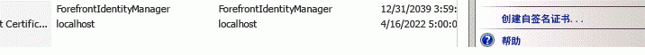

# 使用 Office 365 SharePoint 网站在本地 SharePoint 网站中对提供程序托管的外接程序进行授权
使用 Office 365 SharePoint 网站创建一个环境，在其中您可以使用 ACS 建立提供程序托管的外接程序和本地 SharePoint 2013 场之间的信任，就像为 Office 365 SharePoint 网站开发外接程序时执行的操作一样。
## 在本地环境中对提供程序托管的外接程序使用 ACS 的必备组件
<a name="Prerequisites"> </a>

确保拥有以下组件。


- 本地 SharePoint 2013 开发环境。请参阅 [设置 SharePoint 加载项的本地开发环境](set-up-an-on-premises-development-environment-for-sharepoint-add-ins.md)。


- Office 365 SharePoint 网站。如果还没有此类网站，并且希望快速设置开发环境，您可以 [在 Office 365 上设置 SharePoint 加载项的开发环境](set-up-a-development-environment-for-sharepoint-add-ins-on-office-365.md)。


-  [Visual Studio 2012](https://www.microsoft.com/en-us/download/details.aspx?id=30682) 已远程安装或已在安装了 SharePoint 2013 的计算机上安装。


-  [Microsoft Visual Studio 2012 的 Office 开发工具](https://msdn.microsoft.com/en-us/office/aa905340.aspx)。


- 在已安装 SharePoint 2013 的计算机上安装的 64 位版本  [Microsoft Online Services 登录助手](http://www.microsoft.com/zh-cn/download/details.aspx?id=41950)。


- 在已安装 SharePoint 2013 的计算机上安装的 [用于 Windows PowerShell 的 Microsoft Online Services 模块（64 位）](http://go.microsoft.com/fwlink/p/?linkid=236297)。


## 创建一个证书并使其成为 SharePoint 2013 本地安装的安全令牌服务 (STS) 证书
<a name="Certificate"> </a>

您需要使用您自己的证书替换 SharePoint 2013 本地安装的默认安全令牌服务 (STS) 证书。本文为您提供了使用 IIS 中的"创建自签名证书"选项创建并导出测试证书的示例。您还可以使用证书颁发机构颁发的商业证书。


 [首先创建测试 .pfx 证书文件，然后创建相应的测试 .cer 文件](http://msdn.microsoft.com/zh-cn/library/windows/hardware/ff552299%28v=vs.85%29.aspx)。


 [还可以使用 MakeCert 测试程序生成测试 X.509 证书](http://msdn.microsoft.com/zh-cn/library/ms537364%28VS.85%29.aspx)。


### 创建测试 .pfx 证书文件


1. 在 IIS 管理器中，选择左侧树视图中的  _ServerName_ 节点。


2. 选择"服务器证书"，如图 1 所示。

   **图 1. IIS 中的"服务器证书"选项**


3. 在右侧链接集中单击"创建自签名证书"链接，如图 2 所示。

   **图 2."创建自签名证书"链接**





4. 将证书命名为 SampleCert，然后选择"确定"。


5. 右键单击该证书，然后选择"导出"，如图 3 所示。

   **图 3. 导出测试证书**


6. 将文件导出到您选择的位置并为其设置密码。在此示例中，密码为 **password** 。在生产环境中，请使用强密码。请参阅 [创建强密码指南](http://msdn.microsoft.com/zh-cn/library/bb416446.aspx)和 [强密码](http://msdn.microsoft.com/zh-cn/library/ms161962.aspx)。


## 让您的证书成为 SharePoint 2013 本地安装的 STS 证书。
<a name="STSCertificate"> </a>

现在您已拥有证书，可以让其成为本地 SharePoint 场的 STS 证书。


以管理员身份打开 SharePoint Management Shell并运行此 Windows PowerShell 脚本。


```

$certPrKPath = "c:\\location of your .pfx file"
$certPassword = "password"
$stsCertificate = New-Object System.Security.Cryptography.X509Certificates.X509Certificate2 $certPrKPath, $certPassword, 20
Set-SPSecurityTokenServiceConfig -ImportSigningCertificate $stsCertificate -confirm:$false

```


> **注释**
>  [使用 SharePoint Server 2013 和 Office 365 配置单向混合环境](http://download.microsoft.com/download/6/4/4/644BA525-96CB-4739-B08F-18949A9BDADC/sps-2013-config-one-way-hybrid-environment.docx)文档（可在  [SharePoint 2013 混合资源页](http://www.microsoft.com/zh-CN/download/details.aspx?id=35593)下载）详细解释了如何使用来自知名证书颁发机构的证书或自签名证书替换本地场的默认 STS 证书。 


## 配置 SharePoint 2013 的本地安装以使用 ACS
<a name="ConnectAAD"> </a>

图 4 显示了在本地网站上运行的提供程序托管外接程序整体架构内启用所需连接的四个步骤。还显示了外接程序运行时的 OAuth 令牌流。


**图 4. 使用 Office 365 SharePoint 网站对 SharePoint 的本地安装使用 ACS**


1. 在本地 SharePoint 2013 场中创建 ACS 代理。


2. 将本地服务器的签名证书安装到 Office 365 租户。


3. 将要运行外接程序的 SharePoint 2013 场上的站点的完全限定域名添加到 Office 365 租赁的服务主体名称集合中。


4. 在 SharePoint 2013 场中创建外接程序管理代理。


以下函数可执行配置本地 SharePoint 2013 网站以使用 ACS 的所有任务。如果需要删除之前的配置，还可以使用此函数执行一些清理任务。可以使用多种方式在 PowerShell 中运行该函数。下面列出了一种方法：


1. 在本地 SharePoint 服务器中，将函数中的代码复制到文本文件中，并以名称 MySharePointFunctions.psm1 将其保存到以下任一文件夹中（不要同时保存到两个文件夹）。如果其中包含尚不存在的文件夹，则可能必须创建部分路径。请注意，在两种情况下，路径中最底层的文件夹必须与文件同名。

    > **提示**
      > 文件必须另存为 ANSI 格式，而非 UTF-8。PowerShell 在加载非 ANSI 格式的文件时，可能会报告语法错误。Windows 记事本会默认将其保存为 ANSI。如果使用其他任何编辑器保存文件，请确保将其保存为 ANSI。 

  -  `C:\\users\\username\\documents\\windowspowershell\\modules\\MySharePointFunctions`，其中  _username_ 是即将执行文件的场管理员。


  -  `C:\\windows\\system32\\windowspowershell\\V1.0\\modules\\MySharePointFunctions`


2. 以管理员身份打开 SharePoint Management Shell并运行以下 cmdlet，以验证 MySharePointFunctions 模块是否已列出。

  ```

Get-Module -listavailable
  ```

3. 运行以下 cmdlet 以导入模块。

  ```
  Import-Module MySharePointFunctions
  ```

4. 运行以下 cmdlet，验证 Connect-SPFarmToAAD 函数是否已作为模块的一部分列出：

  ```
  Get-Command -module MySharePointFunctions
  ```

5. 运行以下 cmdlet，验证 Connect-SPFarmToAAD 函数是否已加载。

  ```
  ls function:\\ | where {$_.Name -eq "Connect-SPFarmToAAD"}
  ```

6. 运行  `Connect-SPFarmToAAD` 函数。确保提供必需的参数，以及所有适用于您的开发人员环境的可选参数。请参阅下一节，获取详细信息和示例。


### Connect-SPFarmToAAD 函数参数
<a name="parameters"> </a>


|**参数**|**值**|
|:-----|:-----|
| `-AADDomain`（必需）  <br/> |注册 Office 365 网站 ( _yourcustomdomain_.onmicrosoft.com) 时创建的 *.onmicrosoft.com 域。脚本提示您进行身份验证时，使用您为域  _username_@ _yourcustomdomain_.onmicrosoft.com 创建的用户名和密码。  <br/> |
| `-SharePointOnlineUrl`（必需）  <br/> |您的 Office 365 SharePoint 网站 ( _https://yourcustomdomain_.sharepoint.com) 的 URL。请注意，父域 *不*  是 onmicrosoft.com。 <br/> |
| `-SharePointWeb`（有时必需）  <br/> |您将在其中运行提供程序托管外接程序的本地 SharePoint Web 应用程序的完整 URL（包括协议）。此函数仅将一个来自本地场的 SharePoint Web 应用程序添加到 ACS 中。如果没有为此指定一个值，脚本会选择场中的第一个 Web 应用程序。如果您正在使用可以由通配符（例如  _http://*.contoso.com_）定义的主机名网站集 (HNSC)，则可以使用该字符串作为此参数的值。如果 Web 应用程序拥有该 Internet 区域的备用访问映射 (AAM)，则必需为此参数使用该 AAM URL。如果没有为 HTTPS 配置 SharePoint Web 应用程序，则必须使用 HTTP 作为协议，并且 *必须使用 -AllowOverHttp 开关（请参阅此表的后面部分）*  。 <br/> 如果希望在场中的更多 Web 应用程序中运行使用 ACS 的提供程序托管的外接程序，您需要将它们添加到服务主体名称集合。以下  `Connect-SPFarmToAAD` 函数之后的 Windows PowerShell 脚本向您展示了如何将场中的所有 Web 应用程序添加到服务主体名称集合中。 <br/> |
| `-AllowOverHttp`（可选）  <br/> |如果正在使用开发人员环境并且不想对外接程序使用 SSL，请使用此开关。如果没有为 HTTPS 配置 SharePoint Web 应用程序，则必须使用此开关。  <br/> |
| `-O365Credentials`（可选）  <br/> |第一个字符是大写的"O"，不是零。如果您需要重复运行脚本进行调试，使用此开关后，便不必每次都手动输入 O365 名和密码。在使用此参数之前，必须使用以下 cmdlet 创建将分配给该参数的凭据对象：  <br/> ```$User = "username@yourcustomdomain.onmicrosoft.com"$PWord = ConvertTo-SecureString -String "the_password" -AsPlainText -Force$Credential = New-Object -TypeName System.Management.Automation.PSCredential -ArgumentList $User, $PWord```将  `$Credential` 用作 `-O365Credentials` 参数的值。 <br/> |
| `-Verbose`（可选）  <br/> |此开关会生成更详细的反馈，如果函数无法正常工作，且您需要重新运行函数以进行调试，则此开关可能很有用。  <br/> |
| `-RemoveExistingACS`（可选）  <br/> |如果要替换与 Microsoft Azure Active Directory 的现有连接，请使用此开关。如果您已经在场中创建了一个 ACS 代理，则它会删除现有代理。  <br/> |
| `-RemoveExistingSTS`（可选）  <br/> |如果要替换与 Microsoft Azure Active Directory 的现有连接，请使用此开关。它会删除从较早的 ACS 连接遗留下来的现有可信安全令牌颁发者。  <br/> |
| `-RemoveExistingSPOProxy`（可选）  <br/> |如果要替换与 Microsoft Azure Active Directory 的现有连接，请使用此开关。如果您已经在场中创建了一个外接程序管理代理，则它会删除现有代理。  <br/> |
| `-RemoveExistingAADCredentials`（可选）  <br/> |如果要替换 Office 365 SharePoint 网站，请使用此开关。  <br/> |
 
以下列出了一些示例：


```

Connect-SPFarmToAAD -AADDomain 'MyO365Domain.onmicrosoft.com' -SharePointOnlineUrl https://MyO365Domain.sharepoint.com

Connect-SPFarmToAAD -AADDomain 'MyO365Domain.onmicrosoft.com' -SharePointOnlineUrl https://MyO365Domain.sharepoint.com -SharePointWeb https://fabrikam.com

Connect-SPFarmToAAD -AADDomain 'MyO365Domain.onmicrosoft.com' -SharePointOnlineUrl https://MyO365Domain.sharepoint.com -SharePointWeb http://northwind.com -AllowOverHttp

Connect-SPFarmToAAD -AADDomain 'MyO365Domain.onmicrosoft.com' -SharePointOnlineUrl https://MyO365Domain.sharepoint.com -SharePointWeb http://northwind.com -AllowOverHttp -RemoveExistingACS -RemoveExistingSTS -RemoveExistingSPOProxy -RemoveExistingAADCredentials

```


### Connect-SPFarmToAAD 函数脚本
<a name="function"> </a>


```

function Connect-SPFarmToAAD {
param(
    [Parameter(Mandatory)][String]   $AADDomain,
    [Parameter(Mandatory)][String]   $SharePointOnlineUrl,
    #Specify this parameter if you don't want to use the default SPWeb returned
    [Parameter()][String]            $SharePointWeb,
    [Parameter()][System.Management.Automation.PSCredential] $O365Credentials,
    #Use these switches if you're replacing an existing connection to AAD.
    [Parameter()][Switch]            $RemoveExistingACS,
    [Parameter()][Switch]            $RemoveExistingSTS,
    [Parameter()][Switch]            $RemoveExistingSPOProxy,
    #Use this switch if you're replacing the Office 365 SharePoint site.
    [Parameter()][Switch]            $RemoveExistingAADCredentials,
    #Use this switch if you don't want to use SSL when you launch your app.
    [Parameter()][Switch]            $AllowOverHttp
)
    #Prompt for credentials right away.
    if (-not $O365Credentials) {
        $O365Credentials = Get-Credential -Message "Admin credentials for $AADDomain"
    }
    Add-PSSnapin Microsoft.SharePoint.PowerShell
    #Import the Microsoft Online Services Sign-In Assistant.
    Import-Module -Name MSOnline
    #Import the Microsoft Online Services Module for Windows Powershell.
    Import-Module MSOnlineExtended -force -verbose 
    #Set values for Constants.
    New-Variable -Option Constant -Name SP_APPPRINCIPALID -Value '00000003-0000-0ff1-ce00-000000000000' | Out-Null
    New-Variable -Option Constant -Name ACS_APPPRINCIPALID -Value '00000001-0000-0000-c000-000000000000' | Out-Null
    New-Variable -Option Constant -Name ACS_APPPROXY_NAME -Value ACS
    New-Variable -Option Constant -Name SPO_MANAGEMENT_APPPROXY_NAME -Value 'SPO Add-in Management Proxy'
    New-Variable -Option Constant -Name ACS_STS_NAME -Value ACS-STS
    New-Variable -Option Constant -Name AAD_METADATAEP_FSTRING -Value 'https://accounts.accesscontrol.windows.net/{0}/metadata/json/1'
    New-Variable -Option Constant -Name SP_METADATAEP_FSTRING -Value '{0}/_layouts/15/metadata/json/1'
    #Get the default SPWeb from the on-premises farm if no $SharePointWeb parameter is specified.
    if ([String]::IsNullOrEmpty($SharePointWeb)) {
        $SharePointWeb = Get-SPSite | Select-Object -First 1 | Get-SPWeb | Select-Object -First 1 | % Url
    }

    #Configure the realm ID for local farm so that it matches the AAD realm.
    $ACSMetadataEndpoint = $AAD_METADATAEP_FSTRING -f $AADDomain
    $ACSMetadata = Invoke-RestMethod -Uri $ACSMetadataEndpoint
    $AADRealmId = $ACSMetadata.realm

    Set-SPAuthenticationRealm -ServiceContext $SharePointWeb -Realm $AADRealmId

    $LocalSTS = Get-SPSecurityTokenServiceConfig
    $LocalSTS.NameIdentifier = '{0}@{1}' -f $SP_APPPRINCIPALID,$AADRealmId
    $LocalSTS.Update()

    #Allow connections over HTTP if the switch is specified.
    if ($AllowOverHttp.IsPresent -and $AllowOverHttp -eq $True) {
        $serviceConfig = Get-SPSecurityTokenServiceConfig
        $serviceConfig.AllowOAuthOverHttp = $true
        $serviceConfig.AllowMetadataOverHttp = $true
        $serviceConfig.Update()
    }

    #Step 1: Set up the ACS proxy in the on-premises SharePoint farm. Remove the existing ACS proxy
    #if the switch is specified.
    if ($RemoveExistingACS.IsPresent -and $RemoveExistingACS -eq $True) {
        Get-SPServiceApplicationProxy | ? DisplayName -EQ $ACS_APPPROXY_NAME | Remove-SPServiceApplicationProxy -RemoveData -Confirm:$false
    }
    if (-not (Get-SPServiceApplicationProxy | ? DisplayName -EQ $ACS_APPPROXY_NAME)) {
        $AzureACSProxy = New-SPAzureAccessControlServiceApplicationProxy -Name $ACS_APPPROXY_NAME -MetadataServiceEndpointUri $ACSMetadataEndpoint -DefaultProxyGroup
    }

    #Remove the existing security token service if the switch is specified.
    if ($RemoveExistingSTS.IsPresent) {
        Get-SPTrustedSecurityTokenIssuer | ? Name -EQ $ACS_STS_NAME | Remove-SPTrustedSecurityTokenIssuer -Confirm:$false
    }
    if (-not (Get-SPTrustedSecurityTokenIssuer | ? DisplayName -EQ $ACS_STS_NAME)) {
        $AzureACSSTS = New-SPTrustedSecurityTokenIssuer -Name $ACS_STS_NAME -IsTrustBroker -MetadataEndPoint $ACSMetadataEndpoint
    }

    #Update the ACS Proxy for OAuth authentication.
    $ACSProxy = Get-SPServiceApplicationProxy | ? Name -EQ $ACS_APPPROXY_NAME
    $ACSProxy.DiscoveryConfiguration.SecurityTokenServiceName = $ACS_APPPRINCIPALID
    $ACSProxy.Update()

    #Retrieve the local STS signing key from JSON metadata.
    $SPMetadata = Invoke-RestMethod -Uri ($SP_METADATAEP_FSTRING -f $SharePointWeb)
    $SPSigningKey = $SPMetadata.keys | ? usage -EQ "Signing" | % keyValue
    $CertValue = $SPSigningKey.value

    #Connect to Office 365.
    Connect-MsolService -Credential $O365Credentials
    #Remove existing connection to an Office 365 SharePoint site if the switch is specified.
    if ($RemoveExistingAADCredentials.IsPresent -and $RemoveExistingAADCredentials -eq $true) {
        $msolserviceprincipal = Get-MsolServicePrincipal -AppPrincipalId $SP_APPPRINCIPALID
        [Guid[]] $ExistingKeyIds = Get-MsolServicePrincipalCredential -ObjectId $msolserviceprincipal.ObjectId -ReturnKeyValues $false | % {if ($_.Type -ne "Other") {$_.KeyId}}
        Remove-MsolServicePrincipalCredential -AppPrincipalId $SP_APPPRINCIPALID -KeyIds $ExistingKeyIds
    }
    #Step 2: Upload the local STS signing certificate
    New-MsolServicePrincipalCredential -AppPrincipalId $SP_APPPRINCIPALID -Type Asymmetric -Value $CertValue -Usage Verify

    #Step 3: Add the service principal name of the local web application, if necessary.
    $indexHostName = $SharePointWeb.IndexOf('://') + 3
    $HostName = $SharePointWeb.Substring($indexHostName)
    $NewSPN = '{0}/{1}' -f $SP_APPPRINCIPALID, $HostName
    $SPAppPrincipal = Get-MsolServicePrincipal -AppPrincipalId $SP_APPPRINCIPALID
    if ($SPAppPrincipal.ServicePrincipalNames -notcontains $NewSPN) {
        $SPAppPrincipal.ServicePrincipalNames.Add($NewSPN)
        Set-MsolServicePrincipal -AppPrincipalId $SPAppPrincipal.AppPrincipalId -ServicePrincipalNames $SPAppPrincipal.ServicePrincipalNames
    }

    #Remove the existing SharePoint Online proxy if the switch is specified.
    if ($RemoveExistingSPOProxy.IsPresent -and $RemoveExistingSPOProxy -eq $True) {
        Get-SPServiceApplicationProxy | ? DisplayName -EQ $SPO_MANAGEMENT_APPPROXY_NAME | Remove-SPServiceApplicationProxy -RemoveData -Confirm:$false
    }
    #Step 4: Add the SharePoint Online proxy
    if (-not (Get-SPServiceApplicationProxy | ? DisplayName -EQ $SPO_MANAGEMENT_APPPROXY_NAME)) {
        $spoproxy = New-SPOnlineApplicationPrincipalManagementServiceApplicationProxy -Name $SPO_MANAGEMENT_APPPROXY_NAME -OnlineTenantUri $SharePointOnlineUrl -DefaultProxyGroup
    }
}
```


### 针对 Office 商店配置外接程序和 SharePoint Web 应用程序
<a name="function"> </a>

如果想让用户能够从 Office 商店安装使用 ACS 的提供程序托管的外接程序，则有一个可供场管理员在生产环境中采用的可选配置步骤。（除非您打算从该环境下的存储安装使用 ACS 的外接程序，否则在 SharePoint 开发环境中毫无用处。）以下 cmdlet 能够实现此目标。可以对上述函数添加此代码。


```

New-SPMarketplaceWebServiceApplicationProxy -Name "ApplicationIdentityDataWebServiceProxy" -ServiceEndpointUri "https://oauth.sellerdashboard.microsoft.com/ApplicationIdentityDataWebService.svc" -DefaultProxyGroup

```

对于生产 SharePoint Web 应用程序而言，在完成以上配置步骤后，最佳做法是激活"需要可访问的面向 Internet 的终结点的外接程序"功能。（参见下面的说明。）此功能实际上不起任何作用。只是作为一个标志，告知 Office 商店使用 ACS 的提供程序托管的外接程序可以在 SharePoint Web 应用程序中的网站上安装。


此系统可能会影响 SharePoint 外接程序的外接程序清单。如果您打算通过商店出售您的外接程序，则最佳做法是将以下 **AppPrerequiste** 添加到该外接程序清单的 **AppPrerequisites** 部分：


```

<AppPrerequisite Type="Feature" ID="{7877bbf6-30f5-4f58-99d9-a0cc787c1300}" />
```

先决条件的效果是，当用户正在从本地 SharePoint 场浏览商店时，如果父 SharePoint Web 应用程序未启用"需要可访问的面向 Internet 的终结点的外接程序"功能，您的外接程序将为灰显且不能安装。这将确保在客户将您的外接程序安装到本地 SharePoint 网站，并发现无法正常使用时，您将不会收到客户的投诉。


有两种方法可以启用该功能。第一种方法是在任意 SharePoint 服务器上运行 PowerShell cmdlet（可添加到以上函数的末尾处）：


```
Enable-SPFeature -identity "7877bbf6-30f5-4f58-99d9-a0cc787c1300" -Url http://domain_of_the_SharePoint_web_application
```

另一种启用此功能的方法是在管理中心执行下列步骤：


1. 在"SharePoint 管理中心"中，导航到"应用程序管理|管理 Web 应用程序"。


2. 在"管理 Web 应用程序"页上，选择您希望更改的 Web 应用程序。


3. 在功能区上，单击"管理功能"。


4. 在功能列表中，在"需要可访问的面向 Internet 的终结点的外接程序"旁边，单击"激活"。


5. 单击"确定"。


### 在服务器场中配置其他 SharePoint Web 应用程序
<a name="function"> </a>

如果您的 SharePoint 场中有其他 Web 应用程序，并且您希望在场中运行使用 ACS 信任的提供程序托管的外接程序，则可以使用此 Windows PowerShell 脚本（在 SharePoint Management Shell中）将它们添加到服务主体名称集合中。


```
$SPAppPrincipal = Get-MsolServicePrincipal -AppPrincipalId 00000003-0000-0ff1-ce00-000000000000
$id = "00000003-0000-0ff1-ce00-000000000000/"

Get-SPWebApplication | ForEach-Object {
    $hostName = $_.Url.substring($_.Url.indexof("//") + 2)
    $hostName = $hostName.Remove($hostName.Length - 1, 1)

    $NewSPN = $id + $hostName

    Write-Host "Adding SPN for" $NewSPN

    if ($SPAppPrincipal.ServicePrincipalNames -notcontains $NewSPN) {
       $SPAppPrincipal.ServicePrincipalNames.Add($NewSPN)
       Set-MsolServicePrincipal -AppPrincipalId $SPAppPrincipal.AppPrincipalId -ServicePrincipalNames $SPAppPrincipal.ServicePrincipalNames
    }
}

```


## 后续步骤
<a name="CreateApp"> </a>

按照 [开始创建提供程序承载的 SharePoint 加载项](get-started-creating-provider-hosted-sharepoint-add-ins.md)中的步骤创建一个简单的使用 ACS 作为令牌颁发者的"hello world"提供程序托管的外接程序。


## 其他资源
<a name="bk_addresources"> </a>


-  [SharePoint 外接程序的授权和身份验证](authorization-and-authentication-of-sharepoint-add-ins.md)


