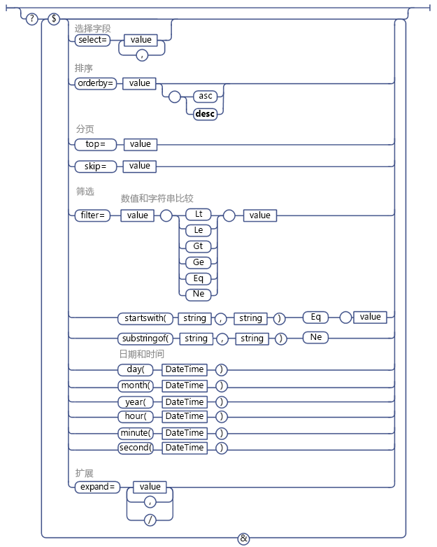

# 在 SharePoint REST 请求中使用 OData 查询操作
了解如何使用各种 OData 查询字符串操作符对您从 SharePoint REST 服务器请求的数据执行选择、筛选和排序。
 **准备工作**
  
    
    

-  [了解 SharePoint 2013 REST 服务](get-to-know-the-sharepoint-2013-rest-service.md)
    
  
-  [导航 REST 服务中展示的 SharePoint 数据结构](navigate-the-sharepoint-data-structure-represented-in-the-rest-service.md)
    
  
-  [确定 SharePoint REST 服务端点 URI](determine-sharepoint-rest-service-endpoint-uris.md)
    
  

SharePoint REST 服务支持多种 OData 查询字符串运算符，使用这些运算符，您可以选择、筛选及订购您请求的数据。
  
    
    

> [!提示]
> SharePoint Online（和本地 SharePoint 2016 及更高版本）REST 服务支持使用 OData  `$batch` 查询选项，将多个请求合并到对该服务的单个调用中。有关详细信息和代码示例的链接，请参阅 [使用 REST API 发出批处理请求](make-batch-requests-with-the-rest-apis.md)。 
  
    
    

## 选择要返回的字段

使用  [$select](http://www.odata.org/documentation/odata-version-2-0/uri-conventions#SelectSystemQueryOption) 查询选项指定针对给定列表、列表项或实体集表示的其他 SharePoint 对象返回的字段。您可以使用 `$select=*` 来返回所有可用字段。
  
    
    

> [!注释]
> 通常，如果您不指定  `$select` 查询选项，则 REST 服务默认返回所有可用字段。但是，在少数几种情况下，某些 SharePoint 对象包含检索资源极为密集的属性；为了优化 REST 服务性能，默认查询中并不包含这些属性，必须显式请求。> 例如，默认情况下不返回 **SPWeb.EffectiveBasePermissions** 属性，必须使用 `$select` 查询选项显式请求。
  
    
    

此外，您可以指定请求从其他列表返回预计字段和查询值。为此，请在  `$select` 和 `$expand` 查询选项中指定字段名称。例如：
  
    
    
 `http://server/site/_api/web/lists('guid')/items?$select=Title,Products/Name&amp;$expand=Products/Name`
  
    
    
不支持批量扩展和选择相关项。
  
    
    

## 选择要返回的项

使用  [$filter](http://www.odata.org/documentation/odata-version-2-0/uri-conventions#FilterSystemQueryOption) 查询选项选择要返回的项。 [SharePoint REST 服务支持的 OData 查询运算符](#bk_supported)列出了 SharePoint REST 服务支持的筛选查询比较选项和功能。
  
    
    

## 单个值循环字段查询

单个值循环字段由 SharePoint REST 服务中两个单独的字段表示：一个字段表示实际字段值，另一个表示字段名称。您可以像对该数据类型的任何其他字段一样对循环字段值执行查询。例如，如果查询字段值为字符串，则可以在查询中使用字符串比较选项。
  
    
    

## 用户查询

在 SharePoint REST 服务中，用户用用户的友好（显示）名称，而非其别名或域\\别名组合表示。因此，您必须阵对用户的友好名称构造用户查询。
  
    
    

> [!注释]
> 不支持基于成员类型的用户查询。 > 不支持使用 **Current** 运算符查询当前用户的 ID。
  
    
    

## 多值循环字段和用户查询

由于多值循环字段作为多值字符串返回，因此无法进行查询（例如，不支持 **Includes** 元素或 **NotIncludes** 元素的等效物）。
  
    
    

## 对返回的项进行排序

使用  [$orderby](http://www.odata.org/documentation/odata-version-2-0/uri-conventions#OrderBySystemQueryOption) 查询选项指定如何对查询返回集中的项进行排序。要对多个字段进行排序，请指定以逗号分隔的字段列表。您还可以通过将 **asc** 或 **desc** 关键字附加到查询指定是按升序还是降序对项进行排序。
  
    
    

## 翻阅返回的项

使用  [$top](http://www.odata.org/documentation/odata-version-2-0/uri-conventions#TopSystemQueryOption) 和 [$skiptoken](http://msdn.microsoft.com/library/dd942121.aspx) 查询选项选择查询以其他方式返回的项的子集。
  
    
    

> [!注释]
> $skip 查询选项不适用于对 SharePoint 列表项的查询。 
  
    
    

使用  `$top` 选项，您可以选择返回返回集的前 *n*  个项。例如，以下 URI 请求实际返回潜在返回集中的前 10 个项：
  
    
    
 `http://server/site/_api/web/lists('<guid>')/items$top=10`
  
    
    
使用 $skiptoken 选项，您可以跳过某些项，直至到达指定项，然后返回剩余的项。
  
    
    
 `$skiptoken=Paged=TRUE&amp;p_ID=5`
  
    
    

> [!注释]
> 使用这些查询选项时，请注意 OData 中的页码是按顺序排列的。例如，如果您使用下一页按钮来显示 SharePoint 列表项，则使用 REST 服务支持在单击按钮时返回第 1 至 20 项，然后是第 21 至 40 项等。但是，如果其他用户在您单击下一页按钮期间删除了第 4 和第 18 项，这种情况下，将重置剩余项的排序位置，并且显示第 21 至 40 项实际将跳过两个项。 
  
    
    

## SharePoint REST 服务支持的 OData 查询运算符

|**支持**|**不支持**|
|:-----|:-----|
|**数字比较**    Lt    Le    Gt    Ge    Eq    Ne   | 算术运算符          （Add、Sub、Mul、Div、Mod）     基本数学函数          （round、floor、ceiling）    |
|**字符串比较**    startsWith    substringof    Eq    Ne   | endsWith    replace    substring    tolower    toupper    trim    concat   |
|**日期和时间函数**    day()    month()    year()    hour()    minute()    second()   | DateTimeRangesOverlap 运算符    关于日期时间是否属于周期性日期时间模式的查询   |
   
下图显示支持的 OData 查询选项。
  
    
    

**支持的 OData 查询选项**

  
    
    

  
    
    

  
    
    

  
    
    

  
    
    

## 其他资源

-  [了解 SharePoint 2013 REST 服务](get-to-know-the-sharepoint-2013-rest-service.md)
    
  
-  [使用 SharePoint 2013 REST 终结点完成基本操作](complete-basic-operations-using-sharepoint-2013-rest-endpoints.md)
    
  
-  [使用 REST 处理列表和列表项](working-with-lists-and-list-items-with-rest.md)
    
  
-  [使用 REST 处理文件夹和文件](working-with-folders-and-files-with-rest.md)
    
  
-  [导航 REST 服务中展示的 SharePoint 数据结构](navigate-the-sharepoint-data-structure-represented-in-the-rest-service.md)
    
  
-  [确定 SharePoint REST 服务端点 URI](determine-sharepoint-rest-service-endpoint-uris.md)
    
  
-  [SharePoint 2013 REST API、终结点和示例](02128c70-9d27-4388-9374-a11bce68fdb8.md)
    
  

  
    
    
