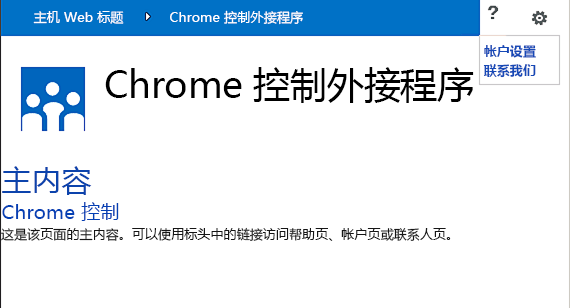
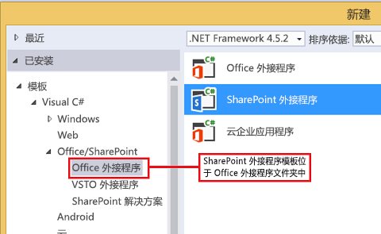
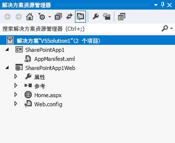
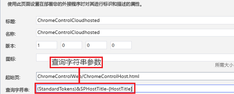
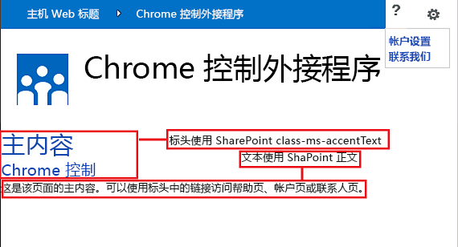

# 在 SharePoint 外接程序中使用客户端部件版式控制
了解如何在 SharePoint 2013 的外接程序中使用部件版式控制。
利用 SharePoint 2013 的部件版式控制，您无需注册服务器库或使用特定技术或工具即可在外接程序中使用特定 SharePoint 网站的标题样式。若要使用此功能，您必须通过标准 <script> 标记注册 SharePoint JavaScript 库。您可使用 HTML **div** 元素提供占位符并使用可用选项进一步自定义控件。该控件继承指定的 SharePoint 网站的外观。


## 使用本文中的示例的先决条件
<a name="SP15Usechromecontrol_Prereq"> </a>

若要按照此示例中的步骤操作，您需要以下内容：


- Visual Studio 2015


- SharePoint 2013 开发环境（本地方案需要外接程序隔离）


有关如何设置符合您需求的开发环境的指南，请参阅 [开始构建 Office 和 SharePoint 相关应用程序](http://msdn.microsoft.com/library/187f8c8c-1b15-471c-80b5-69a40e67deea%28Office.15%29.aspx)。


### 使用部件版式控件前要了解的核心概念

下表列出了可帮助您了解使用部件版式控件的方案中涉及的概念的有用文章。


**表 1. 使用部件版式控件的核心概念**


|**文章标题**|**说明**|
|:-----|:-----|
| [SharePoint 外接程序](sharepoint-add-ins.md) <br/> |了解 SharePoint 2013 中新的外接程序模型，您可以利用此模型来创建外接程序，这些外接程序对最终用户来说是易于使用的小型解决方案。  <br/> |
| [SharePoint 外接程序的 UX 设计](ux-design-for-sharepoint-add-ins.md) <br/> |了解在生成 SharePoint 外接程序时可使用的用户体验 (UX) 选项和替代项。  <br/> |
| [SharePoint 2013 中的主机 Web、外接程序 Web 和 SharePoint 组件](host-webs-add-in-webs-and-sharepoint-components-in-sharepoint-2013.md) <br/> |了解主机 Web 和外接程序 Web 之间的区别。了解 SharePoint 外接程序中可以包括哪些 SharePoint 2013 组件、将哪些组件部署到主机 Web、将哪些组件部署到外接程序 Web 以及如何在独立的域中部署外接程序 Web。  <br/> |
 

## 代码示例：在云托管的外接程序中使用部件版式控制
<a name="SP15Usechromecontrol_Codeexample"> </a>

云托管的外接程序至少包含一个远程组件。有关详细信息，请参阅  [为开发和托管 SharePoint 外接程序选择模式](choose-patterns-for-developing-and-hosting-your-sharepoint-add-in.md)。若要在云托管的外接程序中使用部件版式控制，请执行下列步骤：


1. 创建 SharePoint 外接程序和远程 Web 项目。


2. 在查询字符串中发送默认配置选项。


3. 向 Web 项目添加网页。


图 1 显示的是包含部件版式控件的远程网页。


**图 1. 包含部件版式控件的远程网页**





### 创建 SharePoint 外接程序和远程 Web 项目


1. 以管理员身份打开 Visual Studio 2015。（若要执行此操作，请右键单击"开始"菜单上的"Visual Studio 2015"图标，并选择"以管理员身份运行"。）


2. 使用"SharePoint 外接程序"模板创建新的项目。

    图 2 显示了 Visual Studio 2015 中"SharePoint 外接程序"模板的位置，具体位于"模板"、"Visual C#"、"Office/SharePoint"、"Office 外接程序"下。


   **图 2. SharePoint 外接程序 Visual Studio 模板**





3. 提供您要用于调试的 SharePoint 网站的 URL。


4. 选择"提供商托管"作为您的外接程序的托管选项。有关 SharePoint 托管的代码示例，请参阅  [SharePoint-Add-in-JSOM-BasicDataOperations](https://github.com/OfficeDev/SharePoint-Add-in-JSOM-BasicDataOperations)。

    在向导完成后，您应具有与图 3 类似的"解决方案资源管理器"中的结构。


   **图 3. 解决方案资源管理器中的针对 SharePoint 的外接程序项目**





### 在查询字符串中发送默认配置选项


1. 在清单编辑器中打开 Appmanifest.xml 文件。


2. 向查询字符串添加 **{StandardTokens}** 标记和额外的 _SPHostTitle_ 参数。图 4 显示的是包含已配置查询字符串参数的清单编辑器。

   **图 4. 包含部件版式控件的查询字符串参数的清单编辑器**





   部件版式控件将自动采用查询字符串中的下列值：

  - **SPHostUrl**


  - **SPHostTitle**


  - **SPAppWebUrl**


  - **SPLanguage**


    **{StandardTokens}** 包括 **SPHostUrl** 和 **SPAppWebUrl**。


### 在 Web 项目中添加使用部件版式控件的页


1. 右键单击 Web 项目，并添加新 Web 表单。


2. 复制以下标记，然后将其粘贴到 ASPX 页中。该标记将执行以下任务：

  - 从 Microsoft CDN（内容交付网络）加载 AJAX 库。


  - 从 Microsoft CDN 加载 jQuery 库。


  - 使用 jQuery 函数 **getScript** 加载 SP.UI.Controls.js 文件。


  - 定义 **onCssLoaded** 事件的回调函数。


  - 为部件版式控件准备选项。


  - 初始化部件版式控件。


  ```HTML

<!DOCTYPE html>
<html xmlns="http://www.w3.org/1999/xhtml">
<head>
    <title>Chrome control host page</title>
    <script 
        src="//ajax.aspnetcdn.com/ajax/4.0/1/MicrosoftAjax.js" 
        type="text/javascript">
    </script>
    <script 
        type="text/javascript" 
        src="//ajax.aspnetcdn.com/ajax/jQuery/jquery-1.7.2.min.js">
    </script>  
    <script 
        type="text/javascript"
        src="ChromeLoader.js">
    </script>
<script type="text/javascript">
"use strict";

var hostweburl;

//load the SharePoint resources
$(document).ready(function () {
    //Get the URI decoded URL.
    hostweburl =
        decodeURIComponent(
            getQueryStringParameter("SPHostUrl")
    );

    // The SharePoint js files URL are in the form:
    // web_url/_layouts/15/resource
    var scriptbase = hostweburl + "/_layouts/15/";

    // Load the js file and continue to the 
    //   success handler
    $.getScript(scriptbase + "SP.UI.Controls.js", renderChrome)
});

// Callback for the onCssLoaded event defined
//  in the options object of the chrome control
function chromeLoaded() {
    // When the page has loaded the required
    //  resources for the chrome control,
    //  display the page body.
    $("body").show();
}

//Function to prepare the options and render the control
function renderChrome() {
    // The Help, Account and Contact pages receive the 
    //   same query string parameters as the main page
    var options = {
        "appIconUrl": "siteicon.png",
        "appTitle": "Chrome control add-in",
        "appHelpPageUrl": "Help.html?"
            + document.URL.split("?")[1],
        // The onCssLoaded event allows you to 
        //  specify a callback to execute when the
        //  chrome resources have been loaded.
        "onCssLoaded": "chromeLoaded()",
        "settingsLinks": [
            {
                "linkUrl": "Account.html?"
                    + document.URL.split("?")[1],
                "displayName": "Account settings"
            },
            {
                "linkUrl": "Contact.html?"
                    + document.URL.split("?")[1],
                "displayName": "Contact us"
            }
        ]
    };

    var nav = new SP.UI.Controls.Navigation(
                            "chrome_ctrl_placeholder",
                            options
                        );
    nav.setVisible(true);
}

// Function to retrieve a query string value.
// For production purposes you may want to use
//  a library to handle the query string.
function getQueryStringParameter(paramToRetrieve) {
    var params =
        document.URL.split("?")[1].split("&amp;");
    var strParams = "";
    for (var i = 0; i < params.length; i = i + 1) {
        var singleParam = params[i].split("=");
        if (singleParam[0] == paramToRetrieve)
            return singleParam[1];
    }
}
</script>
</head>

<!-- The body is initally hidden. 
     The onCssLoaded callback allows you to 
     display the content after the required
     resources for the chrome control have
     been loaded.  -->
<body style="display: none">

    <!-- Chrome control placeholder -->
    <div id="chrome_ctrl_placeholder"></div>

    <!-- The chrome control also makes the SharePoint
          Website stylesheet available to your page -->
    <h1 class="ms-accentText">Main content</h1>
    <h2 class="ms-accentText">The chrome control</h2>
    <div id="MainContent">
        This is the page's main content. 
        You can use the links in the header to go to the help, 
        account or contact pages.
    </div>
</body>
</html>
  ```

3. 您还可通过声明性方式使用部件版式控件。在以下代码示例中，HTML 标记无需使用 JavaScript 代码配置和初始化该控件也可声明该控件。以下标记执行下列任务：

  - 为 SP.UI.Controls.js JavaScript 文件提供一个占位符。


  - 动态加载 SP.UI.Controls.js 文件


  - 提供用于部件版式控制的占位符并指定内联 HTML 标记的选项。


  ```HTML

<!DOCTYPE html>
<html xmlns="http://www.w3.org/1999/xhtml">
<head>
    <title>Chrome control host page</title>
    <script 
        src="http://ajax.aspnetcdn.com/ajax/4.0/1/MicrosoftAjax.js" 
        type="text/javascript">
    </script>
    <script 
        type="text/javascript" 
        src="http://ajax.aspnetcdn.com/ajax/jQuery/jquery-1.7.2.min.js">
    </script>  
    <script type="text/javascript">
    var hostweburl;

    // Load the SharePoint resources.
    $(document).ready(function () {

        // Get the URI decoded add-in web URL.
        hostweburl =
            decodeURIComponent(
                getQueryStringParameter("SPHostUrl")
        );

        // The SharePoint js files URL are in the form:
        // web_url/_layouts/15/resource.js
        var scriptbase = hostweburl + "/_layouts/15/";

        // Load the js file and continue to the 
        // success handler.
        $.getScript(scriptbase + "SP.UI.Controls.js")
    });

    // Function to retrieve a query string value.
    // For production purposes you may want to use
    // a library to handle the query string.
    function getQueryStringParameter(paramToRetrieve) {
        var params =
            document.URL.split("?")[1].split("&amp;");
        var strParams = "";
        for (var i = 0; i < params.length; i = i + 1) {
            var singleParam = params[i].split("=");
            if (singleParam[0] == paramToRetrieve)
                return singleParam[1];
        }
    }
    </script>
</head>
<body>

    <!-- Chrome control placeholder 
           Options are declared inline.  -->
    <div 
        id="chrome_ctrl_container"
        data-ms-control="SP.UI.Controls.Navigation"
        data-ms-options=
            '{
                "appHelpPageUrl" : "Help.html",
                "appIconUrl" : "siteIcon.png",
                "appTitle" : "Chrome control add-in",
                "settingsLinks" : [
                    {
                        "linkUrl" : "Account.html",
                        "displayName" : "Account settings"
                    },
                    {
                        "linkUrl" : "Contact.html",
                        "displayName" : "Contact us"
                    }
                ]
             }'>
    </div>

    <!-- The chrome control also makes the SharePoint
          Website style sheet available to your page. -->
    <h1 class="ms-accentText">Main content</h1>
    <h2 class="ms-accentText">The chrome control</h2>
    <div id="MainContent">
        This is the page's main content. 
        You can use the links in the header to go to the help, 
        account or contact pages.
    </div>
</body>
</html>
  ```


    SP.UI.Controls.js 库将自动呈现该控件，前提是它在 **div** 元素中发现 **data-ms-control="SP.UI.Controls.Navigation"** 属性。


### 编辑外接程序清单中的 StartPage 元素


1. 在"解决方案资源管理器"中，双击"AppManifest.xml"文件。


2. 在"起始页"下拉菜单上，选择使用部件版式控件的网页。


### 生成并运行解决方案


1. 确保将 SharePoint 外接程序项目设置为启动项目。


2. 按 F5 键。

    > **注释**
      > 按 F5 时，Visual Studio 将生成解决方案、部署外接程序并打开外接程序的权限页。 
3. 选择"信任"按钮。


4. 单击"ChromeControlCloudhosted"外接程序图标。


5. 在网页中使用部件版式控制时，还可使用 SharePoint 网站样式表，如图 4 中所示。

   **图 5. 网页中使用的 SharePoint 网站样式表**





**表 2. 解决方案故障排除**


|**问题**|**解决方案**|
|:-----|:-----|
|未经处理的异常"未定义 SP"。  <br/> |确保您的浏览器可以加载 SP.UI.Controls.js 文件。  <br/> |
|部件版式控件没有正确呈现。  <br/> |部件版式控件只支持文档模式 Internet Explorer 8 及更高版本。确保以文档模式 Internet Explorer 8 或更高版本的浏览器呈现您的页面。  <br/> |
|证书错误。  <br/> |将您的 Web 项目的 **SSL Enabled** 属性设置为 false。在 SharePoint 外接程序项目中，将 **Web Project** 属性设置为无，然后将该属性设置回您的 Web 项目的名称。  <br/> |
 

## 后续步骤
<a name="SP15Usechromecontrol_Nextsteps"> </a>

本文介绍如何在 SharePoint 外接程序中使用部件版式控制。下一步，您可了解有关其他可供 SharePoint 外接程序使用的 UX 组件的信息。若要了解更多信息，请参阅以下内容：


-  [代码示例：在云托管的外接程序中使用部件版式控制](http://code.msdn.microsoft.com/SharePoint-2013-Work-with-089ecc6f)


-  [代码示例：使用部件版式控制和跨域库 (CSOM)](http://code.msdn.microsoft.com/SharePoint-2013-Use-the-97c30a2e)


-  [代码示例：使用部件版式控制和跨域库 (REST)](http://code.msdn.microsoft.com/SharePoint-2013-Use-the-a759e9f8)


-  [在 SharePoint 外接程序中使用 SharePoint 网站的样式表](use-a-sharepoint-website-s-style-sheet-in-sharepoint-add-ins.md)


-  [创建自定义操作以部署 SharePoint 外接程序](create-custom-actions-to-deploy-with-sharepoint-add-ins.md)


-  [创建外接程序部件以安装 SharePoint 外接程序](create-add-in-parts-to-install-with-your-sharepoint-add-in.md)


## 其他资源
<a name="SP15Usechromecontrol_Addresources"> </a>


-  [设置 SharePoint 加载项的本地开发环境](set-up-an-on-premises-development-environment-for-sharepoint-add-ins.md)


-  [SharePoint 外接程序的 UX 设计](ux-design-for-sharepoint-add-ins.md)


-  [SharePoint 外接程序 UX 设计准则](sharepoint-add-ins-ux-design-guidelines.md)


-  [在 SharePoint 2013 中创建 UX 组件](create-ux-components-in-sharepoint-2013.md)


-  [考虑 SharePoint 外接程序设计选项的三种方法](three-ways-to-think-about-design-options-for-sharepoint-add-ins.md)


-  [SharePoint 外接程序体系结构的重要方面和开发前景](important-aspects-of-the-sharepoint-add-in-architecture-and-development-landscap.md)


