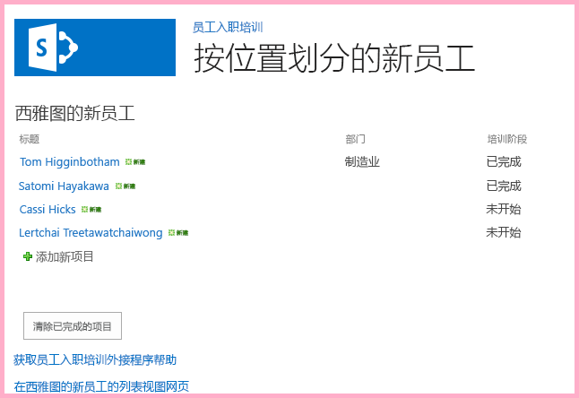
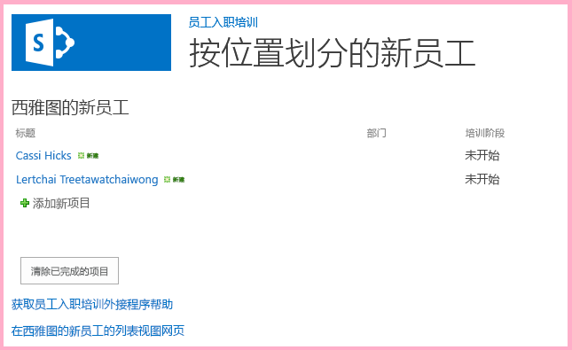

# 使用 SharePoint JavaScript API 处理 SharePoint 数据
使用 SharePoint JavaScript 对象模型处理来自外接程序 Web 中页面上的 JavaScript 的 SharePoint 数据。
这是关于开发 SharePoint 托管的 SharePoint 外接程序的基础知识系列文章中的第 10 篇文章。您应该首先熟悉  [SharePoint 外接程序](sharepoint-add-ins.md)以及本系列中之前的文章：


-  [开始创建 SharePoint 承载的 SharePoint 外接程序](get-started-creating-sharepoint-hosted-sharepoint-add-ins.md)


-  [部署和安装 SharePoint 托管的 SharePoint 外接程序](deploy-and-install-a-sharepoint-hosted-sharepoint-add-in.md)


-  [向 SharePoint 托管的 SharePoint 外接程序添加自定义列](add-custom-columns-to-a-sharepoint-hostedsharepoint-add-in.md)


-  [向 SharePoint 托管的 SharePoint 外接程序添加自定义内容类型](add-a-custom-content-type-to-a-sharepoint-hostedsharepoint-add-in.md)


-  [向 SharePoint 托管的 SharePoint 外接程序中的页面添加 Web 部件](add-a-web-part-to-a-page-in-a-sharepoint-hosted-sharepoint-add-in.md)


-  [向 SharePoint 托管的 SharePoint 外接程序添加工作流](add-a-workflow-to-a-sharepoint-hosted-sharepoint-add-in.md)


-  [向 SharePoint 托管的 SharePoint 外接程序添加自定义页面和样式](add-a-custom-page-and-style-to-a-sharepoint-hosted-sharepoint-add-in.md)


-  [向 SharePoint 托管的 SharePoint 外接程序添加自定义客户端呈现](add-custom-client-side-rendering-to-a-sharepoint-hosted-sharepoint-add-in.md)


-  [在 SharePoint 外接程序的主机 Web 中创建自定义功能区按钮](create-a-custom-ribbon-button-in-the-host-web-of-a-sharepoint-add-in.md)


> **注释**
> 如果您阅读过关于 SharePoint 托管的外接程序的系列文章，那么您应该具有 Visual Studio 解决方案，可以继续阅读本主题。您还可以从  [SharePoint_SP-hosted_Add-Ins_Tutorials](https://github.com/OfficeDev/SharePoint_SP-hosted_Add-Ins_Tutorials) 下载存储库并打开 BeforeJSOM.sln 文件。


尽管 SharePoint 托管的 SharePoint 外接程序 不能具有服务器端代码，您仍然可以通过 JavaScript 和 SharePoint JavaScript 客户端对象模型库，与 SharePoint 托管的 SharePoint 外接程序 中的 SharePoint 组件进行业务逻辑和运行时交互。（我们将其称为 JSOM。请注意结尾是"M"。不要跟 JSO **N** [JavaScript 对象表示法] 混淆。）在本文中，您可使用 JavaScript 对象模型从"西雅图新员工"列表中查找和删除旧项目。
## 创建 JavaScript 以及调用它的按钮


1. 确认是否已完成本系列中第一个教程介绍的下列步骤： 

    从项目的根目录打开文件 **/Pages/Default.aspx** 。其中，这一生成的文件加载 SharePoint 上托管的一个或两个脚本：sp.runtime.js 和 sp.js。加载这些文件的标记位于文件顶部附近的 **Content** 控件（ID 为 **PlaceHolderAdditionalPageHead**）中。此标记因要使用的 **Visual Studio Microsoft Office 开发人员工具** 版本而异。这一系列教程要求使用普通的 HTML **<script>** 标记（而非 **<SharePoint:ScriptLink>** 标记）同时加载这两个文件。请确保 **PlaceHolderAdditionalPageHead** 控件中 `<meta name="WebPartPageExpansion" content="full" />` 行的 *正上方*  有下面这行代码：


  ```

<script type="text/javascript" src="/_layouts/15/sp.runtime.js"></script>
<script type="text/javascript" src="/_layouts/15/sp.js"></script> 

  ```


    然后，在文件中搜索其他任何也会加载这一个或两个文件的标记，并删除多余的标记。保存并关闭文件。


2. 在"解决方案资源管理器"的"脚本"节点中，可能已有一个 Add-in.js 文件。如果不存在，但有 App.js，请右键单击 App.js 并将其重命名为 Add-in.js。如果 Add-in.js 和 App.js 都不存在，请执行下列步骤创建一个：

1. 右键单击"脚本"节点并选择"添加">"新项目">"Web"。


2. 选择"JavaScript 文件"并将其命名为 Add-in.js。


3. 打开 Add-in.js 并删除其中的内容（如果有）。


4. 向文件中添加以下行。对于此代码，请注意以下事项：

  -  `'use strict';` 行可确保浏览器中的 JavaScript 运行时在您无意中在 JavaScript 中采取了一些错误做法时将引发异常。


  -  `clientContext` 变量可保存引用 SharePoint 网站的 **SP.ClientContext** 对象。所有 JSOM 代码一开始将会创建或引用此类对象。


  -  `employeeList` 变量可保存对列表实例"西雅图新员工"的引用。


  -  `completedItems` 变量可保存列表中将被脚本删除的项目，即其"OrientationStage"字段设置为"已完成"的项目。


  ```

'use strict';

var clientContext = SP.ClientContext.get_current(); 
var employeeList = clientContext.get_web().get_lists().getByTitle('New Employees In Seattle'); 
var completedItems; 
  ```

5. 为了最大程度地减少客户端浏览器和 SharePoint 服务器之间的消息，JSOM 使用了批处理系统。实际上只有一个函数 **SP.ClientContext.executeQueryAsync** 向服务器发送消息（并接收回复）。下次调用 **executeQueryAsync** 时，在 **executeQueryAsync** 调用之间发生的 JSOM API 调用将绑定在一起并分批发送到服务器。但是，通常无法调用 JSOM 对象的方法，除非对象在前一次调用 **executeQueryAsync** 时已被带到客户端。您的脚本将会调用列表上每个已完成项目的 **SP.ListItem.deleteObject** 方法，因此它必须调用 **executeQueryAsync** 两次，第一次是为了获取已完成列表项的集合，第二次是为了将 **deleteObject** 调用分批并将其发送到服务器执行。

    因此，首先请创建一个方法以从服务器获取列表项。将以下代码添加到文件中。


  ```

function purgeCompletedItems() {

   var camlQuery = new SP.CamlQuery(); 
   camlQuery.set_viewXml( 
         '<View><Query><Where><Eq>' + 
           '<FieldRef Name=\\'OrientationStage\\'/><Value Type=\\'Choice\\'>Completed</Value>' + 
         '</Eq></Where></Query></View>'); 
     completedItems = employeeList.getItems(camlQuery); 
}
  ```

6. 当这些行被发送到服务器并在其中执行时，它们将创建列表项集合，但脚本必须将该集合带到客户端。这可通过调用 **SP.ClientContext.load** 函数完成，因此请将以下行添加到该方法的结尾。

  ```

clientContext.load(completedItems);
  ```

7. 添加对 **executeQueryAsync** 的调用。此方法具有两个参数，两者均为回调函数。第一个在服务器成功执行批次中的所有命令时运行。第二个在服务器失败（不论什么原因）时运行。您可在后续步骤中创建这两个函数。将以下行添加到该方法的结尾。

  ```
  clientContext.executeQueryAsync(deleteCompletedItems, onGetCompletedItemsFail);
  ```

8. 最后，将以下行添加到该方法的结尾。通过将 **false** 返回到将调用函数的 ASP.NET 按钮，我们可以取消 ASP.NET 按钮的默认行为，即重新加载页面。重新加载页面会导致重新加载 Add-in.js 文件，这反过来会重新初始化 `clientContext` 对象。如果重新加载在 **executeQueryAsync** 发送请求和 SharePoint 服务器发回响应之间完成，原始 `clientContext` 对象将不再存在来处理响应。函数将暂停，不会执行成功或失败回调。（具体的行为根据浏览器可能有所不同。）

  ```
  return false;
  ```

9. 将以下函数  `deleteCompletedItems` 添加到文件中。该函数会在 `purgeCompletedItems` 函数成功时运行。对于此代码，请注意以下事项：

  - **SP.ListItem.get_id** 方法返回列表项的 ID。数组中的每个项目都是 **SP.ListItem** 对象。


  - **SP.List.getItemById** 方法返回具有指定 ID 的 **SP.ListItem** 对象。


  - 调用 **executeQueryAsync** 时， **SP.ListItem.deleteObject** 方法将标记服务器上要删除的列表项。


  - 必须将列表项从发送至服务器的集合复制到数组中，然后才能将其删除。如果脚本直接在 **while** 循环中调用每个项目的 **deleteObject** 方法，JavaScript 将抛出错误，解释进行枚举时更改的集合的长度。此错误消息字面上并不正确，因为项目并未真的从任何内容中删除，除非 **deleteObject** 调用被绑定并发送到服务器。但 JSOM 设计为模仿服务器上的异常抛出（在枚举集合时代码不应更改集合大小）。但是，阵列具有固定大小，因此对数组中的某个项目调用 **deleteObject** 会将项目从列表中删除，但不会更改数组的大小。


  ```
  function deleteCompletedItems() {

    var itemArray = new Array();
    var listItemEnumerator = completedItems.getEnumerator();

    while (listItemEnumerator.moveNext()) {
        var item = listItemEnumerator.get_current();
        itemArray.push(item);
    }

    var i;
    for (i = 0; i < itemArray.length; i++) {
        employeeList.getItemById(itemArray[i].get_id()).deleteObject();
    }

    clientContext.executeQueryAsync(onDeleteCompletedItemsSuccess, onDeleteCompletedItemsFail);
}
  ```

10. 将以下函数  `onDeleteCompletedItemsSuccess` 添加到文件中。该函数在已完成项目成功删除（或者列表中没有任何已完成项目）时运行。第二行 `location.reload(true);` 会导致从服务器重新加载页面。这很方便，因为页面上的列表视图 Web 部件仍会显示已完成项目，直至页面刷新。Add-in.js 文件也会重新加载，但不会产生问题，因为它不会中断正在运行的 JavaScript 函数。

  ```

function onDeleteCompletedItemsSuccess() {
    alert('Completed orientations have been deleted.');
    location.reload(true);
}
  ```

11. 将以下两个失败时回调函数添加到文件中。

  ```

// Failure callbacks

function onGetCompletedItemsFail(sender, args) {
    alert('Unable to get completed items. Error:' + args.get_message() + '\\n' + args.get_stackTrace());
}

function onDeleteCompletedItemsFail(sender, args) {
    alert('Unable to delete completed items. Error:' + args.get_message() + '\\n' + args.get_stackTrace());
}
  ```

12. 打开 default.aspx 文件并查找 ID 为 **PlaceHolderMain** 的 **asp:Content** 元素。


13. 在 **WebPartPages:WebPartZone** 元素和两个 **asp:Hyperlink** 元素中的第一个元素之间添加以下标记。请注意， **OnClientClick** 处理程序的值为 `return purgeCompletedItems()`，而不仅是  `purgeCompletedItems()`。函数返回的  `false` 会告知 ASP.NET 不要重新加载页面。

  ```HTML

<p><asp:Button runat="server" OnClientClick="return purgeCompletedItems()"
  ID="purgecompleteditemsbutton" Text="Purge Completed Items" /></p>
  ```

14. 在 Visual Studio 中重新生成项目。


15. 为了在测试外接程序时尽量避免必须将列表项的"定向阶段"手动设置为 Completed ，请打开列表实例 **NewEmployeesInSeattle** 的 elements.xml 文件（不是列表模板 **NewEmployeeOrientation** 的 elements.xml），并添加标记 `<Field Name="OrientationStage">Completed</Field>` 作为一个或多个 **Row** 元素的最后一个子项。

    下面举例说明了 **Rows** 元素应该是什么样的。


  ```

<Rows>
  <Row>
    <Field Name="Title">Tom Higginbotham</Field>
    <Field Name="Division">Manufacturing</Field>
    <Field Name="OrientationStage">Completed</Field>
  </Row>
  <Row>
    <Field Name="Title">Satomi Hayakawa</Field>
    <Field Name="OrientationStage">Completed</Field>
  </Row>
  <Row>
    <Field Name="Title">Cassi Hicks</Field>
  </Row>
  <Row>
    <Field Name="Title">Lertchai Treetawatchaiwong</Field>
  </Row>
</Rows>
  ```


## 运行并测试外接程序


1. 在调试时 Visual Studio 使用的浏览器上启用弹出窗口。


2. 使用 F5 键部署并运行您的外接程序。Visual Studio 在测试 SharePoint 网站上临时安装此外接程序并立即运行。


3. 将打开外接程序的主页，列表中有一个或多个项目的"定向阶段"为"已完成"。

   **清除已完成项目之前的列表**





4. 外接程序的起始页完全加载后，选择"清除已完成项目"按钮。如果操作成功（未收到任何失败消息），表示所有"已完成"项目都已删除，您将看到一个显示"已完成定向已删除"的弹出消息框。


5. 关闭弹出窗口，页面将重新加载，"已完成"项目不再位于列表视图 Web 部件中。

   **清除已完成项目之后的列表**





6. 要结束调试会话，请关闭浏览器窗口或在 Visual Studio 中停止调试。每次按 F5 时，Visual Studio 将撤回外接程序的之前版本并安装最新版本。


7. 您将在其他文章中使用此外接程序和 Visual Studio 解决方案，因此最好是当您使用一段时间后，最后一次撤回外接程序。在"解决方案资源管理器"中右键单击此项目，然后选择"撤回"。


## 
<a name="Nextsteps"> </a>

在本系列的下一篇文章中，您可将 JavaScript 添加到主机 Web 上使用 SharePoint 数据的外接程序 Web 的页面上： [在外接程序 Web 中使用 JavaScript 中的主机 Web 数据](work-with-host-web-data-from-javascript-in-the-add-in-web.md)。


