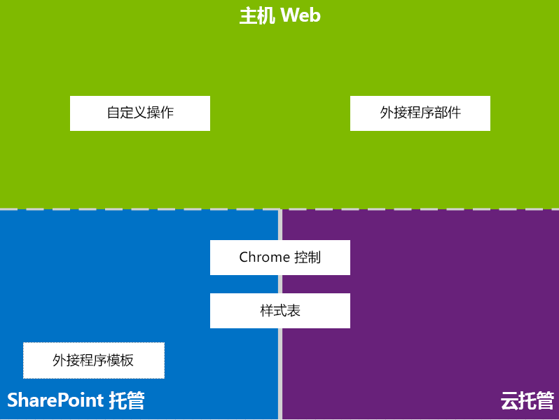
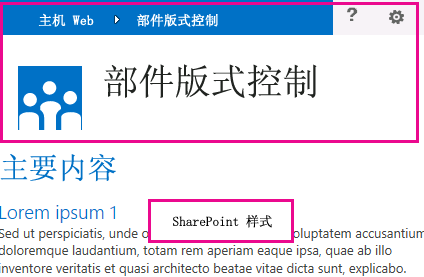
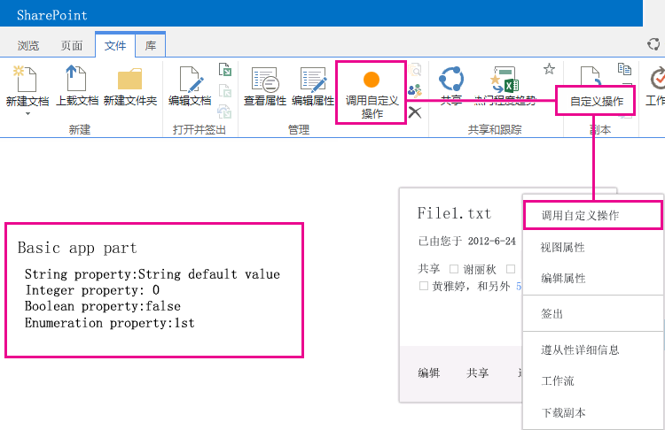

# SharePoint 外接程序的 UX 设计
了解您在 SharePoint 2013 中生成外接程序时具有的用户体验 (UX) 选项。
作为开发人员，您应该在创建外接程序时始终高度重视用户体验 (UX)。SharePoint 外接程序的模型提供了许多 UX 组件和机制，可帮助您营造出色的用户体验。外接程序模型中的用户体验也足够灵活，让您可以使用最能满足最终用户需求的技术和平台。
  
    
    

## SharePoint 2013 中的外接程序 UX 高级概述

作为外接程序开发人员，您必须知道您的外接程序的体系结构。在确定您的外接程序在远程和 SharePoint 平台中的分发方式后，您可以从可用的外接程序 UX 构建备选方案中做出选择。您可能会问自己以下问题：
  
    
    

- 如果创建云托管外接程序，我可以使用什么？
    
  
- 如果创建 SharePoint 托管的外接程序，我可以使用什么？有关详细信息，请参阅  [为开发和托管 SharePoint 外接程序选择模式](choose-patterns-for-developing-and-hosting-your-sharepoint-add-in.md)。
    
  
- 如何将我的 UX 连接到主机 Web？有关详细信息，请参阅 [SharePoint 2013 中的主机 Web、外接程序 Web 和 SharePoint 组件](host-webs-add-in-webs-and-sharepoint-components-in-sharepoint-2013.md)。
    
  
下图显示了设计外接程序 UX 时要考虑的主要方案和选项。
  
    
    

**图 1. 外接程序 UX 主要方案和选项**

  
    
    

  
    
    

  
    
    
在选择您的设计时，您应该从根本上考虑在 SharePoint 中托管您的外接程序的哪些部分，以及不托管哪些部分。您还应考虑您的外接程序与主机 Web 的交互方式。
  
    
    

## 云托管外接程序中的外接程序 UX 方案

假设您确定在 SharePoint 中不托管您的部分用户体验。在这些方案中，预计您的最终用户会在 SharePoint 网站和云托管外接程序之间来回移动。您可以使用平台中的技术和工具，但 SharePoint 还提供了资源以帮助您设计更出色的用户体验。
  
    
    
以下 UX 资源可用于 SharePoint 2013 中的云托管外接程序：
  
    
    

- **部件版式控件：**部件版式控件使您能够在您的外接程序中使用特定 SharePoint 网站的导航标头而无需注册服务器库或使用特定的技术或工具。若要使用此功能，您必须通过标准的 <script> 标记注册一个 SharePoint JavaScript 库。您可以通过使用 HTML **div** 元素提供一个占位符，并通过使用可用的选项进一步自定义该控件。该控件将从指定的 SharePoint 网站继承其外观。有关详细信息，请参阅 [在 SharePoint 外接程序中使用客户端部件版式控制](use-the-client-chrome-control-in-sharepoint-add-ins.md)。
    
   **观看视频：SharePoint 2013 部件版式控件**

  

  
    
    

  
    
    

  
    
    

  
    
    
- **样式表：** 您可以在您的 SharePoint 外接程序中引用 SharePoint 网站的样式表，并使用该样式表和可用的类来设置您的网页的样式。此外，如果最终用户更改 SharePoint 网站的主题，您的外接程序可采用新的样式集而无需修改外接程序中的引用。有关详细信息，请参阅 [在 SharePoint 外接程序中使用 SharePoint 网站的样式表](use-a-sharepoint-website-s-style-sheet-in-sharepoint-add-ins.md)。
    
  
图 2 显示了云托管外接程序的 SharePoint 外接程序的模型中的资源。
  
    
    

**图 2. 云托管外接程序的外接程序 UX 资源**

  
    
    

  
    
    

  
    
    

  
    
    

  
    
    

## SharePoint 托管的外接程序中的外接程序 UX 方案

如果在 SharePoint 中托管您的外接程序，则当用户在主机 Web 和外接程序 Web 之间来回移动时，用户体验不太可能有很大改变。部署外接程序时，外接程序 Web 从主机 Web 提取样式表和主题。您仍可以在 SharePoint 托管的外接程序中使用部件版式控件与样式表，但与云托管方案最显著的差别是外接程序模板的可用性。
  
    
    
下面的 UX 资源可用于 SharePoint 托管的外接程序：
  
    
    

- **外接程序模板：** 外接程序模板包含 **app.master** 母版页。这是创建外接程序 Web 时的默认选项。
    
  
SharePoint 托管的外接程序还会受益于 SharePoint 中的现有资源和技术，如功能区、Web 部件基础结构和客户端呈现。
  
    
    

## 将外接程序 UX 连接到主机 Web 的方案

外接程序的部分用例可以从主机 Web 内触发。SharePoint 提供了从文档库或列表中打开外接程序的方法，以及在 SharePoint 托管的网页内显示部分外接程序 UX 的方法。
  
    
    
以下 UX 资源可用于将外接程序 UX 连接到主机 Web：
  
    
    

- **自定义操作** ：您可以使用自定义操作连接主机 Web UX 和您的外接程序。有两种类型的自定义操作：功能区或 ECB。自定义操作可以向远程网页发送参数，如调用它的列表或项目。有关详细信息，请参阅 [创建自定义操作以部署 SharePoint 外接程序](create-custom-actions-to-deploy-with-sharepoint-add-ins.md)。
    
  
- **外接程序部件：** 您可以通过使用外接程序部件在主机 Web 中包括您的部分外接程序用户体验。在您部署外接程序时，主机 Web 中的 Web 部件库中提供了外接程序部件。用户可以通过使用 **Web 部件添加器** 控件向网页添加外接程序部件。有关详细信息，请参阅 [创建外接程序部件以安装 SharePoint 外接程序](create-add-in-parts-to-install-with-your-sharepoint-add-in.md)。
    
  
图 3 显示了 SharePoint 外接程序的模型中用于将外接程序 UX 连接到主机 Web 的资源。
  
    
    

**图 3. 主机 Web 的外接程序 UX 资源**

  
    
    

  
    
    

  
    
    

  
    
    

  
    
    

## 其他资源

若要了解如何使用 SharePoint 外接程序中的外接程序 UX 选项，请参阅下列资源：
  
    
    

-  [设计 SharePoint 外接程序](design-sharepoint-add-ins.md)
    
  
-  [SharePoint 外接程序](sharepoint-add-ins.md)
    
  
-  [考虑 SharePoint 外接程序设计选项的三种方法](three-ways-to-think-about-design-options-for-sharepoint-add-ins.md)
    
  
-  [SharePoint 外接程序体系结构的重要方面和开发前景](important-aspects-of-the-sharepoint-add-in-architecture-and-development-landscap.md)
    
  
-  [SharePoint 2013 中的主机 Web、外接程序 Web 和 SharePoint 组件](host-webs-add-in-webs-and-sharepoint-components-in-sharepoint-2013.md)
    
  
-  [SharePoint 外接程序 UX 设计准则](sharepoint-add-ins-ux-design-guidelines.md)
    
  
-  [在 SharePoint 2013 中创建 UX 组件](create-ux-components-in-sharepoint-2013.md)
    
  
-  [在 SharePoint 外接程序中使用 SharePoint 网站的样式表](use-a-sharepoint-website-s-style-sheet-in-sharepoint-add-ins.md)
    
  
-  [在 SharePoint 外接程序中使用客户端部件版式控制](use-the-client-chrome-control-in-sharepoint-add-ins.md)
    
  
-  [创建外接程序部件以安装 SharePoint 外接程序](create-add-in-parts-to-install-with-your-sharepoint-add-in.md)
    
  
-  [创建自定义操作以部署 SharePoint 外接程序](create-custom-actions-to-deploy-with-sharepoint-add-ins.md)
    
  

