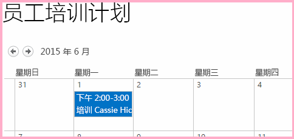
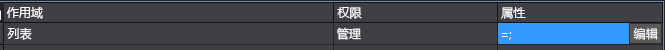
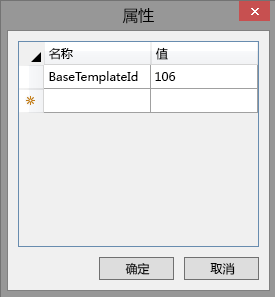
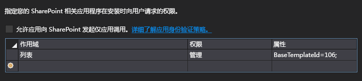
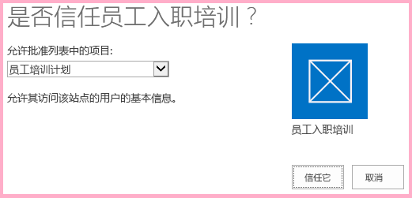
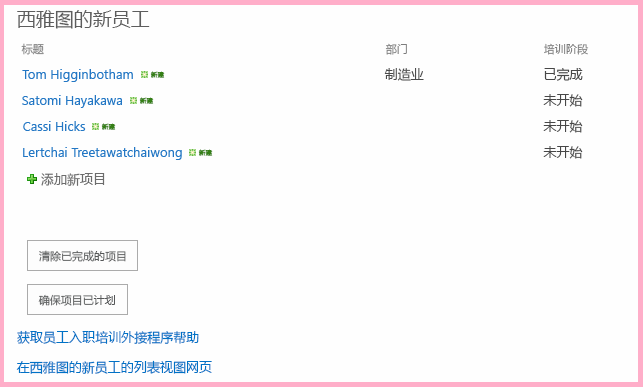
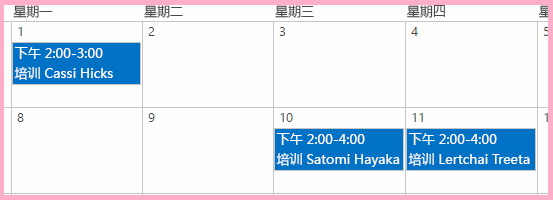

# 在外接程序 Web 中使用 JavaScript 中的主机 Web 数据
使用 SharePoint JavaScript 对象模型 (JSOM) 处理来自外接程序 Web 中页面上的 JavaScript 的主机 Web 中的 SharePoint 数据。
这是关于开发 SharePoint 托管的 SharePoint 外接程序的基础知识系列文章中的第 11 篇文章。您应该首先熟悉  [SharePoint 外接程序](sharepoint-add-ins.md)以及本系列中之前的文章：


-  [开始创建 SharePoint 承载的 SharePoint 外接程序](get-started-creating-sharepoint-hosted-sharepoint-add-ins.md)


-  [部署和安装 SharePoint 托管的 SharePoint 外接程序](deploy-and-install-a-sharepoint-hosted-sharepoint-add-in.md)


-  [向 SharePoint 托管的 SharePoint 外接程序添加自定义列](add-custom-columns-to-a-sharepoint-hostedsharepoint-add-in.md)


-  [向 SharePoint 托管的 SharePoint 外接程序添加自定义内容类型](add-a-custom-content-type-to-a-sharepoint-hostedsharepoint-add-in.md)


-  [向 SharePoint 托管的 SharePoint 外接程序中的页面添加 Web 部件](add-a-web-part-to-a-page-in-a-sharepoint-hosted-sharepoint-add-in.md)


-  [向 SharePoint 托管的 SharePoint 外接程序添加工作流](add-a-workflow-to-a-sharepoint-hosted-sharepoint-add-in.md)


-  [向 SharePoint 托管的 SharePoint 外接程序添加自定义页面和样式](add-a-custom-page-and-style-to-a-sharepoint-hosted-sharepoint-add-in.md)


-  [向 SharePoint 托管的 SharePoint 外接程序添加自定义客户端呈现](add-custom-client-side-rendering-to-a-sharepoint-hosted-sharepoint-add-in.md)


-  [在 SharePoint 外接程序的主机 Web 中创建自定义功能区按钮](create-a-custom-ribbon-button-in-the-host-web-of-a-sharepoint-add-in.md)


-  [使用 SharePoint JavaScript API 处理 SharePoint 数据](use-the-sharepoint-javascript-apis-to-work-with-sharepoint-data.md)


> **注释**
> 如果您阅读过关于 SharePoint 托管的外接程序的此系列文章，那么您应该具有 Visual Studio 解决方案，可以继续阅读本主题。您还可以从  [SharePoint_SP-hosted_Add-Ins_Tutorials](https://github.com/OfficeDev/SharePoint_SP-hosted_Add-Ins_Tutorials) 下载存储库并打开 BeforeHostWebData.sln 文件。


默认情况下，SharePoint 设计为阻止外接程序中的 JavaScript 访问服务器场中其他 SharePoint 网站中的数据。这会阻止异常外接程序中的脚本访问敏感数据。但是，外接程序通常需要访问主机 Web 或者与主机 Web 相同的网站集内的其他网站。在外接程序中启用此方案分为两个部分：
- 请求对外接程序清单文件中的主机 Web 的权限。安装外接程序的用户将收到授予此权限的提示，如果用户不授予此权限，则无法安装此外接程序。


- 不使用 **SP.ClientContext** 对象发出对主机 Web 的 JSOM 调用，而是使用 **SP.AppContextSite** 对象。此对象允许外接程序获取除外接程序 Web 以外的网站的上下文对象，但仅针对相同网站集内的网站。（还有一种方法可以获取 SharePoint Online 订阅 [或本地 SharePoint Web 应用程序] 中任何网站的访问权限，但这属于高级主题。）


在本文中，您可以使用 JSOM 查找尚未启动的方向，并确保它们已在主机 Web 中的日历上进行规划。
## 准备主机 Web 日历

打开主机 Web（即您的开发人员测试网站），并确认其上有一个名为"Employee Orientation Schedule"的日历，且该日历中有一个事件"Orient Cassie Hicks"。如果没有，请执行下列步骤：


1. 从网站的主页选择"网站内容">"添加外接程序">"日历"。


2. 在"添加日历"对话框中，键入 Employee Orientation Schedule 作为"名称"，然后选择"创建"。


3. 日历打开时，将光标放在任何日期上，直到日历上显示"添加"链接，然后单击"添加"。


4. 在"Employee Orientation Schedule - 新项目"对话框中，键入 Orient Cassi Hicks 作为"标题"。将其他字段保留为默认值，然后单击"保存"。

    日历应如下所示：


   **自定义日历**





## 创建 JavaScript 以及调用它的按钮


1. 打开"解决方案资源管理器"的"脚本"节点中的 Add-in.js 文件。


2. 在  `completedItems` 的声明下方添加以下声明。

  -  `notStartedItems` 引用"西雅图新员工"列表中的项，其"定向阶段"为"未启动"。


  -  `calendarList` 引用您在主机 Web 上创建的日历。


  -  `scheduledItems` 引用日历上的项目集。


  ```

var notStartedItems;
var calendarList;
var scheduledItems;
  ```

3. 运行 SharePoint 外接程序时，SharePoint 将调用其起始页并向起始页 URL 添加一些查询参数。其中一个参数为  `SPHostUrl`，即主机 Web 的 URL。外接程序需要此信息来调用主机 Web 数据，因此在 Add-in.js 文件顶部附近，只需在  `scheduledItems` 的变量声明下方添加以下行。对于此代码，请注意以下事项：

  -  `getQueryStringParameter` 是您在下一步中创建的一个实用程序函数。


  -  `decodeUriComponent` 是一个标准 JavaScript 函数，可对 SharePoint 在查询参数上执行的 URI 编码进行逆向工程，例如，编码的正斜杠"%2F"将更改回"/"。


  ```

var hostWebURL = decodeURIComponent(getQueryStringParameter("SPHostUrl"));
  ```

4. 将以下代码添加到文件底部。此函数可用于读取查询参数。

  ```
  // Utility functions

function getQueryStringParameter(paramToRetrieve) {
     var params = document.URL.split("?")[1].split("&amp;");
     var strParams = "";
     for (var i = 0; i < params.length; i = i + 1) {
         var singleParam = params[i].split("=");
         if (singleParam[0] == paramToRetrieve) {
             return singleParam[1];
        }
     }
 }
  ```

5. 将以下函数添加到 Add-in.js 文件中的失败回调部分上方。对于此代码，请注意以下事项：

  - 这几乎与获取"已完成"项目的列表查询方法完全相同，除了它获取的是"未启动"项目，而不是"已完成"项目。我们仅对"未启动"项目感兴趣，因为脚本为简化而做了一个假设，即如果定向的"未启动"阶段已经过去，那么它肯定已经计划。


  - 您在后续步骤中在 **executeQueryAsync** 调用中创建两个回调方法。


  ```

function ensureOrientationScheduling() {

    var camlQuery = new SP.CamlQuery();
    camlQuery.set_viewXml(
        '<View><Query><Where><Eq>' +
            '<FieldRef Name=\\'OrientationStage\\'/><Value Type=\\'Choice\\'>Not started</Value>' +
        '</Eq></Where></Query></View>');
    notStartedItems = employeeList.getItems(camlQuery);

    clientContext.load(notStartedItems);
    clientContext.executeQueryAsync(getScheduledOrientations, onGetNotStartedItemsFail);
    return false;
}
  ```

6. 将以下函数添加到 Add-in.js 文件中前一个函数的下方。请注意，它使用  `hostWebContext` 对象标识所查询的列表。

    > **注释**
      > 注意，未将查询标记添加到 CAML 查询。查询对象中没有实际查询的效果是确保将会检索所有列表项。如果列表非常大，这可能导致服务器请求长时间运行，这是无法接受的。在这种情况下，我们希望找到实现目标的其他方式。但在列表很小（且日历列表几乎始终很小）的示例情况下，获取整个列表以便我们可以在客户端上进行循环访问实际上有助于我们尽量减少服务器调用（即 **executeQueryAsync** 调用）数量。

  ```

function getScheduledOrientations() {

    var hostWebContext = new SP.AppContextSite(clientContext, hostWebURL);
    calendarList = hostWebContext.get_web().get_lists().getByTitle('Employee Orientation Schedule');

    var camlQuery = new SP.CamlQuery();
    scheduledItems = calendarList.getItems(camlQuery);

    clientContext.load(scheduledItems);
    clientContext.executeQueryAsync(scheduleAsNeeded, onGetScheduledItemsFail);
}
  ```

7. 向文件中添加以下函数。对于此代码，请注意以下事项：

  - 此方法检查"西雅图新员工"列表中"未启动"项目的标题（即员工的名字）是否包含在"Employee Orientation Schedule"日历的事件标题中。因此，我们为简化而做出了一个假设，即日历中的所有条目创建时均在事件标题中包含完整的员工名字。


  - 如果日历中已有的事件与"未启动"项目均不匹配，脚本将为该"未启动"项目创建一个日历项。


  - JSOM 使用轻型 **ListItemCreationInformation** 对象，而非 **SPListItem** 对象，以便尽量减小发送到 SharePoint 服务器的有效负载的大小。


  - 编写本文时，新日历事件的两个 DateTime 字段设置为一月中的天数： `2015-06`。 *将这些日期更改为当前月份和年份中的某天，因此您无需在日历中回滚来查找这些项目。* 


  - 如果发现任何"未启动"项目尚未计划，请将第一个"未启动"项目计划为该月的 10 日。每个增加的未计划项目计划为后一天。我们为简化做出了一个假设，即不会有很多未计划项目，因此不会产生诸如"32"一样不可能的日期。


  - 此代码大多是 JavaScript。对于使用 SharePoint JSOM 的行提供了注释。


  ```

function scheduleAsNeeded() {

    var unscheduledItems = false;
    var dayOfMonth = '10';

    var listItemEnumerator = notStartedItems.getEnumerator();

    while (listItemEnumerator.moveNext()) {
        var alreadyScheduled = false;
        var notStartedItem = listItemEnumerator.get_current();

        var calendarEventEnumerator = scheduledItems.getEnumerator();
        while (calendarEventEnumerator.moveNext()) {
            var scheduledEvent = calendarEventEnumerator.get_current();

             // The SP.ListItem.get_item('field_name ') method gets the value of the specified field.
            if (scheduledEvent.get_item('Title').indexOf(notStartedItem.get_item('Title')) > -1) {
                alreadyScheduled = true;
                break;
            }
        }
        if (alreadyScheduled === false) {

             // SP.ListItemCreationInformation holds the information the SharePoint server needs to
             // create a list item
            var calendarItem = new SP.ListItemCreationInformation();

             // The some_list .additem method tells the server which list to add 
             // the item to.
            var itemToCreate = calendarList.addItem(calendarItem);

             // The some_item .set_item method sets the value of the specified field.
            itemToCreate.set_item('Title', 'Orient ' + notStartedItem.get_item('Title'));

             // The EventDate and EndDate are the start and stop times of an event.
            itemToCreate.set_item('EventDate', '2015-06-' + dayOfMonth + 'T21:00:00Z');
            itemToCreate.set_item('EndDate', '2015-06-' + dayOfMonth + 'T23:00:00Z');
            dayOfMonth++;

             // The update method tells the server to commit the changes to the SharePoint database.
            itemToCreate.update();
            unscheduledItems = true;
        }
    }
    if (unscheduledItems) {
        calendarList.update();
        clientContext.executeQueryAsync(onScheduleItemsSuccess, onScheduleItemsFail);
    }
}
  ```

8. 添加以下成功处理程序，当向日历中添加以前未计划的项目时，将会调用此处理程序。

  ```

function onScheduleItemsSuccess() {
    alert('There was one or more unscheduled orientations and they have been added to the '
              + 'Employee Orientation Schedule calendar.');
}
  ```

9. 将以下失败函数添加到文件的失败回调部分。

  ```

function onGetNotStartedItemsFail(sender, args) {
    alert('Unable to get the not-started items. Error:' 
        + args.get_message() + '\\n' + args.get_stackTrace());
}

function onGetScheduledItemsFail(sender, args) {
    alert('Unable to get scheduled items from host web. Error:' 
        + args.get_message() + '\\n' + args.get_stackTrace());
}

function onScheduleItemsFail(sender, args) {
    alert('Unable to schedule items on host web calendar. Error:' 
        + args.get_message() + '\\n' + args.get_stackTrace());
}
  ```

10. 打开 default.aspx 文件并查找 ID 为 **PlaceHolderMain** 的 **asp:Content** 元素。


11. 将以下标记添加到  `purgeCompletedItems` 按钮下方。

  ```HTML

<p><asp:Button runat="server" OnClientClick="return ensureOrientationScheduling()"
  ID="ensureorientationschedulingbutton" Text="Ensure all items are on the Calendar" /></p>
  ```

12. 在 Visual Studio 中重新生成项目。


13. 要在测试外接程序时尽量减少将列表项的"定向阶段"手动设置为 Not Started 的需要，请打开列表实例 **NewEmployeesInSeattle** 的 elements.xml 文件（不是列表模板 **NewEmployeeOrientation** 的 elements.xml），并确保至少有三个 **Row** 元素 *（包括 Cassie Hicks 的行）*  的"定向阶段"值为Not Started。由于这是默认值，因此执行此操作最简单的方法是确保对于这三个或更多行， `OrientationStage` 不存在 **Field** 元素。

    下面举例说明了 **Rows** 元素应该是什么样的。


  ```

<Rows>
  <Row>
    <Field Name="Title">Tom Higginbotham</Field>
    <Field Name="Division">Manufacturing</Field>
    <Field Name="OrientationStage">Completed</Field>
  </Row>
  <Row>
    <Field Name="Title">Satomi Hayakawa</Field>
  </Row>
  <Row>
    <Field Name="Title">Cassi Hicks</Field>
  </Row>
  <Row>
    <Field Name="Title">Lertchai Treetawatchaiwong</Field>
  </Row>
</Rows>
  ```


## 指定对外接程序所需主机 Web 的权限

外接程序自动拥有对其自身外接程序 Web 的完整控制权限，因此到目前为止，您还不需要指定其需要的权限。但是您必须定期请求对与之交换数据的主机 Web 的权限。"员工定向"外接程序需具有相应权限才能向主机 Web 中的日历添加项目。


1. 在"解决方案资源管理器"中，打开 appmanifest.xml 文件。


2. 在清单设计器中，打开"权限"选项卡。


3. 在"作用域"列的最上面一行中，从下拉列表中选择"列表"。


4. 在"权限"列中，选择"管理"。


5. 如果"属性"列保留为空，外接程序将请求对主机 Web 上每个列表的写入权限。最好将外接程序限制为仅拥有所需的权限。在外接程序清单中，无法将权限限定到特定列表实例，但可以将外接程序限定到仅基于特定库列表模板构建的列表实例。日历的库列表模板是数字 ID 为 106 的 **Events**。

    单击同一行的"属性"单元格，使"编辑"按钮显示在单元格中。现在权限列表看起来应该如下所示：


   **带有可见"编辑"按钮的权限列表**





6. 选择"编辑"打开"属性"对话框。


7. 将"名称"设置为 BaseTemplateID，将"值"设置为 106。现在对话框看起来应该如下所示：

   **列表权限属性对话框**





    选择"确定"。现在"权限"选项卡看起来应该如下所示：


   **Visual Studio 中外接程序清单设计器的"权限"选项卡**





## 运行并测试外接程序


1. 确保已按本文前面所述准备主机 Web 日历。它应该具有一个名为"Orient Cassi Hicks"的事件。


2. 在调试时 Visual Studio 使用的浏览器上启用弹出窗口。


3. 使用 F5 键部署并运行您的外接程序。Visual Studio 在测试 SharePoint 网站上临时安装此外接程序并立即运行。


4. 权限同意窗体将打开，您可在其中向外接程序授予所需权限。页面上有一个下拉列表，您可以从主机 Web 上的所有日历中进行选择。选择"Employee Orientation Schedule"，然后选择"信任它"。

   **SharePoint 外接程序同意提示**





5. 外接程序的起始页完全加载后，选择"确保项目已计划"按钮。

   **带有新按钮的"员工定向"主页**





6. 如果运行任何失败回调函数，您将看到回调函数创建的错误消息警报。否则，您将看到最终成功回调创建的成功消息："有一个或多个未计划的方向，已添加到'Employee Orientation Schedule'日历。"


7. 导航到主机 Web 上的"Employee Orientation Schedule"日历。例如，选择您的开发人员网站主页的痕迹导航链接并选择"网站内容"。然后选择"Employee Orientation Schedule"磁贴（不是"Employee Orientation"磁贴）。

    日历看起来应该如下所示。脚本检测到已有 Cassi Hicks 的事件，因此不会再创建一个。它为其他两个定向处于"未启动"状态的员工创建事件。它不会为"未启动"阶段已经过去的员工创建事件。


   **添加两个新事件后的日历**





8.  *在再次按"确保项目已计划"之前，请确保已从日历中删除这两个新事件。* 


9. 要结束调试会话，请关闭浏览器窗口或在 Visual Studio 中停止调试。每次按 F5 时，Visual Studio 将撤回外接程序的之前版本并安装最新版本。


10. 您将在其他文章中使用此外接程序和 Visual Studio 解决方案，因此最好是当您使用一段时间后，最后一次撤回外接程序。在"解决方案资源管理器"中右键单击此项目，然后选择"撤回"。


## 
<a name="Nextsteps"> </a>

在 SharePoint 承载的 SharePoint 外接程序中进行执行高级工作：


-  [设计 SharePoint 外接程序](design-sharepoint-add-ins.md)


-  [开发 SharePoint 外接程序](develop-sharepoint-add-ins.md)


-  [发布 SharePoint 外接程序](publish-sharepoint-add-ins.md)


-  [SharePoint 外接程序开发工具和环境](tools-and-environments-for-developing-sharepoint-add-ins.md)


