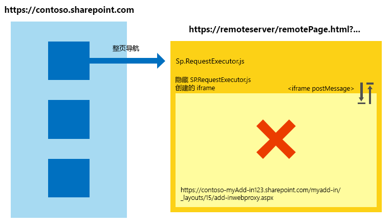
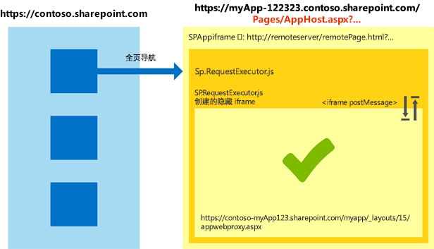

# 跨 SharePoint 外接程序中的不同 Internet Explorer 安全区域使用跨域库
了解在主机 Web 和外接程序页位于 Windows Internet Explorer 的不同安全区域时如何使用 SharePoint 2013 中的跨域库。
如果要将 SharePoint 2013 跨域库用于您的外接程序，您应知道 Internet Explorer 中的安全区域的工作原理。如果 SharePoint 网站和外接程序位于不同的区域，则您的外接程序可能会遇到一些通信问题。本文介绍当您在不同的 Internet Explorer 安全区域中使用跨域库时将发生的情况。
  
    
    


## Internet Explorer 中使用 SharePoint 跨域库的跨域方案
<a name="bk_crosszonescenarios"> </a>

由于安全原因，Internet Explorer 防止位于不同集成级别（也称为安全区域）的页共享 Cookie，因为每个完整性级别都具有其自己的 Cookie 存储。页的集成级别由其最顶端的页确定，并且该页中的所有框架将共享相同完整性级别。有关详细信息，请参阅 [注意跨域方案中的 Cookie 共享](http://blogs.msdn.com/b/ieinternals/archive/2011/03/10/internet-explorer-beware-cookie-sharing-in-cross-zone-scenarios.aspx)。
  
    
    
SharePoint 跨域库使用隐藏 **IFrame** 和托管在 SharePoint 上的客户端代理页使用 JavaScript 启用客户端通信。跨域库在您引用页中的 sp.requestexecutor.js 文件时可用。有关详细信息，请参阅 [使用跨域库从外接程序访问 SharePoint 2013 数据](access-sharepoint-2013-data-from-add-ins-using-the-cross-domain-library.md)。
  
    
    
当远程外接程序页和 SharePoint 网站位于不同的安全区域时，无法发送授权 Cookie。如果没有授权 Cookie，则 **IFrame** 将尝试加载代理页，它将重定向至 SharePoint 登录页。由于安全原因，SharePoint 登录页不能包含在 **IFrame** 中。在这些方案中，库无法加载代理页，并且无法与 SharePoint 通信。
  
    
    
下图显示的是其中无法加载代理页的跨域方案。首页会将框架放置在与  `http://remoteserver/remotepage.html` 相同的安全区域中。代理页不会加载。
  
    
    

**图 1. 其中无法加载代理页的跨域方案**

  
    
    

  
    
    

  
    
    
以下是其中跨域库可能无法加载代理页的一些示例：
  
    
    

- 您的客户使用的是 SharePoint Online，并且您的远程外接程序页托管在 Intranet 服务器上。此方案易于出现代理页加载问题，因为 SharePoint Online URL 一般不在本地 intranet 区域中。这是外接程序初始开发过程中的常见方案，因为您可能使用 IIS Express 或其他本地服务器托管页面，无需完全限定的 Internet 域。
    
  
- 您的客户通过基于窗体的身份验证在本地使用 SharePoint，并且您的远程页承载在云服务（例如，Microsoft Azure）上。
    
  

## 使用 SharePoint 外接程序处理跨域方案
<a name="bk_handlingcrosszone"> </a>

在外接程序开发（强烈推荐）和外接程序运行时有几种方式可解决此问题。
  
    
    

### 最佳实践：使用 apphost 模式

若要处理跨域方案，建议您在 SharePoint 中有一个 apphost 页。apphost 页是在 **IFrame** 中包含远程页的 SharePoint 页。apphost 页的 **IFrame** 中的所有内容与外接程序 Web 存在于同一安全区域中。远程页中的跨域库可成功接收授权 Cookie 和上载代理页。
  
    
    
下图显示的是使用 apphost 页模式处理的跨域方案。 
  
    
    

**图 2. 使用 apphost 页模式处理的跨域方案**

  
    
    

  
    
    

  
    
    
apphost 页所需的代码十分简单。apphost 页的主要部分是 **SPAppIFrame** 元素。您必须使用 CSS 才能使 **IFrame** 不可见，以便它不会干扰您的外接程序。
  
    
    
以下标记是简单 apphost 页的示例。该标记将执行以下任务：
  
    
    

- 声明使用 SharePoint 组件时所需的指令。
    
  
- 声明用于使 **IFrame** 不可见的样式。
    
  
- 声明 **SPAppIFrame** 并将目标设置为外接程序起始页。
    
  


```HTML

<%@ Page
    Inherits="Microsoft.SharePoint.WebPartPages.WebPartPage, Microsoft.SharePoint, Version=15.0.0.0, Culture=neutral, PublicKeyToken=71e9bce111e9429c" 
    language="C#" %>
<%@ Register 
    Tagprefix="SharePoint" 
    Namespace="Microsoft.SharePoint.WebControls" 
    Assembly="Microsoft.SharePoint, Version=15.0.0.0, Culture=neutral, PublicKeyToken=71e9bce111e9429c" %>
<%@ Register 
    Tagprefix="Utilities" 
    Namespace="Microsoft.SharePoint.Utilities" 
    Assembly="Microsoft.SharePoint, Version=15.0.0.0, Culture=neutral, PublicKeyToken=71e9bce111e9429c" %>
<%@ Register 
    Tagprefix="WebPartPages" 
    Namespace="Microsoft.SharePoint.WebPartPages" 
    Assembly="Microsoft.SharePoint, Version=15.0.0.0, Culture=neutral, PublicKeyToken=71e9bce111e9429c" %>

<html>
<head>
    <title>Your add-in page title</title>
    <style type="text/css">
        html, body
        {
            overflow:hidden;
        }
        
        body
        {
            margin:0px;
            padding:0px;
        }
         
        iframe 
        {
            border:0px;
            height:100%;
            width:100%;
        }
    </style>
</head>

<body>
    <SharePoint:SPAppIFrame 
        runat="server" 
        src="~remoteAppUrl/StartPage.html?{StandardTokens}" 
        frameborder="0">
    </SharePoint:SPAppIFrame>
</body>
</html>
```

如果您希望您的用户将链接深入您的外接程序的各个部分，则您的 apphost 页和 **IFrame** 的内容可进行协作以使这成为可能。一种替代方式是在远程外接程序的每页中使用 **IFrame** 公告消息通信和单独的 URL。若要每页具有单独的 URL，您可在外接程序 Web 中创建单独的页或在一个页上使用查询字符串参数。
  
    
    

### 替代方式：向 Internet Explorer 的同一安全区域中添加网站

如果外接程序未设计为采用 apphost 模式，则您可通过将下列域添加到同一安全区域使它继续有效： 
  
    
    

- SharePoint 网站的域（例如， `https://contoso.sharepoint.com`）。
    
  
- 云托管的外接程序的域 ( `http://remoteserver`)。
    
  
- Microsoft 承载的登录页和服务的域 ( `*.microsoftonline.com`)。
    
  
管理员可使用 Active Directory 策略将更改推送到组织中的所有计算机。
  
    
    

## 使用 apphost 模式的安全含义
<a name="bk_securityimplications"> </a>

指出 apphost 模式会高效将远程页放入与外接程序 Web 相同的安全区域这一点很重要。确保您了解向安全区域添加网站的含义。有关详细信息，请参阅 [如何使用 Internet Explorer 中的安全区域](http://support.microsoft.com/kb/174360)。
  
    
    

## 使用其他浏览器：Chrome、Firefox 和 Safari
<a name="bk_otherbrowsers"> </a>

Google Chrome、Mozilla Firefox 和 Apple Safari 等其他浏览器未实现安全区域的概念。如果一个浏览器未将 Cookie 隔离到单独的存储区，则可能不会遇到本文中介绍的难题。建议您在外接程序中采用 apphost 模式。使用 apphost 模式将确保您的外接程序在提到的浏览器和 Internet Explorer 中工作，而不管 SharePoint 所在的安全区域如何。
  
    
    

## 其他资源
<a name="bk_addresources"> </a>


-  [SharePoint 外接程序的安全数据访问和客户端对象模型](secure-data-access-and-client-object-models-for-sharepoint-add-ins.md)
    
  
-  [使用跨域库从外接程序访问 SharePoint 2013 数据](access-sharepoint-2013-data-from-add-ins-using-the-cross-domain-library.md)
    
  
-  [SharePoint 外接程序](sharepoint-add-ins.md)
    
  
-  [SharePoint 外接程序的授权和身份验证](authorization-and-authentication-of-sharepoint-add-ins.md)
    
  
-  [考虑 SharePoint 外接程序设计选项的三种方法](three-ways-to-think-about-design-options-for-sharepoint-add-ins.md)
    
  
-  [SharePoint 外接程序体系结构的重要方面和开发前景](important-aspects-of-the-sharepoint-add-in-architecture-and-development-landscap.md)
    
  
-  [SharePoint 2013 中的主机 Web、外接程序 Web 和 SharePoint 组件](host-webs-add-in-webs-and-sharepoint-components-in-sharepoint-2013.md)
    
  
-  [SharePoint 加载项中的数据](important-aspects-of-the-sharepoint-add-in-architecture-and-development-landscap.md#Data)
    
  
-  [为 SharePoint 2013 中的跨域库创建自定义代理页](create-a-custom-proxy-page-for-the-cross-domain-library-in-sharepoint-2013.md)
    
  
-  [客户端跨域安全性](http://msdn.microsoft.com/zh-cn/library/cc709423%28VS.85%29.aspx)
    
  

