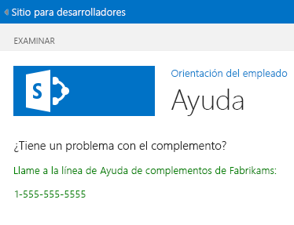

# Agregar una página y un estilo personalizados a un complemento hospedado en SharePoint para SharePoint
Aprenda a incluir una página y un archivo CCS personalizados en un Complementos de SharePoint.
Este es el séptimo de una serie de artículos sobre los conceptos básicos de desarrollo de un Complementos de SharePoint hospedado en SharePoint. Primero debe familiarizarse con  [Complementos de SharePoint](sharepoint-add-ins.md) y con los anteriores artículos de esta serie:
  
    
    


-  [Empezar a crear complementos hospedados en SharePoint para SharePoint](get-started-creating-sharepoint-hosted-sharepoint-add-ins.md)
    
  
-  [Implementar e instalar un complemento hospedado en SharePoint para SharePoint](deploy-and-install-a-sharepoint-hosted-sharepoint-add-in.md)
    
  
-  [Agregar columnas personalizadas a un complemento de SharePoint hospedado en SharePoint](add-custom-columns-to-a-sharepoint-hostedsharepoint-add-in.md)
    
  
-  [Agregar un tipo de contenido personalizado a un complemento de SharePoint hospedado en SharePoint](add-a-custom-content-type-to-a-sharepoint-hostedsharepoint-add-in.md)
    
  
-  [Agregar un elemento web a una página de un complemento para SharePoint hospedado en SharePoint](add-a-web-part-to-a-page-in-a-sharepoint-hosted-sharepoint-add-in.md)
    
  
-  [Agregar un flujo de trabajo a un complemento hospedado en SharePoint para SharePoint](add-a-workflow-to-a-sharepoint-hosted-sharepoint-add-in.md)
    
  

> **NOTA**
> Si ha estado trabajando en esta serie sobre complementos hospedados en SharePoint, tiene una solución Visual Studio que puede usar para continuar con este tema. También puede descargar el repositorio en  [SharePoint_SP-hosted_Add-Ins_Tutorials](https://github.com/OfficeDev/SharePoint_SP-hosted_Add-Ins_Tutorials) y abrir el archivo BeforePage.sln.
  
    
    

En este artículo agregará una página de ayuda al Complemento de SharePoint Orientación de empleados y la configurará para que use una hoja de estilo CSS personalizada. 
## Agregar una página


1. En el **Explorador de soluciones**, haga clic con el botón derecho en la carpeta **Páginas** y elija **Agregar** > **Nuevo elemento**. El cuadro de diálogo **Agregar nuevo elemento** se abre en el nodo de **Office/SharePoint**.
    
  
2. Elija **Página** y dele el nombreHelp.aspx. 
    
  
3. Busque los dos elementos **asp:Content** en el archivo y agregue el siguiente y tercer marcado - **asp:Content** entre ellos.
    
 ```HTML
  
<asp:Content ContentPlaceHolderID="PlaceHolderPageTitleInTitleArea" runat="server">
    Help
</asp:Content> 
 ```

4. Busque el elemento **asp:Content** con el Id. de **PlaceholderAdditionalPageHead** y agréguele el siguiente código de marcado.
    
 ```HTML
  
<link rel="Stylesheet" type="text/css" href="../Content/App.css" />
 ```

5. Busque el elemento **asp:Content** con el Id. de **PlaceHolderMain** y elimine cualquier elemento secundario que contenga.
    
  
6. Agregue lo siguiente como contenido al mismo elemento **asp:Content**.
    
 ```HTML
  <H3>Having a problem with the add-in?</H3>
<p> Call the help line for Fabrikam Add-ins:</p>
<p>1-555-555-5555</p>
 ```

7. Guarde y cierre el archivo.
    
  
8. Abra el archivo Default.aspx.
    
  
9. Busque el elemento **asp:Content** con el Id. de **PlaceHolderMain** y agregue al final el siguiente código de marcado.
    
 ```HTML
  
<p><asp:HyperLink runat="server" NavigateUrl="JavaScript:window.location = _spPageContextInfo.webAbsoluteUrl + '/Pages/Help.aspx';"
    Text="Get help for the Employee Orientation add-in" /></p>

 ```

10. Guarde y cierre el archivo.
    
  

## Agregar una clase de estilo a la hoja de estilo


  
    
    

1. En el **Explorador de soluciones**, abra el archivo app.css de la carpeta **Contents** y agréguele la siguiente línea.
    
 ```
  
p {color: green;}
 ```

2. Guarde y cierre el archivo.
    
  

## Ejecutar y probar el complemento


  
    
    

1. Use la tecla F5 para implementar y ejecutar el complemento. Visual Studio realiza una instalación temporal en su sitio de pruebas de SharePoint y ejecuta inmediatamente el complemento. 
    
  
2. Cuando se abra la página predeterminada del complemento, haga clic en el vínculo **Obtener ayuda sobre el complemento Orientación de empleados** para abrir la página de **Ayuda**. 
    
    Su página personalizada se abre y las dos líneas que puso entre etiquetas <p> se muestran en verde.
    

   **Página de ayuda**

  

     
  

    
    
  
3. Para terminar la sesión de depuración, cierre la ventana del explorador o detenga la depuración en Visual Studio. Cada vez que presione F5, Visual Studio retirará la versión anterior del complemento e instalará la más reciente.
    
  
4. Trabajará con este complemento y con la solución Visual Studio en otros artículos, y se considera recomendable retirar el complemento una última vez cuando acabe de trabajar en él durante un tiempo. En el proyecto, haga clic con el botón secundario en el **Explorador de soluciones** y elija **Retirar**.
    
  

## 
<a name="Nextsteps"> </a>

En el siguiente artículo de esta serie agregará una representación personalizada del lado cliente a una columna de listas en un Complemento de SharePoint:  [Agregar representación del lado cliente personalizada a un complemento de SharePoint hospedado en SharePoint](add-custom-client-side-rendering-to-a-sharepoint-hosted-sharepoint-add-in.md).
  
    
    

